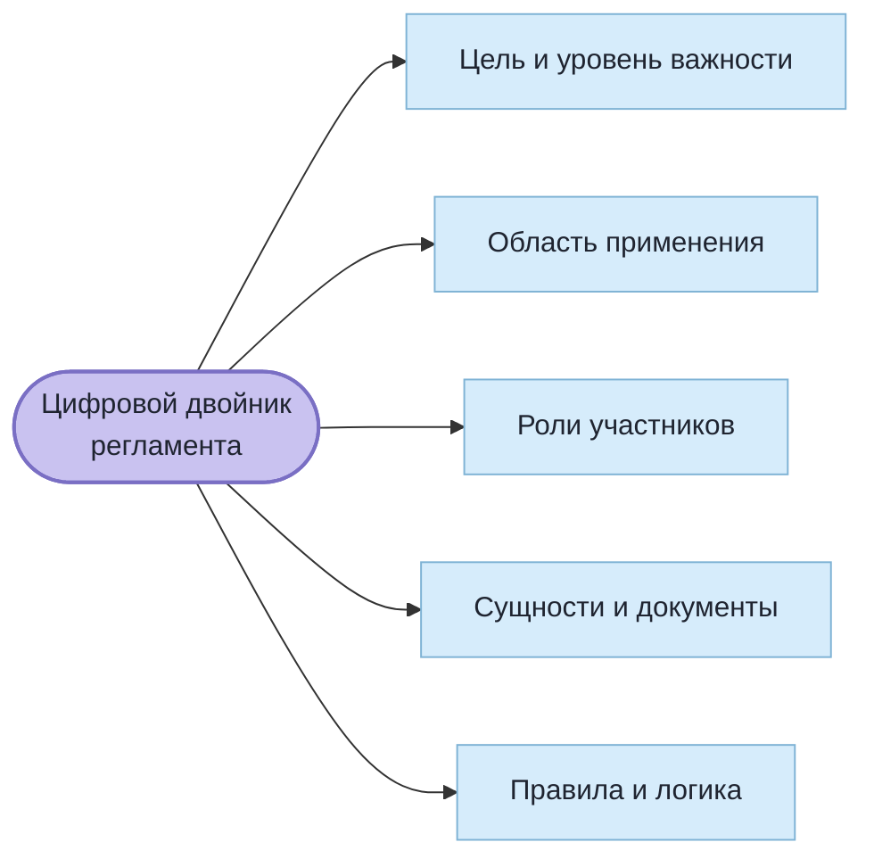
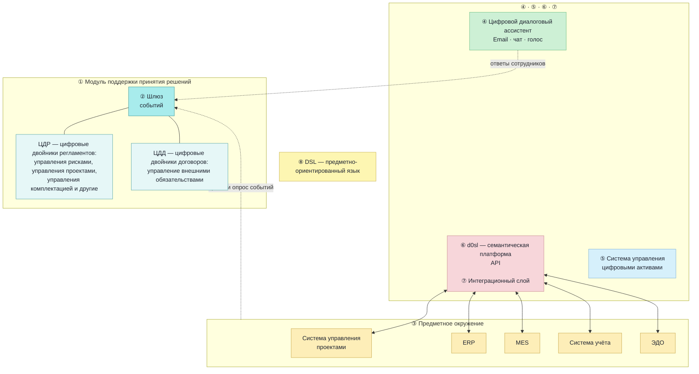

# 11710-11710-1 Техническое задание

**Платформа АРХИ для управления строительным проектом**
ГОСТ 19.201-78

---

## ПРИМЕЧАНИЕ К ОБРАЗЦУ

Это **обезличенная копия** настоящего технического задания, приведённая здесь
как образец строя документа по ГОСТ 19.201-78.

Что снято по сравнению с подлинником:

* титульная часть и лист утверждения с наименованиями сторон, должностями,
  подписями и фамилиями;
* наименования заказчика и исполнителя в тексте — вместо них стоят слова
  «Заказчик» и «Исполнитель»;
* номер договора;
* раздел со списком научных статей — он содержал фамилии авторов и к строю
  документа по ЕСПД отношения не имеет.

Всё остальное — разделы, требования, формулировки, таблицы этапов и порядок
контроля и приёмки — оставлено как в подлиннике. Смотреть здесь стоит именно
на **строй**: как устроены разделы 1–8 по 19.201-78 и насколько подробно
записаны требования, чтобы по ним можно было принимать работу.

---

## АННОТАЦИЯ

Техническое задание (далее по тексту - ТЗ) предназначено для описания и разработки программного обеспечения используемого исследовательским центром Исполнителя в составе системы поддержки принятия решений с применением технологий искусственного интеллекта в области развития городской инфраструктуры и управления строительством с целью решения задач строительной отрасли и кардинального улучшения городской среды и условий жизни, труда и отдыха горожан (Интеллектуальный цифровой двойник городского хозяйства). Разрабатываемое программное обеспечение Платформа АРХИ (Система управления строительными проектами и регламентами с использованием семантического искусственного интеллекта) позволит повысить эффективность управления проектами строительства путем ускорения принятия обоснованных решений  за счет использования  автоматической системы рекомендаций, а также минимизировать риски, связанных с несвоевременным выполнением задач. 	В данном программном документе, в разделе «Введение» указано наименование, краткая характеристика области применения программы  (программного изделия).   В разделе «Основания для разработки» указаны документы, на основании которых ведется разработка, наименование и условное обозначение темы разработки.   	В данном программном документе, в разделе «Назначение разработки» указано функциональное и эксплуатационное назначение программы (программного обеспечения). 	Раздел «Требования к программному продукту» содержит следующие подразделы:  требования к функциональным характеристикам;  требования к надежности;  требования к архитектуре;  требования к информационной и программной совместимости. В данном программном документе, в разделе «Прочие требования» указаны требования к устройствам доступа, условия эксплуатации, а также предварительный состав программной документации. В разделе «Технико-экономические показатели» указаны: ориентировочная экономическая эффективность, предполагаемая годовая потребность, экономические преимущества разработки. В данном программном документе, в разделе «Стадии и этапы разработки» установлены необходимые стадии разработки, этапы и содержание работ. В разделе «Порядок контроля и приемки» указаны виды испытаний и общие требования к приемке работы.

---

## СОДЕРЖАНИЕ

|  | Стр. |
|---|---:|
| [АННОТАЦИЯ](#аннотация) |  |
| [1. ВВЕДЕНИЕ](#1-введение) |  |
| [2. ОСНОВАНИЯ ДЛЯ РАЗРАБОТКИ](#2-основания-для-разработки) |  |
| · [2.1 Заказчик разработки](#21-заказчик-разработки) |  |
| · [2.2 Востребованность разработки](#22-востребованность-разработки) |  |
| · [2.3 Возможности для реализации проекта](#23-возможности-для-реализации-проекта) |  |
| · [2.4 Научная основа для предлагаемых решений](#24-научная-основа-для-предлагаемых-решений) |  |
| [3. НАЗНАЧЕНИЕ РАЗРАБОТКИ](#3-назначение-разработки) |  |
| [4. ТРЕБОВАНИЯ К ПРОГРАММНОМУ ПРОДУКТУ](#4-требования-к-программному-продукту) |  |
| · [4.1 Общие требования](#41-общие-требования) |  |
| · [4.2 Функциональные требования](#42-функциональные-требования) |  |
| · [4.3 Требования к архитектуре](#43-требования-к-архитектуре) |  |
| · [4.4 Требования к надежности](#44-требования-к-надежности) |  |
| · [4.5 Требования к информационной и программной совместимости](#45-требования-к-информационной-и-программной-совместимости) |  |
| [5. ПРОЧИЕ ТРЕБОВАНИЯ](#5-прочие-требования) |  |
| · [5.1 Требования к устройствам доступа](#51-требования-к-устройствам-доступа) |  |
| · [5.2 Требования к входным/выходным данным и серверам платформы](#52-требования-к-входнымвыходным-данным-и-серверам-платформы) |  |
| · [5.3 Условия эксплуатации](#53-условия-эксплуатации) |  |
| · [5.4 Требования к документации](#54-требования-к-документации) |  |
| [6. ТЕХНИКО-ЭКОНОМИЧЕСКИЕ ПОКАЗАТЕЛИ](#6-технико-экономические-показатели) |  |
| · [6.1 Ориентировочная экономическая эффективность](#61-ориентировочная-экономическая-эффективность) |  |
| · [6.2 Предполагаемая годовая потребность](#62-предполагаемая-годовая-потребность) |  |
| · [6.3 Экономическое преимущество разработки перед конкурентами](#63-экономическое-преимущество-разработки-перед-конкурентами) |  |
| [7. СТАДИИ И ЭТАПЫ РАЗРАБОТКИ](#7-стадии-и-этапы-разработки) |  |
| [8. ПОРЯДОК КОНТРОЛЯ И ПРИЕМКИ](#8-порядок-контроля-и-приемки) |  |
| · [8.1. Виды контроля, испытаний и приемки работ](#81-виды-контроля-испытаний-и-приемки-работ) |  |
| · [8.2. Общие требования к приемке работ](#82-общие-требования-к-приемке-работ) |  |
| [9. СЛОВАРЬ ТЕРМИНОВ И СОКРАЩЕНИЙ](#9-словарь-терминов-и-сокращений) |  |

---

## 1. ВВЕДЕНИЕ

### 1.1. Наименование
Данное Техническое Задание (ТЗ) предназначено для описания и разработки программной системы управления строительными проектами и регламентами с использованием семантического искусственного интеллекта «**Платформа АРХИ**», ориентированной на функционирование в составе фреймворка **СИГМА** – комплекса программно-аппаратных средств, ориентированных на создание интеллектуальных цифровых двойников для управления городскими инфраструктурами.

### 1.2. Краткая характеристика области применения программного обеспечения
Разрабатываемое программное обеспечение позволит повысить эффективность управления проектами строительства путем ускорения принятия обоснованных решений  за счет использования  автоматической системы рекомендаций, а также минимизировать риски, связанных с несвоевременным выполнением задач.
Платформа АРХИ служит для оптимизации работы строительного проекта, обеспечивая более эффективное планирование, управление ресурсами, исполнение регламентов. Платформа АРХИ предназначена для решения множества задач, направленных на улучшение эффективности работы организации и обеспечение оперативного принятия решений.
Сегодня принято, что  комплексные решения принимаются на совещаниях, в которых участвуют представители отделов, владеющие информацией: юристы, экономисты, плановый отдел, отдел закупок и т.д. Однако, в реальной жизни времени организацию таких совещаний может просто не быть, поэтому решения принимаются на основании частичной информации.  Платформа АРХИ имеет своей целью выработку рекомендательных решений, а также проверку согласованности применяемых решений на основании загруженных данных за счет использования технологий ИИ.
Использование искусственного интеллекта (ИИ) в Платформе АРХИ не перекладывает ответственности за решения с человека на робота, но повышает информированность руководителя в момент принятия решения, снижает риски неосведомленности о важных аспектах проекта, помогая принимать быстрые и экономически выгодные решения с минимизацией рисков ошибки.

### 1.3. Краткая характеристика объекта, в котором используется программное обеспечение

Объектом применения фреймворка СИГМА (в состав которого войдет Платформа АРХИ) является городская инфраструктура, управляемая с помощью интегрированной интеллектуальной информационной системы, основу которой составляет цифровой двойник городской инфраструктуры, взаимодействующий с другими системами и подсистемами, используемыми городским менеджментом при управлении городской инфраструктурой. Такую общую систему, основанную на передовых информационно-коммуникационных технологиях и технологиях искусственного интеллекта (ИИ) и направленную на повышение качества жизни горожан, эффективность использования ресурсов и устойчивое развитие городской инфраструктуры, в дальнейшем мы будем называть системой «Умный город».

Согласно методологии, которой следует фреймворк СИГМА, город представляет собой сложную **экономическую систему**, состоящую из взаимодействующих **объекта** и **субъекта управления**. Отсюда и цифровой двойник города будет являть собой виртуальную систему, состоящую из взаимодействующих цифровых двойников объекта (цифровой двойник городской среды) и субъекта управления (цифровой двойник городского управления), а также информационной инфраструктуры, создаваемой в дополнение и для обслуживания цифровых двойников объекта и субъекта управления городом.

Объектом для Платформы АРХИ в этой комплексной задаче является та часть городской инфраструктуры, которая напрямую отвечает за сектор управления строительством - **ЦД строительной индустрии** (см. схему).

Для фреймворка СИГМА программное обеспечение Платформа АРХИ будет являться программным специализированным модулем.
Для создаваемого цифрового двойника города  программное обеспечение Платформа АРХИ будет являться самостоятельным отраслевым цифровым двойником, представляющим строительный аспект функционирования городской среды, ориентированный на устойчивое развития города.

### 1.4. Цель разработки.

Целью разработки программной системы управления строительными проектами и регламентами с использованием семантического искусственного интеллекта «**Платформа АРХИ**» является обеспечение эффективности контроля работ и принятия управленческих решений в строительных компаниях и проектных организациях путем обеспечения оперативной информационной поддержки руководителям разных уровней в контроле за выполнением требований строительных и иных регламентов, которые издают и контролируют государственные и муниципальные органы, регулирующие строительную отрасль.

---

## 2. ОСНОВАНИЯ ДЛЯ РАЗРАБОТКИ

### 2.1 Заказчик разработки

**Документ, на основании которых ведется разработка:** договор с индустриальным партнёром (номер не приводится) на выполнение работ или оказание услуг в целях совместной реализации ключевых мероприятий программы Исполнитель в части внебюджетного софинансирования от 21.11.2023 года.

**Организации, утвердившие документ:** Исполнитель, индустриальный партнёр (Заказчик).

**Наименование или условное обозначение темы разработки:** Платформа АРХИ для управления строительными проектами и регламентами с использованием ИИ.

### 2.2 Востребованность разработки

Настоящий проект разработки Платформы АРХИ соответствует направлениям “Цифровое городское управление” и “Эффективно функционирующие государственные услуги” проекта Цифровизации городского хозяйства «Умный город» в части создания платформы с функциями:

* Инструменты для принятия решений о строительстве, оценке эффектов и генерации архитектурных концепций на уровне города/района,
* Платформы для автоматизированного контроля исполнения работ
* Платформы для принятия управленческих решений.

Для управления строительными проектами сегодня широко применяют системы планирования, измерения и диспетчеризации результатов, анализа данных, системы учета, системы цифрового проектирования (BIM).
Деятельность по управлению строительством осуществляется на основании регулирующих документов: строительные нормы и правила, положения договоров подряда и закупок, нормы ГК, правила коммуникаций, правила оформления и предоставления документов.
В практике регламенты частично реализуются в рамках инструментов информационных систем, но большей частью их выполнение обеспечивается живыми людьми. Все взаимодействие между элементами информационных систем делается путем переноса данных вручную, со всеми проблемами точности, своевременности и качества.
Такой подход представляет собою «лоскутную» цифровизацию, когда цифровизация делается слабо связанными друг с другом островками. Основная же проблема, которая при этом возникает: **Теряется основная цель цифровизации – повышение скорости и качества управления.**

Выполнение большинства регламентов управления строительным проектом является технической работой, требующей определенной системности и тщательности, которую готов обеспечить ИИ.

### 2.3 Возможности для реализации проекта

Реализация проекта АРХИ для строительной сферы учитывает, что уже существует методология проектного управления в строительстве с описанием управления составными частями строительного проекта. Разработка Платформы АРХИ использует задачный подход, опирается на проектные методологии и подразумевает создание ПО для работы со следующими задачами строительного проекта:

* **Задача управления интеграцией:** Управление интеграцией обеспечивает координацию и взаимодействие между различными компонентами проекта. Два документа являются ключевыми в данной области управления: Устав проекта, определяющий цели и требования проекта, а также предоставляющий полномочия для использования ресурсов организации, и План управления проектом, который описывает, как будет осуществляться исполнение операций, планирование, мониторинг и контроль. Он включает в себя все вспомогательные планы, процедуры взаимодействия подразделений и другие аспекты управления проектом.
* **Задача управления содержанием:** Управление содержанием включает в себя определение и контроль содержания проекта, включая его структуру, объем и требования.
* **Задача управления сроками (расписанием):** Управление сроками обеспечивает планирование и контроль сроков выполнения проекта.
* **Задача управления стоимостью:** Управление стоимостью включает в себя планирование и контроль бюджета проекта и реально возникающей стоимости.
* **Задача управления качеством:** Управление качеством обеспечивает соответствие проекта требованиям качества, в том числе и с применением методов сравнения проектной и исполняемой BIM моделей объектов строительства.
* **Задача управления коммуникациями:** Управление коммуникациями обеспечивает эффективное взаимодействие между участниками проекта.
* **Задача управления рисками:** Управление рисками включает в себя идентификацию, оценку рисков (в том числе количественную) и управление рисками, связанными с проектом.
* **Задача управления закупками:** Управление закупками обеспечивает планирование и контроль закупок, необходимых для реализации проекта.
* **Задача управления участниками проекта:** Управление участниками проекта включает в себя взаимодействие с заинтересованными сторонами проекта и управление их ожиданиями.

Данные задачи управления реализуются большим количеством процессов, исполняемых и фиксируемых людьми (участниками строительства) в системах управления строительством (бумажные документы и ПО). Все эти задачи должны решаться с проверкой соответствия ГОСТ, строительным нормам и правилам, а также иным приказам, положениям, приписываемыми конкретной организацией и законодательным окружением. В дальнейшем будем именовать эти правила единым термином **регламент**.

Регламенты в рамках которых выполнятся управление строительным проектом, как правило, следующие:

* Положения 	договоров на выполнения строительных работ
* Разделы строительной проектной документации (BIM модели объектов) определяющие 	номенклатуру изделий
* Сметная документация или другая специальная часть проектной документации на объекты, назначающая цену работ.
* Строительные нормы и правила на виды работ.
* Проект организации строительства
* Проекты производства работ и технологические карты, разрабатываемые подрядчиками с учетом специфики конкретного проекта, расширяющие номенклатуру ресурсов в дополнении к проектно-сметной документации.
* Нормы и правила приемки материалов в 	производство работ с соответствующим набором документов оформления.
* ГОСТы, СНиПы на выполнение определенных работ и технические условия производителей необходимые для обеспечения входного контроля вовлекаемых материальных ресурсов.
* Правила хранения и транспортировки грузов и оборудования.
* Ведомственные нормы заказчиков/инвесторов регулирующие, например, правила закупки ресурсов и подрядных работ.
* Координационные процедуры (либо в виде документов, либо как часть Плана управления проектом), 	описывающие правила разрешения или эскалации различных изменений или конфликтов.

Цель разрабатываемой Платформы АРХИ - заменить субъективный выбор применяемых **регламентов** на создание возможности для руководителя учитывать все регламенты и условия. Один человек может просто что-то упустить, а система как раз дает подсказки, учитывающие все факторы. На этапе оформления цифровых двойников регламентов Платформа АРХИ отберет необходимый их набор в соответствии с положениями Устава проекта, проверит достаточность данного набора регламентов, их совместимость  и реальность исполнения.

### 2.4 Научная основа для предлагаемых решений

Платформа АРХИ должна быть разработана в виде **надстройки** над информационными системами (п. 4.5 ТЗ), основанной на методах теории семантического моделирования и включать в себя инструменты оцифровки необходимых регламентов управления, создания цифровых двойников таких регламентов, иметь интерфейсы для получения данных в рамках цифровых регламентов из существующих (внешних) информационных систем, модули исполнения цифровых регламентов, модули анализа и поддержки принятия решений и диалоговые интерфейсы взаимодействия с пользователями (живыми людьми).
Платформа АРХИ должна разрабатываться с опорой на использование семантического искусственного интеллекта (СИИ). Научную и технологическую основу СИИ составляет семантическое моделирование, которое является оригинальным и новым подходом к решению широкого круга задач искусственного интеллекта, не имеющим аналогов в мире.
Особенностью данного подхода, подтверждающей его новизну и оригинальность, является:

* возможность эффективного расширения семантического моделирования и осуществление адекватного цифрового моделирования недетерминированных и иерархических систем
* осуществление семантического анализа больших данных с целью поиска объясняемых закономерностей, прогнозирования, создания объяснительных алгоритмов машинного обучения и т.п.

Логико-математическая основа СИИ была разработана в Институте математики СО РАН еще в 80-х годах прошлого столетия в работах академика РАН С.С. Гончарова, академика РАН Ю.Л. Ершова и д.ф.-м.н. Д.И. Свириденко, получивших высокую научную оценку и широкое признание как в России, так и за рубежом.
В настоящее время эта **математическая теория семантического моделирования** продолжает активно развиваться усилиями ведущих сотрудников Института математики СО РАН (акад. РАН С.С .Гончаров, доктора физ.-мат. наук Е.Е. Витяев, Д.Е. Пальчунов, Д.И. Свириденко) и математиками Новосибирского и Иркутского государственных университетов. [см. ссылки на научные статьи]
Полученные учеными научные результаты носят практический характер, поскольку уже используются при проектировании и реализации широкого спектра прикладных систем семантического моделирования, в том числе и систем искусственного интеллекта.

---

## 3. НАЗНАЧЕНИЕ РАЗРАБОТКИ

Платформа АРХИ предназначена для обеспечения эффективности в строительных компаниях и проектных организациях путем помощи им в выполнении требований строительных и иных регламентов, которые издают и контролируют государственные и муниципальные органы, регулирующие строительную отрасль.

Платформы АРХИ разрабатывается для внедрения в сферу строительства и основными задачами для нее являются:

1. **Платформа АРХИ должна обеспечивать информационную поддержку:**
* Пользователь должен иметь доступ к приказам, нормативам и регламентам, другим документам, регулирующим строительство при помощи функции поиска по номеру документа, тематике, автору:
  * Источник поиска - база данных АРХИ с ранее загруженными в нее оцифрованными текстовыми документами регламентов строительной отрасли.
  * Требования к полноте, актуальности, достоверности результатов поиска определяет Пользователь системы, самостоятельно дополняя систему актуальными для его проекта документами.
* Руководители и сотрудники должны получать информацию о текущем статусе работ, что будет обеспечивать для них прозрачность процессов и помогать руководителям на всех уровнях иерархии в принятии обоснованных решений.
* Информация должна предоставляться в диалоговом режиме, обеспечивая оперативное реагирование на изменения и потребности.
* Пользователи системы должны получать уведомления от системы при обнаружении ей фактов отклонения от графика и плана работ, факты нарушения регламентов:
  * Допустимые отклонения от номинальных количественных (штуки, кг, метры), качественных (удовлетворительно, хорошо, неудовлетворительно) и временных (часы, сутки) значений параметров контроля, за пределами которых Пользователи системы должны получать уведомления - должны настраиваться через web-интерфейс профиля Администратора системы и иметь базовые установленные значения по умолчанию для первого запуска системы равные 1.
* Оповещения системы должны быть ориентированы на достижение эффекта информированного управления сроками и бюджетом проекта для целей снижения материальных и временных потерь и повышения предсказуемости управления ресурсами.

2. **Платформа АРХИ должна обеспечивать легкую интеграцию:**
* интегрироваться с информационными системами (Системы управления проектами Plan-R, Oracle Primavera, Redmine PMS, Microsoft Project, 1С), создавая единую платформу для поддержки принятия решений на основе семантических технологий.
* предоставлять возможность согласования нормативов, приказов и правил, предписанных строительными и контролирующими регламентами разных уровней путем использования единого правила формирования ЦДР:

3. **Платформа АРХИ должна выполнять функцию диспетчера:**
* обеспечивать актуальность данных в информационных системах организации (Системы управления проектами Plan-R, Oracle Primavera, Redmine PMS, Microsoft Project, 1С) путем автоматически проводимого анкетирования пользователей для заполнения параметров задач проекта с изменением статуса задачи, ответственного по задаче и т д.
* заменить трудоемкий процесс “ручного” сбора и восстановления информации о проекте на моментальное оповещение каждого участника проекта в диалоговом режиме.
* исключить необходимость решения задач в авральном режиме за счет актуальности данных в каждый момент с данными о статусе и процентном показателе выполнения текущих задач, а также проекта в целом.

---

## 4. ТРЕБОВАНИЯ К ПРОГРАММНОМУ ПРОДУКТУ

### 4.1 Общие требования

**4.1.1.** Поддержка принятия решений руководителями разного уровня. Проактивное предоставление всей необходимой информации в диалоговом режиме в нужный момент с возможностью настройки оповещений.

**4.1.2.** Обеспечение быстрого перехода от ручного управления к цифровым технологиям за счет использования технологии Цифрового Диалогового Ассистента, в особенности решение проблемы поддержки актуальности данных в информационных системах.

**4.1.3.** Автоматический прогноз рисков нарушения регламентов.

**4.1.4.** Интеграция существующих информационных систем в единую систему поддержки принятия решений на базе единых четких определений понятий на основе
семантических технологий.

**4.1.5.** Автоматизированная актуализация данных во всех информационных системах
предприятия.

**4.1.6.** Поддержка цифровых двойников договоров с контрагентами для управления обязательствами и прогноза последствий.

**4.1.7.** Поддержка цифровых двойников регламентов для повышения управляемости организации, в т.ч. актуализации данных, сбора метрик, и управления рисками.

**4.1.8.** Поддержка анализа данных об управлении с целью повышения качества управления организации.

**4.1.9.** Автоматизация рутинных операций с помощью Цифрового Диалогового
Ассистента.

### 4.2 Функциональные требования

#### 4.2.1. Платформа АРХИ должна обеспечивать выстраивание и поддержание регламентов, процессов и процедур для управления проектом:

* система должна содержать шаблоны проекта, которые позволяют пользователю создать план управления проектом, учитывая все необходимые аспекты и требования, предписываемые регламентами, обязательными к реализации при выполнении строительного проекта.
* система должна обладать возможностью настройки функций и позволять оптимизировать существующие процессы и процедуры с целью повышения эффективности управления проектом.
* система должна иметь интерфейс для перевода документа в его цифровую копию при помощи семантического моделирования, другими словами, создание цифровых двойников договоров (ЦДД) с контрагентами для управления обязательствами и прогноза последствий, а также цифровых двойников регламентов (ЦДР) для повышения качества управления организацией.
* система должна иметь функциональность для работы с ЦДД и ЦДР:
  * Автоматическое исполнение ЦДР
  * Автоматический процессинг событий в информационных системах организации с помощью ЦДР и ЦДД
  * Автоматизация извлечения основных смыслов (семантики) из документов
  * Автоматическая маршрутизация документов в информационных системах организации на основе извлеченной семантики
  * Автоматический контроль за исполнением регламентов и договорных обязательств сотрудниками и контрагентами
  * Автоматизация преобразования текстов регламентов, представленных на русском языке, в семантические логические модели

#### 4.2.2. Платформа АРХИ должна обеспечивать анализ и обработку данных:

* иметь функциональность для поддержки актуальности данных в информационных системах при помощи постоянного опроса пользователей для сбора актуальной информации, организованного при помощи цифрового регламента для Платформы АРХИ конкретного проекта.
* интеграции с различными информационными системами (Системы управления проектами Plan-R, Oracle Primavera, Redmine PMS, Microsoft Project, 1С), обеспечивая хранение и доступ к необходимым данным.
* иметь функциональность для обеспечения автоматического прогноза отклонения от регламентов и предлагать варианты решений для управления этими отклонениями.
* иметь функциональность для актуализации и синхронизации данных во всех информационных системах организации.
* иметь функциональность для анализа информационных потоков и статистик процессинга цифровых двойников регламентов и договоров.
* иметь функциональность для поддержки Big Data и Machine Learning для анализа данных и выявления закономерностей.

#### 4.2.3. Платформа АРХИ должна обеспечивать информационную поддержку принятия решений:

* Платформа АРХИ должна иметь функциональность для предоставления рекомендаций по принятию решений, связанных с управлением проектом, такие как:
  * Предложения о корректировке планов;
  * Рекомендации о правильном распределении ресурсов;
  * Советы по управлению отклонениями от регламентов и правил и т.д.
  * Допустимые отклонения от номинальных количественных (штуки, кг, метры), качественных (удовлетворительно, хорошо, неудовлетворительно) и временных (часы, сутки) значений параметров контроля, за пределами которых Пользователи системы должны получать уведомления - должны настраиваться через web-интерфейс профиля Администратора системы и иметь базовые установленные значения по умолчанию для первого запуска системы равные 1.
* Платформа АРХИ должна иметь функциональность для информационной поддержки принятия решений руководителями любого уровня.
* Платформа АРХИ должна иметь функциональность для предоставления всей необходимой информации в диалоговом режиме по запросу пользователя или по иной настройке, например, по ЦР - цифровому регламенту оповещений или при помощи функции поиска по номеру документа, тематике, автору:
  * Источник поиска - база данных АРХИ с ранее загруженными в нее оцифрованными текстовыми документами регламентов строительной отрасли.
  * Требования к полноте, актуальности, достоверности результатов поиска определяет Пользователь системы, самостоятельно дополняя систему актуальными для его проекта документами.
* Платформа АРХИ должна иметь функциональность для интеграции с существующими информационными системами в единую систему поддержки принятия решений.

#### 4.2.4. Платформа АРХИ должна обеспечивать диспетчеризацию в проекте:

* иметь функциональность для обеспечения взаимодействия между участниками проекта, помогая в координации работ и решении возникающих проблем.
* иметь функциональность для оповещения участников проекта, например о проведении совещаний, для обмена информацией и документами, а также для мониторинга выполнения задач.
* иметь функциональность для интеграции с мессенджерами и чат-ботами для обеспечения удобного взаимодействия с пользователями.
* иметь функциональность для предоставления рекомендаций по использованию своих функций, чтобы пользователи могли эффективно осваивать возможности системы.

**4.2.5. Платформа АРХИ должна обеспечивать планирование**. Ожидаемый результат: реализовано управление сроками и расписанием проекта, включая оповещение руководителя о ближайших (на месяц, год, неделю) контрольных точках, отслеживание прогресса и предупреждение о возможных задержках.
**4.2.6. Платформа АРХИ должна обеспечивать коммуникации и взаимодействие**. Ожидаемый результат: реализована возможность для управления коммуникациями и взаимодействием между участниками проекта, обмен информацией и документами, а также мониторинг выполнения задач.
**4.2.7. Платформа АРХИ должна обеспечивать создание отчетов**. Ожидаемый результат: реализована возможность получения отчета с индикаторами состояния проекта, по которым можно определять перспективы достижения целей, есть возможность фильтровать информацию в требуемых форматах и периодах, а также определение зон устойчивости.
Эти функциональные требования являются основой для разработки программного комплекса Платформа АРХИ и обеспечат его эффективность в управлении проектами.

### 4.3 Требования к архитектуре

Разработка ПО должна строиться на базе верхнеуровневой логической архитектуры системы управления проектами и регламентами:

**Схема 1**. *Верхнеуровневая логическая архитектура Платформы АРХИ*

**4.3.1. Модуль  поддержки принятия решений** на основе цифровых двойников регламентов (ЦДР) и договоров (ЦДД). Этот модуль, который должен быть реализован с использованием семантической платформы Eyeline Software Development Platform компании стороннего поставщика. Основные функции этого модуля:

* Создание ЦДР и ЦДД.
  * ЦДД регламента Управления рисками
  * ЦДД регламента Управления Проектами
  * ЦДД регламента Управления Комплектацией и т д
* Возможность управления версиями ЦДР и ЦДД.
* Исполнение транзакции путем обработки информационных событий (см. ниже **шлюз событий**).
* Обеспечение безопасности и надежности исполнения транзакций.
* Инициация взаимодействия с сотрудниками (проактивные запросы и другие действия) для:
  * Сбора данных
  * Поддержки принятия решений руководителями

**4.3.2. Шлюз событий**. Его функции:

* Принимать изменения и события из существующих информационных систем.
* Принимать другие события, например, ответы, полученные от пользователей системы Цифровым Диалоговым Ассистентом.
* Отправлять полученные события на обработку в модуль поддержки принятия решений.
* Выполняет роль адаптера Платформы АРХИ.

**4.3.3 Предметное окружение** — это существующие информационные системы, с которыми интегрируется Платформа АРХИ  для реализации своих функций. Они служат источниками информации. Кроме того, Платформа АРХИ поддерживает в актуальном состоянии информацию в этих системах за счет проактивного взаимодействия Цифрового Диалогового Ассистента с сотрудниками организации. На схеме выше приведены в качестве примера для строительной организации следующие ИС - информационные системы:

* Система управления проектами (Plan-R, Oracle Primavera, Redmine PMS или Microsoft Project).
* ERP — система управления ресурсами предприятия (1С)
* Система Учета — бухгалтерская система (1С)
* ЭДО — система электронного документооборота предприятия (Контур.Диасофт)

**4.3.4. Цифровой Диалоговый Ассистент** — это основной интерфейс взаимодействия пользователей с Платформой АРХИ. Основные функции:

* Обеспечивает взаимодействие пользователей с Платформой АРХИ без предварительного изучения на естественном языке при помощи привычного средства коммуникации - мессенджера.
* Обеспечивает сбор данных от сотрудников для поддержания в актуальном состоянии информации во всех подключенных информационных системах.
* Обеспечивает взаимодействие с руководителями по вопросам принятия решений на основе ЦДР и ЦДД. Вовремя предоставляет всю необходимую информацию для принятия решения руководителями.
* Информирует сотрудников о всех событиях в регламентах, участниками которых они являются.
* Автоматически реализует различные рутинные операции в соответствии с регламентами.

**4.3.5. Система управления цифровыми активами** реализует следующие функциональные возможности:

* Хранение всех цифровых документов, в т.ч. ЦДР и ЦДД, ссылок на внешние цифровые активы, rich-media материалов и других цифровых активов компании.
* Интеграция Платформы АРХИ с существующими системами электронного документооборота для поддержки принятия решений.
* Разграничение прав доступа пользователей (регистрация, авторизация, 2-х факторная авторизация, настройка ролей пользователя по каждому проекту и набора доступных проектов для пользователя).
* Интеграция существующих бизнес-процессов (workflow) c ЦДР и ЦДД.
* Поддержание хранения различных версий документов, безопасность документов и других активов.
* Пользовательский интерфейс на основе web клиента (например Redmine или аналоги).

**4.3.6. Семантическая платформа (d0sl)** — платформа семантического ИИ для реализации ЦДР и ЦДД. Основные функции:

* Фильтрация и маршрутизация поступающих событий.
* Исполнение транзакций на цифровых двойниках регламентов и договоров путем обработки событий от внешних систем и от пользователей.
* Управление версиями ЦДР и ЦДД.
* Управление целостностью транзакций.
* Сбор статистических данных по транзакциям для последующего анализа.
* Персонализация взаимодействия цифрового диалогового ассистента.
* Анализ статистических данных.
* Обеспечение прозрачной интеграции всех существующих информационных систем из предметного окружения (см. п.3) с платформой АРХИ .

**4.3.7. Интеграционный слой** — это подсистема интеграции с существующей информационной инфраструктурой предприятия посредством открытых API.

**4.3.8. DSL (domain specific language) предметно-ориентированный язык** — это единый для организации формально точный набор определений понятий, свойств и действий, который используется для построения цифровых двойников договоров и регламентов для автоматизации поддержки принятия решений. По сути, это основной пользовательский интерфейс бизнес-аналитиков для создания и управления ЦДР и ЦДД.

#### 4.3.9. Функциональные характеристики по информационной безопасности:

* Гибкое разграничение прав пользователей на чтение, запись и удаление данных - на основе Цифровых Регламентов (ЦР)
* Изоляция уровня бизнес-логики от уровня управления данными в архитектуре.
* Обеспечение сохранности данных при возникновении аварийных ситуаций, таких как отключение питания или сбой в сети.
* Возможность аудита всех действий пользователей и системы в целом.
* Поддержка шифрования и ЭЦП.
* Возможность реализации интеграции закрытого контура принятия решений  с открытым контуром на уровне событий.
* Поддержка двух-факторной аутентификации пользователей с помощью сигнальной сети SS7

#### 4.3.10. Функциональные характеристики производительности:

* Ядро Платформы АРХИ должно быть спроектировано для обработки высокой нагрузки, не менее 10000 транзакций в секунду.
* Платформа АРХИ должна обладать горизонтальной масштабируемостью для быстрого увеличения пропускной способности.
* Платформа АРХИ должна обеспечивать производительность при работе с большими объемами данных с параметром “время отклик” не более 5 секунд.

### 4.4 Требования к надежности

**Функциональные характеристики надежности платформы:**

* Управление жизненным циклом системы на основе Цифровых Регламентов (обновление и бэкап).
* Поддержка онлайн мониторинга состояния системы по протоколу SNMP.
* Создание резервных копий данных системы в ручном и автоматическом режиме
* Возможность восстановления из сохраненной версии базы данных

### 4.5 Требования к информационной и программной совместимости

**Совместимость платформы АРХИ по следующим параметрам:**

* Операционные системы: Windows, Astra Linux, MacOS, Android, Аврора
* Системы управления проектами (Plan-R, Oracle Primavera, Redmine PMS или Microsoft Project, 1С)
* ГОСТ Р 57363-2016/EN 15925:2012 “Системы автоматизированного проектирования. Руководство по применению в строительстве”;
* СП 333.1325800.2017 “Информационное моделирование в строительстве. Правила формирования информационной модели объектов на различных стадиях жизненного цикла”;
* ISO 19650 “Строительство зданий и гражданское строительство. Процессы жизненного цикла объектов строительства”;
* IFC 4 (Industry Foundation Classes for Building Information Modeling).

---

## 5. ПРОЧИЕ ТРЕБОВАНИЯ

### 5.1 Требования к устройствам доступа

Для доступа к управлению АРХИ и для получения информации от системы будут использованы любые совместимые средства связи и коммуникации:

* Персональные компьютеры (ПК)
* Мобильные устройства - планшеты, смартфоны
* Операционные системы: Windows, Astra Linux, MacOS, Android, Аврора
* Мессенджер для коммуникаций: Телеграмм

### 5.2 Требования к входным/выходным данным и серверам платформы

Входные данные для платформы АРХИ:

* цифровые документы (договора, регламенты);
* информационные данные проекта, получаемые через API внешних информационных систем, которые использует заказчик платформы;
* данные, которые вносят аналитики и пользователи посредством интерфейса персональных устройств в процессе эксплуатации платформы.

Выходные данные: оповещения системы, внесенные изменения в информацию о проекте, прочие действия согласно функциональности платформы по ТЗ.

Сервера для развертывания платформы: использовать облачные вычислительные мощности для развертывания платформы АРХИ с организацией Пользователям доступа через мобильные устройства и ПК.

### 5.3 Условия эксплуатации

Обслуживание:

* План регулярного обслуживания Платформы АРХИ, включая установку обновлений и исправлений. Обновления системы будут выходить по мере необходимости и доработок и могут быть установлены без прерывания текущих процессов.
  Носители данных:
* Использовать внешние облачные защищенные хранилища данных.

### 5.4 Требования к документации

Список необходимой документации:

* Текст программы (код)
* Спецификация по функциональности модулей платформы
* Руководство системного администратора по настройке платформы
* Руководство для бизнес-аналитиков по работе с регламентами
* Описание применения (Руководство конечных пользователей - сотрудников и руководителей)
* Методические рекомендации по внедрению и обучению персонала

---

## 6. ТЕХНИКО-ЭКОНОМИЧЕСКИЕ ПОКАЗАТЕЛИ

Построение системы управления строительством на базе Платформы АРХИ позволяет постепенно внедрять и подключать актуальные для задач организации блоки или модули. Рассмотрим ТЭП по данной разработке подробнее.

### 6.1 Ориентировочная экономическая эффективность

Экономическая эффективность Платформы АРХИ обусловлена следующими факторами:

1. **Снижение потерь временного ресурса в организации за счет:**
* высвобождения времени руководителя от диспетчерских функций
* сокращение количества собраний руководства по поиску решений
* снижения затрат и сроков на внесение изменений в организационные процессы и регламенты на основе использования передовых семантических технологий ИИ
* упреждающего (проактивного) предоставления необходимой информации руководителям разных уровней

2. **Снижение зависимости организации от конкретных сотрудников за счет:**
* перехода к отчуждению знаний и навыков сотрудников путем перевода регламентов в Цифровые Двойники Регламентов
* повышения полноты, актуальности и качества информации в информационных системах и накопления базы знаний организации
* цифровизации основных регламентов управления и их частичная автоматизация
* цифрового аудита и контроля за исполнением регламентов и внутренних/внешних соглашений организации

Удобство работы и заложенные возможности в платформу АРХИ, позволяют говорить о возможности ее развития и адаптации под любые цели и задачи.

### 6.2 Предполагаемая годовая потребность

Первой площадкой тестирования и внедрения является Исполнитель. В процессе разработки будет оценен потенциал Платформы АРХИ.

В процессе разработки и тестирования Платформа АРХИ будет применяться на строительном проекте жилого комплекса “Пульсар” участником которого является Заказчик.

В дальнейшем, применение и развитие Платформы АРХИ будет обусловлено потребностью организаций в эффективной системе администрирования проектов.

Планы по внедрению Платформы АРХИ будут разработаны с учетом потребностей конкретных организаций и обеспечат эффективное внедрение системы с минимальными рисками и максимальной пользой для пользователей. Разработка платформы АРХИ основана на необходимости повышения эффективности управления проектами и минимизации рисков.
Внедрение разработанных программных продуктов планируется проводить в сотрудничестве с индустриальными партнёрами Центра ИИ Исполнителя. В качестве основных потребителей разработки рассматриваются крупные строительные компании.
Планируется, что первичные испытания и тестовые внедрения разрабатываемой системы будут проведены в строительных организациях Новосибирской области, в муниципальных организациях, выполняющих функции строительного заказчика, а также в ряде муниципальных предприятий, выполняющих строительно-монтажные и ремонтные работы, прежде всего, объектов транспортной инфраструктуры, сетей и систем жизнеобеспечения.

### 6.3 Экономическое преимущество разработки перед конкурентами

Известных аналогов для Платформы АРХИ нет. Его функции возможно сравнивать только по отдельным модулям, реализуемым в информационных системах подобных ERP, EPM или PPM. Исходя из этого у Платформы АРХИ формируются следующие конкурентные преимущества:

1. **Эволюционная цифровая трансформация**
* Внедрение АРХИ позволит запустить процесс эволюционной цифровой трансформации компании, обеспечивая гибкую интеграцию с существующими процессами управления и способствуя непрерывной адаптации к изменяющимся условиям и требованиям. Это обеспечивает стойкость к долгосрочным изменениям в индустриальной среде и повышает операционную эффективность

2. **Возможности легкой настройки и расширения**
* Платформа АРХИ будет обладать высоким уровнем возможностей кастомизации, что позволит адаптировать инструмент под уникальные потребности и особенности проекта или организации
* Платформа АРХИ будет обладать возможностью интеграции с существующими системами ЭДО, CRM, ERP, финансового и бухгалтерского учета, системами управления проектами

3. **Простота в использовании и обучении**
* Платформа АРХИ будет сама активно запрашивать в диалоговом режиме (чат-бот) нужную информацию у сотрудников и вовремя уведомлять о необходимости принятия важных решений сотрудниками
* Взаимодействие с системой при помощи чат-ботов сможет обеспечить удаленный режим подключения и работы новых пользователей и управление системой с использованием естественного языка
* Сотрудники получат удобный интерфейс для рутинных операций и рост производительности труда во всех текущих процессах компании
* Платформа АРХИ будет помогать оптимизации использования человеческих ресурсов в проектах путем прогнозирования загрузки ресурсов, сроков выполнения задач и бюджета.

4. **Снижение рисков**
* Платформа АРХИ позволит существенно снизить основные риски, присущие проектной организации, такие как срыв сроков, неосведомленность сотрудников, перерасход бюджета и риски, связанные с подрядчиками. Новых участников можно будет быстро интегрировать в проект, а их деятельность остается легко контролируемой.
* Платформа АРХИ позволит настраивать права доступа и руководитель мгновенно сможет ограничить доступ любого сотрудника, в случае обнаружения его недобросовестности.

5. **Увеличение управляемости и прозрачности**
* Платформа АРХИ будет способствовать повышению управляемости организации за счет функции уведомлений руководства по вопросам ресурсов и приоритетов задач, а также за счет высокой прозрачности на уровне проектов и задач.
* Платформа АРХИ сократит время, затрачиваемое на совещания, поиск и принятие решений в компании.
* Платформа АРХИ позволит осуществлять автоматическую генерацию отчетности для инвестора.

---

## 7. СТАДИИ И ЭТАПЫ РАЗРАБОТКИ

В рамках данного ТЗ  планируется разработать программное обеспечение для развертывания Платформы АРХИ согласно **плану мероприятий,** состоящему из стадий и этапов работ:

| № этапа | Мероприятие, стадия | Срок сдачи | Результат |
| :---: | :---- | :---- | ----- |
| 1 | Разработка и утверждение технического задания | 30.03.2024 | ТЗ, утвержденное индустриальным партнером |
| 2 | Анализ требований и регламентов. Разработка и тестирование алгоритмов:  Анализ регламентов и документооборота проекта строительства Анализ и оценка требований, определение возможных решений и технологий для реализации каждого модуля.   Оценка и определение возможных решений для реализации каждой функции, выбор технологий. | 30.08.2024 | План тестирования; Отчет о выбранных алгоритмах |
| 3 | Разработка Концепции программного обеспечения и проектирование архитектуры:  Разработка архитектуры платформы АРХИ, определение основных компонентов и их взаимодействие, а также выбор технологий и инструментов для реализации. Определение основных компонентов Системы управления цифровыми активами, семантической платформы и их взаимодействия, выбор технологий и инструментов. | 30.12.2024 | Концепция ПО; Архитектурный проект ПО |
| 4 | Разработка Платформы АРХИ - Разработка модулей:  Разработка ЦДД для всех документов путем конфигурирования шаблонов Изучение семантической платформы Eyeline SDP, включая создание цифровых двойников регламентов и договоров, обеспечение безопасности и надежности, взаимодействие с сотрудниками и сбор данных. Создание модулей для хранения цифровых документов, разграничения доступа, интеграции со сторонними системами и бизнес-процессами, обеспечения безопасности и поддержки версионности. Создание шлюза для извлечения изменений и событий из информационных систем и обработки других событий, таких как ответы пользователей. Блочное и модульное тестирование | 30.06.2025 | Протокол испытаний прототипа  ПО |
| 5 | Разработка системы поддержки принятия решений на базе разработанных алгоритмов. Разработка чат-бота:  Проектирование архитектуры бота Проектирование базы данных Реализация обработки NLP, взаимодействий с API, логики обработки запросов, модулей уведомлений и аналитики Тестирование чат-бота | 30.09.2025 | Протокол испытаний прототипа чат-бота |
| 6 | Интеграция модулей и шлюза: Соединение всех модулей и шлюза в единую систему, проверка их взаимодействия и тестирование интеграции. Интеграционное тестирование взаимодействия между Системой управления цифровыми активами и семантической платформой, устранение возможных проблем. Интеграция с проектными системами документооборота индустриального партнера | 30.12.2025 | Протокол испытаний Платформы АРХИ |
| 7 | Разработка рабочей документации Спецификация по функциональности модулей платформы Руководство системного администратора по настройке платформы Руководство для бизнес-аналитиков по работе с регламентами Описание применения (Руководство конечных пользователей - сотрудников и руководителей) Методические рекомендации по внедрению и обучению персонала | 30.09.2026 | Рабочая документация согласно требованиям ТЗ |
| 8 | Интеграция Платформы АРХИ с Фреймворком Сигма (см. Термины) | 30.11.2026 | Отчёт: Протокол испытаний Акт сдачи-приемки Исполнитель |
| 9 | Внедрение Платформы АРХИ -  в рабочий процесс для обеспечения поддержки принятия решений при управлении строительством и городской инфраструктурой на основе цифрового двойника, построенного на технологии искусственного интеллекта: Развертывание Платформы АРХИ на целевой инфраструктуре (сервере) Запуск, обучение пользователей  Поддержка в процессе адаптации и использования. Моделирование параметров строительного проекта Моделирование индикаторов бюджета проекта и финансовых потоков проекта. Пользовательское тестирование и сбор рекомендаций от реальных пользователей по доработке системы. Сдача заказчику ПО Платформа АРХИ | 30.12.2026 | Итоговый отчёт: Протокол испытаний Акт сдачи-приемки Заказчика |

---

## 8. ПОРЯДОК КОНТРОЛЯ И ПРИЕМКИ

### 8.1. Виды контроля, испытаний и приемки работ

План контроля и приемки работ включает:

1. Контроль требований:

* Проведение регулярных совещаний с заказчиком для обсуждения требований и уточнения деталей.

2. Технический контроль:
* Проведение регулярных технических проверок кода и архитектуры с целью выявления возможных ошибок или несоответствий.
* Использование инструментов статического анализа кода и средств
автоматического тестирования для обеспечения качества разработки.

3. Контроль сроков:
* Составление графика работ с определением промежуточных сроков, на
которых будет проводиться контроль выполнения задач.
* Регулярный контроль выполнения задач и своевременное реагирование
на задержки или проблемы.

4. Тестирование (испытания):
* Разработка плана тестирования, включающего систематическое
тестирование всех компонентов и функций.
* Выполнение тестовых сценариев, проверка работоспособности,
безопасности и производительности.

5. Проверка требований заказчика:
* Проведение приемочных испытаний с участием заказчика для проверки
соответствия АРХИ поставленным требованиям.

6. Формализация результатов:
* Документирование выполненных работ, проведенных испытаний и результатов приемки.
* Оформление всех документов и протоколов, связанных с контролем и приемкой, в соответствии с установленными стандартами и требованиями.

7. Проведение регулярных ревизий:
* Плановая проверка и обновление документации и архитектуры АРХИ.
* Аудит проделанной работы с целью выявления и исправления возможных ошибок или улучшений.

### 8.2. Общие требования к приемке работ

1. Определение контрольных точек
* Определение ключевых этапов разработки, на которых проводится контроль и приемка работ.

2. Проведение контроля и приемки
* Проверка выполнения работ в соответствии с заданной контрольной точкой.
* Заполнение контрольной документации и фиксация результатов контроля.

3. Приемка работ
* Составление отчета о результатах контроля и приемки работ для каждой контрольной точки.
* Представление отчета заказчику для согласования и утверждения.

4. Устранение замечаний
* В случае выявления недостатков или замечаний заказчика, необходимо
обеспечить их устранение и повторную проверку.

5. Итоговая приемка
* Проведение финальной приемки работ и подписание протокола Окончательной приемки заказчиком.

---

## 9. СЛОВАРЬ ТЕРМИНОВ И СОКРАЩЕНИЙ

ТЗ (Техническое задание) - это документ, в котором описываются требования к разрабатываемому программному продукту или проекту.

Фреймворк СИГМА - разрабатываемый силами Исполнитель комплекс инструментально-технологических средств, ориентированных на создание интеллектуальных систем проактивного управления городскими инфраструктурами – систем «Умный город», в состав которых входят цифровые двойники объектов, систем и подсистем городских инфраструктур и где  интегратором этих систем выступает цифровой двойник муниципалитета, управляющего городской инфраструктурой, интерпретируемый как система поддержки принятия управленческих решений. Таким образом, основное назначение фреймворка «Сигма» состоит в эффективном решении проблемы интеграции интересов различных поставщиков и участников в единую систему управления «Умный город», обеспечивая эффективность, безопасность и непрерывность ее функционирования.

Регламент -  свода правил и предписаний, регулирующих деятельность любого рода. В нашем строительном контексте, регламент - это документ, предписывающий терминологию и возможные способы решения задачи управления строительством.

Задачи управления строительством - реализуются большим количеством процессов, исполняемых и фиксируемых людьми (участниками строительства) в системах управления строительством (бумажные документы и ПО). Все эти задачи должны решаться с проверкой соответствия регламентам - СНИП (строительные нормы и правила), а также иным приказам, положениям, приписываемыми конкретной организацией и законодательным окружением.

Блок - составная часть комплекса ПО

Модуль - составная часть комплекса ПО

ИИ - искусственный интеллект

UI (User Interface) - пользовательский интерфейс, который предоставляет пользователю возможность взаимодействовать с программой или приложением.

API (Application Programming Interface) - программный интерфейс приложения, который определяет возможности и способы взаимодействия с ним.

MVP (Minimum Viable Product) - минимально жизнеспособный продукт, которым можно пользоваться и который включает важные функциональные возможности.

QA (Quality Assurance) - анализ и тестирование программного продукта, чтобы убедиться в его соответствии требованиям и высоком качестве.

DB (Database) - база данных, в которой хранятся структурированные данные.

Смарт-контракты - умные протоколы интеграции на основе онтологий и умных сделок, они представляют собой компьютерные программы, которые выполняются автоматически и независимо, при условии выполнения определенных предустановленных условий. Они основаны на технологии блокчейна, которая обеспечивает безопасную и прозрачную среду для выполнения этих контрактов.

Онтологии - это формальные модели знаний, используемые для структурирования и организации информации. Они описывают семантические отношения между понятиями и позволяют проводить логические выводы на основе этой информации. Онтологии используются для описания и структурирования информации.

sDSL  - семантический предметно-ориентированный язык.

d0sl - платформа для разработки семантического кода, предоставляет набор инструментов для разработки и исполнения моделей, созданных с использованием sDSL

SLA - соглашение об обслуживании (Service Level Agreement).

ИБ - информационная безопасность.

ЖЦ - жизненный цикл.

ИС - информационная система.

ЦД - цифровой двойник - это виртуальная модель реального объекта или системы, которая отображает его состояние и поведение. В умном городе цифровые двойники используются для моделирования информационных систем, прогнозирования рисков и уязвимостей, а также для анализа и оптимизации процессов управления.

DT - Digital Twin (цифровой двойник, перевод с англ.)

СППР - система поддержки принятия решений.

ЦД ИС - цифровой двойник информационной системы.

AI - искусственный интеллект (ИИ).

Reinforcement Learning (RL) - обучение с подкреплением, это метод машинного обучения (machine learning - ML), который обучает программное обеспечение принимать решения для достижения наиболее оптимальных результатов. Такое обучение основано на имитации процесса обучения методом проб и ошибок, который люди используют для достижения своих целей. Действия программного обеспечения, направленные на достижение цели, усиливаются, а действия, отвлекающие от цели, игнорируются.

PMI — Project Management Institute, стандарт Института управления проектами

---
