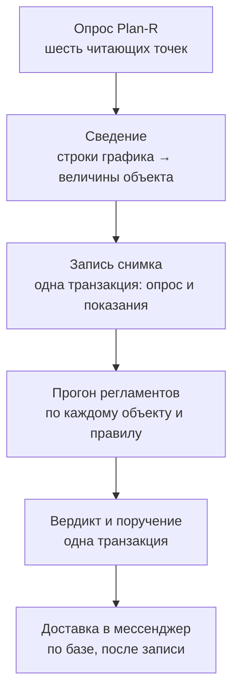

# 11710-11710-13 Описание программы

**Платформа АРХИ, компактная редакция**
ГОСТ 19.402-78

---

## СОСТОЯНИЕ ДОКУМЕНТА

**Редакция 2 от 11.09.2026.** Редакция 1 от 10.09.2026. Что изменилось:
в раздел 4 добавлены решения 4.12—4.16, принятые 11.09.2026; разделы 3.5,
3.6 и 3.7 описывают отправку по расписанию, выдачу справки и обратный
прогноз, которых в прежней редакции не было.

Документ описывает, **как изделие считает**. Его предмет по ГОСТ 19.402-78 —
логическая структура: алгоритм, применённые методы, связи составных частей.
Обоснование выбора средств и архитектуры лежит в пояснительной записке
11710-11710-81 и здесь не повторяется.

**Раздел 4 — несущий и написан не ради полноты комплекта.** В нём собраны
решения о способе счёта, каждое из которых **принято по замеру, а не
по соображению**: прежний способ давал число, которое выглядело исправным
и таковым не было. У каждого решения назван замер, которым обнаружена ошибка,
и проверка, которая держит исправление от возврата. Без этого раздела
изделие невозможно ни принять, ни сопровождать: способ счёта, не записанный
с доводом, восстанавливается следующим разработчиком по догадке — обычно
по той самой, которая уже была отвергнута.

---

## АННОТАЦИЯ

Изделие «Платформа АРХИ, компактная редакция» читает данные о ходе
строительных работ из системы управления проектами Plan-R, сводит их
к величинам собственного словаря, применяет к ним формально записанные
регламенты и, когда регламент нарушен, доводит вердикт до ответственного
лица с предписанным действием и сроком.

Документ описывает порядок работы изделия, алгоритм сведения данных
системы-источника к величинам словаря, алгоритм вынесения вердикта, алгоритм
ведения и доставки поручений, а также решения о способе счёта, принятые
в ходе разработки по результатам измерений на данных заказчика.

---

## СОДЕРЖАНИЕ

|  | Стр. |
|---|---:|
| 1. Общие сведения |  |
| 2. Функциональное назначение |  |
| 3. Описание логической структуры |  |
| · 3.1. Порядок работы изделия |  |
| · 3.2. Алгоритм сведения: от строк графика к величинам объекта |  |
| · 3.3. Алгоритм вынесения вердикта |  |
| · 3.4. Алгоритм ведения и доставки поручений |  |
| · 3.5. Алгоритм отправки ежедневной сводки |  |
| · 3.6. Алгоритм выдачи справки |  |
| · 3.7. Обратный прогноз: задание на горизонт |  |
| 4. Решения о способе счёта, принятые при разработке |  |
| 5. Используемые технические средства |  |
| 6. Вызов и загрузка |  |
| 7. Входные данные |  |
| 8. Выходные данные |  |

---

## 1. ОБЩИЕ СВЕДЕНИЯ

**Обозначение и наименование:** 11710-11710, «Платформа АРХИ, компактная
редакция».

**Язык программирования:** Python 3.12 — служебная часть; HTML, CSS
и JavaScript без сторонних библиотек — страницы изделия. Регламенты
и словарь величин записываются на YAML и программой не являются: это
данные, которые изделие исполняет.

**Программное обеспечение, необходимое для функционирования:** Python 3.12
и девять сторонних средств замкнутого перечня (11710-11710-12, раздел 3).
Хранилище — SQLite, входит в поставку Python.

---

## 2. ФУНКЦИОНАЛЬНОЕ НАЗНАЧЕНИЕ

**Класс решаемых задач:** контроль исполнения формально записанных
регламентов по данным системы управления строительными проектами
и адресное доведение вердикта до ответственного лица.

**Функциональные ограничения, объявленные прямо:**

* изделие **не изменяет данные системы-источника.** Канал в Plan-R открыт
  только на чтение, и это условие, а не умолчание: изделие физически не может
  испортить рабочий график заказчика;
* изделие **не выводит новых фактов.** Все величины либо прочитаны у Plan-R,
  либо посчитаны из прочитанных арифметикой, описанной в разделе 3.2;
* **нейросетей, языковых моделей, семантических платформ и обработки
  естественного языка в изделии нет.** Обоснование каждого отказа —
  в пояснительной записке, раздел 3;
* **величина, которой нет у Plan-R, в изделии появиться не может.** Точки
  приёма показаний извне и ручного ввода нет (11710-11710-81, п. 3.7).

---

## 3. ОПИСАНИЕ ЛОГИЧЕСКОЙ СТРУКТУРЫ

### 3.1. Порядок работы изделия

Работа идёт кругами. Круг запускается планировщиком по расписанию либо
человеком по кнопке и состоит из пяти шагов, строго в этом порядке:

**Разделение на шаги 3 и 5 не украшение.** Вердикт и поручение пишутся одной
транзакцией: иначе в базе остался бы вердикт без поручения, и контур
«решение — действие — подтверждение» разомкнулся бы молча. Доставка вынесена
ПОСЛЕ записи и работает по базе: будь обращение к чужому серверу внутри той же
транзакции, недоступность мессенджера откатывала бы вынесенный вердикт.

**Неудачный круг сохраняется строкой.** Он объясняет, почему прогон получил
«нет данных», а молчание об отказе неотличимо от благополучия.

### 3.2. Алгоритм сведения: от строк графика к величинам объекта

Это ядро изделия. Plan-R отдаёт **строки графика** — тысячи записей на объект;
регламент требует **одно число на объект**. Сведение и есть переход между ними,
и почти все найденные ошибки счёта лежали именно здесь.

#### 3.2.1. Что считается строкой графика

Из записей версии графика берутся **все, кроме вех**. Веха — точка, а не
работа: у неё нет ни длительности, ни объёма, и включение её в счёт работ
завысило бы их число.

Записи различаются по типу: `work` — узлы иерархической структуры работ,
то есть сводные строки разбиения; `task` — сами операции. **Считаются оба
типа наравне** — довод в п. 4.1.

#### 3.2.2. Три выборки из строк графика

Одни и те же строки просматриваются тремя разными способами, и смешивать их
нельзя:

| Выборка | Что это | Для чего нужна |
|---|---|---|
| **все строки** | всё, кроме вех | экстремумы: худшее отставание стоит на операции |
| **листья** | строки, у которых нет потомков | счёты: счёт всех строк сложил бы узлы разбиения с их же содержимым |
| **верхние строки** | те, чей родитель лежит вне выборки | проценты и деньги: у верхней строки стоит итог по её содержимому |

**Верхние строки находятся без знания идентификатора версии.** Родителем такой
строки Plan-R ставит саму версию графика, а не работу; признак «родителя нет
среди строк» находит их и переживёт смену устройства на той стороне.

#### 3.2.3. Пять способов сведения

| Способ | Величины | Почему так |
|---|---|---|
| **Максимум по всем строкам** | отставание финиша, отставание трудозатрат | худшее по объекту: вердикт выносится по объекту, а не по работе |
| **Минимум по всем строкам** | полный резерв | меньше запас — хуже |
| **Сумма по верхним строкам** | плановая и фактическая стоимость | итог по объекту; при разбиении верхняя строка одна, без разбиения складываются все работы (п. 4.5) |
| **Значение верхней строки** | проценты выполнения — по объёмам, по стоимости, по трудозатратам | процент верхней строки есть процент по её содержимому (п. 4.3) |
| **Счёт по листьям** | число работ, просроченных работ, работ на критическом пути | счёт операций, а не узлов разбиения |

Если верхних строк несколько — то есть разбиения в графике нет, — процент
берётся **средним по ним**, и способ сведения **объявляется вместе с числом**:
рядом с величиной печатается «среднее по N верхним строкам графика». Приближение,
не названное приближением, читается как измерение.

#### 3.2.4. Величины, которые изделие считает само

Изделие **не выводит новых фактов**, но три величины считает арифметикой
из прочитанного:

* **давность правки графика** — сутки от наиболее свежей отметки изменения
  среди работ. Единственная величина, которой у Plan-R нет и быть не может:
  это вопрос не к графику, а к работе с ним. Отметки нет — показание
  не пишется вовсе; ноль означал бы «график правили только что», то есть
  ровно противоположное отсутствию сведений;
* **счёт просроченных работ** — по признаку «отклонение финиша больше нуля»;
* **счёт просроченных работ на критическом пути** — пересечение двух признаков,
  измеряемое по самим записям (п. 4.7).

**Просрочка объекта изделием не вычисляется.** Plan-R считает её сам и отдаёт
атрибутом «Отклонение финиша от целевого плана». Для приёмки это важнее,
чем кажется: величина взята из системы заказчика, а не выведена нами
сравнением дат, и производственный календарь изделию поэтому не нужен.

#### 3.2.5. Сведение нескольких графиков одного объекта

У объекта бывает несколько актуальных версий графика. Вердикт выносится
по объекту, поэтому берётся **худшее** значение. Что считать худшим, зависит
от величины: у просрочки и стоимости хуже большее, у резерва и у всех
процентов — меньшее (п. 4.4).

#### 3.2.6. Портфельные величины

Портфель — строка таблицы объектов с признаком, а не пустая ссылка: «портфель»
и «объект не указан» не должны быть неотличимы.

Считаются три величины: число объектов, наибольшая просрочка по портфелю,
сумма стоимостей. Считаются **по показаниям круга целиком**, включая
переотмеченные (п. 4.6), и каждая несёт **пометку покрытия**: «по 6 объектам
из 10». Пометка не чинит пробел, но делает его видимым — сумма по шести
объектам из десяти есть сумма по шести, и молчать об этом нельзя.

#### 3.2.7. Отпечаток способа сведения

У каждого записанного показания хранится **отпечаток способа**, которым
оно получено, — контрольная сумма от самих перечней сведения.

Он нужен потому, что **число живёт дольше правила, по которому посчитано.**
Дозагрузка спрашивает у Plan-R «менялись ли данные», и ответ «нет» честен —
но он про исходные данные, а не про наш счёт. Графики заказчика не правятся
месяцами; значит показание, посчитанное прежним способом, переотмечалось бы
вечно, и исправление способа до экрана не доехало бы никогда.

Отпечаток отвечает на один вопрос: «этим ли способом посчитано то, что лежит
в базе». Не тем — объект перечитывается целиком.

Отпечаток **считается из перечней, а не пишется руками**: поменять способ
и забыть про отпечаток нельзя по устройству.

### 3.3. Алгоритм вынесения вердикта

Прогон одного правила по одному объекту:

1. **Отбор входов.** По каждой величине правила берётся последнее показание
   объекта, снятое **действующим способом сведения**. Показание прежнего
   способа входом не является.
2. **Проверка пригодности.** Вход непригоден, если показания нет вовсе либо
   его возраст превысил срок годности, объявленный у величины в словаре.
3. **Развилка.** Есть непригодные входы — записывается прогон со состоянием
   «нет данных» и **поимённым перечнем недостающих величин**. Уровень шкалы
   при этом остаётся пустым, и этого требует не только код, но и ограничение
   таблицы: «нет данных» **физически не может стать «нормой»**.
4. **Расчёт.** Формула правила вычисляется по входам; в пояснение записывается
   пошаговый расчёт словами — то, что человек прочтёт в ответ на вопрос
   «откуда цифра».
5. **Выбор диапазона.** Шкала правила замкнута и без разрывов — это проверяется
   при загрузке файла правила. Границы читаются как «нижняя включительно,
   верхняя исключительно».
6. **Поручение.** Исходы уровней «внимание» и «критично» заводят поручение
   той же транзакцией.

### 3.4. Алгоритм ведения и доставки поручений

**Заведение.** Поручение получает адресата-роль, срок в часах и текст
из файла правила. В текст **подставляются** имя объекта, номер договора
и генподрядчик: общее указание «внести фактические даты» одинаково для всех
десяти объектов, и получивший его не знает ни о каком объекте речь, ни с кого
спрашивать. Перечень подстановок замкнут; выдуманная подстановка не проходит
загрузку правила.

**Снятие повторов.** Повтор не заводится: «то же поручение» — это совпадение
объекта, правила и уровня исхода при незакрытом состоянии. Текст в сравнение
не входит намеренно — правка текста в файле правила не должна порождать второе
поручение о том же самом (п. 4.9).

**Отбор к доставке.** Уходит недоставленное, а не «родившееся в этом круге»,
с тремя ограничителями: одно сообщение на случай, не старше недели, не больше
двадцати за круг (п. 4.10).

**Просрочка вычисляется, а не хранится** (п. 4.11).

**Отметка исполнения** приходит из мессенджера кнопками «Принял» и «Выполнено».
Нажавший сверяется со списком разрешённых для этой роли; **пустой список
означает запрет, а не разрешение всем.**

### 3.5. Алгоритм отправки ежедневной сводки

Второй, независимый цикл планировщика. Раз в минуту он задаёт один вопрос —
«не пора ли» — и отвечает на него по семи признакам подряд, останавливаясь
на первом же, который говорит «нет»:

| № | Признак | Отказ означает |
|---|---|---|
| 1 | мессенджер настроен | отправлять некуда |
| 2 | `digest.enabled` включена | выключено человеком |
| 3 | `digest.time` разобрано | время набрано неверно; умолчание НЕ подставляется |
| 4 | назначенный час наступил | ждём |
| 5 | за сегодня не отправлено | уже ушло |
| 6 | попытки за сутки не исчерпаны | три неудачи — хватит |
| 7 | снимок существует | сообщать не о чем, и день НЕ закрывается |

Последний признак отличается от прочих тем, что **не расходует попытку**:
изделие с пустой базой поднимается за секунды, а первый опрос идёт минуты,
и сводка «опрос ещё не проходил» стала бы единственной за день.

Ответ на вопрос — не «да либо нет», а **«да либо нет с причиной словами»**:
причина печатается в протоколе приёмки и в журнале. Расписание, молча
не отправляющее сводку, неотличимо от сломанного.

Решение отделено от отправки: приёмка спрашивает решение, ничего не рассылая.

### 3.6. Алгоритм выдачи справки

**Справка — не вердикт, и различение это несущее.** Справку **заказывают**:
она приходит по просьбе человека, а не по расписанию (тем отличается
от сводки) и не без спроса (тем отличается от поручения). Справку **выдают**,
а не выносят: уровня шкалы она не несёт, поручений не заводит, в журнал
прогонов не пишет. Появись у справки уровень — в изделии стало бы два способа
выносить вердикт, один мимо регламентов, порогов и журнала, и обещание
«порог живёт в правиле» перестало бы быть правдой.

Порядок выдачи справки по объекту:

| № | Шаг | Чем существен |
|---|---|---|
| 1 | имя из сообщения сверяется с перечнем объектов | имя из запроса не становится ни путём, ни частью запроса к базе — только выбором из известного набора |
| 2 | при нескольких совпадениях изделие не выбирает | справка, ушедшая не по тому объекту, ничем себя не выдаёт |
| 3 | берутся вердикты ДЕЙСТВУЮЩИХ правил | вердикт снятого правила выглядел бы действующим |
| 4 | берутся величины тем же способом, что для страницы | второй счёт означал бы, что в чате и на экране разные числа |
| 5 | печатаются происхождение и возраст каждого числа | цифра без происхождения на приёмке не считается доказанной |
| 6 | печатается граница: работ поимённо изделие не знает | справка, умолчавшая о границе, обещает знание, которого нет |

**Шаг 6 — не оговорка, а часть ответа.** Изделие хранит сведённые величины
объекта и не хранит строк графика: в базе девять таблиц, и работ среди них
нет ни одной. Поэтому вопрос «как дела на объекте» справка закрывает целиком,
а вопрос «какие именно работы идут» не закрывает вовсе. Это и есть граница
компактной редакции, и называет её сама справка, а не сноска в документе.

---

### 3.7. Обратный прогноз: задание на горизонт

**Прогноз отвечает наблюдением, задание — действием.** «Порог будет пройден
через девять суток» есть наблюдение: услышавший знает, что дело плохо,
и не знает, что делать. То же число, повёрнутое обратно, становится заданием:
«чтобы за неделю не дойти, темп не должен превышать 0,4 в сутки — сбавить
на 1,1».

Считается из трёх чисел, уже имеющихся у прогноза, — текущего значения,
ближайшего порога и темпа, — и потому одинаково работает для любого правила
и любого пространства:

| Положение | Что считается | Чем это является |
|---|---|---|
| под порогом | **запас** = порог − текущее | сколько единиц ещё есть |
| под порогом | **допустимый темп** = запас ÷ горизонт | с какой скоростью ещё можно идти |
| под порогом | **сбавить** = нынешний темп − допустимый | насколько замедлиться |
| за порогом | **перебор** = текущее − пройденная граница | на сколько уже перебрано |

**Горизонт — срок вопроса, а не порог нормы.** Порог решает «хорошо либо
плохо» и живёт только в файле правила; горизонт не решает ничего — он задаёт
срок, на который переводится ответ. Смените семь суток на четырнадцать:
ни один вердикт не изменится, изменится только величина задания. Проверкой
это закреплено отдельно.

**СКОЛЬКО говорит расчёт, ЧТО и КОМУ — правило.** Изделие не знает ни
площадки, ни людей, ни поставок; оно знает предписанное действие и адресата,
записанные в том диапазоне, к которому величина идёт. Задание и предписание
показываются вместе — ни одна из половин сама по себе не работает.

**Способ сокращения расчёт не выдумывает.** У просрочки это работа недель,
у давности графика — одно действие, обнуляющее величину разом. Задание
называет размер перебора и оставляет способ правилу: выдуманный здесь способ
был бы предметным допущением, а изделие предметных допущений не делает.

#### Квадрат решения

Две оси, и обе вычисляемые: **положение** относительно порога и
**направление** движения.

| | Растёт | Держится |
|---|---|---|
| **За порогом** | Делать сейчас | Вернуть под порог |
| **Под порогом** | Упредить | Держать |

Третьей оси — «есть ли чем отыграть» — в изделии нет, и это замер, а не
недоделка: все три её кандидата оказались постоянны у всех объектов
(11710-11710-81, п. 3.9.6).

---

## 4. РЕШЕНИЯ О СПОСОБЕ СЧЁТА, ПРИНЯТЫЕ ПРИ РАЗРАБОТКЕ

Раздел ведёт **историю решений о счёте**. Каждое принято по замеру на данных
заказчика, каждое закреплено проверкой. Формат записи один: что было, чем
обнаружено, почему прежнее неверно, что принято, чем держится.

**Общая черта у всех шестнадцати находок, и её стоит назвать прямо: ни одна
не проявлялась как поломка.** Формула разбиралась без ошибки, шкала смыкалась,
вердикт выносился, страница открывалась. Неверное число выглядело исправным —
и это единственный вид дефекта, который доживает до приёмки.

Пять последних находок (4.12—4.16) сделаны 11.09.2026 и отличаются от прочих
предметом: в них верно посчитанное **не доходило до человека**. Это тот же
класс — изделие с виду исправно, — но обнаруживается он не замером данных,
а сверкой описей: что изделие умеет против того, что оно показывает.

### Сводка

| № | Решение | Замер, которым найдено | Чем закреплено |
|---|---|---|---|
| 4.1 | Считать операции наравне с узлами ИСР | худшее отставание 70 суток против 34 | `test_operacii_vhodyat_naravne_s_uzlami_isr` |
| 4.2 | Экстремумы по всем строкам, счёты по листьям | 377 «работ» при 1 160 операциях | `test_prosrochka_beryotsya_naibolshaya_a_rezerv_naimenshiy` |
| 4.3 | Проценты — с верхних строк, не максимумом | готовность 100 % у всех девяти объектов | `test_procent_beryotsya_s_kornya_a_ne_s_samoy_gotovoy_raboty` |
| 4.4 | Между графиками у процентов хуже меньшее | 100 вместо 63 у объекта с тремя графиками | `test_mezhdu_grafikami_procent_beryotsya_hudshiy` |
| 4.5 | Стоимость — сумма по верхним строкам | занижение в 46,8 раза на плоском графике | `test_bez_razbieniya_stoimost_skladyvaetsya` |
| 4.6 | Портфель — по показаниям круга целиком | стоимость портфеля 82,76 → 0,12 → 9,385 | `test_portfel_ne_hudeet_ot_dozagruzki` |
| 4.7 | Пересечение признаков измерять, а не перемножать | — | `test_peresechenie_priznakov_schitaetsya_po_zapisyam` |
| 4.8 | Счётная величина не пишется при пустом атрибуте | ноль означал бы «просроченных нет» | `test_schyotnye_velichiny_ne_pishutsya_pri_nezapolnennom_atribute` |
| 4.9 | Повтор поручения не заводится | 146 записей за 13 кругов при 12 случаях | `test_na_sluchay_uhodit_odno_soobshchenie` |
| 4.10 | Доставка отбирается по недоставленности | круг № 14: 12 вердиктов ушло, поручений — ноль | `test_nedostavlennoe_proshlogo_kruga_uhodit_sleduyushchim` |
| 4.11 | Просрочка вычисляется, а не хранится | три разных ответа при сравнении строк | `test_prosrochka_schitaetsya_po_sroku` |
| 4.12 | В разрезе журнала пробел считается наравне с вердиктом | 911 прогонов без данных были не видны | `test_okno_otsekaet_staryy_progon` |
| 4.13 | Считанное обязано быть показанным | четыре метода не звала ни одна страница | `test_kazhdyy_metod_kto_to_zovyot` |
| 4.14 | Сводка по расписанию идёт своим циклом | перезапуск двигал бы назначенный час | `test_dosylka_v_tot_zhe_den_razreshena` |
| 4.15 | Разрезы считаются по действующему набору правил | 8 строк сетки при четырёх регламентах | `test_snyatoe_pravilo_v_setku_ne_popadaet` |
| 4.16 | Величина, растущая со временем, переставляется, а не переотмечается | 18 прогнозов из 18 с нулевым темпом | `test_perestanovka_vo_vremeni_pribavlyaet_sutki` |

### 4.1. Строкой графика считается операция, а не только узел разбиения

**Было.** В счёт брались записи типа `work`.

**Замер по полному снимку, 09.09.2026.** Тип `work` — это узлы иерархической
структуры работ, сводные строки разбиения: их 516 против 2 589 записей типа
`task`. Вся производственная правда лежит на операциях: **130 признаков
критического пути из 132 стоят на `task`**, у `work` их нет вовсе. Наибольшее
отклонение финиша на операциях — **70 суток, на узлах — 34**.

**Почему прежнее неверно.** Отбор по `work` не просто терял часть данных —
он **занижал худшее значение вдвое**, оставаясь с виду исправным. Изделие
показывало бы благополучный объект там, где просрочка вдвое больше.

**Принято.** Считаются все записи, кроме вех. Веха — точка, а не работа.

### 4.2. Экстремумы берутся по всем строкам, счёты — по листьям

**Замер.** Счёт узлов разбиения давал «377 работ» там, где операций 1 160.
Счёт всех строк подряд сложил бы узлы с их же содержимым.

**Принято.** Разные выборки под разные способы (п. 3.2.2). Экстремумам листья
не нужны и вредны: наибольшая стоимость берётся как раз с корневого узла,
где стоит итог по объекту.

### 4.3. Проценты выполнения берутся с верхних строк, а не максимумом

**Было.** Проценты сводились максимумом наравне со стоимостью и просрочкой.

**Замер 09.09.2026.** Готовность равнялась **100,0 у всех девяти объектов**;
наименьшее совпадало с наибольшим.

**Почему прежнее неверно.** Максимум процента означает «одна работа готова —
объект готов на сто процентов». Величина, у которой нет разброса, не несёт
сведений вовсе, но выглядит исправной — худший вид поломки.

**Принято.** Проценты берутся с верхних строк графика: их Plan-R сворачивает
сам, и процент верхней строки есть процент по её содержимому. Разброс после
исправления: 1,8 · 39,2 · 52,9 · 58,6 · 59,0 · 60,7 · 62,0 · 63,0 · 100.

### 4.4. Между графиками одного объекта у процентов хуже меньшее

**Замер 10.09.2026.** У объекта с тремя актуальными графиками готовность
100, 84 и 63; на экран шло **100**.

**Почему прежнее неверно.** Починив сведение процента внутри графика, изделие
продолжало льстить между графиками — тем же способом и так же незаметно.
Максимум по графикам означает «берём самый благополучный график объекта».

**Принято.** Объект готов настолько, насколько готова его самая отстающая
часть. Направление выбрано не ради строгости, а ради смысла; среднее по
графикам считать нечем — они несопоставимы по объёму, а взвесить их стоимостью
нельзя: она заполнена не везде.

### 4.5. Стоимость складывается по верхним строкам, а не берётся максимумом

**Было.** Стоимость сводилась максимумом. Довод звучал правдоподобно: итог
по объекту стоит на корневом узле разбиения, и он же наибольший.

**Замер 10.09.2026 по копии боевых данных, шестнадцать версий графиков.**
У тринадцати верхняя строка одна, и максимум действительно равнялся итогу —
там ошибки не было. Но у графика из 98 строк **разбиения нет вовсе**, все
98 строк верхние, и максимум давал стоимость самой дорогой работы:
**120 тысяч вместо 5 618 500 — занижение в 46,8 раза.** Ещё у одного графика
с тремя верхними строками занижение в 1,2 раза.

**Почему прежнее неверно.** Довод верен ровно до тех пор, пока разбиение есть,
и молчаливо предполагал, что оно есть всегда.

**Цена ошибки не в самом числе.** Плановая стоимость превращается в сумму
договора, а это вход правила просрочки этапа — единственного, которое выносит
вердикты с деньгами. **Заниженная в сорок семь раз сумма договора превращает
«критично» во «внимание» и меняет адресата с инвестора на ГИП.**

**Принято.** Сумма по верхним строкам верна в обоих случаях: при разбиении
верхняя строка одна и сумма равна ей, без разбиения складываются все работы.
Замер даёт точное совпадение с итогом по объекту во всех шестнадцати версиях.

**Отдельно оговорено, чего этот способ не делает.** Если стоимость стоит
только на детях, а у сводной строки её нет, — величина не пишется вовсе.
Ответ «нет данных», а не сумма по всем строкам подряд: изделие не знает,
полна ли такая сумма, а число, о полноте которого нельзя ничего сказать,
хуже пробела. Пробел видно, а неполную сумму — нет.

### 4.6. Портфель считается по показаниям круга, а не по перечитанным объектам

**Было.** Портфельные величины складывались по объектам, снятым обходом.

**Замер по журналу 10.09.2026.** Стоимость портфеля по кругам опроса:
**82,76 → 0,12 → 9,385 → 82,76 → 0,622 млн ₽**. Наибольшая просрочка:
**70 → 0 → 34 → 70**.

**Почему прежнее неверно.** Дозагрузка перечитывает только те объекты, чьи
версии графика менялись; у остальных показания переотмечаются прежними
значениями и в круг попадают, а в обход — нет. Портфель считался по остатку.
Он «дешевел» в семьсот раз и «выздоравливал» не потому, что что-то произошло
на стройке, а потому, что в этом круге перечитались другие объекты.

**Цена ошибки.** Это вход правила портфельного риска: вердикт совету
директоров скакал между «критично» и «нормой» по причине, не имеющей
отношения к делу.

**Принято.** Портфель считается по показаниям круга целиком — и снятым
обходом, и переотмеченным, то есть по всему портфелю. Объект, у которого
величины нет вовсе, в счёт не попадает, и это видно в пометке покрытия.

### 4.7. Пересечение признаков измеряется, а не изображается формулой

**Решение принято до появления ошибки** — при разборе предложенного правила
«просрочка на критическом пути».

Работы, которые одновременно просрочены **и** лежат на критическом пути, —
это не произведение двух счётчиков. Перемножение числа просроченных на число
критических **подделывает измерение, которого не было**: формула разберётся,
шкала сомкнётся, вердикт выйдет — и он не будет значить ничего.

**Принято.** Величина считается по самим записям, где оба признака видны
у одной и той же работы. Смысл именно этого пересечения: отставание
на критическом пути сдвигает срок ввода всего объекта, а отставание работы
с запасом не сдвигает ничего.

### 4.8. Счётная величина не пишется при незаполненном атрибуте

**Почему.** Счёт по незаполненному атрибуту даёт ноль, а ноль по величине
«просроченных работ» означает «просроченных нет», то есть **«в графике»**.
Это прямая подмена «нет данных» на «норму» — тот самый инвариант, ради
которого состояние прогона и уровень шкалы разведены отдельными колонками.
Обойти его здесь пришлось бы не злым умыслом, а обычным подсчётом.

**Принято.** Счётные величины пишутся только если атрибут заполнен хотя бы
у одной работы объекта.

### 4.9. Повтор поручения не заводится

**Замер 10.09.2026 перед подключением мессенджера.** В реестре 146 поручений
за тринадцать кругов опроса — при **двенадцати** различных случаях, то есть
по дюжине одинаковых на объект.

**Почему прежнее неверно.** При суточном опросе и неизменном положении дел
один и тот же прораб получал бы одно и то же поручение тридцать раз в месяц.
В реестре это выглядело безобидно; в чате это тридцать одинаковых сообщений,
после которых чат перестают читать — то есть канал глохнет ровно тогда, когда
он нужен.

**Принято.** «То же поручение» — совпадение объекта, правила и уровня исхода
при незакрытом состоянии. Закрытое поручение повтору не мешает: вернулось
положение — это новый случай, а не тот же.

**Что сделано со сроком у повтора.** Вопрос отпал вместе с повтором: записи
не заводится, срок принадлежит первой выдаче и не продлевается. Цена названа
прямо — счётчик просроченных растёт монотонно. Это не порок показа, а точная
картина: сроки просрочиваются, потому что кнопки никто не нажимает.

### 4.10. К доставке отбирается недоставленное, а не рождённое в этом круге

**Было.** Отбор ограничивался поручениями текущего круга опроса. Довод был
верный: в реестре лежали 146 записей, и уйти одной очередью они не должны.

**Замер 10.09.2026.** В круге № 14 ушли **все двенадцать вердиктов** — то есть
чат работал, — и **ни одного поручения**: все они висели на прогонах кругов
1–13. За круги 14–20 не отправлено ни одной строки о поручениях.

**Почему прежнее неверно.** Цена оказалась не той, что объявлялась: не «старое
не шлём», а **«не шлём никогда ничего, что не родилось в этом самом круге»**.
Хуже того: после того как заработало снятие повторов, переиспользованное
поручение навсегда остаётся привязанным к прогону первого круга, и условие
не выполнится больше никогда. **Два верных решения по отдельности дали вечное
молчание вместе.**

**Принято.** Отбор идёт по недоставленности с тремя ограничителями, которые
сохраняют намерение прежнего отбора: одно сообщение на случай — то же, которое
показывает реестр; не старше недели — поручение, пролежавшее дольше, уже
не «случившееся сейчас»; не больше двадцати за круг — очередь расходится
порциями, а не залпом. На боевых данных это дало **12 сообщений вместо 146**.

### 4.11. Просрочка поручения вычисляется, а не хранится

**Замер 10.09.2026.** Одно и то же условие давало **три разных ответа**
о числе просроченных поручений — 0, 3 и 5, — в зависимости от того,
сравниваются отметки времени строками целиком, без часового пояса или разбором.
Верен только разбор: строка со смещением пояса сравнивается верно лишь пока
смещение у всех записей одно, и первая же запись, сделанная на машине с другим
поясом, сломала бы отбор молча.

**Почему не хранить.** Состояние «просрочено» пришлось бы кому-то переставлять
по часам — появилась бы служба, которая ходит по реестру и правит записи;
не отработала она — экран лжёт. Вычисленное состояние солгать не может.

Отдельный довод, найденный проверкой: отбор снятия повторов ищет незакрытые
поручения, и перевод строки в «просрочено» вывел бы её из этого отбора —
следующий опрос завёл бы дубль, и решение 4.9 отменилось бы само собой.

**Принято.** Просрочка есть функция от срока, состояния и текущего времени.
Значение «просрочено» остаётся объявленным в ограничении таблицы
и неиспользуемым — это решение, а не забытая ветка.

**Выполненное с опозданием остаётся выполненным.** Подмена «выполнено»
на «просрочено» теряла бы сам факт закрытия, а по нему считается среднее
время до закрытия.

### 4.12. В разрезе журнала пробел считается наравне с вердиктом

**Было.** Разрезы за период — по регламентам и по объектам — отбирались
условием `status = 'ok'`.

**Замер 11.09.2026 по боевой базе.** За тридцать суток в журнале 1 291 прогон:
**380 с вердиктом и 911 без данных.** Отбор по «ok» показывал первые
и умалчивал о вторых — то есть скрывал более двух третей истории.

**Почему прежнее неверно.** Регламент, месяц молчавший от бескормицы,
и регламент, месяц дававший норму, выглядели в разрезе одинаково: у первого
просто не было строки. Между тем именно раздельность статуса прогона и уровня
исхода — несущее ограничение изделия (раздел 3.3), и разрез, теряющий это
различение, противоречит собственной схеме данных.

**Принято.** Оба разреза группируются по статусу и уровню сразу, статус
возвращается полем ответа, а различает их показывающая сторона: «нет данных»
стоит отдельным столбцом, а не четвёртым уровнем.

### 4.13. Считанное обязано быть показанным

**Замер 11.09.2026, и найден он не данными, а сверкой двух описей** — перечня
методов изделия против перечня обращений со страниц. **Четыре метода
не вызывала ни одна страница**, и три из них стояли за требованиями
задания: разрезы журнала (4.1.8), прогноз рисков (4.1.3), словарь величин
(4.1.4). Четвёртый — прерывание затянувшегося обхода — заводился именно
потому, что иначе изделие приходится гасить целиком; кнопки при этом не было,
и гасить целиком было единственным способом.

**Почему это не заметили раньше.** Испытания приёмки ходят программным
интерфейсом — тем же путём, что страницы, — и на вопрос «работает ли» отвечали
верно. Но «работает» и «показано» разошлись, а различить их могла только
проверка, читающая страницы; такой не было ни одной.

**Принято.** Сверка ведётся машинно и в обе стороны: каждое обращение
со страницы обязано попадать в существующий метод, каждый метод обязан кем-то
вызываться — страницей либо названным в перечне исключением с доводом.
Дополнительно испытания И-03, И-04 и И-08 печатают строку «Показано человеку:
страница X зовёт Y», сверяя это по файлу страницы, а не по памяти составителя.

### 4.14. Ежедневная сводка идёт своим циклом, а не хвостом опроса

**Замер 11.09.2026.** Период опроса — сутки, и отсчитывается он от запуска
изделия: перезапуск в 16:40 двигает все последующие круги на 16:40. Час сводки
задан настройкой по стенным часам — `digest.time = 09:00`.

**Почему хвост опроса не годится.** Сводка, отправляемая в конце круга,
приходила бы в час последнего перезапуска, то есть назначенное время
не соблюдалось бы никогда. Настройка, показывающая не то, что исполняется,
хуже её отсутствия.

**Принято:** отдельный цикл с шагом в минуту (час назначается с точностью
до минуты, и более редкий шаг сдвигал бы отправку). Три решения внутри:

* **признак «сегодня уже отправлено» — строка журнала сообщений**, а не
  настройка: схема предусмотрела `kind = 'digest'` с обязательным основанием
  `batch`, куда идёт дата. Служебное поле среди настроек выглядело бы полем
  для правки человеком;
* **досылка в тот же день разрешена, во вчерашний — нет.** Изделие, поднятое
  в 14:00, отправит сводку сразу: отчёт за сегодня, пришедший позже
  назначенного, остаётся отчётом за сегодня. Границей служат сутки;
* **попыток за сутки три, с четвертью часа между ними.** Одна означала бы,
  что обрыв связи ровно в назначенную минуту съедает день молча; без счёта
  попыток неверно указанный чат набил бы в журнал полторы тысячи строк
  «не доставлено» за сутки.

**Текст сводки один** на команду `/svodka` и на расписание. Две копии
разошлись бы при первой же правке, и расхождение увидели бы в чате, где обе
строки стоят рядом.

### 4.15. Разрезы считаются по действующему набору правил

**Было.** Сетка «регламент × исход», разрезы за тридцать суток и построчный
журнал брали прогоны всех правил, какие встретятся в журнале.

**Замер 11.09.2026 по боевой базе.** Восемь строк сетки при **четырёх**
действующих регламентах; в разрезе за месяц 1 312 прогонов вместо 651.
Лишние четыре правила — три, снятые с набора 10.09.2026, и одно, которое
пробовали и не поставили; все их клетки стояли в «нет данных».

**Почему прежнее неверно.** Разрез отвечает на вопрос «как дела» и «где болит
чаще». Строка правила, которое изделие больше не исполняет, не отвечает
ни на тот, ни на другой: она выглядит действующим правилом, которое молчит,
и сообщает, что изделие чего-то не знает, — тогда как знать было нечего.
На демонстрации она порождает вопрос «а куда делись эти регламенты» вместо
вопроса о деле.

**Принято.** Все разрезы отбираются одним условием по действующему набору,
и условие стоит на стороне метода — одним местом на сетку, оба разреза
за период, построчный журнал, карточки объектов и договоров. Отфильтровать
таблицу и не тронуть счётчики состояний значило бы показать 1 312 прогонов
над таблицей на 651: числа на одном экране перестали бы сходиться.

**ИЗ БАЗЫ НЕ СТЁРТА НИ ОДНА СТРОКА.** Журнал прогонов только дописывается —
на этом держится доказуемость изделия, и обменять её на удобство показа
нельзя. Приёмка печатает это отдельной строкой: сколько правил снято,
сколько всего строк в журнале и что не стёрта ни одна.

---

### 4.16. Величина, растущая со временем, переставляется, а не переотмечается

**Было.** Когда график объекта не менялся, изделие не пересобирает его
величины заново, а подтверждает прежние с новым временем снятия — переотметка
(п. 4.5). Значение при этом копировалось.

**Замер 11.09.2026, найден трассировкой требований.** Величина «дней
с последней правки графика» есть разность текущего момента и отметки
изменения: она **прибавляет сутки за сутки сама, без единой правки
в источнике**. Копирование её замораживало — и замораживало ровно у тех
объектов, чей график никто не трогает, то есть там, где правило свежести
и должно срабатывать.

**Три следствия, и все по разным требованиям:**

* правило свежести **занижало давность**: брошенный график вечно показывал
  то число, которое сняли при первом полном перечёте (требование 4.1.5);
* **прогноз не мог назвать ни одной даты**: ряд не рос, темп выходил нулевым.
  На боевой базе это 18 прогнозов из 18 с ответом «порог не будет пройден»
  (требование 4.1.3);
* сетка, справка по графикам и разрезы показывали замороженное число.

**Принято.** Переотметка **переставляет такое значение во времени**:
прибавляется разность отметок, а не единица за круг — опросы идут не ровно
раз в сутки, бывают и по кнопке, и после простоя, и счёт кругами расходился бы
с календарём тем сильнее, чем дольше работает изделие. Перечень таких величин
объявлен явно (`app/sbor.py`, `PRIBAVLYAYUT_SUTKI`) и сегодня состоит из одной:
остальные от хода времени не меняются, и прибавить к ним сутки значило бы
выдумать измерение, которого не было.

**Неразобранная отметка означает отказ от перестановки, а не ноль**: лучше
подтвердить прежнее число, чем прибавить к нему выдуманное. В происхождении
показания это записано словами — «прибавлено N сут хода времени».

---

## 5. ИСПОЛЬЗУЕМЫЕ ТЕХНИЧЕСКИЕ СРЕДСТВА

Изделие работает на одной машине под управлением macOS либо Linux.
Требуется Python 3.12. Окружение создаётся **в каталоге проекта**, а не
в системном Python: установка изделия не меняет состояние машины.

**Сервер слушает только петлевой адрес 127.0.0.1 и никогда 0.0.0.0.** Изделие
показывают с ноутбука, часто в чужой сети, и открывать его наружу незачем.

Обращения наружу: система управления проектами Plan-R — только на чтение;
мессенджер Telegram — только на отправку и приём нажатий. При недоступности
любого из них изделие работает по локальной копии данных в полном объёме.

---

## 6. ВЫЗОВ И ЗАГРУЗКА

Порядок развёртывания и запуска описан в 11710-11710-12, раздел 2.
Коротко: `./start.command` — меню из пяти пунктов; изделие поднимается
на `http://127.0.0.1:8137`.

При запуске выполняется: применение схемы базы, добавление недостающих
столбцов, запись умолчаний настроек, **проверка замкнутости перечня
настроек**, загрузка словаря величин и регламентов. Правило с величиной вне
словаря **не загружается**; шкала с разрывом либо с пустым диапазоном
отвергается. Пустой перечень правил — ошибка запуска, а не пустой словарь.

---

## 7. ВХОДНЫЕ ДАННЫЕ

**Из системы-источника Plan-R** (шесть читающих точек): дерево объектов,
словарь атрибутов работы, версии графиков, строки графиков, словарь атрибутов
объекта, значения атрибутов объекта. Обращение к атрибутам идёт **по ключу,
а не по номеру в списке**: администратор чужой системы добавит поле, и отбор
по номеру поехал бы без ошибки и без признаков поломки.

Выборка ограничена **числом записей, а не числом страниц**. Ограничение
по страницам обрывало версию из 1 543 записей на пределе каждый раз: объект
считался по двум графикам из трёх, и в журнале об этом не было ни строки.

**Из файлов изделия:** словарь величин и регламенты. Это данные, а не
программа: порог правится числом в файле правила и действует без перезапуска.

**От человека:** пароль администратора, эксплуатационные настройки замкнутого
перечня, нажатия кнопок в мессенджере.

---

## 8. ВЫХОДНЫЕ ДАННЫЕ

**Пять страниц изделия:** витрина, стройпортфель, регламенты, документация,
администратор. Рядом с каждым числом печатается его происхождение и время
снятия: цифра без происхождения на приёмке не считается доказанной.

**Сообщения в мессенджер:** вердикты уровней «внимание» и «критично»,
поручения с кнопками, ответы на команды. Уровень «норма» в чат не уходит —
оповещение о норме приучает не читать оповещения.

**Программный интерфейс** — для страниц, приёмочных испытаний и внешнего
потребителя. Отдельной точкой отдаётся сводка для городского дашборда
платформы СИГМА; состав выгрузки и правила версионирования —
[docs/KONTRAKT-SIGMA.md](../KONTRAKT-SIGMA.md).

**Протокол приёмочных испытаний** — файл с исходом каждой из девяти проверок,
доказательствами и поимённым перечнем недостающего.

---

## СЛОВАРЬ ТЕРМИНОВ

Документ читают и разработчик, и приёмщик. Поэтому строительные понятия
объяснены здесь наравне с техническими: без первых не понять, что изделие
считает, без вторых — как.

### Стройка

| Термин | Что это по существу |
|---|---|
| **Целевой план (ЦП)** | утверждённая версия графика — обязательство, с которым сверяют факт. Отклонения считают от него |
| **Отклонение финиша от ЦП** | на сколько суток окончание работы уехало против целевого плана. Атрибут работы в Plan-R; изделие берёт его готовым и **не вычисляет сравнением дат** — иначе разошлось бы с экраном системы-источника |
| **Критический путь** | работы без запаса времени: задержка любой сдвигает срок ввода объекта. Признак приходит от Plan-R, изделие его только читает |
| **Полный резерв** | сколько суток работу можно задержать, не сдвинув ввод. Ноль означает «на критическом пути» |
| **Веха** | работа нулевой длительности, отмечающая срок |
| **Версия графика** | состояние графика на дату: актуальная и целевая — разные версии одного графика. Работы читаются по версии, а не по проекту |
| **Просрочка этапа** | отставание по объекту; в изделии взвешивается суммой договора |
| **Стройпортфель** | все объекты разом; в изделии ещё и служебный объект для портфельных правил |

### Изделие и техника

| Термин | Что это по существу |
|---|---|
| **Показание** | одно снятое значение величины с происхождением: источник, время снятия, отпечаток способа сведения |
| **Сведение** | превращение сотен строк графика в одно число объекта. Способ у каждой величины свой и назван: сумма по верхним строкам, максимум, счёт |
| **Класс сведения** | с чем величину можно складывать в формуле: объектная, с одной работы, независимая. Ограничение, а не описание |
| **Прогон** | один расчёт одного правила по одному объекту |
| **Вердикт** | исход прогона: значение, диапазон, уровень и пошаговое обоснование |
| **Отпечаток** | короткая метка содержимого — файла правила либо способа сведения. По ней видно, тем ли способом посчитано число |
| **Журнал только дописывается** | записи не изменяются и не удаляются; это закреплено ограничением базы, а не соглашением |
| **SQLite** | база данных одним файлом: ни сервера, ни службы |
| **Постраничность** | чтение чужих данных порциями; при отказе размер порции уменьшается |
| **Идемпотентность** | свойство повторить действие без нового следствия. Здесь: повторный опрос не удваивает показания |

---

## СВЯЗАННЫЕ ДОКУМЕНТЫ

- [Пояснительная записка 11710-11710-81](11710-11710-81%20Пояснительная%20записка.md) —
  обоснование выбранного стека и архитектурные решения со схемами.
- [Текст программы 11710-11710-12](11710-11710-12%20Текст%20программы.md) —
  состав исходного текста, сборка, контрольные суммы.
- [Техническое задание 11710-11710-1](11710-11710-1%20Техническое%20задание.md) —
  основание разработки.
- [Состав регламентов](../SOSTAV-REGLAMENTOV.md) — история решений о составе
  правил и разбор отвергнутых предложений.
- [Требования к данным](../TREBOVANIYA-K-DANNYM.md) — какие величины безопасно
  складывать в одну формулу.
- [Модель данных Plan-R](../PLANR-DATA-MODEL.md) — что отдаёт система-источник.

Конец документа 11710-11710-13.
