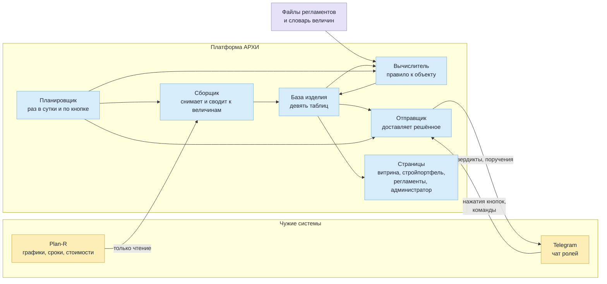
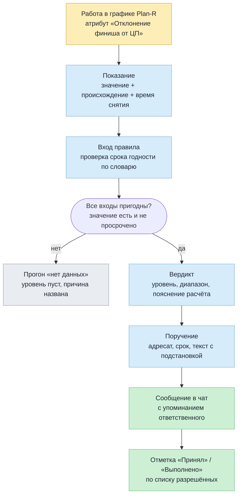
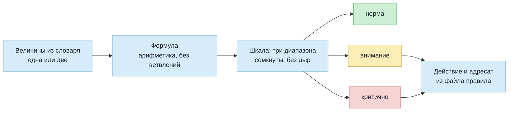
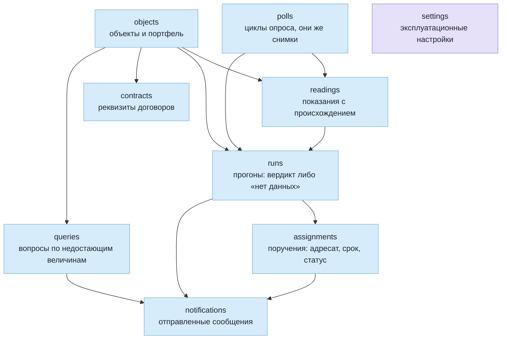
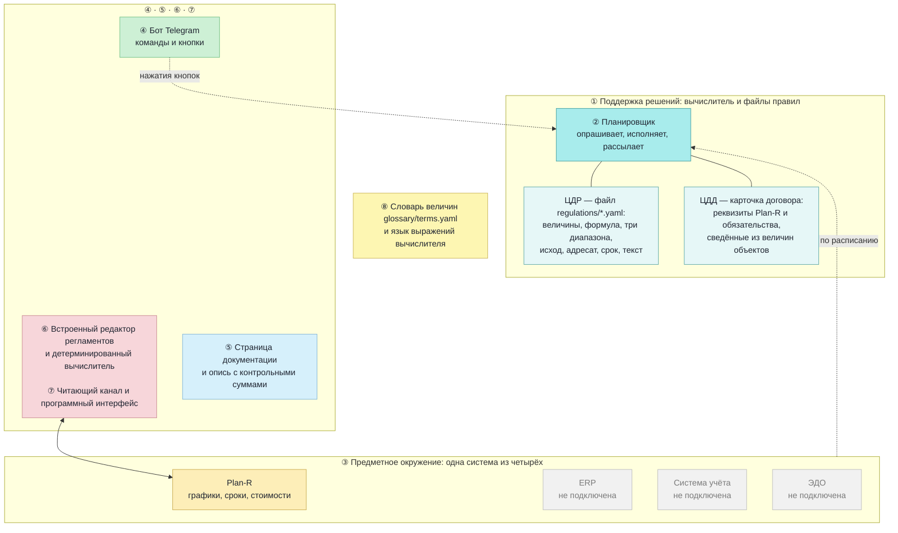

# 11710-11710-81 Пояснительная записка

**Платформа АРХИ, компактная редакция**
ГОСТ 19.404-79

Редакция 2 от 15.09.2026

---

## СОСТОЯНИЕ ДОКУМЕНТА

**Редакция 2 от 15.09.2026.** Прежняя — от 09.09.2026, дополнена 10.09.2026. Первый документ комплекта: он фиксирует
принятые решения и их основания. Разделы 3.2–3.4 закрыты и правке по ходу разработки
не подлежат — это решения, а не описание.

**Что добавлено 10.09.2026.** Пункт 3.8 «Обоснование выбранного состава программных
средств» и раздел 4 «Архитектура изделия и реализованные решения» с четырьмя схемами.
Разделы 3.2–3.4 при этом не затрагивались.

**Разница между разделами 3 и 4, и она существенна.** Раздел 3 излагает **основания
решений** — почему изделие устроено так, а не иначе; он написан до разработки и от неё
не зависит. Раздел 4 излагает **реализованное** — то, что можно открыть и увидеть
на этой сборке; каждое решение приведено вместе с обстоятельством, которое его
потребовало, включая обстоятельства, обнаруженные по ходу работы и признанные
дефектами (пп. 4.5, 4.6).

**Что добавлено 10.09.2026 вторым дополнением.** Пункты 4.9 «Пользовательский
интерфейс» и 4.10 «Программный интерфейс», а также раздел 5 — ожидаемые
технико-экономические показатели.

Показатели даны **границами** и выведены из замеров рабочего экземпляра,
а не назначены: точное число, названное до приёмочных испытаний, было бы
обещанием, а граница есть утверждение, которое можно проверить и опровергнуть.
Под каждой границей названо, на чём она держится. Там, где замера нет,
граница не приводится вовсе.

---

## АННОТАЦИЯ

Документ содержит обоснование решений, принятых при разработке программного изделия
«Платформа АРХИ, компактная редакция», выполняемого по техническому заданию 11710-11710
редакции 7.6.

Основных решений три, и все три — отступления от буквы задания, принятые сознательно:
изделие не применяет семантическую платформу d0sl; его архитектура не опирается на
фреймворк СИГМА; взаимодействие с фреймворком сводится к передаче сводных показателей
для городского дашборда. Основания каждого изложены в разделе 3.

---

## СОДЕРЖАНИЕ

|  | Стр. |
|---|---:|
| 1. Введение |  |
| 2. Назначение и область применения |  |
| 3. Технические характеристики и обоснование принятых решений |  |
| · 3.1а. Как изделие называется и почему именно так |  |
| · 3.1а.1. Признанная аналогия: аларм-трекер с контролем исполнения |  |
| · 3.9. Проверенные и отклонённые возможности: отрицательные результаты |  |
| 4. Архитектура изделия и реализованные решения |  |
| · 4.11. Трассировка задания в изделие: чем занята каждая клетка заявленной архитектуры |  |
| 5. Ожидаемые технико-экономические показатели |  |
| · 5.7. Денежная оценка эффекта — в программе испытаний |  |
| 6. Источники, использованные при разработке |  |
| Приложение А. Хронология |  |
| Приложение Б. Разграничение заимствованного и собственного |  |

---

## 1. ВВЕДЕНИЕ

Изделие разрабатывается по техническому заданию 11710-11710 редакции 7.6, утверждённому
в рамках работ по договору № 0-34-2023 от 21.11.2023, заключённому Новосибирским
государственным университетом с индустриальным партнёром.

Назначение изделия по заданию — информационная поддержка принятия решений при управлении
строительным проектом на основе формально записанных регламентов.

Настоящая записка объясняет, **почему изделие устроено так, а не как предписывает буква
раздела 4.3 задания**. Причины изложены полностью, включая те, что лежат вне техники:
скрывать их бессмысленно, поскольку они проверяются по датам самого задания.

---

## 2. НАЗНАЧЕНИЕ И ОБЛАСТЬ ПРИМЕНЕНИЯ

Изделие применяется в строительных организациях, организациях-заказчиках строительства
и проектных организациях. Оно принимает данные о ходе работ из системы управления
строительными проектами, применяет к ним оцифрованные регламенты строительной отрасли,
выносит вердикт с предписанным действием и доводит его до ответственного лица.

Область применения ограничена строительной отраслью намеренно. Обобщение на другие
предметные области в состав настоящего изделия не входит — обоснование в п. 3.5.

---

## 3. ТЕХНИЧЕСКИЕ ХАРАКТЕРИСТИКИ И ОБОСНОВАНИЕ ПРИНЯТЫХ РЕШЕНИЙ

### 3.1. Постановка задачи

Задание требует изделия, которое (§4.1, девять общих требований) поддерживает принятие
решений руководителями разного уровня, проактивно выдаёт информацию, прогнозирует риск
нарушения регламентов, ведёт цифровые двойники регламентов и договоров, автоматизирует
рутинные операции и опирается на единые определения понятий.

Раздел 4.3 задания предписывает при этом **конкретные средства реализации**: семантическую
платформу стороннего правообладателя (пп. 4.3.1, 4.3.6) и предметно-ориентированный язык
на её основе (п. 4.3.8).

Разделение существенно для всего дальнейшего изложения: **требования §4.1 — к результату,
требования §4.3 — к средству его получения.** Результат достигается; средство заменено.
Ни одно из девяти общих требований при этом не снято.

### 3.1а. Как изделие называется и почему именно так

**Принято владельцем 11.09.2026: изделие называется диспетчером на формально
записанных регламентах.**

Наименование зафиксировано отдельным решением, потому что оно определяет,
что можно говорить об изделии на приёмке и в переписке. Обе половины
существенны.

**«Диспетчер».** Изделие исполняет функцию, названную в задании
диспетчеризацией (п. 4.2.4): доводит вердикт до участника, следит за сроком,
принимает отметку об исполнении и сверяет её с данными. Контур замкнут
и проверен живым нажатием 11.09.2026.

**«На формально записанных регламентах».** Решение выносится правилом из файла:
величина, формула, порог, адресат, срок. У любого вердикта есть пошаговый
расчёт, и он воспроизводится руками. Записывает правило человек — предметный
специалист, без программирования.

**Чем изделие называть НЕЛЬЗЯ, и это запрет, а не предпочтение.** Ни
«интеллектуальным», ни «семантическим», ни «на основе ИИ». Такое наименование
прямо противоречит настоящему разделу и разделу 3.5: языковых моделей,
машинного обучения и семантических платформ в изделии нет, словарь величин —
контролируемый словарь, а не онтология. Расхождение между тем, как изделие
названо, и тем, что о нём написано в его же комплекте, обнаруживается за пять
минут и обесценивает всё остальное, включая верное.

**Что этот запрет не отрицает.** Изделие разработано с применением средств
искусственного интеллекта — это способ разработки, а не свойство изделия,
и смешивать их нельзя. «Создано с помощью ИИ» и «содержит ИИ внутри» —
разные утверждения; верно здесь первое.

#### 3.1а.1. Признанная аналогия: аларм-трекер с контролем исполнения

**Формулировка принята владельцем 12.09.2026 как разрешённая аналогия** —
не взамен наименования, а в дополнение к нему, для разговора с техническим
собеседником:

> **Аларм-трекер с контролем исполнения поручений.** Будильник, который
> звонит, пока обязательство не выполнено.

Аналогия записана здесь потому, что она всё равно возникнет на совещании,
и лучше, чтобы она возникла с оговорками, чем без них.

**Почему она верна.** Механика совпадает точно: порог → срабатывание →
адресат → подтверждение → закрытие. Технический собеседник понимает устройство
изделия за десять секунд, и это дороже точности термина.

**Чем изделие БОЛЬШЕ обычного аларм-трекера.** Три свойства, и все три
про предъявимость, а не про наблюдение:

1. **У порога есть основание.** У трекера порог — настройка, подобранное
   число. Здесь это пункт нормы в поле `osnovanie`, и правило без основания
   не заводится. Тревога не обязана быть защитимой; вердикт обязан — с ним
   идут к подрядчику.
2. **У вердикта есть отпечаток правила.** Трекер знает, что сработало сейчас.
   Изделие знает, какой редакцией правила вынесен вердикт трёхмесячной
   давности, и отвечает на вопрос «что вы показывали в июне». Правка порога
   прежние вердикты не пересчитывает — намеренно.
3. **Закрытие сверяется с данными.** Трекер гаснет, когда метрика вернулась
   либо когда человек нажал «выполнено». Изделие вдобавок **уличает ложное
   закрытие**: если после отметки правило снова дало не «норму», закрытие
   называется неподтверждённым — поимённо, в реестре и в ежедневной сводке.

**Почему «будильник» — не метафора, а описание.** Кнопки «отложить»
у поручения нет, и это следует из устройства, а не из строгости:

* пока ответственный не отметил — поручение открыто;
* вышел срок — уходит на уровень выше;
* отметил, но данные не изменились — закрытие числится неподтверждённым;
* правило сработает на следующем же прогоне и заведёт поручение снова.

Замолчать изделие можно ровно одним способом: **сделать работу так, чтобы
это стало видно в данных.**

**Где аналогия обрывается — сказать обязательно.** Тревога уходит дежурному;
поручение уходит **ответственному по роли**, со сроком и с эскалацией выше
по ролям. У тревоги нет срока и нет того, кто отвечает за неё персонально, —
а на этом здесь держится всё.

**И чего с этой аналогией делать нельзя.** Ставить её наименованием
в отчётных документах. Против требования 4.2.1 задания — «цифровые двойники
регламентов» — слово «диспетчер» читается как выполнение требования,
а «аларм-трекер» как его понижение: «вместо платформы сделали мониторинг».
Проверяющему такое прочтение дарить незачем.

---

### 3.2. Обоснование отказа от применения семантической платформы d0sl

Пункты 4.3.1 и 4.3.6 задания предписывают реализовать модуль поддержки принятия решений
с использованием семантической платформы Eyeline Software Development Platform и языка
d0sl, правообладателем которых является стороннее общество с ограниченной ответственностью.

**Решение: платформа d0sl не применяется.** Основания, в порядке значимости.

**Первое — имущественное, и оно решающее.** Права на коммерческое использование названной
технологии исполнителю в письменном виде не предоставлялись, а её правообладатель в состав
группы разработки не вошёл. Изделие, доведённое на такой основе до стадии распространения,
оказалось бы связано лицензионными условиями третьего лица, не определёнными на момент
разработки. Иными словами, исполнитель не смог бы ни передать изделие заказчику, ни
поручиться за условия его дальнейшего использования.

**Второе — внешняя оценка.** В октябре 2025 года промежуточная проверка Министерства
экономического развития Российской Федерации указала на это обстоятельство как на риск
проекта. Решение принято не по внутреннему усмотрению исполнителя, а после указания
контролирующего органа.

**Третье — соразмерность.** Компактная редакция исполняет четыре регламента одной отрасли,
каждый из которых сводится к схеме «два входных значения → формула → три диапазона →
три исхода». Для такой задачи семантическая платформа общего назначения избыточна:
детерминированный вычислитель занимает порядка двухсот строк и полностью покрывает
требуемое, оставаясь при этом объяснимым построчно — что существенно при приёмке.

**Что сохранено.** Назначение узла ⑥ архитектуры задания — исполнение регламентов
по поступающим событиям, управление их версиями, сбор статистики прогонов — реализуется
собственными средствами в полном объёме. Заменено средство, а не функция.

**Что при этом утрачено, и мы называем это прямо.** Изделие не выполняет логического
вывода на онтологиях и не извлекает семантику из текстов документов. Эти возможности
семантической платформы в компактной редакции отсутствуют, и требования задания,
которые на них опирались, отнесены к отложенным с указанием причины — ведомость покрытия
11710-11710, раздел 4.2.

### 3.3. Обоснование архитектуры, не опирающейся на фреймворк СИГМА

Словарь задания (§9) определяет фреймворк СИГМА как **разрабатываемый** силами Центра
искусственного интеллекта университета комплекс инструментально-технологических средств
для интеллектуальных систем управления городскими инфраструктурами.

**Решение: архитектура изделия на фреймворк СИГМА не опирается.** Основания.

**Первое — хронологическое, и оно исчерпывающее.** План работ задания (§7) устанавливает:
утверждение технического задания — **30.03.2024**; выбор технологий — **30.08.2024**;
проектирование архитектуры — **30.12.2024**; разработка модулей — **30.06.2025**.
То есть архитектура изделия определялась в 2024 году, а модули создавались в первой
половине 2025 года. В этот период фреймворк СИГМА сам находился в стадии разработки —
это зафиксировано в словаре того же задания словом «разрабатываемый».

**Строить изделие на основании, которого ещё не существует, физически невозможно.**
Опора на продукт, находящийся в разработке одновременно с опирающимся на него изделием,
означала бы, что сроки изделия определяются сроками основания, а его состав меняется
вслед за чужими решениями. Ни то, ни другое заданием не предусмотрено и в план работ
не заложено.

**Второе — отношение обратное тому, что предполагает опора.** План работ задания (§7)
относит **интеграцию Платформы АРХИ с фреймворком СИГМА к этапу 8 со сроком 30.11.2026** —
то есть после завершения разработки изделия (этап 4, 30.06.2025) и после разработки системы
поддержки принятия решений (этап 5, 30.09.2025). Само задание, таким образом, устанавливает
порядок: **сначала создаётся изделие, затем оно интегрируется с фреймворком.**

Из этого следует существо отношений между ними. АРХИ — не приложение, построенное
на фреймворке, а **отраслевой инструмент, создаваемый для того, чтобы быть полезным
в его составе**. Фреймворк выступает интегратором городских данных; изделие — источником
данных по строительной отрасли. Обратное построение — фреймворк как основание изделия —
противоречило бы и срокам, и назначению обоих.

**Третье — подтверждение со стороны самого фреймворка.** Уточнённая редакция технического
задания на фреймворк СИГМА 2026 года устанавливает, что подключаемые к его ядру модули,
в том числе реализованные в рамках других проектов Центра, должны обеспечивать реализацию
пользовательских сценариев, а интеграция с внешними подсистемами должна базироваться
на едином стандарте обмена событиями с подключением через адаптеры и программный шлюз.
Требование предъявлено, таким образом, **к способу подключения, а не к внутреннему
устройству подключаемой части.**

**Что заимствовано.** Из проекта фреймворка СИГМА заимствована **идея архитектуры**,
принадлежащая Центру искусственного интеллекта университета: контур из входящих событий,
базы знаний, базы данных, программного шлюза и решателя. Заимствование раскрывается
открыто и с указанием источника. Программные средства, исходные тексты, грамматика
и библиотеки не заимствовались и в изделие не переносились — приложение Б.

### 3.4. Способ взаимодействия с платформой СИГМА

Из п. 3.3 следует, каким это взаимодействие может быть, а каким — нет.

**Изделие передаёт данные, а не исполнение.** Оно не отдаёт фреймворку правила, не просит
его вычислять вердикты и не зависит от его доступности: при отсутствии связи изделие
работает в полном объёме. Направление одностороннее — **от АРХИ к платформе СИГМА**.

**Что передаётся: сводные показатели строительного направления для дашборда.** Платформа
СИГМА в части, обращённой к городу, — это надстройка с дашбордами, показывающая состояние
городских инфраструктур. Строительное направление представлено в ней **сводкой по объектам
заказчика**, а не отдельными нарушениями и не текстами регламентов.

Ориентировочный состав передаваемых показателей:

| Показатель | Смысл |
|---|---|
| Количество объектов строительства | размер портфеля заказчика |
| Уровень готовности по каждому объекту и в среднем | доля выполненного объёма работ |
| Число объектов с отклонением от графика | сколько объектов требует внимания |
| Максимальная и средняя просрочка, дней | глубина отставания |
| Число действующих нарушений по уровням критичности | текущая напряжённость |
| Стоимость портфеля | масштаб в денежном выражении |
| Отметка времени формирования сводки | свежесть данных |
| Качество данных: сколько величин снято автоматически, сколько введено вручную, сколько регламентов не исполнено из-за отсутствия данных | без него дашборд покажет «нарушений нет» там, где данных не было |

**Форма передачи.** Набор именованных числовых показателей с отметкой времени, снабжённый
указанием источника каждого значения. **Контракт зафиксирован** — состав полей, их смысл,
правила версионирования и требования к принимающей стороне изложены в документе
11710-11710-13 «Описание программы», раздел о выдаче данных наружу; он написан заранее,
чтобы готовность принимающей стороны шла параллельно нашей разработке. Способ — выгрузка либо чтение по программному
интерфейсу изделия; конкретный протокол определяется на этапе 8 задания совместно
с разработчиками фреймворка, поскольку зависит от принятого ими единого стандарта обмена
событиями.

**Чего в передаче нет и не предполагается.** Персональных данных; сведений о конкретных
работниках и их нарушениях; текстов договоров и регламентов; исходных данных заказчика
в детализации ниже объекта. Городскому дашборду они не нужны, а их передача создала бы
обязательства, которых изделие на себя не принимает.

**Готовность к этому взаимодействию.** Все перечисленные показатели выводятся из данных,
которые изделие уже собирает и хранит: журнала прогонов регламентов и снимков состояния
объектов, полученных из системы управления строительными проектами. Дополнительного сбора
не требуется — требуется только согласованный формат выгрузки.

### 3.5. Обоснование состава компактной редакции

Изделие выполняется как **компактная редакция**: четыре регламента строительной отрасли,
детерминированный вычислитель, читающий канал к системе управления строительными проектами,
реестр поручений, уведомления в мессенджере, шесть страниц интерфейса.

**Отступление от объёма задания: регламентов четыре, а не пять** — и путь к этому
числу важнее самого числа, потому что он и есть проверка устройства.

Задание называет пять правил. Решением владельца от 09.09.2026 **добавлены два**,
оба по итогам разведки боевого экземпляра, а не из желания расширить объём.

Первый, «Устаревший график объекта», добавлен потому, что замер показал: графики Западного
филиала не правились от 67 до 193 дней при том, что отметка изменения заполнена
у всех работ. Этот регламент — предусловие доверия к остальным: пока график
не пересчитан, отставание в нём копится само собой, и вердикт о просрочке
по такому объекту недостоверен.

Второй, «Просрочка на критическом пути», добавлен потому, что действующий регламент
просрочки отвечает на вопрос «насколько глубоко сорван срок», но не отвечает на вопрос
«сдвинется ли ввод объекта». Отставание работы, у которой есть запас времени,
не сдвигает ничего.

Существенно, что **ни одно из двух не потребовало ни строки в вычислителе**: оба
исполняются тем же шаблоном — одна-две величины, формула, три диапазона, три исхода.
Расширение состава здесь есть добавление данных, а не усложнение изделия, и в этом
проверяется само устройство: если бы новое правило потребовало ветки, изделие
перестало бы быть изделием и стало фреймворком.

Решением владельца от 10.09.2026 **из семи снято три** — охрана подземной кабельной
трассы, средства индивидуальной защиты, приёмка материала, — и снято по одной
и той же причине: **у их величин нет источника.** Ни датчиков, ни обмена с учётной
системой у изделия нет, а ручного ввода в нём нет вовсе, — то есть эти правила
выносили «нет данных» во всех прогонах подряд, 630 строк журнала из 1 194.
Формулировка владельца: «заузить всё до пределов Plan-R — чтобы всё нужное
и ничего лишнего». Вместе с правилами выведены четыре роли адресатов и шесть
величин словаря: роль без правила поручений не получает, и оставлять её значило бы
обещать адресата, которому никогда ничего не придёт.

Итог: **четыре действующих правила, и все четыре считаются по величинам, которые
Plan-R отдаёт сам.** Ни одно не ждёт данных со стороны.

Одновременно **отвергнуты одиннадцать других предложений**, и причины у большинства
не в порогах, а в устройстве сбора: величина существует и правильна сама по себе,
а сочетание величин не описывает ничего. Разбор целиком —
[SOSTAV-REGLAMENTOV.md](../SOSTAV-REGLAMENTOV.md), выведенная из него рамка требований
к данным — [TREBOVANIYA-K-DANNYM.md](../TREBOVANIYA-K-DANNYM.md), отрицательные
результаты с условиями возврата — п. 3.9.

**Нейросетевые средства и языковые модели не применяются.** Задание упоминает обработку
естественного языка (§7, этап 5) и машинное обучение (§4.2.2). В компактной редакции они
отсутствуют по двум причинам: результат такой обработки становится основанием
управленческого действия и должен быть объясним построчно, а объём данных изделия —
десятки событий в сутки — не даёт материала для обучения. Диалог с пользователем
реализован набором команд и кнопок, что прямо показывается на демонстрации.

**Графическое построение регламента не реализуется.** Регламент существует в одном виде —
текстовом файле — и правится текстом. Семь правил одной отрасли не окупают построителя
схем, а второе представление правила неизбежно расходится с первым при первой же правке.

Правка при этом **полная**: страница регламентов даёт менять входы, формулу, границы,
исходы, действия, адресатов, сроки и тексты поручений — то есть всё содержание правила.
Это не противоречит отказу от построителя, потому что правится **экземпляр неизменяемого
шаблона**, а не сам шаблон: холста, узлов и связей нет, четвёртый исход завести нельзя,
условие в условие вложить нельзя. Требование задания о настройке допустимых отклонений
через веб-интерфейс администратора (§3, п. 1) закрывается именно этим.

**Вторая предметная область не заводится.** Обобщение ядра на другие отрасли есть
построение фреймворка; настоящее изделие — отраслевой инструмент, и это его определение,
а не ограничение.

### 3.6. Обоснование локального исполнения на текущем этапе

Задание (§5.2, §5.3) предусматривает развёртывание на облачных вычислительных мощностях
и использование внешних облачных хранилищ. На текущем этапе изделие исполняется локально:
запуск одним сценарием на машине пользователя, хранение в файле встроенной базы данных.

Основание — назначение этапа. Изделие сдаётся демонстрацией и приёмочными испытаниями,
проводимыми на машине показывающего; развёртывание инфраструктуры относится к этапу
внедрения (§7, этап 9). Требования §5.2 и §5.3 отнесены к отложенным с указанием причины
и подлежат выполнению при внедрении на площадке заказчика.

### 3.7. Обстоятельства выполнения работ: данные индустриального партнёра

Задание (§6.2) определяет площадкой тестирования и внедрения строительный проект
жилого комплекса «Пульсар», участником которого является индустриальный партнёр.

**Индустриальный партнёр прекратил работу по договору и актуальных данных
по этому проекту не предоставил**, сославшись на чувствительность коммерческой
информации и риск её раскрытия конкурентам.

Обстоятельство изложено здесь потому, что оно определяет состав данных, на которых
изделие разрабатывается и предъявляется, и без него этот состав выглядел бы
произвольным выбором исполнителя.

**Что из этого следует для работ.**

Изделие разрабатывается и демонстрируется на данных системы управления
строительными проектами, доступных исполнителю в рамках предоставленного доступа.
Проверка состояния этих данных на 09.09.2026 показывает следующее:

- объекты, соответствующие площадке из §6.2, в системе заведены, но **сведений
  о ходе работ по ним нет**: атрибуты отклонения от целевого плана не заполнены,
  графики содержат по шесть-семь записей;
- содержательные данные — сроки, отклонения, критический путь, стоимости,
  трудозатраты, разрешительная документация — заполнены **по другой группе
  объектов** того же пространства, и работы ведутся на них.

**Что это меняет и чего не меняет.** Не меняет ничего в проверяемости изделия:
регламенты, вычислитель и канал работают на настоящих данных настоящей системы,
и вердикты выносятся по ним. Меняет предметную привязку демонстрации: она ведётся
не на объекте, названном в §6.2, и это проговаривается прямо, а не обходится
молчанием.

**Что требуется для устранения.** Возобновление предоставления данных
индустриальным партнёром либо замена площадки внедрения по согласованию
с заказчиком. Решение находится вне компетенции исполнителя и относится
к организационным условиям выполнения договора.

### 3.8. Обоснование выбранного состава программных средств

Перечень средств **замкнут** и приведён в файле `requirements.txt` с указанием
закреплённых версий. Замкнутость здесь не формальность: каждое добавленное
средство есть обязательство сопровождать его версии, лицензию и поведение,
а изделие сдаётся демонстрацией с машины показывающего, где недоступность
одной библиотеки означает несостоявшийся показ.

Ниже — по позициям: что взято, ради чего именно и что рассматривалось взамен.

| Средство | Ради чего | Что рассматривалось и почему не взято |
|---|---|---|
| **Python 3.12** | Язык разработки | Обоснован заданием (§5.4) и наличием готовых средств работы с YAML и HTTP. Замена языка потребовала бы переписывания разборщика правил без выигрыша |
| **FastAPI** | Серверная часть: восемнадцать читающих и пишущих точек, проверка входных данных по объявленной форме | Голый `http.server` — пришлось бы писать разбор тела, коды ответов и проверку самим; это тот же объём кода, но не проверенный |
| **Uvicorn** | Исполнение сервера, слушает **только 127.0.0.1** | Привязка к петлевому адресу — решение, а не умолчание: изделие не должно оказаться доступным из сети по недосмотру |
| **SQLAlchemy 2.0 (async)** | Обращения к базе с параметрами, а не склейкой строк | Прямой `sqlite3` не даёт асинхронного режима, а он нужен: опрос чужой системы идёт минутами и не должен блокировать страницы |
| **aiosqlite, greenlet** | Не самостоятельные возможности, а обязательные части связки «SQLAlchemy async + SQLite» | Объявлены строками перечня, чтобы состав был виден целиком, а не появлялся как неожиданная зависимость |
| **SQLite (режим WAL)** | Хранение: девять таблиц в одном файле | Отдельная СУБД потребовала бы установки и сопровождения на машине показывающего — это инфраструктура, отнесённая к этапу внедрения |
| **httpx** | Читающие обращения к Plan-R: тайм-ауты, повторы, ограничение одновременных запросов | Берёт набор корневых сертификатов `certifi`, и это существенно: **системное хранилище macOS не содержит промежуточного центра сервера Plan-R**, то есть со стандартным средством канал не поднялся бы вовсе |
| **PyYAML** | Чтение файлов регламентов и словаря величин | Собственный разбор YAML — источник расхождений с тем, что человек видит в редакторе |
| **aiogram** | Telegram: получение обновлений, кнопки под сообщениями, разбор нажатий | Прямые обращения к Bot API дали бы то же самое, но опрос обновлений, повторные попытки и разбор нажатий пришлось бы писать заново; версия `pydantic` подчинена этой библиотеке, и набор подобран согласованно |

**Чего в составе нет и не будет.** Средств работы с онтологиями (`rdflib`,
`pyshacl`), обращений к языковым моделям, клиентов внешних облачных служб,
брокеров сообщений и средств машинного обучения. Их отсутствие — объявленная
граница редакции, а не недоработка: обоснование отказа приведено в 3.2 и 3.3.
Проверяющий может убедиться в этом по одному файлу `requirements.txt`.

**Отрисовка диаграмм выполнена собственными средствами.** Диаграммы комплекта
записаны текстом в самих документах и рисуются изделием при показе документа.
Готовое средство `mermaid.js` весит около мегабайта и подключается с внешнего
узла сети, то есть требует связи; изделие показывают с ноутбука, и связь
допустима только к Plan-R и Telegram. Поддерживается ровно то подмножество
языка диаграмм, которое встречается в документах комплекта, а всё прочее даёт
ошибку разбора с указанием строки: молчаливо пропущенная часть диаграммы
означала бы неполную схему, о неполноте которой читатель не узнает.

---

### 3.9. Проверенные и отклонённые возможности: отрицательные результаты

**Зачем этот подраздел вообще написан.** Отрицательный результат — самая
дорогая часть исследования и первая, которую теряют. Он не виден в изделии:
в коде нет строк, которых не написали, и на экране нет страниц, которых
не завели. Через полгода вопрос «а почему у нас нет отчёта по обеспеченности
техникой» задаётся заново, и заново оплачивается тот же перебор.

Здесь записаны **возможности, которые были исследованы замером и отклонены**.
У каждой названо, что именно перебрано, какое число получено и **при каком
условии вопрос открывается снова**. Последнее существенно: почти ни один отказ
здесь не вечен — он привязан к состоянию данных заказчика, а оно меняется.

Подраздел написан так, чтобы его можно было **показать разработчику
системы-источника**: в п. 3.9.5 сведено то, чего изделию не хватило в Plan-R,
с точным указанием атрибутов и их заполненности.

#### 3.9.1. Сводка отклонённого

| Возможность | Отклонена потому, что | Открывается снова, если |
|---|---|---|
| Контроль средств индивидуальной защиты | величин охраны труда в Plan-R нет вовсе | появится источник события — видеоаналитика либо ввод человеком |
| Приёмка материала с расхождением по накладной | поля расхождения живут в системе учёта, с которой изделие не стыкуется | заказчик заведёт расхождение атрибутом работы |
| Охрана подземной кабельной трассы | питается событиями датчика, которых изделие не принимает | появится точка приёма события извне |
| Отчёт по текущим работам | данные лучшие в наборе, но нормы под них не выводится | — вопрос закрыт как регламент, оставлен как справка |
| План работ на месяц | предупреждать не о чем: просроченных по этому признаку нет | заказчик начнёт вести оперативные даты позади календаря |
| Обеспеченность людьми план/факт | численность людей заказчик не ведёт | «Численность бригады» будет заполняться |
| Обеспеченность техникой план/факт | ни одного атрибута про машины среди 245 перебранных | Plan-R заведёт ресурс типа «машина» либо машино-час |
| Доля актуализированных графиков | величина равна нулю при любом разумном окне | графики начнут вести чаще, чем раз в квартал |
| Причина отставания | поля причины нет, ответственный пуст | появится доуточнение вопросом человеку |
| Правило «Фронт работ не раскрыт» | «не начата» на этих данных значит «срок не наступил» | оперативные даты уйдут в прошлое относительно факта |
| Дефицит резерва как правило | резерв ≤ 0 есть определение критического пути | — не открывается: величина не пороговая по смыслу |
| Насыщенность критического пути | описывает топологию графика, а не неблагополучие | — не открывается |
| Готовность портфеля | портфельных величин три, готовности среди них нет | появится портфельная величина готовности |
| Ось квадрата «есть ли чем отыграть» | все три кандидата постоянны у всех объектов | появится величина про ресурс либо наполнится пересечение «просрочена и на критическом пути» |

#### 3.9.2. Три регламента, снятые за отсутствием пути к данным

Первоначальная спецификация называла пять регламентов, и у трёх из них живого
источника не было — это оговаривалось с самого начала как обстоятельство
показа, а не как дефект. Проверка 10.09.2026 показала, что обстоятельство
тяжелее, чем считалось.

**Замер:** на 1 194 прогона журнала эти три правила дали **630, и все 630 —
«нет данных»**: по 210 у каждого, ни одного вердикта, ни одного поручения,
ни одного сообщения за всё время работы изделия.

**Довод «источник подключится при внедрении» не устоял.** Пути, которым эти
правила получили бы значение, в изделии **не существует ни одного**:
автоматического нет, потому что Plan-R таких величин не отдаёт;
человеческого нет, потому что механизм доуточнения заведён в схеме и не
написан в коде, а ручного ввода нет вовсе.

**Что решение купило.** «Нет данных» перестало означать две разные вещи.
Пробел у правила, у которого источника нет в принципе, доказывает
не честность изделия, а его незаконченность. Пробел у правила, считающегося
по Plan-R, — это находка: **у заказчика не заполнено то, что он сам ведёт.**

#### 3.9.3. Шесть вопросов руководителя

Заказчик назвал шесть вопросов, на которые хочет получать ответ, и предложил
проверить, не выйдет ли из них регламентов. Каждый проверен сплошным перебором
атрибутов по копии боевых данных; каждый замер отдельно перепроверен вторым
проходом и сошёлся поштучно. **Регламентом не стал ни один, и причины
у всех разные** — общего «нет данных» здесь нет.

**Текущие работы на объекте.** Данных больше, чем где-либо: «Прогресс»
заполнен на 6 334 строках из 6 334, работ в ходу 259 на восьми объектах
из десяти. Отклонено не по бедности данных, а потому, что **нормы под них
не выводится**: доля работ в ходу меряет нарезку графика, а не объект —
связь со средней длительностью работы, делённой на срок графика, +0,767.
График из 1 160 работ по три дня даёт 1,3 %, график из одной работы
на 160 суток — 100 %.

**План работ на текущий месяц.** Плановый финиш заполнен у 98,9 % работ,
путь к данным есть. Отклонено потому, что **предупреждать не о чем**:
по всему снимку нет ни одной не начатой работы с прошедшим плановым стартом
и ни одной незавершённой с прошедшим финишем. Самый ранний старт среди
не начатых — на пятнадцать суток впереди сегодняшнего дня.

**Обеспеченность людьми.** Перебраны 107 атрибутов работы и 65 атрибутов
объекта. Атрибутов про людей и трудозатраты пятнадцать; единственный,
который говорит о людях, а не о человеко-часах, — «Численность бригады» —
**заполнен ноль раз**. По человеко-часам пара «план и факт» сходится
у одного объекта из десяти.

**Обеспеченность техникой.** Перебрано **245 идентификаторов**, включая 73,
которые встречаются в данных, но отсутствуют в словаре атрибутов. Ни один
не описывает машину или механизм. Условие «зависит от того, ведут ли ресурсное
планирование» разрешилось тем же перебором: **ресурсное планирование заказчик
ведёт, но не по технике** — единиц измерения семь, и машино-часа среди них
нет ни на одной из 6 218 строк.

**Индикатор «график давно не рассчитывали».** Собственного индикатора у Plan-R
нет: перебраны атрибуты работы, атрибуты объекта, поля перечня версий и поля
дерева объектов. **А наша величина и есть искомый индикатор** — отметка
изменения строки двигается именно при пересчёте графика движком источника.
Портфельная доля актуализированных графиков проверена отдельно и отклонена:
при окне семь суток она равна нулю, при четырнадцати — нулю, при тридцати —
нулю.

**Причина отставания и ответственный.** Поля причины нет: единственный
формальный кандидат заполнен на 4,6 % строк числовым мусором, и **ни одна
из 290 записей не стоит на просроченной работе**. Все поля ответственного лица
на уровне объекта пусты. Ответственный при этом есть и уже используется:
генподрядчик собирается из Plan-R и подставляется в текст поручения.

#### 3.9.4. Правило «Фронт работ не раскрыт» и механизм, объясняющий целый класс отказов

Предложение, дошедшее дальше прочих: единственное за всё время, у которого
**все три исхода достижимы** на боевых данных. Отвергнуто состязательной
проверкой, и отвергнуто по существу.

**Решающий довод.** Из 752 не начатых работ **собственное отклонение старта
положительно у двух**; у остальных плановый старт лежит в будущем — вплоть
до апреля 2029 года. То есть **«не начата» на этих данных значит «срок
не наступил»**. Правило же требовало бы у прораба объяснить, что мешает начать
работы 2028 года, и эскалировало бы руководителю «производство остановлено».
**Это не молчащий уровень, а громкий неверный** — с адресатом и сроком,
и он опаснее пробела: молчащее правило раздражает, а уверенно неправое
разрушает доверие ко всем остальным вердиктам изделия.

**Механизм, ради которого стоило пройти этот путь.** Прогресс в Plan-R
**производен от оставшейся длительности**: формула «единица минус оставшаяся
длительность, делённая на длительность» совпадает с прогрессом на 2 397
строках из 2 589, медиана расхождения ноль. Оставшаяся длительность
пересчитывается движком вместе с оперативным финишем.

Отсюда объясняется то, что до сих пор выглядело случайностью: **весь класс
формулировок «работа идёт и не в срок» пуст не по бедности снимка, а по
устройству источника.** Все строки актуальных версий с прошедшим оперативным
финишем имеют статус «завершена» — без единого исключения из 1 612.

**Правило, выведенное из этого и применимое к любому будущему предложению:**
искать отклонение в величинах, которые Plan-R сам подтягивает к календарю,
бессмысленно. Отклонение живёт там, где источник его **не** выравнивает, —
в отклонении от **целевого** плана, а не от оперативного. Именно на нём стоят
три действующих правила изделия из четырёх.

#### 3.9.5. Чего изделию не хватило в системе-источнике

Сведено отдельно, потому что адресовано не приёмке, а **разработчику
и администратору Plan-R**: ниже названо ровно то, чего не хватило,
с указанием атрибута и его заполненности на боевом экземпляре.

| Что требовалось | Атрибут | Состояние на 10.09.2026 |
|---|---|---|
| Численность людей на работе | «Численность бригады» | атрибут есть, **значений ноль** во всех 29 версиях |
| Техника, машино-часы | — | атрибута нет; в ресурсном планировании семь единиц измерения, машино-часа среди них нет |
| Причина отставания | «Комментарий исполнителя» | заполнен на 4,6 % строк, ни одной записи на просроченной работе |
| Ответственный за работу | «Куратор», «Ответственное подразделение», «Создатель» | **значений ноль**; «Координатор» — четыре, и все четыре суть внутренние идентификаторы |
| Время последнего пересчёта графика | — | отдельного атрибута нет; изделие читает отметку изменения строки |
| Плановые трудозатраты как знаменатель | «Трудозатраты план» / «факт» | пара сходится **у одного объекта из десяти** |
| Расхождение поставки с накладной | — | атрибута нет; величина живёт в системе учёта |

**Девять атрибутов заполнены нулём во всех 29 версиях** и потому непригодны
ни для какого правила: освоение по смете, плановый и фактический объём
на дату, отставание по объёму, полный резерв без ограничений, уточнённый
резерв, ранг пути, предельная дата финиша.

**И одно исправление в нашу сторону.** Атрибут «Статус» числился у нас
среди непригодных — это была наша ошибка замера: он заполнен **у 6 334 строк
из 6 334**, просто значения у него строковые, а перебор смотрел числовые.
Правила это не дало (см. п. 3.9.4), но перечень исправлен.

#### 3.9.6. Ось «есть ли чем отыграть»: третья сторона квадрата решения

**Замысел, высказанный заказчиком 11.09.2026.** Раздел прогноза должен
отвечать не наблюдением, а заданием — «что сделать на этой неделе, чтобы
не случился срыв», — и раскладывать работы по квадрату решения в духе
Декартова: **надо, потому что нельзя не сделать × можно, потому что есть чем.**

**Первая ось построена и работает** (п. 4.16): положение величины
относительно порога и направление её движения — обе величины вычисляемые,
обе разные у разных объектов.

**Вторая ось — «есть ли чем отыграть» — построена не была, и это замер,
а не осторожность.** Осью может стать только то, что у разных объектов
разное; иначе квадрат вырождается в столбец. Перебраны три кандидата, каждый
осмысленный по существу, и все три оказались **постоянны у всех объектов**:

| Кандидат | Что означал бы | Замер 11.09.2026 |
|---|---|---|
| Просроченные работы на критическом пути | отставание, которое перестановкой не лечится | **ноль у всех девяти объектов** |
| Наименьший полный резерв | сколько можно опоздать, не двигая срок ввода | **ноль у всех**, где величина снята |
| Свежесть графика | достоверны ли числа, по которым планируем | **«критично» у всех девяти** |

Четвёртый кандидат — доля работ на критическом пути — **разный у объектов**
(от 0,2 % у Гостиницы до 99 % у Монтажа ВЛ) и по смыслу подходит: это и есть
доля графика, которую нельзя двигать. Осью он всё же не стал: разделение
по нему требует порога, а порог есть содержание нормы и живёт только в файле
правила. Завести порог ради оси квадрата значило бы поставить в изделии
второе место правды — ровно то, от чего оно защищено везде остальное.

**Что осталось.** Квадрат построен на двух вычисляемых осях без единого
нового порога: «за порогом либо под ним» × «растёт либо держится». Обе стороны
берутся из уже вынесенных вердиктов и уже посчитанного темпа.

**Условие возврата.** Ось «есть чем отыграть» станет возможна, когда
у заказчика появится хоть одна величина про ресурс — численность бригады,
машино-часы, — либо когда пересечение «просрочена И на критическом пути»
перестанет быть пустым. Первое зависит от того, начнёт ли заказчик вести
ресурсы (п. 3.9.3); второе — от хода работ, и проверяется одним запросом.

---

## 4. АРХИТЕКТУРА ИЗДЕЛИЯ И РЕАЛИЗОВАННЫЕ РЕШЕНИЯ

Раздел описывает то, что **реализовано**, а не замысел. Каждое решение
приведено вместе с обстоятельством, которое его потребовало: решение без
обстоятельства нельзя ни проверить, ни пересмотреть.

**Если нужен один короткий ответ на вопрос «где у вас то, что мы заказывали» —
он в п. 4.11**: восемь частей архитектуры задания и то, чем каждая занята
в изделии, одной таблицей, включая незанятое.

### 4.1. Состав частей и направление потоков

Три обстоятельства этой схемы существенны для приёмки.

**Канал к системе-источнику работает только на чтение.** Изделие не пишет
в Plan-R ничего и не может испортить рабочий график заказчика — это свойство
устройства, а не обещание. Актуальности данных изделие добивается иначе:
выдаёт ответственному поручение внести причину и новый срок, а исполнение
проверяет по отметке изменения графика при следующем опросе, а не по слову
исполнителя.

**Страницы к Plan-R не обращаются.** Они читают снимок из базы изделия.
Обращение к чужой системе внутри отрисовки страницы означало бы, что чужой
сервер решает, откроется ли наш экран.

**Наружу ходит только планировщик.** Один выход наружу — одно место, где
ограничены одновременные обращения, тайм-ауты и повторы.

### 4.2. Путь величины: от чужой системы до отметки об исполнении

Развилка в середине схемы — главное архитектурное решение изделия, и оно
описано отдельно в 4.3.

### 4.3. «Нет данных» не равно «норма»

Изделие такого рода легче всего испортить подстановкой: отсутствующее значение
заменяется нулём, и правило выносит благополучный вердикт по числу, которого
никто не измерял. Ошибка неотличима от исправной работы, потому что выглядит
как «нарушений нет».

Решение проведено через все слои сразу:

- **в базе** состояние прогона и уровень исхода разведены разными столбцами,
  и ограничение таблицы запрещает их сочетать неправильно: у вердикта уровень
  обязан быть, у прогона без данных обязан отсутствовать;
- **в вычислителе** отсутствующий либо просроченный вход останавливает
  исполнение: правило не считается вовсе, а в журнал пишется, каких именно
  величин не хватило;
- **в сборщике** счётная величина не пишется, если атрибут не заполнен ни
  у одной работы объекта: счёт по незаполненному атрибуту дал бы ноль,
  а ноль означает «просроченных работ нет»;
- **на экране** пробел показан отдельным столбцом сетки «регламент × исход»
  и серым цветом, не входящим в шкалу; строки сетки сходятся к числу
  предметов, поэтому пропавший пробел был бы виден сложением;
- **в чате** пробелы не рассылаются: это не исход, а состояние прогона,
  и разбирают его там, где видно всё поле пробелов сразу.

### 4.4. Неизменяемый шаблон регламента

Регламент — экземпляр одного шаблона: **одна-две величины → формула → три
диапазона → три исхода**. Ни одной ветки под конкретное правило в вычислителе
нет и быть не должно.

Обстоятельство, потребовавшее решения: первая ветка «если правило такое-то,
то посчитать иначе» превращает изделие во фреймворк, а фреймворк отнесён
за пределы редакции (3.3). Поэтому правило подгоняется под шаблон, а не шаблон
под правило: право на упрощение регламента закреплено решением владельца.

Следствия, которые проверяются на приёмке:

- **порог правится без участия программиста** — число вводится на странице
  регламентов и переписывает сам файл правила, причём обе записи границы
  сразу: «до» одного диапазона и «от» следующего есть одно и то же число;
- **негодное правило не принимается** — перед записью набор перечитывается
  целиком тем же разбором, что и при запуске, и при отказе действовать
  остаётся прежнее правило;
- **у величины одно место определения** — словарь; правило с величиной вне
  словаря не загружается вовсе, и опечатка в ключе обнаруживается при
  загрузке, а не вердиктом по несуществующему числу.

### 4.5. Снимок, дозагрузка и отпечаток способа сведения

Опрос чужой системы — самая дорогая часть работы изделия: полный обход
боевого экземпляра занимает часы. Три решения делают его выполнимым.

**Цикл опроса записывается одной транзакцией.** Строка журнала не вставляется
в начале «чтобы был след»: при обрыве осталась бы запись без исхода, и журнал
перестал бы отвечать на вопрос, чем кончился опрос.

**Перечитывается только изменившееся.** У Plan-R спрашивается одно: менялась ли
хоть одна работа после такого-то момента. Ответ «не менялась» весит два байта
против сотен обращений полного обхода. Замер боевого экземпляра: графики
не правились от 67 до 288 суток, то есть при суточном опросе почти каждый круг
обходить нечего. Показания непрочитанных объектов **переотмечаются** прежними
значениями с новым временем: пропуск означал бы, что данные стареют и уходят
в «нет данных» при том, что они есть и только что подтверждены.

**У каждого показания стоит отпечаток способа сведения.** Это решение принято
по обнаруженному дефекту, и обстоятельство стоит назвать прямо. Ответ «не
менялось» честен, но он относится к исходным данным, а не к тому, как изделие
их считает. После исправления способа сведения процентов выполнения объекты
с нетронутыми графиками остались со значениями прежнего счёта — и, поскольку
графики не правят месяцами, исправление не дошло бы до экрана никогда.
Отпечаток отвечает на вопрос «этим ли способом посчитано то, что лежит
в базе»; не совпал — график перечитывается целиком, невзирая на ответ
источника.

**Предел выборки поставлен на записях, а не на страницах.** Обстоятельство
того же рода и обнаружено тем же способом — сверкой с копией.

Постраничный сбор уменьшает страницу, когда экземпляр перестаёт отвечать
на крупное тело: граница у него в байтах, а вес записи у разных объектов
отличается втрое. На отдельных версиях страница садится до одной записи.
Предел, поставленный на числе страниц, в этот момент меняет смысл: четыреста
страниц по десять записей — это четыре тысячи записей с запасом, а четыреста
страниц по одной записи — четыреста записей. Замер 10.09.2026: версия
на 1 543 записи обрывалась на четырёхсотой каждый раз, всегда; крупнейший
график заказчика был нечитаем по устройству предела.

Цена этого на экране измерена той же сверкой и стоит того, чтобы её назвать:
у одного объекта показывалось 17 работ вместо 427 и плановая стоимость
9,4 млн вместо 35,4 млн, а **наибольшая просрочка портфеля — 34 дня вместо
70**, то есть главное число, ради которого изделие и опрашивает источник.
Ошибка при этом не выглядела ошибкой: числа были правдоподобны, происхождение
у них стояло, журнал сообщал об удачном опросе.

Предел теперь считает записи. Число обходов он ограничивает сам: обход либо
приносит новую запись, либо выборка кончается по повтору идентификатора,
значит обходов не больше, чем записей. Одновременно неудача чтения версии
стала храниться в журнале опроса — числом и поимённо. Прежде она никуда
не записывалась: сборщик знал о ней, возвращал числом в сводку прохода,
и след кончался; объект считался по двум графикам из трёх, и заметить это
было нечем.

**Сверка с копией заведена постоянным средством.** Копия снимается без
защищённого канала за минуту и целиком, живой обход через такой канал идёт
часами и обрывается, — поэтому эталоном служит копия, а не недочитанный живой
обход. Средство пересчитывает величины по копии действующим способом
и называет расхождения тремя разными видами: значение разошлось; величина
показана, а в источнике её нет; величина есть в источнике, а на экране её нет.
Второй вид опаснее первого — число выглядит измеренным, а измерять его нечем.
Сверка ничего не чинит: расхождения устраняет полный перечёт.

### 4.6. Отделение доставки от вычисления

Вердикт и поручение записываются одной транзакцией: иначе в базе осталось бы
решение без предписанного действия, и контур «решение — действие —
подтверждение» разомкнулся бы молча. Отправка в мессенджер в эту транзакцию
**не входит**: недоступность чужого сервера откатывала бы вердикт.

Отправщик работает после и по базе: читает, что решено, и досылает то, чего
ещё не отправлял. Отсюда устойчивость к обрыву — переслать неотправленное
можно следующим кругом, ничего не пересчитывая. Несостоявшаяся попытка
сохраняется строкой с причиной: молчание о ней означало бы, что изделие
считает адресата оповещённым, когда он не оповещён, — а на этом держатся
сроки поручений.

Повтор гасится ключом «правило + объект + уровень + номер окна»: регламент,
сработавший вчера и сегодня одинаково, шлёт одно сообщение. Ключ ставится
**только у доставленного**: у неудачи ключа нет, иначе временный сбой связи
заглушил бы сообщение навсегда.

### 4.7. Происхождение числа

Рядом с каждым числом печатается источник и время снятия, а у сведённых
величин — способ сведения («среднее по семи верхним строкам графика»)
и покрытие («только по трём объектам из десяти»).

Обстоятельство: цифра без происхождения на приёмке не считается доказанной,
и это самое частое замечание проверяющих. Второе обстоятельство важнее
первого: сумма, сложенная по трём объектам из десяти, без пометки покрытия
превращает «нет данных» в ноль **сложением** — то есть обходит запрет
из 4.3 не злым умыслом, а обычным подсчётом.

### 4.8. Схема данных

Два свойства схемы заданы ограничениями таблиц, а не соглашением:

- **у сообщения всегда названо основание** — вердикт, поручение или вопрос;
  безосновательная рассылка в изделии невозможна по устройству таблицы;
- **портфель — строка таблицы объектов с признаком**, а не пустая ссылка:
  «портфель» и «объект не указан» не должны быть неотличимы.

Порог регламента в этой схеме отсутствует намеренно. Порог есть содержание
нормы и живёт только в файле правила; срок годности величины — только
в словаре; период опроса и адреса чатов — только в настройках. Смешение дало
бы у порога второе место правды.

### 4.9. Пользовательский интерфейс: шесть страниц и мессенджер

Страниц ровно шесть, и каждая отвечает на свой вопрос. Седьмая не заводится:
страница, отвечающая на два вопроса, отвечает плохо на оба.

| Страница | На какой вопрос отвечает | Чего на ней нет |
|---|---|---|
| **Витрина** | что это за изделие и что оно умеет | данных Plan-R — ни одного числа; плитки считают свои же файлы |
| **Стройпортфель** | что изделие увидело в системе-источнике | правки: страница только показывает |
| **Регламенты** | что есть норма и как её изменить | эксплуатационных настроек: они не норма |
| **Администратор** | как изделие настроено и что с каналом | порогов: порог — содержание нормы |
| **Документация** | из чего состоит комплект и что в нём написано | ненаписанное скрыто не бывает: позиция видна с отметкой |
| **Описание интерфейса** | из каких точек изделие состоит | кнопки «выполнить»: описание не управляет |

**Шесть, а не пять — это исправление записи, а не рост изделия.** До
11.09.2026 документы называли пять и называли РАЗНЫЕ пять: записка
пропускала страницу документации, README — описание интерфейса. Оба перечня
были неполны, и каждый выглядел полным. Найдено сверкой при составлении
программы и методики испытаний; число сверяется проверкой
(`tests/test_pmi_chisla.py`).

**Разделение «норма против эксплуатации» проведено через весь интерфейс.**
Порог правится только на странице регламентов; чат, период опроса и список
разрешённых — только на странице администратора. Смешать их значило бы дать
норме второе место правды, и первая же правка «не там» разошлась бы с файлом
правила молча.

**Всё остальное живёт в мессенджере, а не в седьмой странице.** Вердикт
приходит в чат с упоминанием ответственного, поручение — с кнопками
подтверждения. Разбор естественного языка отсутствует, и на фразу словами
бот отвечает, что понимает только команды: это показывается намеренно,
как объявленная граница редакции.

**Устройство страниц.** Разметка и оформление написаны без подключаемых
средств: ни одного обращения к внешнему узлу сети, ни одного мегабайтного
средства оформления. Причина та же, что у собственного отрисовщика диаграмм
(п. 3.8): изделие показывают с ноутбука, и страница обязана открыться без
связи. Тон элемента при этом **вычисляется** — из уже вынесенного вердикта
либо из доли, — и никогда не назначается: назначенный цвет отвязывается
от состояния при первой же правке.

### 4.10. Программный интерфейс

Страницы не имеют своего доступа к базе: они читают то же, что отдаётся
наружу. Это не архитектурная строгость ради строгости — это условие
проверяемости: приёмочные испытания ходят **тем же интерфейсом, что и
страницы**, а не мимо него, и потому проверяют то самое, что видит человек.

**Двадцать шесть точек, из них семь пишущих.** Разделение читающих
и пишущих — не оформление: пишущие меняют норму либо настройку и потому
закрыты паролем администратора, читающие открыты.

Что отдаётся наружу:

- **состояние изделия** — версия, число регламентов и величин, режим канала,
  сколько сообщений доставлено;
- **снимок и стройпортфель** — объекты, величины с происхождением, вердикты,
  техническая строка вызова;
- **регламенты** — паспорт каждого: версия, отпечаток файла, входы из словаря,
  шкала, счётчик прогонов;
- **журнал** — прогоны, поручения, разрезы за назначенное число суток;
- **сводка для городского дашборда** — отдельная точка с покрытием у каждого
  числа (п. 3.4);
- **эксплуатация** — настройки, журнал опросов, проверка связи.

Что принимается снаружи: правка текста регламента, правка настройки,
перечитывание набора правил, запуск опроса, закрепление снимка, обмен пароля
на билет. Больше ничего: изделие не принимает ни данных о ходе работ
(их оно читает само), ни готовых вердиктов.

**Описание интерфейса строится из самих обработчиков**, а не составляется
отдельным документом: отдельный разошёлся бы с кодом при первой же правке
и разошёлся бы молча. Показывает его собственная страница — встроенная
страница средства разработки грузит оформление с внешнего узла сети и без
связи осталась бы пустой, то есть выглядела бы поломкой ровно тогда, когда
её открывают на приёмке.

**Описание закрыто наравне с правкой, и это исправление несоразмерности.**
Схема интерфейса отдавалась без всякой проверки, тогда как правка одной
настройки требовала пароля; карта всех точек, включая пишущие, полезнее
злоумышленнику, чем любая отдельная настройка. Открывается она по
**короткоживущему билету**: страница администратора меняет пароль на случайный
билет со сроком в четверть часа и открывает описание соседней вкладкой.
Пароль в адрес не кладётся — он осел бы в истории браузера, в журнале сервера
и в закладках навсегда, а пароль на изделие один.

**Изделие слушает только петлевой адрес.** Не настройка по умолчанию,
а решение: сервер, доступный из сети по недосмотру, отдал бы наружу и данные
заказчика, и точки правки нормы.

### 4.11. Трассировка задания в изделие: чем занята каждая клетка заявленной архитектуры

**Зачем этот пункт.** Задание (§4.3) задаёт архитектуру схемой из восьми
пронумерованных частей и требует строить разработку на её основе. Изделие
построено иначе — не в другом порядке, а **другими средствами**: вместо
платформы стороннего правообладателя файл правила, вместо приёма событий их
опрос, вместо пяти систем окружения одна. Каждое такое замещение обосновано
в разделе 3 поодиночке, и именно поэтому его трудно увидеть целиком.

Отсюда предмет пункта: **одна таблица, отвечающая на вопрос, который на приёмке
задают первым, — «где у вас то, что мы заказывали».** Пустых клеток в ней нет
ни одной; есть клетки, занятые не тем, чего ждали, и про каждую сказано, чем
именно замещение отличается от заявленного.

Трассировка ведётся к **тому же изделию**, которое описано выше, и не вводит
новых сущностей: третий столбец — это части со схемы п. 4.1, названные своими
именами.

**Схема 5**. *Та же архитектура, занятая средствами компактной редакции.
Нумерация и расположение частей — со схемы 1 задания; серым показано
незанятое.*

#### Таблица соответствия

| № задания | Что заявлено | Чем занято в изделии | Чем замещение отличается от заявленного |
|---|---|---|---|
| 4.3.1 ① | Модуль поддержки решений на ЦДР и ЦДД, реализованный на платформе стороннего правообладателя | Вычислитель `app/vychislitel.py`, файлы правил `regulations/*.yaml`, таблица `contracts` и карточка договора на стройпортфеле | Платформа не применяется (п. 3.2). ЦДР существует как файл, а не как объект платформы; версия и отпечаток файла записываются в каждый прогон, чем и обеспечено «управление версиями». Заявленные ЦДР управления рисками и комплектацией не заводились: их величин нет в источнике (п. 3.9.2) |
| 4.3.2 ② | Шлюз событий: принимать изменения из информационных систем и ответы пользователей, отправлять на обработку, быть адаптером | Планировщик `app/planirovshchik.py`: два цикла — опрос с исполнением правил и ежедневная сводка; читающий канал `app/planr.py`; входящий канал мессенджера | **Опрос вместо приёма** — см. ниже, замещение первое. Роль адаптера сохранена целиком: единственная часть, ходящая наружу |
| 4.3.3 ③ | Предметное окружение: система управления проектами, ERP, система учёта, ЭДО | Plan-R, и только он | **Одна система из четырёх** — см. ниже, замещение третье. Это не отложенная работа, а причина, по которой три правила сняты с набора 10.09.2026 |
| 4.3.4 ④ | Цифровой диалоговый ассистент: естественный язык, email, чат, голос; сбор данных, информирование, рутинные операции | Бот Telegram: три команды, кнопки «Принял» и «Выполнено» под сообщениями, упоминание адресата по роли, ежедневная сводка по расписанию | Команды и кнопки вместо естественного языка — граница редакции объявлена и показывается (п. 3.5). Один канал из трёх: email и голоса нет. Проактивность, сбор отклика и рутинные операции реализованы полностью |
| 4.3.5 ⑤ | Система управления цифровыми активами: хранение документов, интеграция с ЭДО, разграничение прав, workflow, версии, web-клиент | Страница «Документация»: комплект ГОСТ 19 файлами, отрисовка со схемами, опись состава с контрольными суммами каждого файла | **Покрыто слабее всего из восьми частей.** Нет интеграции с ЭДО, нет ролевого разграничения прав (их ровно двое: смотрящий и знающий пароль), нет workflow и версионирования документов средствами изделия. Отложенное названо в бэклоге, запись 9 |
| 4.3.6 ⑥ | Семантическая платформа: фильтрация и маршрутизация событий, исполнение транзакций на ЦДР и ЦДД, версии, целостность, статистика, персонализация | Встроенный редактор регламентов на странице «Регламенты» и детерминированный вычислитель; журнал прогонов | Обоснование отказа — п. 3.2. Функции платформы разнесены по изделию: маршрутизация — адресат в самом правиле; целостность — прогон и поручение одной записью базы; статистика — журнал прогонов и разрезы за тридцать суток; персонализация — чат роли и упоминание. Семантического вывода нет: изделие не порождает новых фактов |
| 4.3.7 ⑦ | Интеграционный слой: открытые программные интерфейсы | Читающий канал к Plan-R, собственный интерфейс из двадцати шести точек, выгрузка сводки для городского дашборда по зафиксированному контракту (п. 3.4) | Интеграция односторонняя по решению: наружу изделие только читает и отдаёт, в чужие системы не пишет ничего |
| 4.3.8 ⑧ | DSL: единый формально точный набор определений понятий, свойств и действий; интерфейс бизнес-аналитика для построения ЦДР | Словарь величин `glossary/terms.yaml`, формат файла регламента и язык выражений `app/vyrazhenie.py` | **Самое точное соответствие из восьми.** Определения понятий вынесены в один файл, и правило с величиной вне словаря не загружается. Язык не универсален намеренно: арифметика над замкнутым словарём, без вложенных условий и без пользовательских функций |
| 4.3.9 | Информационная безопасность: разграничение прав, изоляция бизнес-логики, сохранность при авариях, аудит, шифрование и ЭЦП, два контура, двухфакторная проверка по SS7 | Правка закрыта паролем; норма отделена от данных — правило в файле, данные в базе, ветвлений под правило в вычислителе нет; сохранность — журнал упреждающей записи и полная синхронизация, снимок одной транзакцией; аудит — журнал прогонов только дописывается, журнал сообщений хранит и неудачи | Реализованы четыре пункта из семи. Шифрования, ЭЦП, двух контуров и двухфакторной проверки нет и в компактной редакции не предполагалось |
| 4.3.10 | Производительность: не менее 10 000 транзакций в секунду, горизонтальная масштабируемость, отклик не более 5 с | Отклик выдержан с многократным запасом: применение правила к объекту 1 мс, страница стройпортфеля 35 мс (п. 5.2) | Под заявленную нагрузку изделие **не проектировалось и на неё не проверялось**: оно исполняется локально (п. 3.6), а его поток событий — десятки в сутки. Горизонтальной масштабируемости нет |

#### Три замещения, которые меняют существо, а не средство

Остальные строки таблицы — замена средства: то же делается иначе. Эти три
меняют само устройство, и приёмке важно видеть их отдельно.

**Первое: опрос вместо приёма событий.** Задание строит контур на том, что
информационные системы **присылают** изменения, а шлюз их принимает. Plan-R
событий не рассылает: у него читающий программный интерфейс, и узнать
об изменении можно только спросив. Поэтому шлюз у нас — планировщик: он
ходит наружу сам, раз в сутки, и сравнивает отметки изменения графиков.

Следствие, которое стоит назвать прямо: **изделие узнаёт о событии не в момент,
когда оно произошло, а в момент следующего опроса.** Период выбран по замеру,
а не по осторожности — графики Западного филиала не правились от 67 до 193
дней, и опрашивать ежечасно то, что меняют раз в квартал, значит нагружать
чужой сервер без нового знания. Подкачка по кнопке период не ограничивает.

Обратный ход контура при этом сохранён целиком: ответы людей приходят
не опросом, а событием — нажатие кнопки в мессенджере принимается сразу.

**Второе: правило как файл вместо правила на семантической платформе.**
Отказ обоснован в п. 3.2; здесь важно его архитектурное следствие. Правило
перестало быть программой и стало **экземпляром неизменяемого шаблона**:
одна-две величины, формула, три диапазона, три исхода. Из этого выросло
всё остальное устройство — от запрета на четвёртый исход до того, что
добавление регламента не требует ни строки в вычислителе (п. 4.4).

Цена названа: выразительность правила ограничена шаблоном. Правило, которому
нужна ветка, изделие не примет — его придётся разложить на два либо признать,
что оно не выражается (п. 3.9).

**Третье: одна система окружения вместо четырёх.** Из четырёх названных
заданием подключён Plan-R. Это не бедность реализации, а обнаруженное
условие: **величина, которой нет в системе-источнике, не может появиться
в изделии никаким способом** — ни ручным вводом, ни приёмом извне (бэклог,
запись 1). Замер 10.09.2026 показал, чем это оборачивается на практике: три
правила из семи выносили «нет данных» во всех прогонах подряд — 630 строк
журнала из 1 194 — и были сняты с набора вместе с их ролями и величинами.

Отсюда правило, применимое к любому расширению окружения: **регламент
заводится после источника, а не раньше.** Подключение ERP и системы учёта
откроет класс правил по комплектации и оплате; до подключения такие правила
означали бы уровень, который никогда не наступает.

#### Что осталось незанятым

| Часть задания | Состояние | Где записано |
|---|---|---|
| ERP, система учёта, ЭДО в окружении | не подключены; ждут доступа заказчика | п. 3.9.5, бэклог |
| Ролевое разграничение прав | двое прав вместо ролей | бэклог, запись 9 |
| Интеграция с ЭДО и workflow документов | не реализованы | настоящий пункт, строка 4.3.5 |
| Шифрование, ЭЦП, двухфакторная проверка | не реализованы | настоящий пункт, строка 4.3.9 |
| Нагрузка 10 000 транзакций в секунду и горизонтальная масштабируемость | не проектировались | п. 3.6, строка 4.3.10 |
| Естественный язык, email и голос в ассистенте | не реализованы по решению | п. 3.5 |
| Механизм доуточнения: вопрос человеку и ответ кнопкой | половина контура готова | бэклог, запись 1 |

**Ни одна строка этой таблицы не закрыта молча.** Незанятое названо
незанятым — в том числе там, где оно закрывает требование задания лишь
частично; отклонённое после проверки названо отклонённым с результатом
измерения (п. 3.9); отложенное названо отложенным с условием возврата.
Это и есть то, ради чего трассировка сведена в одно место: перечень,
в котором нечему потеряться.

---

## 5. ОЖИДАЕМЫЕ ТЕХНИКО-ЭКОНОМИЧЕСКИЕ ПОКАЗАТЕЛИ

### 5.1. Как читать этот раздел

Показатели даны **границами** — «не менее» и «не более», — а не точками.
Причина в том, что это ожидаемые, а не сданные значения: точное число,
названное до приёмочных испытаний, было бы обещанием, а граница есть
утверждение, которое можно проверить и опровергнуть.

Каждая граница **выведена из замера**, а не назначена. Под каждой названо,
на чём она держится и что именно измерялось; замеры выполнены 10.09.2026 на
рабочем экземпляре изделия с данными боевого экземпляра системы управления
проектами. Там, где замера нет, граница не приводится вовсе.

Границы взяты **с запасом к замеру**: изделие сдаётся на чужой машине,
и показатель, совпадающий с замером до единицы, оказался бы невыполнимым
от одной лишь разницы в оборудовании.

### 5.2. Быстродействие

| Показатель | Ожидается | На чём выведено |
|---|---|---|
| Применение одного регламента к одному объекту | **не более 50 мс** | замер: 61 прогон за 0,08 с, то есть 1 мс на прогон; граница взята с полусотенным запасом на медленный диск |
| Полный круг: все регламенты по всем объектам портфеля | **не более 5 с** | замер: 61 прогон за 0,08 с; при росте портфеля вдесятеро — под секунду |
| Ответ страницы стройпортфеля с данными десяти объектов | **не более 1 с** | замер: 35 мс; граница с тридцатикратным запасом |
| Ответ прочих читающих точек | **не более 0,5 с** | замер: перечень регламентов 2 мс, сводка для городского дашборда 14 мс |
| Снятие полной копии данных из системы-источника | **не более 5 мин** | замер: 3 180 записей за 0,6 мин по прямому каналу |

**Оговорка, без которой границы теряют смысл.** Всё перечисленное — время
работы изделия, а не время ответа чужой системы. Обход системы-источника
через защищённый канал занимал в замерах часы: страница ответа садилась
до одной записи, и это свойство канала, а не изделия (п. 4.5). Показатель
быстродействия обхода поэтому дан для прямого канала и в испытаниях
проверяется на нём же.

### 5.3. Объём работы, снимаемой с человека

Это главный показатель по существу задания (§6): «снижение потерь временного
ресурса, высвобождение времени руководителя от диспетчерских функций».

| Показатель | Ожидается | На чём выведено |
|---|---|---|
| Проверок регламентов за один круг опроса, без участия человека | **не менее 60** | замер: 7 регламентов, 10 объектов портфеля плюс портфель целиком — 61 прогон за круг |
| Величин, снимаемых автоматически, от числа участвующих в расчётах | **не менее 90 %** | замер: 77 действующих показаний, все 77 сняты из системы-источника, ручного ввода нет ни одного |
| Кругов опроса в месяц без участия человека | **не менее 30** | период опроса — сутки, круг идёт по расписанию |
| Проверок в месяц, снятых с человека | **не менее 1 800** | 60 проверок × 30 кругов |

**Чего это НЕ означает, и это надо сказать прямо.** Изделие не заменяет
разбор положения дел на объекте: оно снимает **обход** — regулярную сверку
десяти графиков с семью нормами, — но не решение по итогам сверки. Решение
принимает человек, и время на него не сокращается, а высвобождается для него.

### 5.4. Достоверность и объяснимость

| Показатель | Ожидается | На чём выведено |
|---|---|---|
| Доля чисел на экране, у которых напечатано происхождение и время снятия | **100 %** | свойство устройства: показание без происхождения в базу не пишется |
| Доля вердиктов с пошаговым расчётом словами | **100 %** | пояснение записывается в самом прогоне и предъявляется по запросу из чата |
| Расхождение показанного с источником | **ноль** | проверяется средством сверки с копией-эталоном; на 10.09.2026 расхождений нет |
| Число сведений, подставленных вместо отсутствующих | **ноль** | «нет данных» и «норма» разведены на пяти слоях (п. 4.3) |

### 5.5. Стоимость владения и трудоёмкость

| Показатель | Ожидается | На чём выведено |
|---|---|---|
| Лицензионные платежи третьим лицам | **ноль** | 9 средств, все со свободными условиями (п. 3.8) |
| Выделенная серверная инфраструктура на этапе демонстрации | **не требуется** | исполнение локальное, хранение — один файл базы |
| Внешних служб, без которых изделие не работает | **ноль** | без связи работает по копии в полном объёме |
| Объём исходного текста изделия | **порядка 13 тыс. строк** | замер: 7 566 строк служебной части, 4 715 страниц, 1 167 вспомогательных средств |
| Доля пояснений в служебной части | **не менее 10 %** | замер: 826 строк пояснений; каждое решение объяснено на месте |
| Объём проверок | **не менее 400** | замер: 420 проверок, три пакета — дымовой, полный, боевой |
| Срок изменения нормы силами заказчика | **минуты, без участия программиста** | порог правится числом на странице регламентов и пишется в файл правила; перезапуск не нужен |
| Трудоёмкость сопровождения | **растёт с числом регламентов, а не отраслей** | ни одной ветки под конкретное правило в вычислителе (п. 4.4) |

### 5.6. Границы применимости показателей

Все приведённые числа получены на портфеле из **десяти объектов, 3 180 записей
графика, четырёх регламентов, 18 величин словаря**. Это порядок величины
одного филиала, а не города.

Что при десятикратном росте портфеля изменится, а что нет:

- **не изменится** время применения регламента: оно не зависит от числа
  объектов, правило считается по своему объекту;
- **вырастет линейно** время круга и объём обхода источника: круг есть
  повторение одной и той же работы по каждому объекту;
- **упрётся первым** обход системы-источника, а не расчёт: замер показывает
  разницу в четыре порядка между чтением графиков и вычислением по ним.

Показатели за пределами этого порядка настоящим документом не заявляются
и подлежат отдельной оценке.

### 5.7. Денежная оценка эффекта — в программе испытаний

Показатели выше отвечают на вопрос «чего изделие стоит и что успевает».
Вопрос «что оно даёт в деньгах» отвечается **на боевом портфеле десяти
проектов** и потому вынесен в программу и методику испытаний
(11710-11710-51, раздел 9): там же лежат замер, допущения и оговорки.

Числа здесь намеренно не повторяются. Повторённое число живёт своей жизнью:
поправят в одном документе, забудут в другом, и на приёмке разойдутся два
«официальных» значения. Механизм оценки назван одной строкой, остальное —
по ссылке.

**Оценка построена на одном механизме — сроке обнаружения нарушения нормы.**
Замер показал давность графиков от 70 до 290 суток: решения принимались без
новых фактов, по звонкам и совещаниям. Изделие сокращает этот срок до суток,
и денежная оценка есть перевод сокращения в рубли по названным допущениям,
взятым в меньшую сторону. Высвобождение времени руководителя, сокращение
совещаний и снижение зависимости от конкретных сотрудников (§6.1 задания)
в оценку **не входят**: измерить их на десяти проектах нечем.

Получается командой `python3 -m scripts.tep`; счёт закреплён набором
проверок `tests/test_tep.py`.

---

## 6. ИСТОЧНИКИ, ИСПОЛЬЗОВАННЫЕ ПРИ РАЗРАБОТКЕ

1. Техническое задание 11710-11710-1, редакция 7.6 — основной источник требований.
2. Техническое задание на фреймворк СИГМА, уточнённая редакция 2026 года — в части
   требований к способу подключения модулей (п. 3.3 настоящей записки).
3. Открытая документация системы управления строительными проектами, применяемой
   заказчиком, — в части программного интерфейса.
4. Действующие нормативные документы строительной отрасли — в части оцифрованных
   регламентов; документы-основания указаны в карточке каждого регламента.

---

## ПРИЛОЖЕНИЕ А. Хронология

| Дата | Событие | Значение для решений |
|---|---|---|
| 21.11.2023 | Договор № 0-34-2023 с индустриальным партнёром | основание начала работ |
| 30.03.2024 | Утверждение технического задания редакции 7.6 (§7, этап 1) | зафиксирован состав требований |
| 30.08.2024 | Выбор технологий (§7, этап 2) | **фреймворк СИГМА в этот момент разрабатывается** и основанием служить не может |
| 30.12.2024 | Проектирование архитектуры (§7, этап 3) | архитектура определена без опоры на фреймворк |
| 30.06.2025 | Разработка модулей (§7, этап 4) | изделие создаётся раньше, чем существует основание, на которое предлагалось опереться |
| Октябрь 2025 | Промежуточная проверка Министерства экономического развития | зависимость от стороннего правообладателя названа риском |
| 30.11.2026 | Интеграция с фреймворком СИГМА (§7, этап 8) | **задание само ставит интеграцию после создания изделия** |
| до 09.09.2026 | Индустриальный партнёр прекратил работу по договору и не предоставил актуальных данных, сославшись на чувствительность коммерческой информации | площадка §6.2 недоступна; состав данных демонстрации определён этим, п. 3.7 |

Хронология — самостоятельное обоснование пункта 3.3: она содержится в самом задании
и проверяется по нему без обращения к иным источникам.

---

## ПРИЛОЖЕНИЕ Б. Разграничение заимствованного и собственного

| Что | Происхождение | Как использовано |
|---|---|---|
| Идея архитектуры: события → база знаний → база данных → шлюз → решатель | проект фреймворка СИГМА, Центр искусственного интеллекта университета | заимствована открыто, с указанием источника; реализована собственными средствами |
| Семантическая платформа Eyeline SDP, язык d0sl: исходные тексты, грамматика, среда, библиотеки | стороннее общество с ограниченной ответственностью | **не применялись и не переносились** |
| Требования к изделию | техническое задание 11710-11710-1 ред. 7.6, заказчик | выполняются; отступления перечислены в разделе 3 и в ведомости покрытия |
| Регламенты строительной отрасли, программный код изделия | собственная разработка | входят в состав изделия |
| Сторонние библиотеки общего назначения | открытые лицензии | привлекаются через менеджер пакетов; исходные тексты в изделие не переносятся |

---

## СЛОВАРЬ ТЕРМИНОВ

Записка объясняет решения, и потому смешивает три языка: строительный,
технический и язык задания. Здесь расшифрованы все три — в том объёме,
в каком они в ней встречаются.

### Стройка

| Термин | Что это по существу |
|---|---|
| **Целевой план (ЦП)** | утверждённая версия графика — обязательство, от которого считают отклонения |
| **Отклонение финиша от ЦП** | на сколько суток окончание работы уехало против целевого плана. Берётся готовым атрибутом, а не вычисляется сравнением дат |
| **Критический путь** | работы без запаса времени: задержка любой сдвигает срок ввода объекта |
| **Полный резерв** | допустимая задержка работы без сдвига ввода; ноль означает критический путь |
| **Ввод объекта** | срок сдачи объекта в эксплуатацию — то, ради чего считают всё остальное |
| **Стройпортфель** | все объекты организации разом |

### Изделие

| Термин | Что это по существу |
|---|---|
| **ЦДР, ЦДД** | цифровой двойник регламента и договора — понятия задания. В изделии первый есть файлом правила, второй — карточкой договора; разбор в разделе 3 |
| **Величина** | одно измеримое число об объекте с единственным определением: источник, единица, срок годности |
| **Сведение** | превращение строк графика в одно число объекта |
| **Вердикт, прогон** | результат применения правила к объекту и сам его расчёт |
| **Отпечаток** | короткая метка содержимого: по ней видно, какой редакцией правила вынесен вердикт и тем ли способом посчитано число |

### Техника

| Термин | Что это по существу |
|---|---|
| **Python 3.12** | язык изделия |
| **FastAPI** | средство, которым изделие отвечает на обращения страниц |
| **SQLAlchemy, ORM** | средство работы с базой из кода. ORM — способ обращаться к таблицам как к объектам языка |
| **SQLite** | база данных одним файлом: ни сервера, ни службы |
| **WAL** | режим записи базы, при котором чтение не ждёт записи. Для показа существен: страница не замирает во время опроса |
| **async** | способ выполнения, при котором ожидание чужого ответа не останавливает остальное |
| **aiogram** | средство обращения к Telegram |
| **HTTP, тайм-аут, постраничность** | способ обращения к чужой системе, предел ожидания ответа и чтение данных порциями |
| **YAML** | текстовый формат регламентов и словаря величин |
| **mermaid** | текстовая запись схем. Изделие рисует их собственным средством, без обращений к сети |
| **Токен** | строка доступа к чужой системе, заменяющая пароль |
| **ЕСПД** | Единая система программной документации, серия ГОСТ 19 |

---

## СВЯЗАННЫЕ ДОКУМЕНТЫ

- 11710-11710-1 Техническое задание, редакция 7.6 — источник требований.
- 11710-11710 Спецификация — состав изделия и комплекта документов.
- 11710-11710-13 Описание программы — как изделие устроено.
- 11710-11710-31 Описание применения — зачем изделие, для кого и с какими
  объявленными ограничениями; читается непрофильным человеком.
- 11710-11710-32 Руководство системного программиста — установка, режимы
  работы по данным, настройки, получение токенов, обслуживание.
- 11710-11710-33 Руководство программиста — формат регламента и правка
  порога предметным специалистом без программиста.
- 11710-11710-34 Руководство оператора — работа в чате и на страницах.
- 11710-11710-51 Программа и методика испытаний — девять испытаний
  И-01…И-09 и состояние функций на дату прогона.
- 11710-11710-90 Методические рекомендации — порядок внедрения, обучение
  по ролям, ошибки первого месяца.
- Ведомость покрытия требований — что выполнено, что отложено и почему.

**Комплект полон с 11.09.2026: одиннадцать документов из одиннадцати.**
