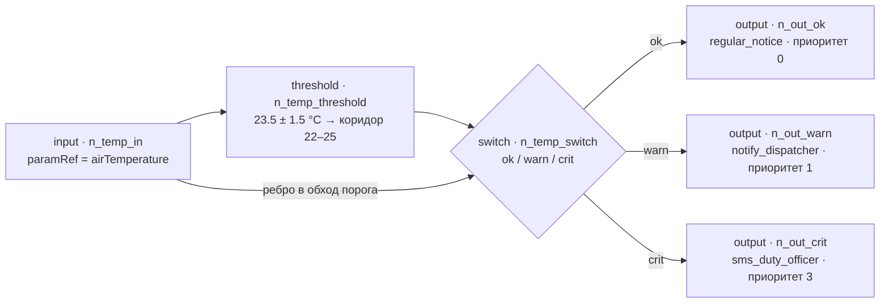
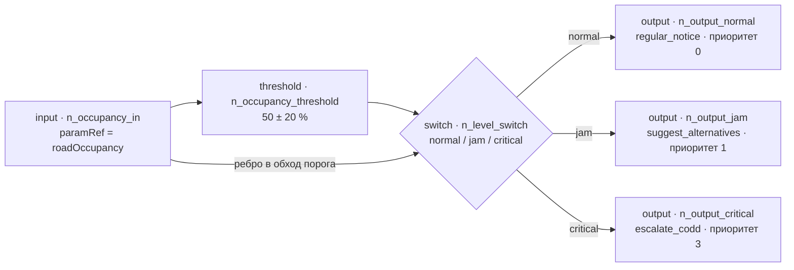
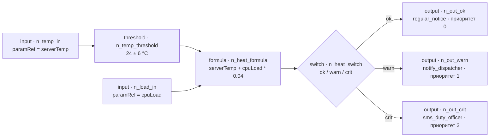
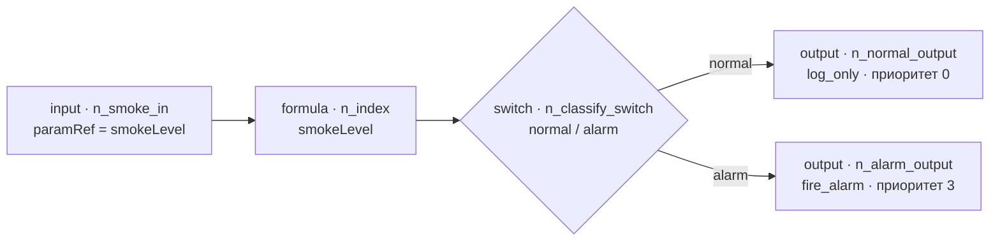

УТВЕРЖДЁН
00000-00000-35-ЛУ

---

# РАГРАФ. Описание языка регламентов Flow DSL

**Обозначение:** 00000-00000-35.
**Наименование изделия:** РАГРАФ — фреймворк инструментов для построения платформ проверяемого управления.
**Стандарт:** ГОСТ 19.506-79 «ЕСПД. Описание языка. Требования к содержанию и оформлению».
**Дата:** 2026-09-04.
**Листов:** документ выполнен в электронной форме.

---

## АННОТАЦИЯ

Документ описывает **Flow DSL** — предметно-ориентированный язык, на котором в изделии РАГРАФ записываются регламенты: правила, извлечённые из приказов, норм, договоров и внутренних процедур организации.

Язык принадлежит доменно-нейтральному ядру фреймворка и не содержит отраслевых понятий. На нём одинаково записываются регламенты строительной площадки, теплосети, диспетчерской службы и службы поддержки; отраслевое содержание вносится набором регламентов и датасетов, а не изменением языка. Поэтому описание языка выделено в комплект фреймворка, а комплекты платформ, собранных на нём, на настоящий документ ссылаются.

Адресат документа — **методолог**: сотрудник, отвечающий за содержание регламентов организации. Знание языков программирования от него не требуется и настоящим документом не предполагается.

Состав документа отвечает ГОСТ 19.506-79: общие сведения о языке, элементы языка, встроенные элементы, средства отладки, средства обмена данными, способы структурирования программы. Порядок изложения взят из учебника `docs/BOOK/`: сначала задача, которую язык решает, затем ядро из пяти узлов, затем запуск, проверка и замыкание контура. Перечень элементов, выданный до объяснения, зачем они нужны, формально соответствовал бы стандарту и был бы бесполезен на практике.

**Все фактические сведения — перечни узлов, функций, сообщений об ошибках, правила исполнения — установлены по исходным текстам и проверкам изделия и сопровождаются ссылками вида `файл:строка`.** Документация проекта местами отстаёт от кода, поэтому источником истины служит код.

---

## СОДЕРЖАНИЕ

1. Общие сведения о языке
2. Элементы языка: узлы и их параметры
3. Выражения и встроенные функции
4. Семантика исполнения
5. Средства отладки программы
6. Средства обмена данными
7. Способы структурирования программы
   Приложение А. Примеры

---

## 1. ОБЩИЕ СВЕДЕНИЯ О ЯЗЫКЕ

### 1.1. Назначение языка

Flow DSL предназначен для записи регламента в форме, которую машина **исполняет**, а человек **читает и проверяет**.

Задача, которую язык решает, состоит в следующем. Правила, по которым работает организация, изложены в документах: приказах, строительных нормах, положениях о службе, условиях договоров. В информационных системах эти правила либо отсутствуют, либо зашиты в исходный текст программы. В первом случае соблюдение правила зависит от внимательности человека, во втором — изменение правила требует цикла разработки и выпуска новой версии, а доказать, что программа делает ровно то, что написано в норме, невозможно без чтения кода.

Flow DSL выносит правило из кода в **граф на экране**. Методолог собирает регламент мышью, изделие исполняет его на поступающих данных и сопровождает каждый вердикт пошаговым расчётом со ссылкой на пункт нормы-основания.

### 1.2. Задачный подход: регламент как задача с критерием решённости

В основе языка лежит **задачный подход**: регламент рассматривается не как последовательность действий, а как **задача**, у которой есть условие, способ решения и признак того, что она решена.

Отсюда четыре обязательных составляющих регламента:

| Составляющая | Чем задаётся в языке |
|---|---|
| **Что наблюдаем** | узел «Событие» — привязка к внешнему сигналу |
| **Что считаем нормой** | узлы «Порог», «Сравнить», «Формула» — числовое условие |
| **Что делаем при отклонении** | узел «Выход» — вердикт с предписанным действием и ролью-адресатом |
| **Как узнаём, что решено** | критерий решённости регламента — условие, по которому изделие самостоятельно проверяет исполнение |

Последняя составляющая отличает регламент от простого правила оповещения. Без критерия решённости система умеет только объявить проблему; с ним — замкнуть контур и проверить, что проблема устранена.

### 1.3. Три глагола и карта языка

Любой регламент читается как три глагола: **измерить → оценить → действовать**. Им отвечают пять основных узлов, соединённых рёбрами:

```
Событие → Вход → Формула → Развилка → Выход
```

Событие приносит значение из внешнего мира. Вход помещает его в регламент как именованный параметр. Формула вычисляет. Развилка выбирает ветку. Выход выдаёт вердикт.

Остальные элементы языка — не исключения из этой схемы, а сокращения:

- **Порог** и **Сравнить** — готовые формы часто встречающихся условий, чтобы не записывать выражение с нуля;
- **Время** — источник, отвечающий на вопрос о текущем моменте («ночь», «рабочие часы»), и потому стоящий на месте события;
- **SHACL** — не элемент логики, а формальное ограничение на входные данные (раздел 6).

Небольшое число элементов — сознательное свойство языка. Язык из девяти типов узлов методолог осваивает за несколько занятий, и, что важнее, чужой регламент читается по схеме слева направо без изучения исходного текста.

### 1.4. Характеристика области применения

Язык применяется там, где решение принимается **по правилу, изложенному в документе**, и где требуется доказать, что правило соблюдено: контроль сроков и стоимости, охрана труда, эксплуатация инженерных сетей, диспетчерское реагирование, входной контроль, регламенты службы поддержки.

Язык не предназначен для вычислительных задач общего вида: в нём нет циклов, подпрограмм, изменяемого состояния и операций ввода-вывода. Это ограничение намеренное — оно обеспечивает завершимость исполнения и делает трассу вердикта конечной и обозримой.

### 1.5. Форма представления программы

Программа на Flow DSL существует в трёх согласованных представлениях:

| Представление | Назначение | Кто работает |
|---|---|---|
| Схема в визуальном редакторе | сборка и чтение регламента | методолог |
| Структура данных регламента (узлы, рёбра, параметры) | хранение и исполнение | изделие |
| Онтологическое представление RDF/Turtle с формальными ограничениями SHACL | обмен с внешними системами, проверка | смежная платформа |

Все три представления описывают одну и ту же программу и переводятся друг в друга без потерь; порядок перевода изложен в разделе 6.

### 1.6. Происхождение

Язык развивает **Σ-программирование** и задачный подход школы Института математики СО РАН (работы С. С. Гончарова, Ю. Л. Ершова, Д. И. Свириденко, их развитие у Е. Е. Витяева и Д. Е. Пальчунова). Непосредственный текстовый предшественник — язык `d0sl`. Отличие Flow DSL от предшественника состоит в форме: правило записывается не текстом, а графом, что и позволяет работать с ним методологу, а не программисту.

---

## 2. Элементы языка: узлы и их параметры

### 2.1 Общие сведения об элементах языка

Программа на языке Flow DSL (регламент) представляет собой ориентированный ациклический граф. Граф состоит из элементов двух видов:

- **узел** — именованный элемент, выполняющий одно элементарное действие (приём сигнала, сравнение, вычисление, маршрутизация, выдача вердикта);
- **ребро** — направленная связь между двумя узлами, задающая порядок обхода графа при исполнении.

Иных синтаксических конструкций (операторов, блоков, подпрограмм, циклов) в языке нет. Цикл в графе запрещён: проверка ацикличности выполняется при сохранении регламента (`backend/app/services/validator.py:101`).

**Общие поля узла.** Все параметры всех типов узлов размещены в одной плоской модели `FlowNode`; отдельных схем на каждый тип узла в языке не предусмотрено (`backend/app/schemas/domain.py:386`). Обязательными на уровне схемы являются только два поля — `id` и `type`; все прочие поля имеют значение по умолчанию `None`. Следовательно, «обязательность» параметра конкретного типа узла схемой не контролируется: она проверяется только валидатором (`backend/app/services/validator.py`) и линтером (`backend/app/services/flow_validators.py`), причём часть проверок носит характер предупреждения и не препятствует сохранению регламента.

Таблица 2.1 — Поля, общие для всех типов узлов

| Поле | Тип | Обязательность | Назначение |
|---|---|---|---|
| `id` | строка | обязательно (схема) | Уникальный идентификатор узла в пределах регламента. Используется как ключ в трассе вердикта, а также как адрес привязки (`bindsTo`) и как ключ подстановки значения при исполнении |
| `type` | `NodeKind` | обязательно (схема) | Машинное имя типа узла; одно из девяти значений по таблице 2.3 |
| `label` | строка | необязательно | Подпись узла на схеме. Для узла «Формула» дополнительно служит одним из имён переменной в области видимости (см. 2.8); для узла «Время» — человекочитаемая подпись условия |
| `position` | `{x, y}` | необязательно | Координаты узла на схеме. Помимо отображения, координаты имеют побочное значение: по координате Y выполняется автопривязка события к входу (2.3), по координатам определяется «первый» узел выхода, диктующий рекомендацию регламента (2.10) |

**Ребро.** Ребро (`FlowEdge`) содержит только три поля (`backend/app/schemas/domain.py:458`).

Таблица 2.2 — Поля ребра

| Поле | Тип | Обязательность | Назначение |
|---|---|---|---|
| `source` | строка | обязательно | Идентификатор узла-источника |
| `target` | строка | обязательно | Идентификатор узла-приёмника |
| `condition` | строка | необязательно | Метка ветки. Единственное поле ребра, несущее семантику: по нему выполняется маршрутизация развилки (2.9) |

Существенное ограничение языка: **номер порта (выхода) узла в тексте регламента не сохраняется.** Модель ребра не содержит полей `sourceHandle`/`targetHandle`, а редактор при сохранении отображает ребро в тройку `{source, target, condition: e.label}` (`frontend/src/lib/rulesDsl.ts:40`). Отсюда следуют два практических вывода для методолога:

1. Нарисованные на схеме порты «истина/ложь» узла сравнения и отдельные порты веток развилки являются исключительно изобразительным средством; собрать ветвление «по ложной ветке» средствами языка нельзя.
2. Метка ветки задаётся подписью ребра (`condition`), поэтому переименование подписи изменяет маршрутизацию развилки (`frontend/src/lib/rulesDsl.ts:43`).

Ограничения на количество рёбер, входящих в узел и исходящих из него, в языке отсутствуют. Проверяются только три условия: отсутствие узлов нулевой степени (ошибка `ISOLATED_NODE` — в том числе для непривязанного события), отсутствие висячих рёбер и ацикличность графа (`backend/app/services/validator.py:101`). Дополнительно редактор запрещает петлю узла на самого себя и повторное ребро между той же парой узлов (`frontend/src/components/flow/FlowCanvas.tsx:104`).

### 2.2 Перечень типов узлов

В языке определено девять машинных типов узлов (`backend/app/schemas/domain.py:342`). Русские наименования узлов в интерфейсе задаются единым реестром `NODE_KIND_META` (`frontend/src/lib/api.ts:1697`).

Таблица 2.3 — Типы узлов языка Flow DSL

| Машинное имя | Название в интерфейсе | Назначение | Вход | Выход |
|---|---|---|---|---|
| `sensor` | Событие | Точка привязки регламента к внешнему сигналу (датчик, задача, выход другого регламента) | Входные рёбра отсутствуют; редактор запрещает любое ребро в событие | Единственное допустимое исходящее ребро — в узел «Вход» |
| `time` | Время | Источник-условие по системным часам (ночь, рабочие часы, день недели, окно) | Входных портов нет вовсе (`frontend/src/components/flow/nodes/index.tsx:155`) | Один выход; активирует нижележащие узлы как сработавший порог |
| `input` | Вход | Скалярный параметр регламента; точка подстановки числового значения | Один вход слева (порт `sensor-in`), входящие рёбра формально допустимы (`…/nodes/index.tsx:61`) | Один выход |
| `threshold` | Порог | Проверка «эталон ± допустимое отклонение» | Один вход | Один выход (`…/nodes/index.tsx:71`) |
| `compare` | Сравнить | Сравнение значения с уставкой либо двух значений между собой | Два порта: «значение» слева, «диапазон» сверху | Два порта («истина» справа, «ложь» снизу), но ветка «ложь» в тексте регламента не сохраняется (`…/nodes/index.tsx:75`) |
| `formula` | Формула | Вычисление выражения на языке формул | Один вход | Один выход (`…/nodes/index.tsx:91`) |
| `switch` | Развилка | Маршрутизация потока по метке ветки либо по числовым границам зон | Один вход | По одному порту на каждую зону (при пустом списке зон — один общий) (`…/nodes/index.tsx:109`) |
| `output` | Выход | Терминальный вердикт: код действия, текст рекомендации, приоритет | Один вход | Исходящие рёбра запрещены (`…/nodes/index.tsx:138`) |
| `shacl_constraint` | SHACL | Устаревший узел-лист: проверка значения предшественника против внешнего ограничения | Один вход | Исходящие рёбра запрещены (`…/nodes/index.tsx:165`) |

В палитре редактора методологу доступны **восемь** типов, сгруппированные по задачному подходу (`frontend/src/components/flow/NodePalette.tsx:34`):

| Фаза | Группа | Типы узлов |
|---|---|---|
| Предусловие | Событие | `sensor`, `time` |
| Логика | Вход | `input` |
| Логика | Оценка | `threshold`, `compare`, `formula`, `switch` |
| Логика | Действие | `output` |

Тип `shacl_constraint` из палитры исключён (решение от 2026-06-09): добавить такой узел мышью нельзя, однако ранее созданные регламенты, содержащие его, читаются и исполняются без ограничений.

Источником потока считается узел «Вход» **или** узел «Время»: при наличии в графе хотя бы одного узла `time` ошибка `MISSING_INPUT` не выдаётся, и путь «источник → выход» отыскивается от узлов обоих типов (`backend/app/services/validator.py:118`).

### 2.3 Узел `sensor` — «Событие»

Назначение: объявить внешний сигнал, наполняющий параметр регламента. Собственных вычислений узел не выполняет.

Таблица 2.4 — Параметры узла «Событие» (`backend/app/schemas/domain.py:437`)

| Параметр | Тип | Назначение |
|---|---|---|
| `sensorType` | одно из 11 значений: `p`, `t`, `flow`, `noise`, `detector`, `fiber`, `air`, `weather`, `traffic`, `task`, `distance` | Категория физического датчика |
| `sensorSubtype` | строка | Конкретный подтип датчика; определяет схему полей полезной нагрузки |
| `bindsTo` | идентификатор узла «Вход» | Адрес подстановки значения. Без него узел исполнителем полностью игнорируется |
| `externalId` | строка | Внешний ярлык источника; в логике не используется, проносится в трассу вердикта |
| `leykaTrigger` | `status_changed` | Событие внешнего трекера задач, запускающее регламент |
| `sourceKind` | `sensor` \| `regulation` \| `leyka` | Вид источника при композиции регламентов |
| `sourceRegulationId` | идентификатор регламента | Регламент-источник при `sourceKind = regulation` |
| `sourceOutputAction` | строка | Код действия узла «Выход» регламента-источника |

Правила соединения и срабатывания:

- узел не имеет входных портов; редактор допускает единственное исходящее ребро — в узел «Вход» (`frontend/src/components/flow/FlowCanvas.tsx:41`);
- проведение ребра «событие → вход» автоматически проставляет `bindsTo` равным идентификатору целевого входа; вручную поле заполнять не требуется (`frontend/src/components/flow/FlowCanvas.tsx:117`);
- при сохранении регламента выполняется доклейка: событие с заданным `sensorSubtype`, но без `bindsTo`, автоматически привязывается к ближайшему по координате Y свободному узлу «Вход», и соответствующее ребро дописывается в текст регламента (`backend/app/api/flow.py:101`);
- событие считается сработавшим **только** если его `bindsTo` указывает на узел «Вход», для которого разрешено значение. Числового значения узел не порождает: он помечает сработавшими себя и своё исходящее ребро (`backend/app/services/flow_executor.py:177`).

Ограничение реализации: значение `sourceKind = regulation` («сигнал от другого регламента») исполнителем графа не обрабатывается — разрешение показаний выполняется только по идентификатору датчика, идентификатору параметра и типу датчика (`backend/app/services/flow_executor.py:532`). Композиция регламентов реализована как синхронизация записей в таблицу триггеров при сохранении регламента, а не как исполнение внутри графа (`backend/app/services/regulation_store.py:4321`).

### 2.4 Узел `time` — «Время»

Назначение: источник-условие, вычисляемый по системным часам; открывает ветку регламента без входного сигнала.

Таблица 2.5 — Параметры узла «Время» (`backend/app/schemas/domain.py:350`)

| Параметр | Тип | Назначение |
|---|---|---|
| `expression` | текст на языке формул | Условие на временных функциях. Носитель всей семантики узла |
| `timeMode` | `night` \| `work_hours` \| `day_of_week` \| `window` | Пресет пикера; подсказка интерфейсу, какой набор полей показать. На исполнение не влияет |

Пикер времени порождает ровно четыре формы выражения (`frontend/src/components/flow/PropertyPanel.tsx:666`): `is_night(s, e)`; `hour() >= s and hour() < e`; при переходе через полночь — `hour() >= s or hour() < e`; `day_of_week() == d`. Интервал полуоткрытый: `[начало, конец)`.

Правила срабатывания:

- узел вычисляется **до** начала обхода графа: при истинном значении выражения он заносится в множество сработавших и активирует нижележащие узлы как сработавший порог (`backend/app/services/flow_executor.py:257`);
- пустое либо ошибочное выражение даёт «не сработал» с пояснением в трассе вердикта, без аварийного завершения прогона;
- узел не несёт числового значения и не заносится в таблицу значений узлов, поэтому развилка при выборе числовой зоны его пропускает и берёт число от датчика (`backend/app/services/flow_executor.py:751`);
- синтаксис `expression` проверяется при сохранении; ошибка блокирует сохранение с кодом `FORMULA_SYNTAX` (`backend/app/services/validator.py:288`).

Дополнительно валидатор проверяет стыковку интервалов у узлов «Время», подключённых к развилкам: пересечение часов — ошибка `TIME_GATE_OVERLAP`; «дыра» ровно в один непокрытый час у двух почти взаимодополняющих условий — ошибка `TIME_GATE_GAP` (`backend/app/services/validator.py:351`).

Особенность реализации: в обходе графа предусмотрена универсальная ветка, помечающая сработавшим любой узел, не попавший в явные обработчики (`backend/app/services/flow_executor.py:363`). Через программный интерфейс (в обход редактора) можно провести ребро **в** узел «Время» и тем самым заставить его сработать вопреки собственному условию.

### 2.5 Узел `input` — «Вход»

Назначение: скалярный параметр регламента; точка, в которую подставляется числовое значение показания.

Таблица 2.6 — Параметры узла «Вход»

| Параметр | Тип | Название в интерфейсе | Назначение |
|---|---|---|---|
| `paramRef` | идентификатор параметра | «Параметр» (выпадающий список) | Ссылка на параметр регламента. Единственное содержательное поле узла (`frontend/src/components/flow/PropertyPanel.tsx:172`) |

Правила срабатывания: узел ничего не вычисляет. Он считается сработавшим, если в наборе разрешённых значений присутствует значение с ключом, равным идентификатору данного узла, и передаёт это число вниз по потоку (`backend/app/services/flow_executor.py:193`).

Значение попадает во «Вход» тремя способами в порядке убывания приоритета (`backend/app/services/flow_executor.py:532`):

| Приоритет | Поле показания | Способ разрешения |
|---|---|---|
| 1 | `sensor_id` | По полю `bindsTo` соответствующего узла «Событие» |
| 2 | `param_id` | По узлу «Вход» с таким значением `paramRef` |
| 3 | `sensor_type` | По первому узлу «Событие» с данным `sensorType`, далее по его `bindsTo` |

Неразрешённое показание игнорируется без сообщения.

Пара «Вход + Порог» имеет дополнительное значение при сохранении: из неё автоматически выводятся параметры регламента — `paramRef` даёт идентификатор и имя параметра, а непосредственно следующий за входом порог — эталонное значение, допустимое отклонение и единицу измерения (`backend/app/services/flow_storage.py:587`).

Примечание. Комментарий в коде редактора утверждает, что единственным допустимым предшественником входа является событие, однако проверка этого не выполняет: ограничиваются только исходящие рёбра события, поэтому рёбра «порог → вход» или «формула → вход» редактором пропускаются (`frontend/src/components/flow/FlowCanvas.tsx:38` против `:41`).

### 2.6 Узел `threshold` — «Порог»

Назначение: проверка отклонения измеренного значения от эталона. По существу является сокращённой записью формулы `abs(value - refValue) > deviation`.

Таблица 2.7 — Параметры узла «Порог» (`frontend/src/components/flow/PropertyPanel.tsx:181`)

| Параметр | Тип | Название в интерфейсе | Назначение |
|---|---|---|---|
| `refValue` | число | «Эталон» | Эталонное (номинальное) значение параметра |
| `deviation` | число | «Отклонение» | Допустимое отклонение от эталона в обе стороны |
| `unit` | строка | «Ед. изм.» | Единица измерения; отображение и вывод параметров регламента |

Правила срабатывания (`backend/app/services/flow_executor.py:206`):

- узел срабатывает при `abs(value - refValue) > deviation`; границы диапазона включаются в норму;
- если `refValue` **или** `deviation` не заданы, узел не срабатывает никогда, а в трассу вердикта записывается «порог не настроен».

Семантика границ зафиксирована приёмочными испытаниями для порога 20.5 ± 1.5: значения 19.0 и 22.0 признаются нормой (уровень 0), значения 18.9 и 22.1 вызывают срабатывание (уровень 2) (`backend/tests/test_flow_executor.py:197`).

Ограничение реализации: **порог получает входное значение только от узла «Вход»** — сначала на один шаг назад, затем на два шага (через любой промежуточный узел) (`backend/app/services/flow_executor.py:562`). Значение, вычисленное формулой или узлом сравнения, в порог не передаётся: цепочка «формула → порог» даёт в трассе вердикта «нет входного значения», и порог молча не срабатывает.

Дополнительно следует учитывать: линтер предупреждает только об отсутствии `refValue`; пустое `deviation` проходит без замечаний, хотя такой порог не сработает ни при каких значениях (`backend/app/services/flow_validators.py:93` против `backend/app/services/flow_executor.py:222`).

### 2.7 Узел `compare` — «Сравнить»

Назначение: сравнение значения с уставкой либо сравнение двух значений между собой.

Таблица 2.8 — Параметры узла «Сравнить» (`frontend/src/components/flow/PropertyPanel.tsx:189`)

| Параметр | Тип | Назначение |
|---|---|---|
| `operator` | строка | Код операции сравнения. Фактически обязателен, но схемой не контролируется |
| `refValue` | число | Уставка либо эталон при сравнении с одним предшественником |
| `deviation` | число | Допустимое отклонение при операции «вне диапазона» |

Интерфейс предлагает пять операций: `outside_range` («вне диапазона»), `inside_range` («внутри диапазона»), `greater`, `less`, `equal`.

Исполнитель применяет пять стратегий в следующем порядке (`backend/app/services/flow_executor.py:839`):

| № | Условие применения | Результат |
|---|---|---|
| 1 | Операция `outside_range`/`out_of_range`, единственный предшественник — «Порог» | Принимается готовый вердикт порога |
| 2 | Операция `outside_range`, предшественник — «Вход», заданы собственные `refValue` и `deviation` | `abs(v - refValue) > deviation` |
| 3 | Один предшественник, задана операция | Сравнение значения предшественника с `refValue` |
| 4 | Два и более предшественников | Применение операции к паре значений: `operator(v1, v2)` |
| 5 | Ни одно условие выше не выполнено | Транзитная передача с признаком «сработал» |

Полный перечень операций, распознаваемых вычислителем (`backend/app/services/flow_executor.py:923`): `greater`/`gt`/`>`, `less`/`lt`/`<`, `ge`/`>=`, `le`/`<=`, `equal`/`eq`/`==`, `ne`/`!=`, а также `outside_range`/`out_of_range` в стратегиях 1–2. Любая иная операция в двухаргументном сравнении даёт «ложь».

Ограничения реализации, существенные для методолога:

- операция `inside_range` присутствует в списке интерфейса, но вычислителем **не реализована**: она не попадает ни в одну из стратегий 1–4 и обрабатывается стратегией 5, то есть узел сравнения с этой операцией срабатывает **всегда** (`frontend/src/components/flow/PropertyPanel.tsx:198` против `backend/app/services/flow_executor.py:920`);
- по той же причине узел сравнения без операции, без `refValue` либо без разрешённых значений даёт ложноположительное срабатывание; линтер такую ситуацию не выявляет.

Валидатор выдаёт предупреждение (не ошибку), если у узла сравнения нет предшественников либо предшественник ровно один и это не порог: «Узел сравнения с одним входом ожидает threshold (value+range внутри)» (`backend/app/services/validator.py:153`).

### 2.8 Узел `formula` — «Формула»

Назначение: вычисление произвольного выражения над значениями входов регламента.

Таблица 2.9 — Параметры узла «Формула»

| Параметр | Тип | Назначение |
|---|---|---|
| `expression` | текст на языке формул | Единственное поле узла. Вычисляется безопасным вычислителем по синтаксическому дереву, без применения `eval`/`exec` (`backend/app/services/flow_executor.py:785`) |

Правила срабатывания (`backend/app/services/flow_executor.py:827`):

| Результат вычисления | Поведение узла |
|---|---|
| Логическое значение | Узел срабатывает в соответствии с этим значением |
| Число (включая 0) | Узел считается сработавшим, число передаётся вниз по потоку как значение узла |
| `None` («неизвестно» по Клини) | Узел не срабатывает; в трассу вердикта записывается «unknown» с перечнем переменных без данных |

Область видимости выражения формируется только из узлов «Вход» с разрешёнными значениями; одно и то же число помещается в область видимости под тремя именами — `paramRef`, имя параметра и подпись узла (`backend/app/services/flow_executor.py:702`). Значения других узлов (порогов, сравнений, иных формул) в область видимости не входят.

Синтаксис выражения проверяется при сохранении; ошибка блокирует сохранение с кодом `FORMULA_SYNTAX`. Пустое выражение ошибкой не считается (`backend/app/services/validator.py:288`).

Ограничение реализации: история временных рядов в текущей версии всегда пуста (`backend/app/services/flow_executor.py:734`), поэтому функции `rate`, `delta`, `mean`, `max_over` в рабочем прогоне возвращают `None` и по правилу Клини гасят формулу. Это заглушка, а не работающий механизм временных рядов; регламенты, опирающиеся на динамику, в текущей версии не срабатывают.

### 2.9 Узел `switch` — «Развилка»

Назначение: маршрутизация потока по одной из нескольких ветвей.

Таблица 2.10 — Параметры узла «Развилка» (`frontend/src/components/flow/PropertyPanel.tsx:213`)

| Параметр | Тип | Назначение |
|---|---|---|
| `cases` | список записей `{id?, label, value, min?, max?}` | Описание зон (ветвей). Поля `min`/`max` редактируются как «min (≥)» и «max (<)»; пустое значение трактуется как минус либо плюс бесконечность |

Порядок исполнения: развилка обрабатывается вторым проходом, **после** основного обхода графа; в первом проходе она только помечается сработавшей и накапливает метки входящих рёбер (`backend/app/services/flow_executor.py:350`).

Порядок маршрутизации (`backend/app/services/flow_executor.py:419`):

| № | Правило | Результат |
|---|---|---|
| 1 | Совпадение по метке | Зажигаются исходящие рёбра, метка которых входит в множество активных меток входящих рёбер |
| 2 | Маршрут по числовым границам | Выбирается ровно **одна** ветвь, для которой `min ≤ V < max`. Если значение не попало ни в одну зону, не зажигается ни одна ветвь |
| 3 | Транзитная передача | При отсутствии совпадений по меткам и числовых границ зажигаются **все** исходящие рёбра |

Классифицирующее число берётся по приоритету: формула или сравнение (значения узлов) → порог (его входное значение) → вход; берётся первое найденное (`backend/app/services/flow_executor.py:591`). Для развилки с несколькими числовыми входами результат вследствие этого неоднозначен. Соответствие ветви и ребра при маршруте по границам определяется совпадением метки ребра со значением `value` **или** с подписью `label` зоны (`backend/app/services/flow_executor.py:665`).

**Гейт времени.** Если в развилку входит хотя бы одно ребро от узла «Время», маршрутизация выполняется только при срабатывании хотя бы одного такого предшественника (логическое ИЛИ между гейтами). Иначе в трассу вердикта записывается «switch: гейт времени не активен — ветка пропущена», и ни один выход не зажигается (`backend/app/services/flow_executor.py:396`).

**Проверка зон.** Валидатор требует стыковки соседних зон встык по правилу `[min, max)`: перекрытие (максимум одной зоны больше минимума следующей) — блокирующая ошибка `SWITCH_ZONE_OVERLAP`; разрыв — предупреждение `SWITCH_ZONE_GAP`. Зона без `min` и без `max` («всё остальное») в проверку стыковки не включается (`backend/app/services/validator.py:311`).

Ограничения реализации:

- развилка без описанных зон и без совпадающих меток зажигает **все** исходящие рёбра (правило 3), вследствие чего вердикт прогона равен наибольшему приоритету среди всех выходов независимо от входного значения (`backend/app/services/flow_executor.py:445`; поведение зафиксировано испытанием `backend/tests/test_flow_executor_compare_switch.py:149`). Такая развилка отмечается в редакторе предупреждающим знаком у ветви «без границ»;
- в коде маршрутизации присутствует недействующий фрагмент: множество ключей маршрутизации объединяется с собственным подмножеством, поэтому поле `value` зоны никогда не расширяет набор ключей, и совпадение отыскивается исключительно по меткам входящих рёбер (`backend/app/services/flow_executor.py:415`).

### 2.10 Узел `output` — «Выход»

Назначение: терминальный элемент регламента, формирующий вердикт и предписываемое действие.

Таблица 2.11 — Параметры узла «Выход» (`frontend/src/components/flow/PropertyPanel.tsx:529`)

| Параметр | Тип | Название в интерфейсе | Назначение |
|---|---|---|---|
| `action` | строка (код действия) | «Действие» | Машинный код предписываемого действия |
| `text` | строка | «Рекомендация» | Текст рекомендации, выдаваемой пользователю |
| `priority` | целое 0…3 | «Приоритет» | Степень серьёзности вердикта |
| `leykaTaskId` | строка | — | Идентификатор связанной задачи во внешнем трекере |
| `leykaTaskUrl` | строка | — | Готовая ссылка на задачу во внешнем трекере |

Шкала приоритета возрастает по серьёзности (`frontend/src/components/flow/PropertyPanel.tsx:548`):

| Значение | Смысл |
|---|---|
| 0 | Норма |
| 1 | Внимание |
| 2 | Опасно |
| 3 | Критично |

Формирование вердикта прогона (`backend/app/services/flow_executor.py:504`): уровень равен наибольшему приоритету среди всех сработавших узлов «Выход» (0, если не сработал ни один); рекомендация образуется склейкой их текстов через перевод строки.

Примечание. Пояснительный комментарий к структуре результата прогона утверждает обратную шкалу («1 — критический»), что не соответствует ни интерфейсу, ни фактическому вычислению вердикта; приёмочное испытание `test_multiple_outputs_take_max_priority` прямо фиксирует взятие максимума (`backend/app/services/flow_executor.py:105` против `frontend/src/components/flow/PropertyPanel.tsx:548`).

Проверка кода действия: линтер сверяет `action` с закрытым реестром известных кодов `KNOWN_OUTPUT_ACTIONS` (около 40 кодов групп `notify_*`, `create_*`, `issue_*`, `escalate_*`, `block_*`, `stop_*`, `send_*`, `auto_*`, `request_*`, `no_*`, `reset_*`). Отсутствие кода и неизвестный код дают предупреждения и сохранению не препятствуют (`backend/app/services/flow_validators.py:48`).

Узел «Выход» является терминальным: исходящие рёбра из него запрещены редактором (`frontend/src/components/flow/nodes/index.tsx:138`).

Дополнительная роль: первый по координатам узел «Выход» с непустым текстом определяет поле рекомендаций регламента при сохранении, то есть выход служит источником истины для рекомендации регламента в целом (`backend/app/api/flow.py:192`).

### 2.11 Узел `shacl_constraint` — «SHACL» (устаревший)

Назначение: проверка значения узла-предшественника против внешнего ограничения регламента по границам `minInclusive`/`maxInclusive` (`backend/app/services/flow_executor.py:940`).

Таблица 2.12 — Параметры узла «SHACL»

| Параметр | Тип | Назначение |
|---|---|---|
| `constraintRef` | идентификатор ограничения | Ссылка на ограничение регламента |

Особенности:

- **инвертированная семантика срабатывания:** признак «сработал» означает **нарушение** ограничения, а не успешную проверку (`backend/app/services/flow_executor.py:308`). При чтении трассы вердикта это следует учитывать особо;
- узел является листом: выходной порт в интерфейсе отсутствует, исходящие рёбра запрещены (`frontend/src/components/flow/nodes/index.tsx:165`);
- валидатор требует непустого `constraintRef` (ошибка `MISSING_CONSTRAINT_REF`) и существования указанного ограничения среди SHACL-форм регламента (ошибка `UNKNOWN_CONSTRAINT_REF`) (`backend/app/services/validator.py:257`);
- в палитре редактора тип отсутствует; новые регламенты его не используют, ранее созданные исполняются без ограничений.

### 2.12 Элементы, не являющиеся узлами языка

**Критерий решённости** (`acceptance_criterion`) не является узлом графа: это поле регламента. В палитре он вынесен в отдельную секцию «Постусловие», а на схеме изображается вспомогательным элементом-ромбом с префиксом идентификатора `__sigma`, который вырезается из сохраняемого текста регламента (`frontend/src/components/flow/nodes/index.tsx:287`). Ссылаться на него рёбрами и использовать его в вычислениях нельзя.

### 2.13 Сводная таблица применимости параметров

Таблица 2.13 — Соответствие «тип узла — используемые параметры» (знак «+» — параметр применяется данным типом)

| Параметр | `sensor` | `time` | `input` | `threshold` | `compare` | `formula` | `switch` | `output` | `shacl_constraint` |
|---|---|---|---|---|---|---|---|---|---|
| `paramRef` | | | + | | | | | | |
| `refValue` | | | | + | + | | | | |
| `deviation` | | | | + | + | | | | |
| `unit` | | | | + | | | | | |
| `operator` | | | | | + | | | | |
| `expression` | | + | | | | + | | | |
| `timeMode` | | + | | | | | | | |
| `cases` | | | | | | | + | | |
| `action` | | | | | | | | + | |
| `text` | | | | | | | | + | |
| `priority` | | | | | | | | + | |
| `constraintRef` | | | | | | | | | + |
| `sensorType`, `sensorSubtype`, `bindsTo`, `externalId` | + | | | | | | | | |
| `sourceKind`, `sourceRegulationId`, `sourceOutputAction` | + | | | | | | | | |
| `leykaTrigger` | + | | | | | | | | |
| `leykaTaskId`, `leykaTaskUrl` | | | | | | | | + | |

Поскольку все перечисленные поля физически принадлежат единой модели `FlowNode`, синтаксически допустимо задать любой параметр на узле любого типа; параметры, не указанные в таблице 2.13 для данного типа, исполнителем игнорируются и на вердикт не влияют.

---

## 3. Выражения и встроенные функции

Выражение — единственная форма записи вычислений в языке регламентов Flow DSL. Выражение задаётся в поле `expression` узлов двух типов: «Формула» (`formula`) и «Время» (`time`); оба типа обрабатываются одним и тем же вычислителем и одним и тем же контекстом вычисления (`backend/app/services/flow_executor.py:751`).

Вычислитель реализован в `backend/app/services/formula_eval.py`. Текст выражения разбирается в синтаксическое дерево средствами разборщика языка Python в режиме одиночного выражения (`backend/app/services/formula_eval.py:196`), после чего дерево обходит собственный интерпретатор `_eval_node` (`backend/app/services/formula_eval.py:420`). Функции `eval()` и `exec()` не применяются; исполнение произвольного кода языком не предусмотрено.

Далее по тексту раздела ссылки вида `formula_eval.py:NNN` означают файл `backend/app/services/formula_eval.py`.

### 3.1. Грамматика выражения

Язык выражений — подмножество выражений языка Python. Допустимые конструкции определяются закрытым перечнем типов узлов синтаксического дерева (`backend/app/services/formula_eval.py:120`); любой узел вне перечня отвергается на стадии разбора с сообщением «Запрещённая конструкция: <тип узла>».

Грамматика в расширенной форме Бэкуса — Наура (обозначения: `{}` — повторение ноль и более раз, `[]` — необязательная часть):

```
выражение     ::= тернарное
тернарное     ::= дизъюнкция [ "if" тернарное "else" тернарное ]
дизъюнкция    ::= конъюнкция { "or" конъюнкция }
конъюнкция    ::= отрицание { "and" отрицание }
отрицание     ::= "not" отрицание | сравнение
сравнение     ::= сумма { знак_сравнения сумма }
знак_сравнения::= "==" | "!=" | "<" | "<=" | ">" | ">=" | "in" | "not in"
сумма         ::= произведение { ( "+" | "-" ) произведение }
произведение  ::= унарное { ( "*" | "/" | "//" | "%" ) унарное }
унарное       ::= ( "-" | "+" ) унарное | степень
степень       ::= первичное [ "**" унарное ]
первичное     ::= литерал | имя | вызов | список | кортеж | "(" выражение ")"
вызов         ::= имя "(" [ выражение { "," выражение } ] ")"
список        ::= "[" [ выражение { "," выражение } ] "]"
кортеж        ::= "(" выражение "," [ выражение { "," выражение } ] ")"
литерал       ::= целое | вещественное | строка | "True" | "False" | "None"
имя           ::= идентификатор
```

Перед разбором выполняется текстовая нормализация записи в стиле языка C (`backend/app/services/formula_eval.py:167`): `&&` заменяется на ` and `, `||` — на ` or `, одиночный знак `!` (не входящий в `!=`) — на ` not `. Замена посимвольная, без учёта синтаксического контекста; следствия изложены в 3.7.

Пустое выражение либо выражение из одних пробелов отвергается с сообщением «Пустое выражение» (`backend/app/services/formula_eval.py:192`). При этом в графе регламента пустое поле `expression` ошибкой проверки не считается — узел просто не срабатывает (`backend/app/services/validator.py:288`).

Конструкции, отсутствующие в языке (проверено, все отвергаются на разборе — `backend/app/services/formula_eval.py:141`):

| Конструкция | Пример записи | Реакция |
|---|---|---|
| Обращение к полю объекта | `x.y` | «Запрещённая конструкция: Attribute» |
| Индексация и срез | `x[0]` | «Запрещённая конструкция: Subscript» |
| Безымянная функция | `lambda a: a` | «Запрещённая конструкция: Lambda» |
| Словарь, множество | `{1: 2}`, `{1, 2}` | «Запрещённая конструкция: Dict» / «Set» |
| Форматная строка | `f"{x}"` | «Запрещённая конструкция: JoinedStr» |
| Порождающее выражение | `[i for i in a]` | «Запрещённая конструкция: ListComp» |
| Поразрядные операции | `a & b`, `a \| b`, `a << 1`, `~a` | «Запрещённая конструкция: BitAnd» и др. |
| Именованный аргумент вызова | `abs(a=1)` | «Запрещённая конструкция: keyword» |
| Проверка тождественности | `x is None` | «Запрещённая конструкция: Is» (операторы `is`, `is not` в перечень не входят; вместо них применяется `x == None`) |

Присваивание, определение функции, импорт модуля, цикл языком не предусмотрены: разбор ведётся в режиме одиночного выражения, любая инструкция даёт синтаксическую ошибку.

Ограничение глубины вложенности выражения отсутствует. Обход дерева — обычная рекурсия (`backend/app/services/formula_eval.py:420`), поэтому выражение порядка трёх тысяч операций приводит к переполнению стека (исключение `RecursionError`), которое не относится к ошибкам вычислителя: в программном интерфейсе оно перехватывается общим обработчиком (`backend/app/api/formula.py:159`), а в проверке регламента, где перехватываются только ошибки вычислителя (`backend/app/services/validator.py:298`), приводит к внутренней ошибке сервера. Указание на «захардкоженную глубину рекурсии» в пояснении `backend/app/services/formula_eval.py:40` реализации не соответствует.

### 3.2. Операнды: литералы, имена, константы

**Литералы.** Допустимы целые, вещественные, логические `True`/`False`, `None` и строковые литералы: значение литерала берётся без проверки типа (`backend/app/services/formula_eval.py:425`). Строки полноценно участвуют в вычислении: `'abc' + 'd'` даёт `'abcd'`, `s == "ok"` даёт логическое значение. При этом строковый результат всего выражения программный интерфейс относит к состоянию «ошибка» (см. 3.9), поэтому строки применимы только как промежуточные операнды сравнения, а не как итог формулы.

**Имена.** Имя разрешается в два шага (`backend/app/services/formula_eval.py:426`): сначала в переменных контекста, затем во встроенных константах. Если имя не найдено ни там, ни там, вычисление прекращается ошибкой имени «Переменная 'x' не определена». Следствие: переменная затеняет одноимённую встроенную константу — при наличии переменной `pi` со значением 1 выражение `pi` даёт 1.

**Встроенные константы** (`backend/app/services/formula_eval.py:395`, выдаются методом `GET /api/formula/catalog`):

| Константа | Значение |
|---|---|
| `pi` | 3,14159… |
| `e` | 2,71828… |
| `inf` | машинная бесконечность |
| `nan` | «не число»; все сравнения с ним ложны, включая `nan == nan` |
| `True`, `False`, `None` | перечислены в каталоге, но как имена недостижимы: разборщик распознаёт их как литералы, а не как имена |

**Переменные при исполнении регламента.** Набор доступных имён строится только из входных узлов с разрешённым значением (`backend/app/services/flow_executor.py:717`). Одно значение попадает в набор под несколькими именами: идентификатор параметра (`paramRef`), отображаемое имя параметра, если оно отличается, и подпись узла, если она отличается. Отсюда два практических следствия: переименование узла в редакторе изменяет набор имён, доступных формуле; вход без разрешённого значения в набор не попадает вовсе, и выражение с этим именем даёт не «неизвестно», а ошибку имени.

### 3.3. Операторы и их старшинство

Отдельного описания старшинства язык не вводит — оно наследуется от разборщика языка Python (`backend/app/services/formula_eval.py:196`). Порядок от низшего старшинства к высшему:

| Ранг | Операторы | Ассоциативность | Примечание |
|---|---|---|---|
| 1 | `a if условие else b` | правая | трёхзначная логика не поддерживается (см. 3.5) |
| 2 | `or` (запись `\|\|`) | слева направо | сокращённое вычисление, логика Клини |
| 3 | `and` (запись `&&`) | слева направо | сокращённое вычисление, логика Клини |
| 4 | `not` (запись `!`) | правая | **ниже сравнений**: `!a == b` означает `not (a == b)` |
| 5 | `==`, `!=`, `<`, `<=`, `>`, `>=`, `in`, `not in` | цепочка (см. ниже) | `0 < x < 10` допустимо |
| 6 | `+`, `-` (двухместные) | левая | `+` работает и на строках |
| 7 | `*`, `/`, `//`, `%` | левая | деление на ноль — ошибка, не «неизвестно» |
| 8 | `-x`, `+x` (одноместные) | правая | `-2 ** 2` равно −4 |
| 9 | `**` | **правая** | `2 ** 3 ** 2` равно 512 |
| 10 | вызов функции, скобки, список, кортеж | — | — |

Цепочка сравнений вычисляется поэтапно (`backend/app/services/formula_eval.py:516`): каждая пара сравнивается отдельно, при первом ложном результате возвращается «ложь», при неопределённом промежуточном результате вся цепочка даёт «неизвестно».

### 3.4. Вычисление при отсутствии данных (трёхзначная логика)

Отсутствующее значение обозначается `None` и трактуется как «неизвестно». Правила приведены в таблице.

| Конструкция | Результат | Ссылка |
|---|---|---|
| Арифметика, где хотя бы один операнд «неизвестно» | «неизвестно» (оператор не применяется) | `backend/app/services/formula_eval.py:439` |
| `-x`, `+x`, `not x` при `x` = «неизвестно» | «неизвестно» | `backend/app/services/formula_eval.py:470` |
| `and`: все операнды истинны | литеральное `True`, **а не последний операнд**: `1 and 2` даёт `True` | `backend/app/services/formula_eval.py:490` |
| `and`: встретился явно ложный операнд | сам этот операнд, вычисление прекращается: `0 and 5` даёт `0` | `backend/app/services/formula_eval.py:490` |
| `and`: был «неизвестно», явно ложных не было | «неизвестно» | `backend/app/services/formula_eval.py:490` |
| `or`: встретился истинный операнд | сам этот операнд: `0 or 3` даёт `3` | `backend/app/services/formula_eval.py:500` |
| `or`: все операнды ложны | `False` | `backend/app/services/formula_eval.py:500` |
| `or`: был «неизвестно», истинных не было | «неизвестно»: `None or 0` даёт «неизвестно» | `backend/app/services/formula_eval.py:500` |
| `==`, `!=`, `in`, `not in` с `None` | вычисляются обычным образом: `x == None` даёт `True`, `None in [1, None]` даёт `True` | `backend/app/services/formula_eval.py:519` |
| `<`, `<=`, `>`, `>=`, где любой операнд `None` | «неизвестно» | `backend/app/services/formula_eval.py:519` |

Асимметрия операторов `and` и `or` существенна для методолога: оператор `or` сохраняет значение операнда, оператор `and` его теряет. Записать «вернуть число при выполнении условия» через `and` нельзя.

### 3.5. Тернарное выражение

Тернарное выражение `a if условие else b` трёхзначную логику **не поддерживает** (`backend/app/services/formula_eval.py:547`): неопределённое условие считается ложным и выбирается ветвь `else`. При переменной `x`, равной `None`, выражение `1 if x else 2` даёт `2`, а не «неизвестно».

Идиома подстановки значения по умолчанию через `or` работоспособна только для ненулевого значения: `x or 5` при неизвестном `x` даёт `5`, а `x or 0` даёт «неизвестно», поскольку ноль ложен и результатом остаётся «неизвестно». Рекомендуемая ранее в `docs/FORMULA-SPEC.md:173` запись `rate("temp", "1h") or 0` требуемого действия не выполняет.

### 3.6. Встроенные функции

Вызов возможен только по имени функции из закрытого перечня (`backend/app/services/formula_eval.py:353`); неизвестное имя даёт ошибку имени «Функция 'x' не определена». Всего определено 33 функции; их перечень выдаётся методом `GET /api/formula/catalog`. Функции разделены на два вида по признаку `takes_ctx` (`backend/app/services/formula_eval.py:350`): числовые, тригонометрические и `between` получают только аргументы методолога; функции времени и временных рядов дополнительно получают контекст вычисления первым скрытым аргументом. Именованные аргументы запрещены на уровне грамматики, поэтому все аргументы, включая необязательные, передаются позиционно.

**Числовые функции**

| Сигнатура | Назначение | Пример | Вырожденный случай |
|---|---|---|---|
| `abs(x)` | модуль числа | `abs(-3)` → `3` | — |
| `min(a, b, …)`, `min(список)` | минимум | `min([1,2,3])` → `1` | вызов без аргументов — ошибка значения |
| `max(a, b, …)`, `max(список)` | максимум | `max(a, 0)` | то же |
| `round(x[, n])` | округление; `n` только позиционно | `round(2.567, 1)` → `2.6` | — |
| `sqrt(x)` | квадратный корень | `sqrt(16)` → `4.0` | `sqrt(-1)` → ошибка «sqrt(...): math domain error» |
| `pow(x, n)` | возведение в степень вещественной арифметикой | `pow(2, 10)` → `1024.0` | при `abs(n) > 1024` — «pow exponent слишком большой»; `pow(2, 1024)` — «pow(...): math range error» |
| `log(x[, основание])` | логарифм; без второго аргумента — натуральный | `log(x, 10)` | `log(0)` → «log(...): math domain error»; запись `log(x, base=10)` запрещена грамматикой |
| `log10(x)` | десятичный логарифм | `log10(1000)` → `3.0` | `log10(0)` — ошибка значения |
| `exp(x)` | экспонента | `exp(1)` → `2.718…` | переполнение — ошибка значения |
| `floor(x)`, `ceil(x)` | округление вниз и вверх до целого | `ceil(2.1)` → `3` | — |
| `sign(x)` | знак числа, целое −1, 0 или 1; вычисляется как `(x > 0) - (x < 0)` | `sign(-7)` → `-1` | — |

**Тригонометрические функции** (аргументы и результаты — в радианах): `sin(x)`, `cos(x)`, `tan(x)`, `asin(x)`, `acos(x)`, `atan(x)`, `atan2(y, x)`. Аргумент вне области определения (`asin(2)`, `acos(2)`) даёт ошибку значения «math domain error».

**Логическая функция**

| Сигнатура | Назначение | Пример |
|---|---|---|
| `between(x, lo, hi)` | принадлежность отрезку, оба конца включительно (`lo <= x <= hi`) | `between(hour(), 6, 22)` |

**Функции времени и календаря.** Момент времени берётся из контекста вычисления: заданное значение либо текущее время в формате UTC (`backend/app/services/formula_eval.py:113`). Часовой пояс объекта не учитывается, при исполнении регламента время не передаётся, поэтому для новосибирской площадки показания смещены на семь часов относительно местного времени.

| Сигнатура | Назначение | Пример | Примечание |
|---|---|---|---|
| `now()` | текущий момент времени | `now()` | как итог формулы недопустим (см. 3.9); сравнение с числом — ошибка значения |
| `hour()` | час, 0…23 | `hour() >= 6 and hour() < 22` | UTC |
| `minute()` | минута, 0…59 | `minute() == 0` | UTC |
| `day_of_week()` | день недели: понедельник = 0 … воскресенье = 6 | `day_of_week() == 4` | — |
| `is_weekend()` | выходной день (день недели ≥ 5) | `is_weekend()` | — |
| `is_night(начало = 22, конец = 6)` | ночной интервал; при `начало <= конец` — полуинтервал `[начало, конец)`, иначе переход через полночь (`час >= начало` или `час < конец`) | `is_night()` в 23:30 UTC → `True`; `is_night(6, 22)` в 23:30 → `False` | значения по умолчанию 22 и 6 |

**Функции временных рядов.** Первым аргументом передаётся **имя параметра строкой**; окно задаётся строкой «целое число + суффикс `m`, `h` или `d`» (`backend/app/services/formula_eval.py:257`). Суффикс регистронезависим (`"1H"` допустимо), число обязано быть целым (`"1.5h"` — ошибка значения «window: число + 'm'/'h'/'d'»), не строка (`60`) и строка короче двух символов (`"h"`) также отвергаются.

| Сигнатура | Назначение | Результат при недостатке данных |
|---|---|---|
| `rate(параметр, окно)` | скорость изменения: (последнее значение − первое) / (интервал **в секундах**) | «неизвестно» при менее чем двух отсчётах в окне или неположительном интервале |
| `delta(параметр, окно)` | приращение: последнее значение минус первое в окне | «неизвестно» при менее чем двух отсчётах |
| `prev(параметр)` | предпоследний отсчёт **всей** истории; окно не принимается | «неизвестно» при менее чем двух отсчётах |
| `mean(параметр, окно)` | среднее по окну | «неизвестно» при пустом окне |
| `max_over(параметр, окно)` | максимум по окну | «неизвестно» при пустом окне |
| `min_over(параметр, окно)` | минимум по окну | «неизвестно» при пустом окне |
| `count_above(параметр, значение, окно)` | число отсчётов со **строгим** превышением `значение` | **`0`**, а не «неизвестно» |

Единица измерения результата `rate` — единицы параметра в секунду, а не за окно: условие `rate("temp", "1h") > 5` означает «рост более 5 единиц в секунду». Рост с 10 до 20 за 59 минут даёт 0,0028.

Функция `count_above` — единственная функция рядов, нарушающая трёхзначную логику: отсутствие данных она представляет как «превышений не было».

**Состояние временных рядов в текущей версии.** При исполнении регламента история отсчётов не формируется: соответствующая процедура безусловно возвращает пустой набор (`backend/app/services/flow_executor.py:748`). Следовательно, при обращении к `POST /api/flow/execute` функции `rate`, `delta`, `prev`, `mean`, `max_over`, `min_over` всегда дают «неизвестно», а `count_above` — всегда `0`. Раздел временных рядов языка описан и реализован в вычислителе, но данными не обеспечен; регламенты, построенные на нём (например, поставляемый пример `backend/data/fixtures/tutorial-05-rate-of-change.flow.json:19`), при исполнении не срабатывают. Отбор отсчётов при отсутствии истории или отсутствии в ней ключа выполняется молча — пустым набором, без ошибки (`backend/app/services/formula_eval.py:275`).

### 3.7. Поведение в вырожденных и ошибочных случаях

| Ситуация | Поведение | Ссылка |
|---|---|---|
| `1 / 0`, `1.0 / 0.0`, `x / 0` | ошибка значения «Деление на ноль» (не «неизвестно») | `backend/app/services/formula_eval.py:450` |
| `x // 0` | ошибка значения «Деление на ноль» | `backend/app/services/formula_eval.py:450` |
| `x % 0` | ошибка значения «Деление на ноль (mod)» | `backend/app/services/formula_eval.py:450` |
| `a ** n` при `abs(n) > 1024` | ошибка значения «Power exponent слишком большой» | `backend/app/services/formula_eval.py:461` |
| `2 ** 1024` | допустимо, даёт целое из 309 цифр; ограничение наложено только на показатель, но не на размер результата | `backend/app/services/formula_eval.py:461` |
| `pow(2, 1024)` | ошибка значения «pow(...): math range error» — поведение оператора `**` и функции `pow` различается | `backend/app/services/formula_eval.py:206` |
| `sqrt(-1)`, `log(0)` | ошибка значения «math domain error», не «неизвестно» | `backend/app/services/formula_eval.py:566` |
| Сравнение несовместимых типов: `'a' < 1`, `now() > 5` | ошибка значения «Compare: …», не «ложь» и не «неизвестно» | `backend/app/services/formula_eval.py:540` |
| Сравнение с `nan`: `nan == nan` | `False`; любое сравнение с `nan` ложно — источник постоянно невыполняющегося условия | — |
| Недостающий аргумент функции: `between(1, 2)` | ошибка значения с исходным текстом среды: «between(...): _fn_between() missing 1 required positional argument: 'hi'» — пользователю показывается внутреннее имя функции | `backend/app/services/formula_eval.py:564` |
| Неизвестная функция: `len('abc')`, `__import__('os')` | ошибка имени «Функция 'x' не определена» — на стадии вычисления, а не разбора | `backend/app/services/formula_eval.py:554` |
| Неизвестная переменная | ошибка имени «Переменная 'x' не определена» — именно ошибка, а не «неизвестно» | `backend/app/services/formula_eval.py:432` |
| Знак `!` внутри строкового литерала: `status == "OK!"` | нормализация превращает выражение в `status == "OK not "`; строку, содержащую `!`, `&&` или `\|\|`, записать нельзя | `backend/app/services/formula_eval.py:167` |
| Смешение записи в стиле C со сравнениями: `!x > 5` | означает `not (x > 5)` — при такой записи скобки обязательны | `backend/app/services/formula_eval.py:174` |
| Имя параметра в функции ряда без кавычек: `rate(temp, "1h")` | ошибки нет; поиск истории идёт по **значению** переменной и молча даёт «неизвестно» | `backend/app/services/formula_eval.py:280` |
| Итог функции, не являющийся ошибкой вычислителя | заворачивается в ошибку значения с приставкой «имя(...)»; ошибки самого вычислителя (например, разбора окна) передаются без приставки | `backend/app/services/formula_eval.py:564` |

Отдельно отмечается: любая ошибка вычисления, а также деление на ноль и выход за область определения, в графе регламента не отличима по внешнему признаку от невыполненного условия — узел просто не срабатывает (см. 3.8).

### 3.8. Вычисление выражения в составе регламента

| Свойство | Поведение | Ссылка |
|---|---|---|
| Набор имён | только входные узлы с разрешённым значением, под именами `paramRef`, отображаемого имени параметра и подписи узла | `backend/app/services/flow_executor.py:717` |
| Результат «неизвестно» | узел «Формула» **не срабатывает**; в трассу вердикта выводится «unknown (трёхзначная Kleene)» — перечень недостающих переменных фактически не выводится, поскольку в наборе имён значения `None` отсутствуют по построению | `backend/app/services/flow_executor.py:827` |
| Логический результат | узел срабатывает, если результат истинен | `backend/app/services/flow_executor.py:827` |
| Числовой результат | узел считается сработавшим при **любом** значении, включая ноль и отрицательное, и значение передаётся вниз по графу, чтобы узел «Развилка» мог отнести его к числовой зоне | `backend/app/services/flow_executor.py:827` |
| Ошибка вычисления | прогон не прерывается: узел помечается несработавшим, в трассу вердикта заносится «ошибка формулы: …» | `backend/app/services/flow_executor.py:809` |
| Узел «Время» | тот же вычислитель и тот же контекст; типовые выражения — `is_night(22, 6)`, `between(hour(), 6, 22)`, `hour() >= 6 and hour() < 22` | `backend/app/services/flow_executor.py:751` |
| Проверка регламента | для узлов типов `formula` и `time` выполняется разбор выражения; ошибка даёт нарушение с кодом `FORMULA_SYNTAX`; пустое выражение ошибкой не считается | `backend/app/services/validator.py:288` |

### 3.9. Программный интерфейс работы с выражениями

| Метод | Действие | Ограничение |
|---|---|---|
| `POST /api/formula/validate` | только разбор выражения, без вычисления | имена переменных и функций **не проверяются**: выражение `__import__("os")` возвращает признак `ok = true` и отвергается лишь при вычислении. Признак `ok` означает «выражение синтаксически допустимо», а не «выражение вычислимо и безопасно по составу имён» |
| `POST /api/formula/evaluate` | вычисление с заданными значениями переменных | история отсчётов не передаётся: функции временных рядов дают «неизвестно» либо `0` |
| `GET /api/formula/catalog` | перечни встроенных функций и констант | — |

Классификация ошибок для интерфейса (`backend/app/api/formula.py:108`): синтаксическая ошибка — вид `syntax`, ошибка имени — `name`, ошибка значения — `value`, прочие — `other`.

Классификация результата (`backend/app/api/formula.py:119`): логическое значение — состояние `true` или `false` (проверяется раньше числа, так как логический тип является подтипом целого); `None` — состояние `unknown`; целое или вещественное — состояние `number`; любой иной тип, в том числе строка и момент времени, — состояние `error`, причём текст ошибки при этом не формируется (поле ошибки пустое).

Трёхзначная семантика закреплена приёмочными проверками (`backend/tests/test_formula_api.py:122`): «неизвестно И истина» → «неизвестно», «неизвестно И ложь» → «ложь», «неизвестно ИЛИ истина» → «истина», `pressure + 1` при неизвестном `pressure` → «неизвестно». Отдельной проверкой (`backend/tests/test_formula_api.py:174`) закреплено, что неопределённая переменная даёт именно состояние `error` с видом `name`, а не «неизвестно».

---

## 4. Семантика исполнения

Настоящий раздел определяет, каким образом регламент, записанный на языке Flow DSL, преобразуется в вердикт. Описание соответствует действующей реализации исполнителя `backend/app/services/flow_executor.py` и вычислителя формул `backend/app/services/formula_eval.py`; каждое положение сопровождается ссылкой на реализацию в формате `файл:строка` и может быть проверено по исходному тексту.

### 4.1. Единица исполнения — прогон

Единицей исполнения является **прогон** — один вызов функции `execute_flow(dsl, regulation, readings, now=None)` (`backend/app/services/flow_executor.py:126`). Функция чистая: между вызовами состояние не сохраняется, накопленная история показаний не ведётся.

| Свойство прогона | Значение |
|---|---|
| Вход | граф регламента (`dsl`), паспорт регламента (`regulation`), список показаний (`readings`), момент времени (`now`, необязательно) |
| Выход | структура `ExecutionResult` (см. 4.7) |
| Память между прогонами | отсутствует |
| История показаний | всегда пустая (`_build_formula_history` возвращает `{}` — `backend/app/services/flow_executor.py:734`) |
| Момент времени по умолчанию | `datetime.now(timezone.utc)`, то есть UTC (`backend/app/services/formula_eval.py:114`) |

Из отсутствия истории следует практическое ограничение: временные функции рядов `rate`, `delta`, `prev`, `mean`, `max_over`, `min_over` в любом прогоне возвращают «неизвестно» (`None`) и переводят формулу в состояние `unknown`, из-за чего узел не срабатывает. Формулы над рядами в текущей реализации неработоспособны, и методолог не должен их применять.

Ни один боевой вызов не передаёт параметр `now`, поэтому узлы времени всегда оценивают выражения по UTC. Для объекта в часовом поясе UTC+7 выражение `is_night(22, 6)` смещается на семь часов. В контуре Live ETL местный час подаётся отдельным параметром `clock-context.local_hour`, но сам узел времени его не использует.

### 4.2. Порядок вычисления узлов

Порядок обхода графа **фазовый и жёстко заданный**; топологическая сортировка узлов не выполняется (`backend/app/services/flow_executor.py:158`).

| № | Фаза | Содержание |
|---|---|---|
| 1 | Резолюция показаний | сопоставление элементов `readings` с узлами типа `input` (см. 4.3) |
| 2 | Узлы-датчики (`sensor`) | помечаются сработавшими при наличии значения |
| 3 | Узлы входа (`input`) | получают резолвенное значение |
| 4 | Все узлы порога (`threshold`) | вычисляются целиком, независимо от связей |
| 5 | Все узлы времени (`time`) | вычисляются целиком как источники-условия (`backend/app/services/flow_executor.py:251`) |
| 6 | Обход в ширину от активированных узлов | распространение сигнала (`backend/app/services/flow_executor.py:235`) |
| 7 | Второй проход по развилкам | фактическая маршрутизация (`backend/app/services/flow_executor.py:374`) |
| 8 | Дообход за развилками | пометка цепочки до выхода (`backend/app/services/flow_executor.py:481`) |
| 9 | Формирование вердикта | расчёт `level` и рекомендации (`backend/app/services/flow_executor.py:503`) |

Дополнительные правила обхода:

- стартовая очередь обхода в ширину формируется как `sorted(activated)`, то есть в **алфавитном порядке идентификаторов узлов** (`backend/app/services/flow_executor.py:274`); порядок вычисления не зависит от структуры графа;
- рёбра, целевой узел которых отсутствует в списке узлов, отбрасываются молча при построении списка исходящих рёбер (`backend/app/services/flow_executor.py:153`); диагностика висячих рёбер на этапе исполнения не выдаётся;
- цикл в графе не приводит к зацикливанию: узел, уже занесённый во множество сработавших, повторно в очередь не ставится (`backend/app/services/flow_executor.py:283`); прогон графа `input → o1 → o2 → o1` завершается корректно;
- защита от повторного вычисления действует **только для сработавших узлов**. Несработавший узел с двумя предшественниками вычисляется дважды и даёт две одинаковые записи трассы (`backend/app/services/flow_executor.py:283`).

### 4.3. Передача значений

Ребро графа **не переносит значение**. Ребро несёт только факт «сигнал дошёл» (`backend/app/services/flow_executor.py:244`). Значения хранятся в двух словарях, адресуемых по идентификатору узла, и узел-получатель самостоятельно отыскивает своих предшественников по списку `dsl.edges`.

| Хранилище | Что содержит | Кто читает |
|---|---|---|
| `inputs_resolved` | значения узлов входа по итогам фазы 1 | порог, область видимости формулы, развилка |
| `node_values` | результаты узлов формулы и сравнения | развилка, сравнение, SHACL-ограничение |

#### 4.3.1. Резолюция показаний в узлы входа

Показание сопоставляется узлу входа по приоритету (`backend/app/services/flow_executor.py:532`):

| Приоритет | Признак показания | Правило сопоставления |
|---|---|---|
| 1 | `sensor_id` | по свойству `bindsTo` соответствующего узла-датчика |
| 2 | `param_id` | по свойству `paramRef` узла входа |
| 3 | `sensor_type` | первый узел-датчик указанного типа, далее по его `bindsTo` |

Нерезолвленное показание игнорируется молча, прогон не прерывается. Два показания, адресованные одному узлу входа, перезаписывают друг друга: побеждает последнее по списку `readings` (проверено прогоном `a=1.0`, затем `a=9.0` → `inputs_resolved={'in_a': 9.0}`) — `backend/app/services/flow_executor.py:164`.

#### 4.3.2. Ограничения передачи значений

| Ограничение | Следствие для методолога | Реализация |
|---|---|---|
| Порог берёт значение **только от узла входа** — по прямому ребру или через один промежуточный узел | схема «вход → формула → порог» сравнивает с порогом сырое значение входа, а не результат формулы: прогон `input(5) → a*10 → threshold(0±1)` сравнил `5.0` | `backend/app/services/flow_executor.py:562` |
| Область видимости формулы содержит **только значения узлов входа**; ключи — `paramRef`, человекочитаемое имя параметра и подпись узла | формулы не композируются: выражение `f1 + 1` даёт ошибку «Переменная 'f1' не определена» | `backend/app/services/flow_executor.py:702` |
| Вычисленное число передаётся дальше только через узлы, читающие `node_values` | это развилка, сравнение и SHACL-ограничение; иного способа передать результат формулы нет | `backend/app/services/flow_executor.py:591` |

### 4.4. Условия срабатывания узлов

| Тип узла | Условие срабатывания (`fired = true`) | Реализация |
|---|---|---|
| `sensor`, `input` | наличие резолвенного значения | `backend/app/services/flow_executor.py:166` |
| `threshold` | `abs(value − refValue) > deviation`; неравенство строгое, поэтому **обе границы диапазона считаются нормой** (при `20.5 ± 1.5` значения `19.0` и `22.0` дают уровень 0) | `backend/app/services/flow_executor.py:225` |
| `threshold` без `refValue` или без `deviation` | не срабатывает никогда, даже при значении `999`; в трассу заносится «порог не настроен (refValue/deviation = null)» | `backend/app/services/flow_executor.py:216` |
| `time` | выражение, вычисленное на системных часах (UTC), истинно; пустое или ошибочное выражение даёт `fired = false` с пояснением, без аварийного завершения | `backend/app/services/flow_executor.py:751` |
| `formula`, булев результат | результат истинен | `backend/app/services/flow_executor.py:827` |
| `formula`, числовой результат | срабатывает при **любом** числе, включая `0.0` (прогон `a*0 → выход` даёт `level = 1`) | `backend/app/services/flow_executor.py:827` |
| `formula`, результат `None` | не срабатывает; в трассе «`<expr>` → unknown (трёхзначная Kleene)»; узлы ниже не активируются | `backend/app/services/flow_executor.py:813` |
| `compare` | вычисляется по пяти стратегиям: диапазон через узел порога; диапазон по собственным `ref`/`dev`; одноместная операция против `refValue`; двухместная операция по двум предшественникам; при отсутствии операции или входов — сквозной проход с `fired = true` | `backend/app/services/flow_executor.py:839` |
| `shacl_constraint` | **инвертирован относительно прочих узлов**: `fired = true` означает НАРУШЕНИЕ ограничения. Нарушение продолжает распространение сигнала вниз, соответствие ограничению узлы ниже не зажигает. Уровень существенности вычисляется, но в трассу и результат не попадает | `backend/app/services/flow_executor.py:308` |
| `switch` | см. 4.6 | `backend/app/services/flow_executor.py:374` |
| `output` | до узла дошёл сигнал | `backend/app/services/flow_executor.py:503` |

Практическое следствие для методолога: связка «формула → выход» напрямую срабатывает при любых данных, если формула числовая. Различать уровни в такой схеме способна только развилка с числовыми границами.

### 4.5. Трёхзначная логика

Трёхзначная логика Клини реализована **внутри вычислителя формул** (`backend/app/services/formula_eval.py:480`), а не на уровне графа. Третье значение — «неизвестно» (`unknown`, представляется как `None`).

#### 4.5.1. Таблицы истинности

Обозначения: И — истина, Л — ложь, Н — неизвестно.

Конъюнкция `and` (`backend/app/services/formula_eval.py:490`):

| `A and B` | B = И | B = Л | B = Н |
|---|---|---|---|
| **A = И** | И | Л | Н |
| **A = Л** | Л | Л | Л |
| **A = Н** | Н | Л | Н |

Дизъюнкция `or` (`backend/app/services/formula_eval.py:500`):

| `A or B` | B = И | B = Л | B = Н |
|---|---|---|---|
| **A = И** | И | И | И |
| **A = Л** | И | Л | Н |
| **A = Н** | И | Н | Н |

Отрицание `not` (`backend/app/services/formula_eval.py:477`):

| A | `not A` |
|---|---|
| И | Л |
| Л | И |
| Н | Н |

#### 4.5.2. Распространение «неизвестно» в выражениях

| Конструкция | Поведение при операнде «неизвестно» | Реализация |
|---|---|---|
| Арифметика (`+`, `−`, `*`, `/`, унарный минус) | результат «неизвестно» | `backend/app/services/formula_eval.py:439` |
| Числовые сравнения (`<`, `<=`, `>`, `>=`) | результат «неизвестно» | `backend/app/services/formula_eval.py:527` |
| Проверки `==`, `!=`, `in`, `not in` | вычисляются обычным образом; это допустимый тест «есть ли значение» | `backend/app/services/formula_eval.py:513` |
| Условное выражение `X if cond else Y` | **обходит трёхзначную логику**: при `cond` = Н выбирается ветка `else` | `backend/app/services/formula_eval.py:547` |

Последнее обстоятельство существенно: в тернарной конструкции неизвестность вырождается в ложь. Методологу следует применять `and`/`or`, а не условное выражение, если нужно сохранить признак «нет данных».

#### 4.5.3. Отсутствующие данные не дают «неизвестно»

Узел входа без значения **не попадает** в область видимости формулы (`backend/app/services/flow_executor.py:719`). Поэтому обращение к нему приводит не к состоянию `unknown`, а к ошибке имени `FormulaNameError`, и в трассе оператор видит «ошибка формулы: Переменная 'b' не определена», а не «нет данных». Ветка трассы «unknown (нет данных: …)» с перечнем переменных без значений в исполнении недостижима, поскольку значение `None` в область видимости никогда не помещается.

Единственный практически достижимый источник состояния «неизвестно» при исполнении — функции над рядами (см. 4.1), всегда возвращающие `None`.

### 4.6. Правило выбора ветки (развилка)

Развилка (`switch`) обрабатывается **в два этапа**. При обходе в ширину она лишь помечается активной и запоминает метку (`condition`) входящего ребра; фактическая маршрутизация выполняется вторым проходом после завершения обхода (`backend/app/services/flow_executor.py:350`, `backend/app/services/flow_executor.py:374`).

#### 4.6.1. Гейт времени

Если у развилки есть хотя бы одно входящее ребро от узла времени, маршрутизация выполняется, только когда сработал хотя бы один такой узел (дизъюнкция гейтов). В противном случае в трассу заносится «гейт времени не активен — ветка пропущена» с `fired = false` (`backend/app/services/flow_executor.py:396`).

#### 4.6.2. Приоритет правил маршрутизации

| Приоритет | Правило | Результат | Реализация |
|---|---|---|---|
| 1 | Исходящее ребро, метка `condition` которого совпала с меткой активного входящего ребра | зажигается это ребро | `backend/app/services/flow_executor.py:415` |
| 2 | Числовые границы `cases` | зажигается ветка, диапазон которой накрыл значение | `backend/app/services/flow_executor.py:660` |
| 3 | Запасное правило | зажигаются **все** исходящие рёбра | `backend/app/services/flow_executor.py:452` |

Совпавшая метка **сильнее** числовых границ: при входящей метке `hi` и значении `5`, которое по границам относится к ветке `lo`, развилка маршрутизирует в `hi` (`backend/app/services/flow_executor.py:426`). Легаси-метки на рёбрах тем самым молча отключают режим границ.

Метку отдаёт **только первое** входящее ребро: последующие срезаются проверкой «узел уже сработал», поэтому у развилки с двумя условными входами вторая метка теряется и её ветка не срабатывает (`backend/app/services/flow_executor.py:283`).

#### 4.6.3. Границы case

Границы полуоткрытые: `min <= V < max` (`backend/app/services/flow_executor.py:660`). Если значение не попало ни в один диапазон, **не зажигается ни одна ветка**: при `V = 10` и диапазонах `[0; 10)` и `[20; 30)` получается уровень 0 и пояснение «значение вне диапазонов case».

Встроенная функция формул `between(x, lo, hi)` включает обе границы (`backend/app/services/formula_eval.py:220`). Смешение двух соглашений в одном регламенте порождает разрыв или перекрытие на границе; методологу следует выбирать одно из них.

#### 4.6.4. Значение, по которому маршрутизирует развилка

Для маршрутизации по границам берётся ровно **один скаляр**, первый найденный по порядку рёбер (`backend/app/services/flow_executor.py:591`):

| Порядок поиска | Источник значения |
|---|---|
| 1 | узел формулы или сравнения (`node_values`) |
| 2 | узел порога (его входное значение) |
| 3 | узел входа |

Развилка с несколькими метриками на входе молча берёт первую. Развилка без границ, а равно развилка с границами, но без числового входа (например, имеющая только предшественника-узел времени), уходит в запасное правило и зажигает все исходящие ветки одновременно. **Гарантия «ровно одна ветка» действует только при заданных `min`/`max` и наличии числового значения** (`backend/app/services/flow_executor.py:452`).

#### 4.6.5. Узлы за развилкой

Всё, что расположено за развилкой, кроме узлов выхода, **не вычисляется**: дообход механически помечает узлы сработавшими и доводит сигнал до выхода (`backend/app/services/flow_executor.py:481`). Прогон `развилка → compare(1 > 1000) → выход` даёт `level = 2` при ложном сравнении, и узел сравнения в трассе отсутствует. Ставить за развилкой узлы сравнения, формулы или SHACL-ограничения в расчёте на их вычисление недопустимо.

### 4.7. Вердикт и трасса

#### 4.7.1. Состав результата

Структура `ExecutionResult` (`backend/app/services/flow_executor.py:102`):

| Поле | Содержание |
|---|---|
| `level` | уровень вердикта, целое число |
| `regulation_id`, `regulation_name` | идентификатор и наименование регламента |
| `recommendation` | текст рекомендации |
| `fired_nodes` | идентификаторы сработавших узлов |
| `fired_edges` | идентификаторы пройденных рёбер |
| `trace` | трасса вердикта — плоский список записей `NodeTrace` |
| `inputs_resolved` | значения, подставленные в узлы входа |

Запись трассы `NodeTrace` состоит из полей `node_id`, `node_type`, `fired`, необязательного `value` и необязательного `explanation`.

#### 4.7.2. Расчёт уровня

`level = max(priority or 0)` по всем сработавшим узлам выхода; если не сработал ни один узел выхода, `level = 0` (`backend/app/services/flow_executor.py:508`). **Шкала возрастающая**: при одновременно сработавших выходах с приоритетами 1 и 2 итоговый уровень равен 2. Комментарий в коде на строке `backend/app/services/flow_executor.py:106` («1 — критический») шкале не соответствует; нормативным является поведение функции расчёта, закреплённое тестом `backend/tests/test_flow_executor.py:148`.

#### 4.7.3. Рекомендация

`recommendation` — склейка текстов сработавших узлов выхода через перевод строки. Список выходов строится обходом множества `fired_nodes`, поэтому **порядок строк рекомендации не детерминирован между процессами** (проверено при значениях `PYTHONHASHSEED` от 1 до 5 — пять различных порядков при одном и том же уровне) — `backend/app/services/flow_executor.py:504`. Уровень и трасса при этом устойчивы. Смысл рекомендации не должен зависеть от порядка строк.

#### 4.7.4. Состав трассы

| Тип узла | Когда попадает в трассу |
|---|---|
| `threshold`, `time` | **всегда**, включая несработавшие и случай «нет входного значения» |
| `sensor`, `input` | только при наличии значения |
| `formula`, `compare`, `switch`, `shacl_constraint`, `output` | только если до узла дошёл сигнал |

Отсюда следуют свойства трассы вердикта, которые методолог обязан учитывать:

| Свойство | Пояснение | Реализация |
|---|---|---|
| Несработавшего выхода в трассе нет | «почему не сработало» восстанавливается только по порогам и узлам времени, трассируемым всегда | `backend/app/services/flow_executor.py:203` |
| Узел может встречаться в трассе несколько раз | несработавшая формула или сравнение с двумя предшественниками даёт две одинаковые записи; индексировать трассу как «узел → одна запись» нельзя | `backend/app/services/flow_executor.py:283` |
| По полю `value` нельзя отличить булеву формулу от числовой | булев результат записывается как `0.0`/`1.0` | `backend/app/services/flow_executor.py:298` |
| `fired_edges` — это **пройденные** рёбра, а не рёбра, приведшие к срабатыванию | ребро помечается до проверки целевого узла: ребро `input → formula` с ложной формулой всё равно попадает в `fired_edges`, и подсветка в редакторе зажигает рёбра в несработавшие узлы | `backend/app/services/flow_executor.py:282` |
| Уровень существенности SHACL-ограничения в трассу не попадает | значение вычисляется, но отбрасывается вызывающим кодом; поля нарушений в результате нет | `backend/app/services/flow_executor.py:310` |

#### 4.7.5. Результат в вызывающих контурах

| Контур | Что добавляется к `ExecutionResult` |
|---|---|
| `POST /api/regulations/{id}/execute` | `incident_id`, `leyka_pings` и, для домена `finance_scoring`, `passport`; каждый прогон заносит в журнал инцидентов **две** записи — событие и вердикт с общим `incident_id` (`backend/app/api/flow.py:396`) |
| Live ETL (`applier.apply_one`) | одна строка `etl_runs` и одна идемпотентная по `run_id` строка `regulation_metrics`; итоговый уровень равен максимуму из уровня движка и уровня синтетического оценщика (`backend/app/services/etl/applier.py:630`) |

Трёхзначный признак `criterion_passed` (истина / ложь / не определено) к исполнению графа не относится: он выражает оценку критерия приёмки, выполняемую **после** прогона, и записывается в `regulation_metrics`; в ответе операции исполнения его нет (`backend/app/services/etl/applier.py:83`).

### 4.8. Сводка ограничений семантики

| № | Ограничение | Как строить регламент |
|---|---|---|
| 1 | Порог не видит результат формулы | сравнение с уставкой выполнять либо порогом непосредственно от узла входа, либо целиком внутри формулы |
| 2 | Числовая формула зажигает выход при любом результате, включая `0.0` | формулы, управляющие выходом, писать булевыми |
| 3 | Формулы не композируются по имени | все вычисления одной величины размещать в одном выражении |
| 4 | Развилка без границ или без числового входа зажигает все ветки | задавать `cases` с числовыми `min`/`max` и обеспечивать числового предшественника |
| 5 | Метка `condition` отменяет маршрутизацию по границам; учитывается только первая входящая метка | не смешивать метки на рёбрах и числовые границы в одной развилке |
| 6 | Границы `cases` полуоткрытые, `between` — включающая | выбрать одно соглашение для всего регламента |
| 7 | Узлы за развилкой не вычисляются | за развилкой размещать только узлы выхода |
| 8 | Отсутствующие данные дают ошибку имени, а не «неизвестно» | проверять наличие данных явно, конструкциями `x == None` / `x != None` |
| 9 | Условное выражение обходит трёхзначную логику | использовать `and`/`or` |
| 10 | Функции над рядами всегда возвращают «неизвестно» | не применять `rate`, `delta`, `prev`, `mean`, `max_over`, `min_over` |
| 11 | Узел времени работает по UTC | учитывать смещение часового пояса объекта при записи выражений времени |
| 12 | `shacl_constraint` инвертирован (`fired = true` — нарушение) | выход после ограничения трактовать как реакцию на нарушение |
| 13 | Порядок обхода алфавитный, а не топологический | не закладываться на порядок вычисления узлов |
| 14 | Порядок строк рекомендации не детерминирован | каждую строку рекомендации делать самодостаточной |

---

## 5. Средства отладки и статический контроль

Язык регламентов Flow DSL не имеет отдельного компилятора: текст регламента представляет собой граф узлов и рёбер, который сохраняется и исполняется интерпретатором. Поэтому контроль корректности организован в виде трёх слоёв статических проверок и четырёх средств динамической отладки (ручного прогона на тестовых данных).

Все проверки носят **уведомительный, а не блокирующий характер**. Сохранение потока (`PUT /api/regulations/{id}/flow`) вызывает запись графа до каких-либо проверок и не обращается к валидатору вовсе (`backend/app/api/flow.py:118`), поэтому сохранить можно граф с циклом, висячим ребром или ошибочной формулой. Запуск контроля — сознательное действие методолога (кнопка «Проверить», вкладка «Проверка регламента»).

### 5.1 Состав средств контроля

| № | Средство | Что делает | Программный вызов | Место в интерфейсе | Реализация |
|---|---|---|---|---|---|
| 1 | Базовый валидатор | 10 блоков структурных проверок графа, ~16 кодов находок | `POST /api/regulations/{id}/validate` | кнопка «Проверить» в редакторе потока | `backend/app/services/validator.py:67`, `backend/app/api/validate.py:15` |
| 2 | Анализ непротиворечивости и пробелов | агрегирует находки валидатора и мягкого контроля, добавляет 6 собственных кодов, раскладывает результат по трём корзинам | `GET /api/regulations/{id}/consistency` | вкладка «Проверка регламента» | `backend/app/services/regulation_analysis.py:192`, `backend/app/api/regulations.py:415` |
| 3 | Мягкий контроль (lint) | непреграждающие замечания к отдельным узлам | внутри `analyze_regulation`; также в поле `lint` ответа `PUT /flow` | вкладка «Проверка регламента» | `backend/app/services/flow_validators.py:74` |
| 4 | Проверка критерия решённости | согласованность критерия и выходных узлов регламента | `GET /api/regulations/{id}/criterion-validation` | предупреждающая полоса редактора регламента | `backend/app/services/validator.py:406`, `backend/app/api/regulations.py:392` |
| 5 | Кросс-регламентный анализ | поиск взаимоисключающих вердиктов у пар регламентов по одному параметру | `GET /api/regulations/conflicts` | экран конфликтов корпуса | `backend/app/services/regulation_corpus_analysis.py:225`, `backend/app/api/regulations.py:202` |
| 6 | Ручной прогон | исполнение регламента на заданных входах с построением трассы вердикта | `POST /execute` | панель «Запуск» в редакторе потока | `backend/app/services/flow_executor.py:89`, `frontend/src/components/flow/ExecutePanel.tsx:37` |
| 7 | Автоподбор тестовых входов | подбор набора входов на каждый достижимый уровень реальным прогоном | `POST /api/regulations/{id}/test-scenarios` | кнопки-пресеты «Норма / Внимание / Критично» | `backend/app/api/flow.py:481` |
| 8 | Конструктор формул | разбор и пробное вычисление выражения без сохранения регламента | `POST /api/formula/validate`, `POST /api/formula/evaluate` | окно редактирования формулы узла | `backend/app/api/formula.py:140`, `backend/app/api/formula.py:79` |

Базовый валидатор не обращается к внешним источникам данных и может выполняться по черновику редактора до сохранения регламента.

### 5.2 Форма выдачи диагностических сообщений

Результат статической проверки — структура `ValidationResult{valid, errors[]}`; признак `valid=False` выставляется только при наличии хотя бы одной находки уровня «ошибка», предупреждения сохранение и работу не блокируют (`backend/app/services/validator.py:394`).

Каждая находка (`ValidationError`) содержит ровно пять полей (`backend/app/schemas/domain.py:537`):

| Поле | Назначение |
|---|---|
| `nodeId` | узел, к которому относится находка (пусто у глобальных находок) |
| `edgeId` | ребро в форме `«источник__приёмник»` |
| `code` | устойчивый код находки (см. 5.3–5.5) |
| `message` | текст сообщения на русском языке |
| `severity` | уровень: `error` (ошибка) или `warning` (предупреждение) |

Уровень `info` схемой **не допускается**: он существует только во внутренних записях мягкого контроля и в пользовательский отчёт не попадает.

В редакторе потока узлы с ошибками получают признак оформления `rf-node--error` и всплывающую подсказку, а список сообщений раскрывается щелчком по коду узла с автоматической прокруткой канваса к нему (`frontend/src/components/flow/FlowEditorScreen.tsx:152`, `frontend/src/components/flow/nodes/BaseNode.tsx:50`). До первого нажатия кнопки «Проверить» диагностика в интерфейсе не отображается (`frontend/src/store/flowStore.ts:25`).

### 5.3 Проверки базового валидатора

| Код | Уровень | Что обнаруживается | Сообщение | Способ исправления |
|---|---|---|---|---|
| `DANGLING_EDGE` | ошибка | ребро ссылается на несуществующий узел | «Ребро ссылается на несуществующий узел: {источник} → {приёмник}» | удалить ребро либо создать недостающий узел |
| `ISOLATED_NODE` | ошибка | любой узел с нулевой степенью, включая `input`, `sensor`, `output` | «Чип без связей: «{название}» ({тип}) — соедините его с другими узлами» | соединить узел ребром или удалить его |
| `MISSING_INPUT` | ошибка | в графе нет ни одного источника | «Нет входного узла» | добавить узел `input` либо узел времени |
| `MISSING_OUTPUT` | ошибка | в графе нет выходного узла | «Нет выходного узла» | добавить узел `output` с кодом действия |
| `NO_IO_PATH` | ошибка | ни один источник не достигает ни одного выхода | «Нет пути от входа к выходу — правило не сработает» | достроить цепочку рёбер от источника к выходу |
| `COMPARE_INSUFFICIENT_INPUTS` | предупреждение | у узла сравнения нет предшественников | «Узел сравнения не подключён к источнику данных» | подключить источник значения |
| `COMPARE_INSUFFICIENT_INPUTS` | предупреждение | один предшественник, и он не является порогом | «Узел сравнения с одним входом ожидает threshold (value+range внутри). Подключите threshold или добавьте второй вход.» | подключить пороговый узел либо добавить второй вход |
| `UNKNOWN_PARAM_REF` | ошибка | входной узел ссылается на отсутствующий параметр регламента | «Параметр '{ссылка}' не найден в регламенте» | исправить ссылку или объявить параметр |
| `THRESHOLD_OUT_OF_BOUNDS` | предупреждение | эталонное значение порога выходит за границы параметра-источника | «refValue {x} ниже допустимого минимума параметра {имя} ({min})» / «… выше допустимого максимума …» | изменить эталонное значение либо границы параметра |
| `CYCLE_DETECTED` | ошибка | в графе обнаружен цикл | «Обнаружен цикл в правиле: a → b → …» | разорвать цикл, удалив одно из рёбер |
| `MISSING_CONSTRAINT_REF` | ошибка | узел SHACL не ссылается на ограничение | «SHACL-узел не ссылается ни на одно ограничение» | выбрать ограничение в свойствах узла |
| `UNKNOWN_CONSTRAINT_REF` | ошибка | ссылка на несуществующее ограничение | «constraintRef '…' не существует в SHACL-shapes регламента. Откройте «Ограничения», добавьте или выберите другой.» | добавить ограничение либо выбрать существующее |
| `FORMULA_SYNTAX` | ошибка | недопустимая грамматика или запрещённая конструкция в выражении узла `formula` или `time` | «Синтаксис формулы: {ошибка}» | исправить выражение в конструкторе формул (5.7.3) |
| `SWITCH_ZONE_OVERLAP` | ошибка | зоны развилки перекрываются | «Зоны развилки пересекаются: «A» и «B» обе накрывают значение X. Граница полуоткрыта [min, max): выровняйте max «A» и min «B» в одну точку.» | свести верхнюю границу одной зоны и нижнюю границу другой в одну точку |
| `SWITCH_ZONE_GAP` | предупреждение | между зонами развилки остался непокрытый интервал | «Дыра между зонами развилки: значения [a; b) не попадают ни в «A», ни в «B». Стыкуйте встык: max «A» = min «B».» | состыковать зоны встык либо добавить промежуточную зону |
| `TIME_GATE_OVERLAP` | ошибка | интервалы узлов времени пересекаются | «Интервалы времени «день» и «ночь» пересекаются (22:00) — момент попадёт в обе ветки. Сделайте границы полуоткрытыми [нач, кон)…» | привести границы к полуоткрытому виду |
| `TIME_GATE_GAP` | ошибка | час суток не покрыт ни одним интервалом | «Час 22:00 не входит ни в «день», ни в «ночь» — в это время не сработает ни одна ветка…» | расширить один из интервалов до стыка |

Пояснения к отдельным проверкам:

- **Источником сигнала считается узел `input` либо узел времени** (`time`): узел времени читает системные часы и законно начинает ветвь, поэтому при его наличии `MISSING_INPUT` не выдаётся (`backend/app/services/validator.py:118`).
- Ребро с кодом `DANGLING_EDGE` в граф не добавляется, поэтому связность по нему далее не рассчитывается (`backend/app/services/validator.py:85`).
- Проверка `NO_IO_PATH` экзистенциальная: достаточно одного пути от любого источника до любого выхода (`backend/app/services/validator.py:126`).
- Один предшественник-порог у узла сравнения считается законным: он несёт и значение, и границу `refValue ± deviation` (`backend/app/services/validator.py:153`).
- Проверка `THRESHOLD_OUT_OF_BOUNDS` сопоставляет с границами параметра **только само эталонное значение**; диапазон `refValue ± deviation` намеренно не проверяется, что закреплено регрессионным тестом (`backend/app/services/validator.py:209`, `backend/tests/test_validator.py:105`).
- Проверки `UNKNOWN_PARAM_REF` и `UNKNOWN_CONSTRAINT_REF` выполняются только при непустых списках параметров и ограничений соответственно.
- Зоны развилки трактуются как полуоткрытые интервалы `[min, max)`; сравниваются только соседние пары после сортировки по нижней границе, а ветвь «по умолчанию» (обе границы не заданы) и нечисловые границы из проверки исключаются (`backend/app/services/validator.py:312`).
- Проверки временных интервалов выполняются только для узлов времени, имеющих ребро в развилку, и только для четырёх распознаваемых форм выражения: `is_night(s,e)`, `hour()>=s and hour()<e`, `hour()>=s or hour()<e`, `between(hour(),s,e)` (устаревшая, замкнутая с обоих концов — именно поэтому обнаруживает перекрытие на верхней границе). Любое иное выражение проверку границ проходит без разбора (`backend/app/services/validator.py:33`).

### 5.4 Проверки анализа непротиворечивости и пробелов

Функция `analyze_regulation` собирает находки базового валидатора и мягкого контроля и добавляет шесть собственных кодов (`backend/app/services/regulation_analysis.py:192`).

| Код | Уровень | Что обнаруживается | Сообщение | Способ исправления |
|---|---|---|---|---|
| `DEAD_SWITCH_CASE` | ошибка | зона развилки лежит вне допустимого диапазона параметра | «Ветка развилки «X» (значения [a; b)) лежит вне допустимого диапазона параметра «P» [min; max] — она никогда не сработает.» | скорректировать границы зоны или границы параметра |
| `SWITCH_UNCOVERED_RANGE` | предупреждение | часть допустимого диапазона параметра не покрыта ни одной зоной | «Развилка не покрывает значения [a; b) параметра «P»: при таком входе не сработает ни одна ветка и регламент не выдаст вердикт. Добавьте нижнюю/верхнюю зону или ветку по умолчанию.» | добавить крайнюю зону либо ветвь по умолчанию |
| `DEAD_OUTPUT` | ошибка | к выходному узлу не ведёт ни один источник данных | «Выход «X» недостижим: ни один источник данных к нему не ведёт — этот исход никогда не наступит.» | достроить путь от источника либо удалить выход |
| `UNREACHABLE_NODE` | предупреждение | вычисляющий узел не ведёт ни к одному выходу | «Узел «X» (formula) не ведёт ни к одному выходу — он не влияет на вердикт (мёртвая ветка).» | соединить узел с выходом или удалить его |
| `UNKNOWN_INPUT_NO_FALLBACK` | предупреждение (глобальное, без указания узла) | регламент решает по формулам и порогам, но не имеет ветви ручной проверки или эскалации | «Регламент решает по формулам/порогам, но не имеет ветки ручной проверки или эскалации. При отсутствии данных (значение «неизвестно» по Клини) ни одна ветка не сработает и вердикт не будет выдан. Добавьте выход request_manual_check / create_followup_task…» | добавить выход ручной проверки или ветвь по умолчанию |
| `CONTRADICTORY_OUTPUTS` | ошибка | на одном наборе входов одновременно достижимы вердикт-одобрение и вердикт-блокировка | «Противоречие: на одном входе могут сработать одновременно «A» (одобрение/норма) и «B» (блокировка/стоп) — они не разведены развилкой…» | развести исходы развилкой либо изменить классы вердиктов |

Особенности алгоритмов:

- Проверки `DEAD_SWITCH_CASE` и `SWITCH_UNCOVERED_RANGE` выполняются только тогда, когда развилку питает **один сырой параметр**. Обход предшественников возвращает «неопределено», если выше по графу встречается узел `formula`, `compare` или `switch`, либо два различных параметра, — это защита от ложных срабатываний (`backend/app/services/regulation_analysis.py:147`, `backend/tests/test_regulation_analysis.py:211`).
- Зона считается мёртвой при `hi <= dom_lo` или `lo > dom_hi`; зона, начинающаяся ровно во включительном максимуме области значений, мёртвой не считается (`backend/tests/test_regulation_analysis.py:243`).
- Проверка `SWITCH_UNCOVERED_RANGE` выполняется только при заданной границе SHACL; наличие ветви «по умолчанию» подавляет её полностью (`backend/tests/test_regulation_analysis.py:92`).
- Источниками достижимости для `DEAD_OUTPUT` считаются узлы `input`, `time` и `sensor` (сенсор включён намеренно — он расположен выше входа по графу).
- Проверка `UNREACHABLE_NODE` применяется только к вычисляющим типам `formula`, `compare`, `threshold`, `switch`, `shacl_constraint`; узлы нулевой степени пропускаются, их обнаруживает `ISOLATED_NODE`.
- Ветвь ручной проверки опознаётся по членству в закрытом перечне действий либо по ключевым словам в коде действия и названии узла: `manual`, `review`, `hold`, `check`, `flag`, `notify`, `escalate`, `followup`, `inspect`, `audit`, «проверк», «ручн», «эскал», «отлож» (`backend/app/services/regulation_analysis.py:89`).
- Противоречие вердиктов ищется через выполнимость ограничений путей: для каждого выхода по всем простым путям собираются карты вида «развилка → условие», выходы конфликтуют при существовании пары совместимых карт (`backend/app/services/regulation_analysis.py:372`, `:444`). Классы вердиктов заданы двумя **закрытыми** перечнями: 6 кодов одобрения и 14 кодов блокировки; прочие коды нейтральны (`backend/app/services/regulation_analysis.py:47`).

**Раскладка находок по корзинам отчёта** жёстко задана перечнями кодов (`backend/app/services/regulation_analysis.py:68`):

| Корзина отчёта | Заголовок во вкладке | Коды |
|---|---|---|
| `contradictions` | «Непротиворечивость» | `SWITCH_ZONE_OVERLAP`, `TIME_GATE_OVERLAP`, `CYCLE_DETECTED`, `DEAD_SWITCH_CASE`, `CONTRADICTORY_OUTPUTS` |
| `gaps` | «Пробелы — неописанное поведение» | `SWITCH_ZONE_GAP`, `TIME_GATE_GAP`, `SWITCH_UNCOVERED_RANGE`, `UNKNOWN_INPUT_NO_FALLBACK`, `UNREACHABLE_NODE`, `DEAD_OUTPUT`, `NO_IO_PATH`, `MISSING_OUTPUT`, `MISSING_INPUT` |
| `structural` | «Структурные замечания» | все остальные коды, включая `ISOLATED_NODE`, `FORMULA_SYNTAX` и коды мягкого контроля |

Отчёт дополняется сводкой `summary` и счётчиками `counts`; признак `ok=False` выставляется при наличии любой ошибки (`backend/app/services/regulation_analysis.py:341`). Во вкладке «Проверка регламента» ошибки выделяются розовым, предупреждения — янтарным; предусмотрена кнопка «Проверить заново» (`frontend/src/components/regulations/ConsistencyView.tsx:39`).

### 5.5 Мягкий контроль отдельных узлов

Функция `lint_flow` возвращает непреграждающие замечания в виде записей с полями `code`, `node_id`, `severity`, `message` (`backend/app/services/flow_validators.py:74`).

| Код | Уровень | Что обнаруживается | Способ исправления |
|---|---|---|---|
| `threshold_no_refvalue` | предупреждение | у порогового узла не задано эталонное значение — узел молча не срабатывает | задать `refValue` либо подать эталон входным узлом |
| `output_no_action` | предупреждение | у выходного узла не задан код действия | задать код действия |
| `output_unknown_action` | предупреждение | код действия отсутствует в статическом реестре из 44 кодов; сообщение подсказывает похожие коды того же кластера по префиксу | исправить опечатку либо зарегистрировать код в реестре |
| `switch_no_cases` | предупреждение | у развилки не заданы зоны — исходящие рёбра игнорируются интерпретатором | описать зоны развилки |
| `switch_edge_unknown_condition` | предупреждение | условие на ребре не совпадает ни с одной зоной развилки | привести условие ребра к одной из зон |
| `switch_edge_no_condition` | сведение | у ребра развилки нет условия, оно трактуется как ветвь по умолчанию | действий не требуется |

Замечание уровня «сведение» (`info`) в пользовательский отчёт не попадает — см. 5.10.

### 5.6 Проверка критерия решённости

Функция `validate_criterion(reg, dsl=...)` сверяет критерий решённости регламента с фактическим содержимым потока (`backend/app/services/validator.py:406`, `:482`).

| Код (для основного и каждого дополнительного критерия) | Уровень | Что обнаруживается |
|---|---|---|
| `PRIMARY_MISSING_OUTPUT_ID` / `ADDITIONAL_{i}_MISSING_OUTPUT_ID` | ошибка | не указан идентификатор ожидаемого выхода |
| `..._UNKNOWN_OUTPUT_ID` | предупреждение | ожидаемый выход не найден среди выходных узлов ни по коду действия, ни по названию |
| `..._INVALID_SLA` | ошибка | не задан положительный срок (`sla_seconds > 0`) |
| `..._MISSING_SENSOR_FIELDS` | ошибка | не заполнены обязательные поля сенсора; сообщение перечисляет недостающие: `sensor_subtype`, `sensor_field`, `normal_threshold` |
| `..._INVALID_FOLLOWUP` | ошибка | некорректно описано контрольное последействие |

### 5.7 Ручной прогон на тестовых данных

Статический контроль не обнаруживает дефектов, проявляющихся только при вычислении (см. 5.10). Поэтому проверка регламента завершается ручным прогоном на тестовых данных по следующей последовательности.

#### 5.7.1 Подготовка набора входных данных

Запрос `POST /api/regulations/{id}/test-scenarios` подбирает по одному набору входов на каждый достижимый **уровень** вердикта, выполняя реальные прогоны интерпретатора. Перебор значений строится как нарастающая шкала по числам Фибоначчи и степеням десяти, дополненная значениями в **середине каждой зоны развилки**, чтобы не проскочить узкие зоны (`backend/app/api/flow.py:481`, `:562`). Полученные наборы питают кнопки-пресеты «Норма / Внимание / Критично» в панели «Запуск».

#### 5.7.2 Прогон и разбор трассы вердикта

Запрос `POST /execute` возвращает уровень вердикта, перечни сработавших узлов и рёбер и полную трассу вердикта — последовательность записей `NodeTrace{node_id, node_type, fired, value, explanation}` (`backend/app/services/flow_executor.py:89`). Канвас редактора подсвечивает пульсацией только сработавший путь (`frontend/src/components/flow/ExecutePanel.tsx:37`).

Диагностика времени исполнения выводится в поле `explanation` человекочитаемым текстом:

| Ситуация | Вид записи трассы |
|---|---|
| Ошибка вычисления формулы | «ошибка формулы: {текст}» |
| Значение «неизвестно» по трёхзначной логике Клини | «{выражение} → unknown (нет данных: pressure, temp)» — с перечислением конкретных отсутствующих переменных |

#### 5.7.3 Отладка отдельной формулы

Для узлов `formula` и `time` предусмотрен конструктор формул, работающий без сохранения регламента (`backend/app/api/formula.py`):

| Запрос | Действие | Результат |
|---|---|---|
| `POST /api/formula/validate` | только разбор выражения, без вычисления | признак корректности и `error.kind` из набора `syntax`, `name`, `value`, `other` |
| `POST /api/formula/evaluate` | пробное вычисление на заданных значениях переменных с трёхзначной логикой | `state` из набора `true`, `false`, `unknown`, `number`, `error`; переменная со значением «пусто» даёт `unknown` |

#### 5.7.4 Пример полного цикла отладки

Регламент `traffic-speed-fine` (штраф за превышение скорости), контрольный прогон на действующем сервере:

| Шаг | Действие | Результат |
|---|---|---|
| 1 | `GET /api/regulations/traffic-speed-fine/consistency` | `ok=false`; сводка «Найдено — пробелов: 1, прочих замечаний: 1.»; противоречий нет; пробел — `UNKNOWN_INPUT_NO_FALLBACK`; структурное замечание — `ISOLATED_NODE` на узле `n_in_sla` («Чип без связей: «SLA инспектора, мин»»); счётчики: противоречий 0, пробелов 1, структурных 1, ошибок 1 |
| 2 | `POST /api/regulations/traffic-speed-fine/test-scenarios` | три сценария: уровень 1 «✅ Норма» (все входы нулевые), уровень 2 «💵 Постановление warn» (`warnExcessKmh=21`), уровень 3 «🚨 Постановление critical» (`warnExcessKmh=41`) |
| 3 | `POST /execute` с показанием `warnExcessKmh=41` | `level=3`, но в трассе видна реальная неисправность: «formula n_formula_fine_warn fired=False \| ошибка формулы: Переменная 'warnFineRub' не определена» |

Пример показывает разделение ролей средств контроля: неподключённый узел обнаружен статическим анализом, а неопределённая переменная в формуле — только прогоном; статический валидатор такого дефекта не находит (см. 5.10).

### 5.8 Кросс-регламентный статический анализ

Запрос `GET /api/regulations/conflicts` (с необязательными параметрами `?domain=` или `?ids=`) ищет пары регламентов, которые на **одном параметре** (сопоставление по нормализованным имени и единице измерения) выдают взаимоисключающие вердикты на пересекающемся диапазоне значений. Используются те же средства, что и в одиночном анализе: определение ведущего параметра развилки, перечни кодов одобрения и блокировки, слияние диапазонов (`backend/app/services/regulation_corpus_analysis.py:225`).

Сравниваются только развилки, классифицируемые одним сырым параметром; слишком общие имена параметров («значение», «уровень», «индекс», «показатель», `value`, `level`, `score` и подобные) отбрасываются для исключения ложных конфликтов (`backend/app/services/regulation_corpus_analysis.py:38`, `:138`).

Контрольный прогон на действующем сервере обнаружил один конфликт: «Норма A — шум разрешён до 55 дБ» против «Норма B — меры по шуму с 50 дБ» по параметру «Уровень шума» на диапазоне `[50; 55)`. Сводка отчёта раскрывает воронку отбора: «сравнивались 3 из 65 регламентов — только классифицируемые развилкой; пороговые/формульные вне анализа» (`backend/app/services/regulation_corpus_analysis.py:300`).

Результат анализа используется также как источник сигнала риска при приоритизации корпуса: число находок-противоречий входит в формулу ценности регламента (`backend/app/services/regulation_priority.py:79`). В демонстрационном контуре анализ выполняется дважды — по действующему потоку и по искусственному «черновику с пробелом» — чтобы показать обнаружение пробела до наступления инцидента (`backend/app/api/demo_tracker.py:345`).

### 5.9 Результаты контрольного прогона по корпусу регламентов

Автономный прогон анализа по 59 файлам потоков `backend/data/fixtures/*.flow.json`:

| Показатель | Значение |
|---|---|
| Регламентов с `ok=false` | 3 |
| `output_unknown_action` (предупреждение) | 146 |
| `UNKNOWN_INPUT_NO_FALLBACK` (предупреждение) | 9 |
| `switch_edge_unknown_condition` (предупреждение) | 6 |
| `UNREACHABLE_NODE` (предупреждение) | 6 |
| `ISOLATED_NODE` (ошибка) | 3 |
| `DEAD_SWITCH_CASE`, `CONTRADICTORY_OUTPUTS`, `SWITCH_UNCOVERED_RANGE`, `SWITCH_ZONE_*`, `TIME_GATE_*`, `CYCLE_DETECTED`, `FORMULA_SYNTAX` | 0 |

Все три «красных» регламента отклонены по одной и той же причине — забытый неподключённый входной узел: `traffic-speed-fine` — «Чип без связей: «SLA инспектора, мин»»; `support-sla-critical` — «SLA полного решения, дней»; `support-monthly-quality-review` — «День отчёта». Два последних дополнительно несут `UNREACHABLE_NODE` на формуле, не доходящей до выхода.

Автоматизированные испытания средств контроля: 45 тестов в `backend/tests/test_validator.py` (15), `backend/tests/test_validator_criterion.py` (17) и `backend/tests/test_regulation_analysis.py` (13) выполняются за 1,36 с; ещё 53 теста в `backend/tests/test_it_support_fixtures.py` и `backend/tests/test_traffic_speed_fine.py` (в том числе регрессии мягкого контроля) — за 13 с. Все тесты проходят успешно.

### 5.10 Ограничения средств контроля

Приведённые ниже ограничения выявлены прогоном и должны учитываться методологом: перечисленные дефекты статическим контролем **не обнаруживаются**.

| Ограничение | Следствие для методолога | Реализация |
|---|---|---|
| Сохранение потока не проверяется | в хранилище может лежать регламент с циклом, висячим ребром или ошибочной формулой; проверку нужно запускать вручную | `backend/app/api/flow.py:118` |
| Разбор формулы контролирует только грамматику и белый перечень конструкций | неизвестные переменные и функции проходят статическую проверку: `nonexistent_var * 2` и `foobar(x)` признаются корректными и падают лишь при прогоне | `backend/app/services/formula_eval.py:185`, `:141` |
| `TIME_GATE_GAP` обнаруживает пробел ровно в один час | пробел «день `[6,21)` + ночь `[23,6)`» (два часа) не обнаруживается, тогда как «день `[6,22)` + ночь `[23,6)`» обнаруживается | `backend/app/services/validator.py:380` |
| Разбор узла времени поддерживает только четыре формы выражения | выражение вида `day_of_week() < 5` из проверки временных границ выпадает без сообщения | `backend/app/services/validator.py:33`, `:359` |
| `DEAD_SWITCH_CASE` и `SWITCH_UNCOVERED_RANGE` работают только при развилке по одному сырому параметру | регламенты, где развилку питает формула, сравнение или два параметра, полностью выпадают из проверки полноты развилки | `backend/app/services/regulation_analysis.py:147` |
| Классы вердиктов заданы закрытыми перечнями | `CONTRADICTORY_OUTPUTS` на всех 59 фикстурах не сработал ни разу; кросс-корпусный анализ сравнил лишь 3 регламента из 65 | `backend/app/services/regulation_analysis.py:47` |
| Перебор путей ограничен потолком 400 | на крупных графах выход помечается неразрешимым, и пара выходов исключается из проверки противоречий без следа в отчёте | `backend/app/services/regulation_analysis.py:369`, `:436` |
| Реестр кодов действий отстал от корпуса | 146 предупреждений `output_unknown_action` на 47 из 59 фикстур (99 незарегистрированных кодов), подсказка часто отвечает «(нет похожих)» — шум затрудняет чтение отчёта | `backend/app/services/flow_validators.py:48` |
| Замечание `switch_edge_no_condition` имеет уровень `info` | анализ берёт из мягкого контроля только уровень `warning`, поэтому замечание не отображается нигде | `backend/app/services/regulation_analysis.py:210`, `backend/app/services/flow_validators.py:172` |
| Поле `lint` ответа `PUT /flow` интерфейсом не читается | замечания мягкого контроля доходят до методолога только через вкладку «Проверка регламента» | `backend/app/api/flow.py:294` |
| `UNKNOWN_PARAM_REF` и `UNKNOWN_CONSTRAINT_REF` не срабатывают при пустых списках | на регламенте без объявленных параметров любые ссылки считаются верными | `backend/app/services/validator.py:188`, `:271` |
| `GET /criterion-validation` проверяет **сохранённый** регламент | до сохранения правки предупреждающая полоса показывает состояние до правки | `backend/app/api/regulations.py:406` |
| `ISOLATED_NODE` попадает в корзину структурных замечаний | возможна выдача «Найдены ошибки» одновременно с «Противоречий не найдено» и «Пробелов покрытия не найдено» | `backend/app/services/regulation_analysis.py:344`, `frontend/src/components/regulations/ConsistencyView.tsx:120` |
| Стыковка зон развилки проверяется только для соседних пар после сортировки, нечисловые границы отбрасываются | конструкции сложнее двух-трёх зон могут дать неполную картину | `backend/app/services/validator.py:325`, `:329` |
| Обход циклов обёрнут в подавляющий перехват исключений | при сбое обхода выдаётся «циклов нет» вместо сообщения об ошибке | `backend/app/services/validator.py:254` |
| Кнопка «Симулировать» на экране запуска — навигационная ссылка на редактор потока с признаком `?run=1` | валидатор ею не запускается; единственная кнопка, запускающая проверку, — «Проверить» в редакторе потока | `frontend/src/components/execute/ExecuteScreen.tsx:262` |

---

## 6. Средства обмена данными

### 6.1. Общая схема обмена

Регламент, записанный на языке Flow DSL, обменивается данными с внешней средой через три границы:

| Граница | Направление | Носитель | Реализация |
|---|---|---|---|
| Приём измерений и событий | вход | узел `sensor`, таблица `etl_snapshots`, приёмник PUSH-событий | `backend/app/services/etl/applier.py:183`, `backend/app/services/live_data_store.py:105`, `backend/app/api/ingest.py:86` |
| Декларация подписки | описание | сущность `RegulationTrigger`, таблица `regulation_triggers` | `backend/app/schemas/domain.py:118`, `backend/app/services/regulation_store.py:285` |
| Выдача результата | выход | `ExecutionResult` (вердикт, трасса вердикта), журнал `etl_runs`, журнал инцидентов, ссылка на задачу | `backend/app/services/flow_executor.py:102`, `backend/app/api/flow.py:398` |
| Обмен самим регламентом | вход/выход | RDF/Turtle (`data.ttl`, `shapes.ttl`), пакет обмена ZIP | `backend/app/services/turtle_bridge.py:169`, `backend/app/services/sigma_export.py:181` |

Язык не содержит операторов ввода-вывода. Обмен полностью декларативен: методолог рисует узел-источник и связывает его с входом регламента, а перенос значений выполняет исполняющая подсистема.

### 6.2. Входные данные: узел `sensor`

Единственная точка входа внешних данных в регламент — узел с `type = "sensor"`. Его поля описаны в `backend/app/schemas/domain.py:425-440`.

| Поле | Назначение | Обязательность |
|---|---|---|
| `sensorType` | класс датчика (закрытый перечень, см. 6.3) | не обязательно |
| `sensorSubtype` | подтип — конкретный источник из библиотеки датчиков | обязательно для получения живого значения |
| `externalId` | имя поля во входном сообщении источника | обязательно для получения живого значения |
| `bindsTo` | идентификатор узла `input`, в который инжектируется значение | обязательно; без него исполнитель узел игнорирует |
| `sourceKind`, `sourceRegulationId`, `sourceOutputAction` | режим композиции: источником служит выход другого регламента | только для композиции (см. 6.5) |

Пример реальной привязки из поставляемого регламента `construction-overdue-stage.flow.json`: узел `sensor` с `sensorType = "task"`, `sensorSubtype = "pms-stage-overdue"`, `externalId = "overdue_days"`, `bindsTo = "n_in_overdue"`; узел `input` с `paramRef = "overdueDays"`. Значение поля `overdue_days` внешнего источника становится значением параметра `overdueDays` регламента.

Ключ выборки живого значения — тройка `(sensorSubtype, externalId, region)`; исполнитель для каждого узла-датчика запрашивает последний снимок `latest_snapshot(sensorSubtype, externalId, region)` (`backend/app/services/etl/applier.py:183-195`). Если `sensorSubtype` или `externalId` не заполнены, узел пропускается молча — без предупреждения в интерфейсе.

Значение `externalId` должно буквально совпадать с именем поля, под которым источник записывает данные (колонка `field` таблицы снимков): `current.pm2_5`, `reginfo.level`, `overdue_days` и т. п. (`backend/app/services/sensor_schema_store.py:1140-1169`). Поиск ведётся по точному совпадению строки; сопоставление по синонимам, регистронезависимое сравнение и приведение имён не выполняются.

### 6.3. Классы и подтипы датчиков

Класс датчика — закрытый перечень `SensorType` (`backend/app/schemas/domain.py:378-383`), одиннадцать значений:

| Значение | Смысл | Значение | Смысл |
|---|---|---|---|
| `p` | давление | `air` | качество воздуха |
| `t` | температура | `weather` | погода |
| `flow` | расход | `traffic` | дорожная обстановка |
| `noise` | шум | `task` | задача в трекере / система управления проектом |
| `detector` | дискретный извещатель | `distance` | дистанция (стереозрение) |
| `fiber` | распределённый акустический контроль волокна | | |

Расширение перечня требует правки исходного кода. Ранее существовавший тип `d` (диаметр) удалён как конструктивный, а не исполняемый признак.

Подтипы датчиков и схемы их полей в коде **не** хранятся: они лежат в базе данных в таблицах `sensor_subtypes(subtype_id, class_id, label, kind, protected, module_id)` и `sensor_field_schemas(subtype_id, field_name, datatype, unit, required, example_value, position)` (`backend/app/services/sensor_schema_store.py:85-121`). Методолог заводит и правит подтип из интерфейса без изменения программы.

| Свойство подтипа | Значения | Следствие |
|---|---|---|
| `kind` | `integration` — реально подключённый внешний источник; `template` — заготовка методолога | `integration` помечается `protected = True` |
| `protected` | истина/ложь | удаление защищённого подтипа через программный интерфейс отклоняется кодом 403 (`backend/app/services/sensor_schema_store.py:519-540`; проверено `backend/tests/test_sensor_schemas.py:89-96` на подтипе `vd-anpr`) |

Защищёнными подтипами-интеграциями являются `om-*`, `yandex-traffic-xml`, `leyka-*`, `clock-context`, `vd-anpr`, `fiber`.

### 6.4. Хранение принятых значений

Все принятые значения складываются в единую таблицу снимков (`backend/app/services/live_data_store.py:105-117`):

| Колонка | Тип | Назначение |
|---|---|---|
| `ts` | TIMESTAMP | момент измерения |
| `source_id` | VARCHAR | идентификатор источника |
| `subtype` | VARCHAR | подтип датчика |
| `field` | VARCHAR | имя поля (сопоставляется с `externalId`) |
| `value` | DOUBLE | числовое значение |
| `region` | VARCHAR | территориальная привязка |
| `raw_payload` | VARCHAR | исходное сообщение в виде строки JSON |

Значение, доступное регламенту, **всегда числовое**. Всё нечисловое (строки, признаки, вложенные структуры) сохраняется только в `raw_payload` и языку Flow DSL недоступно. Практическое следствие: привязка `externalId` к строковому полю (например `reginfo.hint` подтипа `yandex-traffic-xml`) даёт постоянное отсутствие снимков.

### 6.5. Каналы приёма

| Канал | Инициатор | Механизм | Реализация |
|---|---|---|---|
| PULL | планировщик изделия | опрос внешних систем по расписанию, запись снимков; фиксированные подтипы `om-weather-current/daily`, `om-air-quality`, `yandex-traffic-xml`, `leyka-*`, `clock-context`, `pms-stage-overdue`, `pms-contract-meta`, `pms-portfolio`, `holiday-context` | `backend/app/services/etl/puller.py:43-925` |
| PUSH | внешний детектор | `POST /api/ingest/anpr`; принимает массив, конверт `{events: [...]}` или один объект; предел 2000 записей в запросе (иначе код 413); необязательный заголовок `X-Ingest-Token` сверяется постоянным по времени сравнением; неизвестные поля события не отвергаются | `backend/app/api/ingest.py:86-187` |
| Композиция | другой регламент | узел `sensor` с `sourceKind = "regulation"` и указанием исходного регламента и его выходного действия; при сохранении графа материализуется в триггер с устойчивым идентификатором `regsrc-<param_ref>` | `backend/app/services/regulation_store.py:4320-4372` |
| Прямое исполнение | вызывающая система | `POST /api/regulations/{id}/execute` с телом `{readings: [...], dsl?}` | `backend/app/services/flow_executor.py:532-557` |

Идемпотентность PUSH-канала обеспечена первичным ключом `event_id = sha1(camera | numberPlate | timestamp_ms)` таблицы событий: детектор передаёт перекрывающиеся окна, повторы гасятся хранилищем (`backend/app/services/live_data_store.py:151-158`).

Во входном сообщении прямого исполнения каждое показание привязывается к узлу тремя способами, в порядке убывания приоритета:

| Приоритет | Поле показания | Правило привязки |
|---|---|---|
| 1 | `sensor_id` | узел-датчик с этим идентификатором → его `bindsTo` |
| 2 | `param_id` | узел `input` с совпадающим `paramRef` |
| 3 | `sensor_type` | первый узел-датчик указанного класса → его `bindsTo` |

### 6.6. Формальные ограничения на значения

Ограничения на данные существуют на двух уровнях с разной строгостью.

**Уровень приёма (мягкий контроль).** При записи снимка выполняется сверка имени поля со схемой подтипа. Если подтип зарегистрирован, а поле в его схеме отсутствует, в журнал пишется предупреждение `unknown field`, но снимок всё равно сохраняется и доступен для чтения (`backend/app/services/live_data_store.py:326-343`; подтверждено `backend/tests/test_payload_validation.py:19-95`). Если подтип в реестре схем отсутствует вовсе, проверка не выполняется совсем (`backend/app/services/live_data_store.py:67-87`). Отказа в приёме сообщения по несоответствию схеме язык и исполняющая подсистема не предусматривают; наверх, в интерфейс, факт несоответствия не поднимается.

**Уровень описания контракта (SHACL-форма).** Форма ограничений **деривируется** из параметров регламента и отдельного редактируемого слоя ограничений не имеет (`backend/app/services/turtle_bridge.py:493-512`):

| Свойство параметра | Конструкция SHACL |
|---|---|
| `datatype` (`decimal`, `string`, `date`, `boolean`) | `sh:datatype` |
| `minInclusive` / `maxInclusive` | `sh:minInclusive` / `sh:maxInclusive` |
| `required` | `sh:minCount 1` (иначе `0`) |
| `pattern` (для строковых) | `sh:pattern` |
| парное свойство `<параметр>Deviation` | отдельное ограничение `xsd:decimal`, `sh:minInclusive 0.0` |

Дополнительно формируется форма критерия приёмки `AcceptanceCriterionShape`: `sh:in` с перечнем пяти допустимых видов критерия и `sh:or` с условными ветвями — `specific_output` требует `expectedOutputId`, `task_closed_within_sla` — `slaSeconds`, `sensor_returned_normal` — пары `sensorSubtype`/`sensorField` и порога `normalThreshold` (`backend/app/services/turtle_bridge.py:514-595`).

**Существенное ограничение.** В процессе исполнения обработчик SHACL не запускается: библиотека `pyshacl` присутствует в перечне зависимостей, но нигде в исполняемом коде не импортируется; вместо неё применён встроенный проверяющий модуль тех же правил, обеспечивающий отклик интерфейса за миллисекунды (`backend/app/services/validator.py:399-403`). SHACL-форма является **экспортным контрактом** для принимающей стороны, а не исполняемым механизмом изделия.

Единственная проверка вида SHACL внутри графа — узел `shacl_constraint` с полями `min`/`max`/`pattern`/`severity` (`backend/app/services/regulation_store.py:1488-1520`). Узел выведен из активного каталога и вырезан из всех сохранённых графов миграцией `strip_shacl_from_flows_v1`; в новых регламентах применяться не должен, хотя исполнитель его по-прежнему принимает.

Обратный разбор форм поддержан: читаются встроенные заготовки вида `sh:property [ ... ]` со свойствами `datatype`, `minCount`, `maxCount`, `minInclusive`, `maxInclusive`, `pattern`, `message`, `severity`; границы подставляются в параметры при разборе `data.ttl` (`backend/app/services/turtle_bridge.py:923-987`).

### 6.7. Триггеры — декларация подписки

Триггер (`RegulationTrigger`, `backend/app/schemas/domain.py:118-171`) — декларативная связь «вход регламента ↔ источник данных».

| Поле | Назначение |
|---|---|
| `param_ref` | параметр регламента, который получает значение (обязателен) |
| `sensor_subtype` | подтип датчика-источника |
| `event_type` | тип события в шине |
| `source_regulation`, `source_output` | источник — выход другого регламента (композиция) |
| `label`, `description` | наименование и пояснение для методолога |

Триггеры материализованы в таблице `regulation_triggers` с первичным ключом `(source_id, trigger_id)` и индексами `idx_trig_subtype`, `idx_trig_event`, `idx_trig_source_reg` — это и есть обратный поиск «какие регламенты слушают данный датчик» за постоянное время (`backend/app/services/regulation_store.py:285-316`).

Правила выведения триггеров из графа (`backend/app/services/triggers.py`):

| Правило | Реализация |
|---|---|
| Триггер создаётся **только** при явной привязке `sensor.bindsTo → input`; вход без датчика триггера не порождает | `backend/app/services/triggers.py:116-144` |
| Эвристики по имени параметра (подстановка подтипа и типа события по словарю) отключены по умолчанию после ревизии 2026-05-18, так как порождали ложные привязки | `backend/app/services/triggers.py:116-144` |
| Автоматическое выведение «один триггер на каждый параметр» отключено: функция по умолчанию возвращает пустой список и в засеве/дозаполнении не вызывается | `backend/app/services/triggers.py:291-308` |
| Если датчик привязан, но подтип не выбран, в качестве подтипа берётся класс датчика — чтобы датчик был виден в выгрузке Turtle и в редакторе | `backend/app/services/triggers.py:202-207` |
| Согласование при сохранении графа: подтип обновляется только по явной привязке; тип события и пояснение, введённые вручную, сохраняются; наименование обновляется, только если было сгенерировано автоматически; триггеры-сироты удаляются | `backend/app/services/triggers.py:147-288` |
| На уровне хранилища: «один параметр — не более одного триггера» (устранение дублей по идентификатору и по параметру при сохранении) | `backend/app/services/regulation_store.py:3650-3700` |

При сохранении графа датчик с выбранным подтипом, но без `bindsTo`, автоматически привязывается к ближайшему по вертикальной координате свободному узлу `input`, и дорисовывается ребро «датчик → вход» (`backend/app/api/flow.py:77-118`).

Обратный поиск отдан наружу тремя точками доступа (`backend/app/api/sensor_schemas.py:38-64`): `GET /api/sensor-subtypes/{subtype_id}/regulations` — кто слушает датчик; `GET /api/sensor-subtypes/_usage` — сводка «подтип → число регламентов»; `GET /api/regulations/{id}/triggered-by` — источники по композиции.

### 6.8. Выходные данные

Результат исполнения регламента — структура `ExecutionResult` (`backend/app/services/flow_executor.py:102-120`):

| Поле | Содержание |
|---|---|
| `level` | уровень вердикта |
| `regulation_id` | идентификатор регламента |
| `recommendation` | текст рекомендации (сообщение) |
| `fired_nodes`, `fired_edges` | сработавшие узлы и рёбра |
| `trace` | трасса вердикта — последовательность записей по узлам |
| `inputs_resolved` | фактические значения входов, на которых получен вердикт |

Каждый прогон живого потока фиксируется в журнале `etl_runs(run_id, ts, regulation_id, inputs_json, level, fired_outputs, recommendation, duration_ms, error, city)`. Каждый вызов исполнения дополнительно пишет цепочку в журнал инцидентов (событие с источником-датчиком и вердикт регламента с уровнем и рекомендацией), возвращает `incident_id` и уведомляет связанные задачи по полю выхода `leykaTaskId` (`backend/app/api/flow.py:398-449`). Связь «выход → задача» задаётся парой полей узла-выхода `leykaTaskId` / `leykaTaskUrl`.

### 6.9. Представление регламента в RDF/Turtle

Регламент выгружается и принимается в виде документа Turtle в пространстве имён `<http://regulations.local/ontology#>`.

| Правило сериализации | Реализация |
|---|---|
| Идентификатор экземпляра — `PascalCase(source_id)` с суффиксом `Regulation` | `backend/app/services/turtle_bridge.py:169-245` |
| Параметры — **плоские скалярные свойства** экземпляра, не отдельные сущности «параметр»; к каждому добавляется парное свойство `<параметр>Deviation` | `backend/app/services/turtle_bridge.py:169-245` |
| Предикат параметра строится из его устойчивого идентификатора `p.id`, а не из отображаемого имени; переименованное имя уходит отдельным `rdfs:label@ru` (иначе сериализатор падает на кириллице и пробелах в идентификаторе ресурса) | `backend/app/services/turtle_bridge.py:218-226` |
| Приведение имени: `camelCase` → фильтр по набору `[A-Za-z0-9_-]` → при пустом остатке (полностью кириллическое имя) устойчивый суррогат `p_<md5[:12]>`; дефис намеренно оставлен, чтобы имена вида `trig-<параметр>` переживали цикл «выгрузка — загрузка» | `backend/app/services/turtle_bridge.py:609-642` |
| Триггеры — узлы `:<Экземпляр>_Trigger_<id>` типа `:Trigger`, привязанные предикатом `:hasTrigger`, со свойствами `:paramRef`, `:sensorSubtype`, `:eventType`, `:sourceRegulation`, `:sourceOutput`, `rdfs:label@ru` | `backend/app/services/turtle_bridge.py:398-423` |
| Критерий решённости, дополнительные критерии, акцептор и действия при провале: `:hasAcceptanceCriterion`, `:hasAdditionalCriterion` с `:criterionIndex`, `:acceptorResult`, `:hasFailureAction` с `:actionIndex` — порядок хранится индексами, поскольку Turtle порядок не гарантирует | `backend/app/services/turtle_bridge.py:263-348` |
| Происхождение документа-основания — по нотации W3C PROV-O: `prov:wasDerivedFrom` на именованный узел `:Source_<Экземпляр>` со свойствами `sourceUrl` (ссылка; при недопустимом адресе — литерал), `sourceExcerpt`, `sourceChecksum`, `sourceMimeType`. Локальный путь к файлу в Turtle не выгружается | `backend/app/services/turtle_bridge.py:352-391` |

Иллюстративный фрагмент выгрузки (структура соответствует сериализатору):

```turtle
@prefix :     <http://regulations.local/ontology#> .
@prefix rdfs: <http://www.w3.org/2000/01/rdf-schema#> .
@prefix prov: <http://www.w3.org/ns/prov#> .
@prefix xsd:  <http://www.w3.org/2001/XMLSchema#> .

:ConstructionOverdueStageRegulation
    a                      :Regulation ;
    :name                  "Просрочка этапа" ;
    :date                  "2026-05-20"^^xsd:date ;
    :overdueDays           5.0 ;
    :overdueDaysDeviation  0.0 ;
    :recommendation        "Выдать предписание подрядчику" ;
    prov:wasDerivedFrom    :Source_ConstructionOverdueStageRegulation ;
    :hasTrigger            :ConstructionOverdueStage_Trigger_trig-overdueDays .

:ConstructionOverdueStage_Trigger_trig-overdueDays
    a               :Trigger ;
    rdfs:label      "Просрочка этапа, дней"@ru ;
    :paramRef       "overdueDays" ;
    :sensorSubtype  "pms-stage-overdue" .
```

Обратный разбор триггеров ведётся по локальным именам предикатов (без привязки к префиксу), идентификатор триггера восстанавливается из адреса ресурса по разделителю `_Trigger_`; триггер без `:paramRef` молча отбрасывается как недопустимая декларация (`backend/app/services/turtle_bridge.py:760-797`).

**Что Turtle не переносит.** Единица измерения, версия, статус, домен, приоритет рекомендации и локальный путь к файлу-основанию в Turtle отсутствуют; при сохранении через редактор Turtle они восстанавливаются из базы данных по `p.id` (не по отображаемому имени) — `backend/app/api/regulations.py:588-638`.

Точки обмена документом:

| Операция | Поведение |
|---|---|
| `GET /regulations/{id}/raw` | отдаёт дословно сохранённый пользователем Turtle, при его отсутствии — каноническую сериализацию из модели, при её отсутствии — документ вышестоящей системы; при отказе разборщика на «грязном» имени возвращается заглушка-комментарий, а не ошибка сервера (`backend/app/api/regulations.py:498-535`) |
| `PUT /regulations/{id}/raw` | принимает `text/plain`, разбирает документ и отклоняет его кодом 400, если не распознаны ни параметры, ни наименование, ни рекомендация — защита от потери данных при нарушенном синтаксисе (`backend/app/api/regulations.py:572-586`) |
| Вышестоящая система управления регламентами | обмен сырым Turtle с типом содержимого `text/plain` по путям `/api/v1/regulations/{id}/data` и `/shapes`, методы GET/POST/PUT/DELETE (`backend/app/services/regulation_client.py:112-205`) |

Ограничение разбора: параметром считается **только числовое** скалярное свойство (`ref = _to_float(raw); if ref is None: continue`), тип жёстко устанавливается в `decimal` (`backend/app/services/turtle_bridge.py:716-733`). Строковые, датовые и логические параметры, которые генератор SHACL-форм описывать умеет, при цикле «выгрузка — загрузка» через Turtle теряются вместе со своим типом. Единица измерения при разборе берётся из встроенного словаря соответствий (`backend/app/services/turtle_bridge.py:39-101`), поэтому нестандартные единицы существуют только в базе данных.

### 6.10. Пакетный обмен

Пакет обмена — архив ZIP со структурой `<source_id>/{data.ttl, shapes.ttl, regulation.json, flow.json, source.<расширение>, manifest.json}`; при корпусной выгрузке в корень добавляется `corpus_manifest.json` (`backend/app/services/sigma_export.py:181-210`).

При загрузке пакета читаются **только** `data.ttl`, `shapes.ttl`, `manifest.json` и файл-основание `source.*`; файлы `flow.json` и `regulation.json` из архива игнорируются, идентификатор берётся из манифеста, иначе — из имени папки (`backend/app/services/sigma_export.py:320-383`). Следствие: цикл «выгрузка — загрузка» **не сохраняет граф Flow DSL**; переносятся параметры, ограничения и метаданные регламента.

### 6.11. Ограничения и известные расхождения

| Ограничение | Проявление | Реализация |
|---|---|---|
| Отсутствие сигнализации о несовпадении имени поля | при переименовании поля во внешнем источнике исполнитель тихо перестаёт находить значение по прежнему `externalId`; факт фиксируется лишь предупреждением в журнале | `backend/app/services/live_data_store.py:326-343` |
| Незаполненный `sensorSubtype` или `externalId` | узел-датчик выглядит настроенным на схеме, но в живом потоке невидим — пропуск без предупреждения | `backend/app/services/etl/applier.py:186-187` |
| Рассогласование территориальной привязки для подтипов `pms-*` | опрашивающая подсистема пишет снимки с признаком «глобально», а выборка для этих подтипов использует регион активного объекта → снимок не находится, регламенты строительного контура получают отметку «нет снимков». Автотесты этого не обнаруживают, так как обращаются к исполнителю напрямую по `param_id` | `backend/app/services/etl/puller.py:770,795,822`; `backend/app/services/etl/applier.py:163-172` |
| Подтипы `pms-portfolio` и `holiday-context` не объявлены в библиотеке датчиков | данные пишутся и читаются, но подтипов нет в справочнике, и проверка входного сообщения для них полностью отключена | `sensor_schema_store.py` (перечни засева); `backend/app/services/live_data_store.py:67-87` |
| Внутренняя несогласованность деривированной формы | форма всегда требует наличия `<параметр>Deviation`, рекомендации и даты, тогда как сериализатор пишет эти утверждения лишь при непустых значениях: регламент без допуска, даты или рекомендации даст нарушение при проверке пакета на принимающей стороне | `backend/app/services/turtle_bridge.py:232-249` против `backend/app/services/turtle_bridge.py:477-512` |
| Поставляемый файл `shapes.ttl` имеет приоритет над деривированной формой | для регламентов из поставки правка границ параметра в интерфейсе не попадает в выгружаемый `shapes.ttl`, тогда как `data.ttl` уже отражает правку — пара документов расходится | `backend/app/services/regulation_client.py:85-92, 154-157` |
| Молчаливое поглощение ошибок согласования | синхронизация «граф → параметры, триггеры, рекомендация, критерий» при сохранении обёрнута в перехват исключений с пустой обработкой: при сбое граф сохранён, а декларации остаются прежними | `backend/app/api/flow.py:274-290` |
| Отсутствие проверки существования подтипа | эвристический словарь подстановки ссылается на подтипы, которых нет в библиотеке; проверка существования подтипа при создании триггера в коде отсутствует (эвристики отключены, но защиты нет) | `backend/app/services/triggers.py:32-60, 119-129` |
| Хрупкость идентификатора триггера при ручной правке Turtle | триггер без `:paramRef` отбрасывается без ошибки; идентификатор восстанавливается разбором адреса по подстроке `_Trigger_` и зависит от неизменности префикса экземпляра | `backend/app/services/turtle_bridge.py:774-785` |

Расхождения эксплуатационной документации с реализацией, выявленные при подготовке настоящего раздела и подлежащие устранению в документации: заявление о выведении триггеров «по одному на параметр» с эвристической подстановкой подтипа (в коде отключено), статистика по подтипам `industrial-*`, `air-quality-pm`, `adpi-gsm` (таких подтипов в библиотеке нет), заявление о применении `pyshacl` как работающего средства проверки (в исполняемом коде не используется), учебный модуль по узлу `shacl_constraint` (узел выведен из каталога миграцией), а также утверждение манифеста пакета о том, что `flow.json` не выгружается, при фактическом его помещении в архив (`backend/app/services/sigma_export.py:90-92` против `backend/app/services/sigma_export.py:167-176`).

---

## 7. СПОСОБЫ СТРУКТУРИРОВАНИЯ ПРОГРАММЫ

Средств структурирования внутри одного регламента язык не содержит: подпрограмм, процедур, модулей и пространств имён в нём нет. Программа структурируется **снаружи** — составлением регламентов в цепочки и наборы. Ниже перечислены четыре доступных способа.

### 7.1. Регламент как единица программы

Единицей программы служит регламент целиком: связный граф от источника до вердикта. Регламент имеет собственное наименование, домен, набор параметров, документ-основание и историю версий; исполняется он как одно неделимое действие — от поступления события до записи вердикта в журнал.

Разбивать логику на части внутри одного графа средствами языка нельзя. Если правило становится необозримым, оно разделяется на два регламента и связывается способом 7.2 — этот приём и заменяет вынесение подпрограммы.

### 7.2. Композиция: выход одного регламента как вход другого

Узел «Событие» принимает значение не только от датчика, но и от другого регламента. Вид источника задаётся параметром `sourceKind` (раздел 2.3):

| `sourceKind` | Источник значения |
|---|---|
| `sensor` | внешний датчик или подтип события |
| `regulation` | вердикт другого регламента; сам регламент указывается в `sourceRegulationId` |
| `leyka` | изменение состояния задачи во внешнем трекере |

При `sourceKind = regulation` срабатывание регламента-источника подаёт значение на вход регламента-приёмника, и тот исполняется следом. Так строятся цепочки: первый регламент оценивает обстановку, второй решает, кого извещать, третий — что делать при неисполнении.

Ограничение то же, что и внутри графа: цикл запрещён. Регламент не может прямо или косвенно питать сам себя.

### 7.3. Цифровой двойник процесса

Именованный набор регламентов со связями «выход одного — вход другого» образует **цифровой двойник процесса**. Двойник собирается в отдельном разделе интерфейса: в набор включаются регламенты-участники, между ними настраиваются связи, графы участников просматриваются вкладками, набор целиком выгружается для передачи.

Двойник процесса — не новая языковая конструкция, а именованная композиция уже описанных регламентов. Его назначение — дать процессу, разбитому на несколько правил, одно имя, одну границу и одну точку передачи.

### 7.4. Замыкание контура: критерий решённости

Регламент, выдавший вердикт, задачу не закрывает: он объявил отклонение, но не установил, что оно устранено. Замыкает контур **критерий решённости** — условие, по которому изделие самостоятельно проверяет исход.

Критерий задаётся на регламенте (а не на узле) и бывает пяти видов (`backend/app/schemas/domain.py:72`):

| Вид | Когда проверяется | Что означает |
|---|---|---|
| `no_violation` | сразу после исполнения | нарушение не обнаружено |
| `specific_output` | сразу после исполнения | сработал именно ожидаемый выход; ожидаемый указывается в `expected_output_id` |
| `custom` | сразу после исполнения | произвольное условие, заданное методологом |
| `task_closed_within_sla` | отложенно, на каждом цикле сбора данных | задача, заведённая вердиктом, закрыта быстрее предельного срока `sla_seconds` |
| `sensor_returned_normal` | отложенно, на каждом цикле сбора данных | датчик `sensor_subtype` по полю `sensor_field` вернулся в норму (значение ниже `normal_threshold`) не позднее `followup_seconds` после срабатывания |

Первые три вида отвечают на вопрос «правильно ли сработало правило», последние два — на вопрос «привело ли срабатывание к результату». Именно вторые превращают набор правил в управляемый процесс: по ним накапливается доля успешных срабатываний регламента, и по её падению обнаруживается, что правило перестало работать.

### 7.5. Версии как способ сохранения структуры во времени

Каждая правка регламента порождает версию со снимком состояния и разбором изменений; любая версия восстанавливается. Для структурирования это существенно по двум причинам: вердикт всегда сопровождается указанием версии правила, по которому вынесен, и потому остаётся объяснимым спустя время; а изменение правила не требует выпуска новой версии изделия и потому не ломает связанные с ним регламенты.

---

## ПРИЛОЖЕНИЕ А. Примеры

Раздел носит справочный характер и содержит разбор учебного набора регламентов домена `tutorial` — шести примеров, поставляемых в составе изделия и предназначенных для освоения языка Flow DSL. Примеры расположены по возрастанию сложности: от одиночного порога с развилкой до трёхзначной логики и оконных функций.

Все приведённые ниже схемы, параметры узлов и результаты прогонов получены из фактических файлов поставки и фактического поведения интерпретатора; ссылки на реализацию даны в формате `файл:строка` и пригодны для самостоятельной проверки.

### А.1 Состав учебного набора и его роль

Учебные регламенты зарегистрированы в реестре фикстур (`backend/app/services/fixtures.py:175-198`), у всех шести значение домена — `tutorial`.

| Обозначение | Тема примера | Используемые типы узлов |
|---|---|---|
| `tutorial-01-basic-threshold` | Порог и развилка на три зоны | input, threshold, switch, output |
| `tutorial-02-logical-and` | Логическое «И» временем, без формулы | input, time, switch, output |
| `tutorial-03-three-level-switch` | Развилка как единственный классификатор | input, threshold, switch, output |
| `tutorial-04-formula-threshold` | Свёртка двух входов формулой | input, threshold, formula, switch, output |
| `tutorial-05-rate-of-change` | Оконная функция `rate()` | input, formula, switch, output |
| `tutorial-06-kleene-unknown` | Отсутствие данных и «неизвестно» | input, formula, switch, output |

Учебные потоки являются seed-содержимым: при каждом запуске система сравнивает семантику сохранённого потока (узлы и рёбра без координат) с содержимым файла-фикстуры и при расхождении пере-засеивает поток из `tutorial-*.flow.json` (`backend/app/services/regulation_store.py:788-837`). Источником истины по примерам являются именно файлы фикстур, а не база данных. **Правки, внесённые непосредственно в учебный регламент, будут затёрты при следующем запуске**; для самостоятельных экспериментов методолог обязан сделать копию (форк) регламента.

**Покрытие типов узлов.** Язык содержит девять типов узлов (`backend/app/schemas/domain.py:342-356`). Учебный набор демонстрирует шесть из них:

| Тип узла | Есть пример в учебном наборе |
|---|---|
| `input` | да (все шесть уроков) |
| `threshold` | да (уроки 1, 3, 4) |
| `switch` | да (все шесть уроков) |
| `output` | да (все шесть уроков) |
| `time` | да (урок 2) |
| `formula` | да (уроки 4, 5, 6) |
| `compare` | нет |
| `sensor` | нет |
| `shacl_constraint` | нет |

Примеров узлов `compare`, `sensor` и `shacl_constraint` в учебном наборе не предусмотрено; их описание приведено в разделе, посвящённом типам узлов, и примерами не сопровождается.

### А.2 Правила чтения примеров

Разбор каждого примера опирается на следующие семантические правила интерпретатора, общие для всего языка.

| Правило | Реализация |
|---|---|
| Сигнал распространяется поиском в ширину только из активированных узлов (входы со значением, сработавшие пороги, датчики). Узел, до которого поиск не дошёл, не вычисляется вовсе и в трассу вердикта не попадает | `backend/app/services/flow_executor.py:191-201` |
| Узел `threshold` считается сработавшим только при выходе значения за коридор: `abs(v − refValue) > deviation` (проверка симметрична — недобор ловится наравне с перебором) | `backend/app/services/flow_executor.py:225-233` |
| Ветка развилки выбирается по полуоткрытому интервалу: `(min is None or value >= min) and (max is None or value < max)`; берётся первая подошедшая, ровно одна | `backend/app/services/flow_executor.py:654-662` |
| Если значение не попало ни в один диапазон, не зажигается ни одна ветка (возвращается пустой список, а не «все сразу») | `backend/app/services/flow_executor.py:663-664` |
| Если ни у одного `case` развилки не задано ни `min`, ни `max`, маршрутизация по границам не применяется и включается запасной режим «зажечь все исходящие ветки» с пояснением «switch: pass-through (нет conditions)» | `backend/app/services/flow_executor.py:644-650`, `452-455` |
| Гейт времени: развилка, имеющая входящее ребро от узла типа `time`, маршрутизирует только когда хотя бы один такой предшественник сработал; иначе в трассу пишется «switch: гейт времени не активен — ветка пропущена» | `backend/app/services/flow_executor.py:396-407` |
| Числовая формула считается сработавшей при любом значении, включая 0; булева формула зажигает нижележащие узлы по своей истинности | `backend/app/services/flow_executor.py:827-832` |
| Переменные формулы — это `paramRef` входных узлов; в область видимости попадают только входы с резольвенным значением, входы без значения не кладутся вообще | `backend/app/services/flow_executor.py:716-731` |
| Уровень вердикта равен максимуму `priority` среди сработавших выходов; рекомендация — конкатенация их текстов через перевод строки | `backend/app/services/flow_executor.py:504-510` |

### А.3 Пример 1. Порог и развилка на три зоны

**Задача.** Температура серверной: при значении в норме — штатное уведомление, при умеренном нагреве — наблюдение дежурного, при перегреве — SMS дежурному по ИТ.

**Схема графа.**



**Разбор узлов** (`backend/data/fixtures/tutorial-01-basic-threshold.flow.json:5-58`).

| Узел | Тип | Параметры | Назначение |
|---|---|---|---|
| `n_temp_in` | input | `paramRef = airTemperature` | Точка ввода показания |
| `n_temp_threshold` | threshold | `refValue = 23.5`, `deviation = 1.5`, `unit = "°C"` | Фиксирует выход из коридора 22–25 °C в трассе вердикта |
| `n_temp_switch` | switch | `ok: max = 25`; `warn: min = 25, max = 28`; `crit: min = 28` | Классификация в три зоны |
| `n_out_ok` | output | `regular_notice`, `priority = 0` | Норма |
| `n_out_warn` | output | `notify_dispatcher`, `priority = 1` | Наблюдение |
| `n_out_crit` | output | `sms_duty_officer`, `priority = 3` | SMS дежурному |

Четвёртое ребро `n_temp_in → n_temp_switch` (`…tutorial-01-basic-threshold.flow.json:61-63`) — конструктивно обязательно. Поиск в ширину стартует только из активированных узлов; порог активируется исключительно при выходе значения за коридор. Без обходного ребра при температуре внутри коридора сигнал до развилки не дошёл бы и не сработал бы ни один выход.

**Результаты прогона.**

| Показание, °C | Порог | Ветка развилки | Сработавший выход | Уровень вердикта |
|---|---|---|---|---|
| −10.0 | вне коридора | `ok` | Норма | 0 |
| 20.0 | вне коридора | `ok` | Норма | 0 |
| 23.0 | в коридоре | `ok` | Норма | 0 |
| 25.0 | в коридоре | `warn` | Наблюдение | 1 |
| 26.0 | вне коридора | `warn` | Наблюдение | 1 |
| 28.0 | вне коридора | `crit` | SMS дежурному | 3 |
| 30.0 | вне коридора | `crit` | SMS дежурному | 3 |

**На что обратить внимание.**

1. Границы полуоткрыты: ровно 25.0 уходит в «внимание», ровно 28.0 — в «SMS» (`backend/app/services/flow_executor.py:659-662`).
2. Порог в этом примере на маршрутизацию не влияет. При 20 °C трасса содержит запись «20.0 вне [22.0, 25.0] °C → out_of_range», однако развилка всё равно выбирает ветку `ok` и вердикт имеет уровень 0: у нижней ветки нет параметра `min`, а порог симметричен и ловит недобор наравне с перебором (`backend/app/services/flow_executor.py:225-233`). Порог здесь выполняет роль диагностической записи в трассе, а не роль классификатора.

**Критерий решённости и панель прогноза.** Урок 1 — единственный учебный регламент, для которого задан критерий решённости: `kind = "no_violation"`, «Решено = уровень 0 (норма)» (`backend/app/services/default_criteria.py:154-164`). Для него предзасеяно 12 демонстрационных прогонов — 3 неуспешных (уровень 1, «тугой порог → ложное Внимание») и 9 успешных (уровень 0), что даёт апостериорную оценку ≈ (1 + 9) / (2 + 12) в панели прогноза (`backend/app/services/regulation_store.py:693-702`).

### А.4 Пример 2. Логическое «И» без формулы

**Задача.** Контроль шума с разной нормой днём и ночью: днём умеренное превышение — внимание дежурного, ночью то же значение — вызов инспектора.

**Схема графа.**



```mermaid
flowchart LR
  IN["input · n_noise_in<br/>paramRef = noiseLevel"]
  TD["time · n_time_day<br/>hour&#40;&#41; >= 6 and hour&#40;&#41; < 22"]
  TN["time · n_time_night<br/>is_night&#40;22, 6&#41;"]
  SD{"switch · n_switch_day<br/>ok / warn / crit"}
  SN{"switch · n_switch_night<br/>ok / crit"}
  ON["output · n_out_norma<br/>regular_notice · приоритет 0"]
  OW["output · n_out_warn<br/>notify_dispatcher · приоритет 1"]
  OA["output · n_out_alarm<br/>send_inspector · приоритет 3"]
  IN --> SD
  TD -- "гейт времени" --> SD
  IN --> SN
  TN -- "гейт времени" --> SN
  SD -- "ok" --> ON
  SD -- "warn" --> OW
  SD -- "crit" --> OA
  SN -- "ok" --> ON
  SN -- "crit" --> OA
```

**Разбор узлов** (`backend/data/fixtures/tutorial-02-logical-and.flow.json:5-86`).

| Узел | Тип | Параметры | Назначение |
|---|---|---|---|
| `n_noise_in` | input | `paramRef = noiseLevel` | Показание шумомера |
| `n_time_day` | time | `timeMode = "window"`, `expression = "hour() >= 6 and hour() < 22"` | Гейт дневного интервала |
| `n_time_night` | time | `timeMode = "night"`, `expression = "is_night(22, 6)"` | Гейт ночного интервала |
| `n_switch_day` | switch | `ok: max = 55`; `warn: min = 55, max = 85`; `crit: min = 85` | Дневная норма |
| `n_switch_night` | switch | `ok: max = 55`; `crit: min = 55` | Ночная норма (средней зоны нет) |
| `n_out_alarm` | output | `send_inspector`, `priority = 3` | Общий выход обеих развилок |

Конъюнкция «время И значение» собрана здесь **без узла формулы**: узлов типа `formula` в примере нет вовсе. Роль «И» выполняет гейт времени — развилка с неактивным предшественником типа `time` просто пропускается, ни одна её ветка не зажигается, а в трассу пишется «switch: гейт времени не активен — ветка пропущена» (`backend/app/services/flow_executor.py:396-407`). Гейт — это отсутствие маршрутизации, а не ложная ветка.

Функция `is_night(22, 6)` реализована как интервал с переходом через полночь: при `start > end` возвращается `h >= start or h < end`, то есть полуоткрытый интервал [22:00, 06:00) (`backend/app/services/formula_eval.py:245-254`). Дневное выражение записано симметрично — `hour() >= 6 and hour() < 22`, что исключает нахлёст на 22-м часе.

**Результаты прогона.**

| Время | Шум, дБ | Активная развилка | Выход | Уровень |
|---|---|---|---|---|
| 12:00 | 70 | дневная | Внимание дежурного | 1 |
| 23:00 | 70 | ночная | Тревога: нарушение тишины | 3 |
| ровно 06:00 | — | дневная | по значению | — |
| ровно 22:00 | — | ночная | по значению | — |

В обоих прогонах неактивная развилка помечена в трассе как пропущенная по гейту времени. Семантика гейта и границы суток закреплены модульными тестами (`backend/tests/test_flow_executor.py:330-407`).

**На что обратить внимание.** Выход `n_out_alarm` общий для двух развилок: в него ведут ребро `день/crit` и ребро `ночь/crit` (`backend/data/fixtures/tutorial-02-logical-and.flow.json:84-86`). Это штатный приём: одно действие, достижимое из разных условий, описывается одним узлом-выходом.

### А.5 Пример 3. Развилка как единственный классификатор

**Задача.** Загруженность дороги: норма — информирование, затор — рекомендация альтернативных маршрутов, критическая пробка — эскалация.

**Схема графа.**



**Разбор узлов** (`backend/data/fixtures/tutorial-03-three-level-switch.flow.json:5-53`). Структура повторяет пример 1: вход, порог `refValue = 50.0`, `deviation = 20.0`, `unit = "%"`, развилка на три зоны и обходное ребро `n_occupancy_in → n_level_switch` (`…tutorial-03-three-level-switch.flow.json:115-118`). Фактические границы развилки — `normal: max = 30`; `jam: min = 30, max = 70`; `critical: min = 70`.

**Результаты прогона.**

| Загруженность, % | Ветка | Выход | Уровень |
|---|---|---|---|
| 20 | `normal` | Обычное оповещение | 0 |
| 30 | `jam` | Альтернативные маршруты | 1 |
| 50 | `jam` | Альтернативные маршруты | 1 |
| 70 | `critical` | Эскалация ЦОДД | 3 |
| 90 | `critical` | Эскалация ЦОДД | 3 |

**На что обратить внимание.** Тексты выходов этого примера («норма 30..60%», «затор 60..85%», «критическая пробка > 85%», `…tutorial-03-three-level-switch.flow.json:59,71,83`) описывают иные границы, чем заданные в `cases` того же файла (30 и 70). При загруженности 50 % оператор получит рекомендацию с формулировкой «Затор (60..85%)». Пример демонстрирует важное свойство языка: **текст выхода — свободная строка, интерпретатором не проверяемая**; согласованность текста и границ — ответственность методолога. Средства статического анализа это расхождение не выявляют (см. А.9).

### А.6 Пример 4. Свёртка нескольких входов формулой

**Задача.** Тепловой индекс серверной: температура сама по себе допустима, но в сочетании с высокой загрузкой стойки означает риск перегрева.

**Схема графа.**



**Разбор узлов** (`backend/data/fixtures/tutorial-04-formula-threshold.flow.json:5-45`).

| Узел | Тип | Параметры |
|---|---|---|
| `n_temp_in` / `n_load_in` | input | `serverTemp` / `cpuLoad` |
| `n_temp_threshold` | threshold | `refValue = 24.0`, `deviation = 6.0`, `unit = "°C"` |
| `n_heat_formula` | formula | `serverTemp + cpuLoad * 0.04` |
| `n_heat_switch` | switch | `ok: max = 28`; `warn: min = 28, max = 32`; `crit: min = 32` |

Переменные формулы — это значения `paramRef` входных узлов (`backend/app/services/flow_executor.py:716-731`).

**Результаты прогона.**

| `serverTemp` | `cpuLoad` | Значение формулы | Ветка | Уровень |
|---|---|---|---|---|
| 20 | 10 | 20.4 | `ok` | 0 |
| 26 | 70 | 28.8 | `warn` | 1 |
| 30 | 60 | 32.4 | `crit` | 3 |
| 35 | не задано | не вычислено | — | 0 |

**На что обратить внимание.**

1. Числовая формула считается сработавшей при любом значении, включая 0 (`backend/app/services/flow_executor.py:827-832`). Без этого правила развилка не смогла бы классифицировать «норму»: нулевой индекс молчал бы наравне с ошибкой.
2. Порог `24 ± 6 °C` лежит в стороне от боевого маршрута: значение развилке даёт формула, а сама формула достижима поиском в ширину также и от второго входа `cpuLoad`. Прогон, в котором подан только `serverTemp`, не даёт ни одного выхода, но причина не в пороге.
3. Отсутствие входа и «неизвестно» по Клини — **разные механизмы**. Вход без значения в область видимости формулы не кладётся вообще, поэтому при `serverTemp = 35` без `cpuLoad` трасса содержит «ошибка формулы: Переменная 'cpuLoad' не определена», а не «unknown». Ветка пояснения «unknown (нет данных: …)» (`backend/app/services/flow_executor.py:817-821`) в этом сценарии недостижима, поскольку область видимости никогда не содержит значений `None`.

### А.7 Пример 5. Оконная функция `rate()`

**Задача.** Уровень воды в подвале: при росте быстрее заданной скорости — аварийное закрытие магистральной задвижки.

**Схема графа.**



```mermaid
flowchart LR
  IN["input · n_water_in<br/>paramRef = waterLevel"]
  F["formula · n_rate_formula<br/>rate&#40;&quot;waterLevel&quot;, &quot;1h&quot;&#41; > 5"]
  SW{"switch · n_severity_switch<br/>monitor / leak — без границ"}
  O1["output · n_monitor_output<br/>log_only · приоритет 0"]
  O2["output · n_valve_output<br/>close_valve · приоритет 3"]
  IN --> F
  F --> SW
  SW -- "monitor" --> O1
  SW -- "leak" --> O2
```

**Разбор узлов** (`backend/data/fixtures/tutorial-05-rate-of-change.flow.json:15-67`). Развилка имеет два `case` — `monitor` и `leak` — **без параметров `min` и `max`**.

**Фактический результат прогона.** При подаче `waterLevel = 10.0` вердикт имеет уровень 0, список сработавших узлов — `['n_water_in']`, трасса вердикта содержит запись «`rate("waterLevel", "1h") > 5` → unknown (трёхзначная Kleene)». Ни один выход не срабатывает.

**Объяснение.** Пример демонстрирует синтаксис оконной функции, но в текущей версии интерпретатора не может дать результат по трём взаимосвязанным причинам.

| Причина | Реализация |
|---|---|
| Интерпретатор никогда не передаёт формуле историю измерений: `_build_formula_history` возвращает пустой словарь с комментарием «MVP — пустая история»; иных вызовов с историей в коде нет | `backend/app/services/flow_executor.py:734-748` |
| `rate()` возвращает `None`, если в окне менее двух измерений; сравнение с `None` по трёхзначной логике Клини даёт `None`, а формула с результатом `None` не срабатывает | `backend/app/services/formula_eval.py:287-301`, `backend/app/services/flow_executor.py:813-822` |
| `rate()` нормирует прирост на секунды, а не на длительность окна: `(last − first) / dt.total_seconds()`. Условие `rate("waterLevel", "1h") > 5` означает 5 см в секунду (18 000 см/час), а не 5 см/час, заявленные в наименовании узла. Прирост +10 см за час даёт значение 0.00278 | `backend/app/services/formula_eval.py:296-301` |

**Дополнительное наблюдение (антипаттерн).** Если формуле искусственно подать историю измерений и она сработает, развилка без границ не сможет маршрутизировать по значению: признак `has_bounds` ложен, платформенная маршрутизация возвращает `None` (`backend/app/services/flow_executor.py:644-650`), и включается запасной режим «switch: pass-through (нет conditions)», зажигающий **все** исходящие ветки (`backend/app/services/flow_executor.py:452-455`). Экспериментально получены оба выхода одновременно — «Мониторинг» (приоритет 0) и «Закрыть задвижку» (приоритет 3), уровень вердикта 3. Пример следует рассматривать как иллюстрацию требования: **у каждого `case` развилки, разделяющей числовые зоны, должны быть заданы границы**.

### А.8 Пример 6. Отсутствие данных и трёхзначная логика

**Задача.** Уровень задымления: норма — журналирование, превышение — пожарная тревога; при отсутствии показания датчика вердикт не выдаётся.

**Схема графа.**



**Разбор узлов** (`backend/data/fixtures/tutorial-06-kleene-unknown.flow.json:5-46`). Формула `smokeLevel` выполняет проброс значения входа на развилку; границы развилки — `normal: max = 30`, `alarm: min = 30`.

**Результаты прогона.**

| Показание | Ветка | Выход | Уровень | Трасса вердикта |
|---|---|---|---|---|
| 10.0 | `normal` | Мониторинг (норма) | 0 | вход → формула → развилка → выход |
| 30.0 | `alarm` | Тревога: пожар | 3 | то же |
| 50.0 | `alarm` | Тревога: пожар | 3 | то же |
| не задано | — | нет | 0 | **пустая** |

**На что обратить внимание.** Итог «ни один выход не сработал» при отсутствии показания верен, однако механизм — не «неизвестно» в формуле: вход не активируется, поиск в ширину до узла формулы не доходит, формула не вычисляется вовсе и трасса вердикта остаётся пустой (`backend/app/services/flow_executor.py:191-201`). Явная ветка трёхзначной логики в языке существует и даёт несрабатывание при результате `None` с пояснением «→ unknown (трёхзначная Kleene)» (`backend/app/services/flow_executor.py:813-822`), но в данном примере она не задействуется. Граница полуоткрыта: ровно 30.0 попадает в тревогу.

### А.9 Результаты статического анализа учебного набора

Проверка непротиворечивости и полноты («Проверка регламента») на шести примерах даёт единственное нарушение.

| Пример | Результат проверки | Пояснение |
|---|---|---|
| 1, 2, 3 | без нарушений | формулы отсутствуют, правило `UNKNOWN_INPUT_NO_FALLBACK` к ним не применяется |
| 4 | без нарушений | предупреждение снято по действию `notify_dispatcher`: подстрока `notify` признаётся признаком выхода ручной проверки (`backend/app/services/regulation_analysis.py:91-103`) |
| 5 | без нарушений | предупреждение снято ошибочно: `case` без `min`/`max` засчитан как всеохватная ветка (`backend/app/services/regulation_analysis.py:321-325`) |
| 6 | `UNKNOWN_INPUT_NO_FALLBACK` (предупреждение) | есть формула, но нет ни выхода ручной проверки или эскалации, ни всеохватной ветки (`backend/app/services/regulation_analysis.py:319-335`) |

Кроме того, синтаксический контроль выдаёт по 2–3 предупреждения `output_unknown_action` на каждый пример: ни один из применённых учебных кодов действий (`regular_notice`, `notify_dispatcher`, `sms_duty_officer`, `send_inspector`, `suggest_alternatives`, `escalate_codd`, `log_only`, `close_valve`, `fire_alarm`) не входит в реестр `KNOWN_OUTPUT_ACTIONS` (`backend/app/services/flow_validators.py:48-72`). Предупреждение носит рекомендательный характер и на исполнение регламента не влияет.

### А.10 Примечания к сопроводительным материалам

Часть сопроводительных описаний учебного набора не соответствует текущему содержимому фикстур. Расхождения приводятся для того, чтобы методолог опирался на фактическое поведение, описанное в А.3–А.8.

| Материал | Что заявлено | Что фактически |
|---|---|---|
| `backend/data/fixtures/INDEX.md:65` и `frontend/src/components/flow/FlowPrimerModal.tsx:70-71` | Пример 2 построен на узле `formula` с выражением вида `3 if (noiseLevel > 55 and ночь) else …` | Узла `formula` в примере 2 нет; используются два узла `time` и две развилки с гейтом времени (`backend/data/fixtures/tutorial-02-logical-and.flow.json:5-75`) |
| `backend/data/fixtures/INDEX.md:60` | Учебный набор вводит «все 8 типов узлов» | Типов узлов девять (`backend/app/schemas/domain.py:342-356`), примерами покрыто шесть |
| `backend/data/fixtures/INDEX.md:66`, `backend/app/services/fixtures.py:184`, тексты выходов примера 3 | Границы 30 / 60 / 90 % либо 30..60 / 60..85 / > 85 % | Фактические границы `cases` — 30 и 70 |
| `backend/data/fixtures/tutorial-01-basic-threshold.data.ttl:37-38` | `:airTemperature 24.0`, `:airTemperatureDeviation 1.5` → норма параметра 22.5–25.5 (`backend/app/services/turtle_bridge.py:709-722`) | Порог в потоке — 23.5 ± 1.5, то есть 22–25; данные и поток расходятся |
| `backend/data/fixtures/tutorial-06-kleene-unknown.data.ttl:21-23` | При отсутствии данных формула возвращает «неизвестно» и нижележащие узлы не срабатывают | Формула не вычисляется вовсе: вход не активирован, трасса пуста (см. А.8) |
| `docs/BOOK/02-yadro-yazyka-5-uzlov.md:401-403` | Пример 5 маршрутизирует по принципу «да/нет» и закрывает задвижку | История измерений в интерпретатор не передаётся, развилка не достигается; при её достижении сработали бы оба выхода (см. А.7) |
| `docs/BOOK/02-yadro-yazyka-5-uzlov.md:158-163, 183-184` | В примере 1 порог определяет срабатывание | Срабатывание порога на маршрутизацию не влияет (см. А.3) |
| `docs/BOOK/02-yadro-yazyka-5-uzlov.md:362`, `frontend/src/components/flow/PropertyPanel.tsx:625` | Заготовка «Рабочие часы» — `between(hour(), 6, 22)` | Генератор выражения выдаёт полуоткрытое `hour() >= s and hour() < e` (`frontend/src/components/flow/PropertyPanel.tsx:661-663`); `between()` включает обе границы (`backend/app/services/formula_eval.py:220-221`) и дал бы нахлёст на 22-м часе |
| `docs/regulation-flows/tutorial/` | 12 карточек-схем учебных примеров | Ни одна не соответствует текущим фикстурам (устаревшие редакции примеров 1, 2 и 4) |
| `backend/data/fixtures/tutorial-02-logical-and.shapes.ttl:15-20` | Ограничение на свойство `:hourOfDay` | Такого свойства нет ни в данных примера, ни в потоке: время берётся из системных часов узлом `time` |

Дополнительно отмечается, что фикстура примера 2 и модульный тест используют разные выражения для дневного интервала: в фикстуре — корректное полуоткрытое `hour() >= 6 and hour() < 22` (`backend/data/fixtures/tutorial-02-logical-and.flow.json:17`), в тесте — `between(hour(), 6, 22)` (`backend/tests/test_flow_executor.py:307`), включающее 22-й час. Границы развилки примера 1 дополнительно закреплены регрессионным тестом на стороне пользовательского интерфейса (`frontend/src/lib/switchBounds.regression.test.ts:34-44`).

---

## СВЯЗАННЫЕ ДОКУМЕНТЫ

- `docs/RAGRAF/GOST-19/README.md` — состав комплекта программных документов РАГРАФ и правило разделения «фреймворк — платформа».
- `docs/BOOK/` — учебник «Flow DSL»: тот же материал в обучающем изложении, с практикой на учебных регламентах.
- `docs/ARCHI-CONSTRUCTION/GOST-19/` — комплект платформы АРХИ, собранной на настоящем языке; ссылается на настоящий документ.
