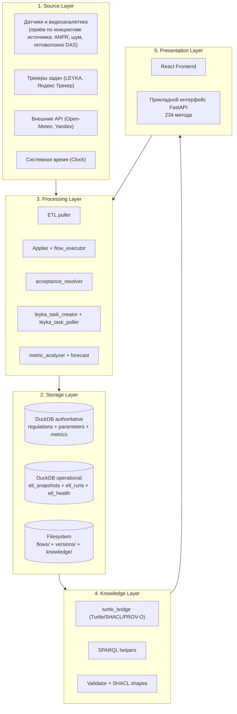
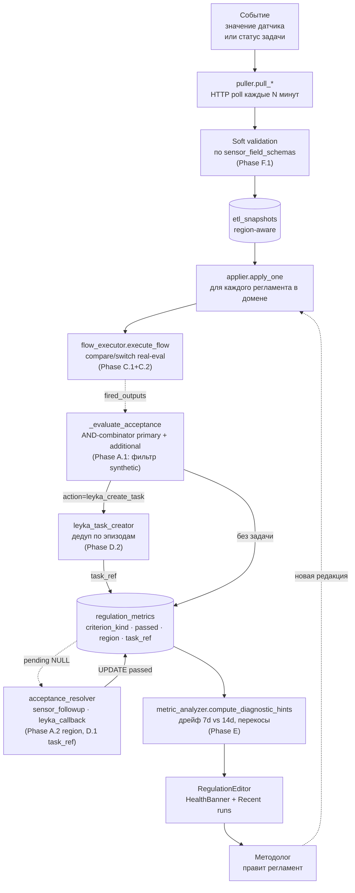
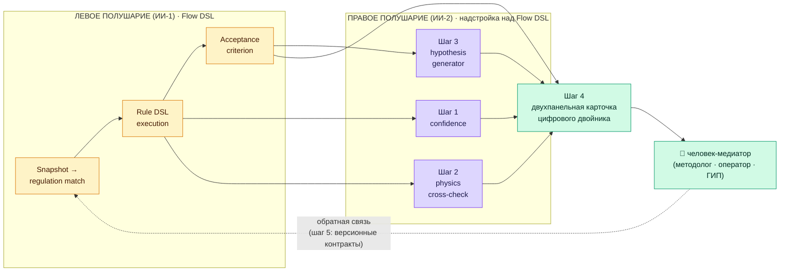

# ОТЧЁТ О НАУЧНО-ИССЛЕДОВАТЕЛЬСКОЙ И ОПЫТНО-КОНСТРУКТОРСКОЙ РАБОТЕ

## Платформа «РАГРАФ» — замкнутый контур «датчик — регламент — задача — человек»
### (промежуточный, этап 1 — НИОКТР пилотного развёртывания)

---

> **УДК:** [002:004]:316.774
> **ГРНТИ:** 20.01.04
> **Обозначение документа:** РАГРАФ.НИР.001-2026
> **Дата составления:** 2026-05-28
> **Версия документа:** 1.0
> **Версия программы:** 0.8 (УГТ-7, опытная эксплуатация)
> **Разработано в соответствии с:** ГОСТ 7.32-2017 «Отчёт о научно-исследовательской работе», серия ГОСТ 19 «Единая система программной документации»
> **Основание:** ТЗ РАГРАФ от 2026-05-23 ([`TZ_RAGRAF.md`](TZ_RAGRAF.md))
> **Связанные документы:**
> [`DATA-FLOW-AUDIT.md`](DATA-FLOW-AUDIT.md) — аудит потока данных,
> [`ARCHITECTURE.md`](ARCHITECTURE.md) — архитектура,
> [`PROGRESS-ARHI-2026-05-27.md`](PROGRESS-ARHI-2026-05-27.md) — стендовая реализация,
> [`STRATEGY-POSITIONING.md`](GOTOMARKET/STRATEGY-POSITIONING.md) — позиционирование.

---

## Лист утверждения

| Должность | ФИО | Подпись | Дата |
|---|---|---|---|
| Разработчик и руководитель НИОКТР | Барбашин О.В. | _____________ | 2026-05-28 |
| Правообладатель программного обеспечения Платформы АРХИ | ЦИИ НГУ | _____________ |   |
| Согласовано (методологическая база) | НГУ, лаб. теоретической кибернетики (Д.Е. Пальчунов) | _____________ |   |
| Согласовано (научный фундамент) | ИМ СО РАН (С.С. Гончаров, Д.И. Свириденко, Е.Е. Витяев) — задачный подход | _____________ |   |

---

## Список исполнителей

| Должность | ФИО | Раздел отчёта |
|---|---|---|
| Руководитель НИОКТР, владелец продукта | Барбашин О.В. | Введение, разделы 1, 2, 4, 5, заключение |
| Методологическая опора (задачный подход) | С.С. Гончаров, Д.И. Свириденко, Е.Е. Витяев (ИМ СО РАН) | Раздел 3.1 |
| Методологическая опора (ТФС) | П.К. Анохин (классическая нейрофизиология) — историческое основание | Раздел 3.2 |
| Методологическая опора (онтологии) | Д.Е. Пальчунов (НГУ) — 4-уровневая модель | Раздел 3.3 |
| Заказчик стендового развёртывания | ЦИИ НГУ (Платформа АРХИ) | Раздел 5 |

> Проект инициативный, ведётся одним разработчиком с опорой на открытые публикации Сибирской математической школы. Соисполнители из РАН/НГУ привлечены как **методологическая база** без формального участия в коде; их работы цитируются в разделе 6.

---

## Термины, определения, сокращения и обозначения

**РАГРАФ** — программная платформа для замыкания операционного контура «датчик — регламент — задача — человек» на основе задачного подхода и формально-проверяемой логики.

**Цифровой двойник субъекта управления (ЦД СУ)** — набор исполняемых спецификаций (цифровых регламентов) и связанных с ними хранилищ знаний, отражающих логику действий субъекта в рамках управления объектом в определённом задачном пространстве.

**Цифровой регламент (ЦР)** — формализованная задача с четырьмя обязательными компонентами по задачному подходу: предметная область, запрос, критерий решённости, контекст. В РАГРАФ цифровой регламент сохраняется как совокупность Turtle-описания, SHACL-ограничений и flow.json-графа.

**Задачный подход** — методология постановки интеллектуальной задачи через четыре компонента: предметная область, запрос, критерий решённости, контекст существования и решения задачи. Авторы: С.С. Гончаров, Д.И. Свириденко, Е.Е. Витяев (Cognitive Systems Research, 2023).

**Теория функциональных систем (ТФС)** — нейрофизиологическая модель целенаправленной деятельности П.К. Анохина (1975). Включает шесть стадий: афферентный синтез → принятие решения → акцептор результата → эфферентный синтез → исполнение → обратная афферентация.

**4-уровневая онтологическая модель Д.Е. Пальчунова** — формализация представления знаний предметной области через четыре связанных уровня: онтологический (термины и сигнатуры), теоретический (общие законы), прецедентный (история исполнений), вероятностный (оценочные и нечёткие утверждения). В РАГРАФ — карта стека хранилищ.

**Замкнутый контур принятия решений** — архитектурный принцип, при котором каждое событие проходит полный цикл: источник → нормализация → решение → действие → проверка исхода → подсказка методологу. Никаких потерянных событий, никаких висящих ожиданий без срока жизни (TTL).

**Критерий решённости (acceptance criterion)** — машинно-проверяемое условие, при выполнении которого регламент считается успешно отработавшим. В РАГРАФ реализовано 5 типов: `no_violation`, `specific_output`, `task_closed_within_sla`, `sensor_returned_normal`, `custom`.

**Объяснимость по построению (англ. XAI by construction)** — свойство системы, при котором каждое решение трассируется до пункта нормативного документа (PROV-O), цепочки сработавших узлов в трассе исполнения, входных значений датчиков. Не дописывается сверху, а встроена в архитектуру.

**Rule DSL Flow (Flow DSL)** — визуальный декларативный язык РАГРАФ для описания регламентов. Восемь типов узлов: `input`, `threshold`, `compare`, `formula`, `switch`, `output`, `sensor` и `time` («чип времени» — узел-источник без входного ребра, вычисляющий условие по системным часам: ночь, рабочие часы, день недели, окно). Литерал `shacl_constraint` сохранён в перечислении ради обратной совместимости, но с 2026-06-09 в фикстурах не используется: ограничения SHACL — контракт данных, а не логика потока. Хранится в `flow.json`. Самостоятельное оформление языка как результата НИР (РИД / кандидат на стандарт) — [RESULT-FLOW-DSL.md](RESULT-FLOW-DSL.md).

**ETL** — Extract-Transform-Load, паттерн обработки потока внешних событий. В РАГРАФ реализован через `etl/puller.py` (Extract), `live_data_store.append_snapshot` (Transform), `etl/applier.py` (Load и запуск регламентов).

**LEYKA** — собственный таск-трекер ЦИИ НГУ (https://leyka-nsu.vercel.app), используемый РАГРАФ как референсный канал доведения поручений до исполнителей и как ЦДА — цифровой диалоговый ассистент.

**ЦДА (Цифровой Диалоговый Ассистент)** — **система управления проектами (СУП) со встроенной мессенджер-Лентой**, через которую система ведёт диалог с человеком-исполнителем: ставит задачу, принимает ответы и комментарии в стиле сообщений Telegram, отслеживает изменение статусов, эскалирует руководителю. Соответствует §4.3.4 ТЗ Платформы АРХИ. В стендовой реализации РАГРАФ роль ЦДА играет LEYKA — её чат-Лента каждой задачи воспроизводит логику чата Telegram, что делает интерфейс привычным для российских пользователей без обучения (см. раздел 5.5).

**Σ Сигма** — родственный фреймворк ЦИИ НГУ для масштаба городской платформы. Совместим с РАГРАФ по открытым форматам W3C (Turtle, SHACL, PROV-O) — регламенты переносятся файлами без переписывания.

**УГТ** — Уровень Готовности Технологии (Technology Readiness Level, TRL). По оценке Минобрнауки РФ: УГТ-7 — полнофункциональный прототип в условиях, максимально приближенных к эксплуатационным.

**ИИ-модератор** — терминологическая позиция РАГРАФ как «надстройки над таск-трекером, которая собирает ответы исполнителей и докладывает руководителю». Не «ИИ-помощник» (generic) и не «ИИ-заместитель человека» — модератор коллективной работы.

**Сокращения:**
- БЗ — база знаний.
- БД — база данных.
- ДПО — дополнительное профессиональное образование (форма реализации образовательного модуля РАГРАФ, см. §5.11).
- ИИ — искусственный интеллект.
- КПК — курс повышения квалификации (формат программы первого потока РАГРАФ, 72 ак. ч., см. §5.11.3).
- НГУ — Новосибирский государственный университет.
- НИОКТР — научно-исследовательская и опытно-конструкторская работа.
- НИР — научно-исследовательская работа.
- ОВ — объект управления.
- ПО — программное обеспечение.
- СУ — субъект управления.
- СУП — система управления проектами (Primavera P6, MS Project, Jira, Redmine и др.). РАГРАФ работает как ИИ-модератор-надстройка над существующей СУП организации, см. §5.11.6.
- СППР — система поддержки принятия решений.
- ТЗ — техническое задание.
- ТФС — теория функциональных систем (П.К. Анохина).
- ЦД — цифровой двойник.
- ЦД СУ — цифровой двойник субъекта управления.
- ЦДА — цифровой диалоговый ассистент (СУП со встроенной мессенджер-Лентой).
- ЦДР — цифровой двойник регламента.
- ЦДД — цифровой двойник договора.

---

## СОДЕРЖАНИЕ

- [Термины, определения, сокращения и обозначения](#термины-определения-сокращения-и-обозначения)
- [РЕФЕРАТ](#реферат)
- [Введение](#введение)
  - [Принципиальное позиционирование: место LLM в архитектуре РАГРАФ](#принципиальное-позиционирование-место-llm-в-архитектуре-раграф)
  - [Постановка задачи](#постановка-задачи)
  - [Позиционирование: связка «фреймворк Σ Сигма ↔ прикладная Платформа АРХИ ↔ прототип РАГРАФ»](#позиционирование-связка-фреймворк-σ-сигма--прикладная-платформа-архи--прототип-раграф)
  - [Актуальность исследований](#актуальность-исследований)
  - [Объект применения](#объект-применения)
  - [Ожидаемые результаты НИОКТР](#ожидаемые-результаты-ниоктр)
- [1. Определение основных требований и целей проекта](#1-определение-основных-требований-и-целей-проекта)
  - [1.1. Методология](#11-методология)
  - [1.2. Постановка задачи через задачный подход](#12-постановка-задачи-через-задачный-подход)
  - [1.3. Требования к платформе РАГРАФ](#13-требования-к-платформе-раграф)
  - [1.4. Технологическая схема создания цифрового двойника](#14-технологическая-схема-создания-цифрового-двойника)
- [2. Анализ существующих решений и выбор технологий](#2-анализ-существующих-решений-и-выбор-технологий)
  - [2.1. Рыночная ниша — пустота между датчиками и людьми](#21-рыночная-ниша--пустота-между-датчиками-и-людьми)
  - [2.2. Семантический стек W3C — обоснование выбора](#22-семантический-стек-w3c--обоснование-выбора)
  - [2.3. Выбор технологического ядра](#23-выбор-технологического-ядра)
  - [2.4. Соотношение технологических стеков РАГРАФ и Σ Сигма](#24-соотношение-технологических-стеков-раграф-и-σ-сигма)
- [3. Научные основы и публикации](#3-научные-основы-и-публикации)
  - [3.1. Задачный подход Сибирской математической школы](#31-задачный-подход-сибирской-математической-школы)
  - [3.2. Теория функциональных систем П.К. Анохина](#32-теория-функциональных-систем-пк-анохина)
  - [3.3. 4-уровневая онтологическая модель Д.Е. Пальчунова](#33-4-уровневая-онтологическая-модель-де-пальчунова)
  - [3.4. Соответствие стандартам доверенного ИИ](#34-соответствие-стандартам-доверенного-ии)
  - [3.5. Исследование маппинга с двумя действующими ГОСТами по ИИ (2026-05-30)](#35-исследование-маппинга-с-двумя-действующими-гостами-по-ии-2026-05-30)
  - [3.6. Усиление платформы по рекомендациям Д.И. Свириденко (Σ СИГМА, 11.09.2024)](#36-усиление-платформы-по-рекомендациям-ди-свириденко-σ-сигма-11092024)
  - [3.7. Реализация языка d0sl и Σ-программирования в Flow DSL РАГРАФ (2026-06-09)](#37-реализация-языка-d0sl-и-σ-программирования-в-flow-dsl-раграф-2026-06-09)
- [4. Разработка архитектуры и дизайна платформы](#4-разработка-архитектуры-и-дизайна-платформы)
  - [4.1. Принципы и слоистая модель](#41-принципы-и-слоистая-модель)
  - [4.2. Сквозной поток данных](#42-сквозной-поток-данных)
  - [4.3. Хранилища и форматы регламента](#43-хранилища-и-форматы-регламента)
  - [4.4. Ключевые архитектурные решения (ADR)](#44-ключевые-архитектурные-решения-adr)
  - [4.5. Описание входных и выходных данных](#45-описание-входных-и-выходных-данных)
  - [4.6. Связь архитектуры РАГРАФ с концепцией ЦД СУ из НИР 2024](#46-связь-архитектуры-раграф-с-концепцией-цд-су-из-нир-2024)
- [5. Уровень новизны и практическая реализация на стенде](#5-уровень-новизны-и-практическая-реализация-на-стенде)
  - [5.1. Научная новизна](#51-научная-новизна)
  - [5.2. Техническая новизна](#52-техническая-новизна)
  - [5.3. Уровень готовности технологии (УГТ)](#53-уровень-готовности-технологии-угт)
  - [5.4. Стендовое развёртывание](#54-стендовое-развёртывание)
  - [5.5. LEYKA как элемент цифрового диалогового ассистента РАГРАФ — характеристика, стек и обоснование выбора](#55-leyka-как-элемент-цифрового-диалогового-ассистента-раграф--характеристика-стек-и-обоснование-выбора)
  - [5.6. Внешние интеграции стенда: Plan-R (макет API → боевое подключение) и КАППА (экспертная верификация датасетов)](#56-внешние-интеграции-стенда-plan-r-макет-api--боевое-подключение-и-каппа-экспертная-верификация-датасетов)
  - [5.7. Демонстрационные сценарии на стенде](#57-демонстрационные-сценарии-на-стенде)
  - [5.8. Матрица покрытия требований ТЗ Платформы АРХИ как доказательство пригодности фреймворка](#58-матрица-покрытия-требований-тз-платформы-архи-как-доказательство-пригодности-фреймворка)
  - [5.9. Метрика прогресса — точность принятия решений](#59-метрика-прогресса--точность-принятия-решений)
  - [5.10. Продуктовая ниша как отдельное направление исследований](#510-продуктовая-ниша-как-отдельное-направление-исследований)
  - [5.11. Образовательный модуль РАГРАФ — массовое обучение цифровых модераторов регламентов в строительной и муниципальной сферах](#511-образовательный-модуль-раграф--массовое-обучение-цифровых-модераторов-регламентов-в-строительной-и-муниципальной-сферах)
  - [5.12. Два паттерна приёма событий: PULL-поллинг и PUSH-уведомления](#512-два-паттерна-приёма-событий-pull-поллинг-и-push-уведомления)
  - [5.13. Экспериментальная проверка пользы доменной базы знаний — абляция маршрутизации запросов](#513-экспериментальная-проверка-пользы-доменной-базы-знаний--абляция-маршрутизации-запросов)
  - [5.14. Гуманистический решатель ВИЛНС — пятислойный «паспорт решения» как доменно-нейтральная рамка доверенного ИИ](#514-гуманистический-решатель-вилнс--пятислойный-паспорт-решения-как-доменно-нейтральная-рамка-доверенного-ии)
  - [5.15. Натурная проверка ядра на живых данных](#515-натурная-проверка-ядра-на-живых-данных)
  - [5.16. Маркетинговое исследование: кому и зачем нужен продукт](#516-маркетинговое-исследование-кому-и-зачем-нужен-продукт)
  - [5.17. Модель сопровождения: консалтинговое снятие и приоритизация регламентов](#517-модель-сопровождения-консалтинговое-снятие-и-приоритизация-регламентов)
- [6. Заключение](#6-заключение)
  - [6.1. Методологические результаты](#61-методологические-результаты)
  - [6.2. Экспериментальные находки (главные результаты для последующей теории)](#62-экспериментальные-находки-главные-результаты-для-последующей-теории)
  - [6.3. Технические результаты](#63-технические-результаты)
  - [6.4. Эмпирические результаты на стенде](#64-эмпирические-результаты-на-стенде)
  - [6.5. Что не удалось / отложено с обоснованием](#65-что-не-удалось--отложено-с-обоснованием)
  - [6.6. Архитектурные ограничения текущей реализации и пути их снятия в боевых внедрениях по секторам](#66-архитектурные-ограничения-текущей-реализации-и-пути-их-снятия-в-боевых-внедрениях-по-секторам)
  - [6.7. Продуктовая ниша как отдельный исследовательский результат](#67-продуктовая-ниша-как-отдельный-исследовательский-результат)
  - [6.8. План дальнейших работ (этап 2 НИОКТР)](#68-план-дальнейших-работ-этап-2-ниоктр)
  - [6.9. Открытые направления развития на основе семантического моделирования (Гончаров, Свириденко, 2018) — обращение к авторам теории](#69-открытые-направления-развития-на-основе-семантического-моделирования-гончаров-свириденко-2018--обращение-к-авторам-теории)
  - [6.10. Эмпирический методологический результат — разработка в паре с ИИ-агентом как практическое воплощение гибридного ИИ](#610-эмпирический-методологический-результат--разработка-в-паре-с-ии-агентом-как-практическое-воплощение-гибридного-ии)
  - [6.11. Гипотеза: РАГРАФ + ИИ-2 + человек = воплощение саморефлексирующего ИИ уровня 3 на масштабе города](#611-гипотеза-раграф--ии-2--человек--воплощение-саморефлексирующего-ии-уровня-3-на-масштабе-города)
  - [6.12. Дорожная карта расширения Flow DSL в гибридный контур — пять инженерных шагов](#612-дорожная-карта-расширения-flow-dsl-в-гибридный-контур--пять-инженерных-шагов)
  - [6.13. Опровергнутая гипотеза о профессии оператора регламентов — отрицательный результат](#613-опровергнутая-гипотеза-о-профессии-оператора-регламентов--отрицательный-результат)
  - [6.14. Маркетинговые выводы: ответы на вопросы «Зачем?» и «Кому надо?»](#614-маркетинговые-выводы-ответы-на-вопросы-зачем-и-кому-надо)
- [7. Список использованных источников](#7-список-использованных-источников)
  - [7.1. Научные работы (внешние)](#71-научные-работы-внешние)
  - [7.2. Нормативно-технические документы](#72-нормативно-технические-документы)
  - [7.3. Стандарты W3C](#73-стандарты-w3c)
  - [7.4. Документация платформы РАГРАФ](#74-документация-платформы-раграф)
  - [7.5. Прочие источники](#75-прочие-источники)
- [Приложение А. Состав фикстур регламентов](#приложение-а-состав-фикстур-регламентов)
- [Приложение Б. API-эндпоинты платформы](#приложение-б-api-эндпоинты-платформы)
- [Приложение В. Сводный глоссарий](#приложение-в-сводный-глоссарий)
  - [В.1. Аббревиатуры](#в1-аббревиатуры)
  - [В.2. Термины и определения (русский алфавит)](#в2-термины-и-определения-русский-алфавит)
  - [В.3. Термины (латинский алфавит)](#в3-термины-латинский-алфавит)

---

## РЕФЕРАТ

**Отчёт:** 1 книга, ≈ 210 страниц, 3 рисунка (диаграммы в нотации Mermaid), 84 таблицы, 71 источник, 3 приложения.

**Ключевые слова:** ЦИФРОВОЙ ДВОЙНИК СУБЪЕКТА УПРАВЛЕНИЯ, ЗАДАЧНЫЙ ПОДХОД, ТЕОРИЯ ФУНКЦИОНАЛЬНЫХ СИСТЕМ, ОНТОЛОГИЧЕСКАЯ МОДЕЛЬ ПАЛЬЧУНОВА, ЗАМКНУТЫЙ КОНТУР, FORMAL-PROOF XAI, SHACL, DUCKDB, FASTAPI, W3C TURTLE, PROV-O, НАТУРНАЯ ПРОВЕРКА, ПРОДУКТОВАЯ НИША, ОТРИЦАТЕЛЬНЫЙ РЕЗУЛЬТАТ.

> **Редакция от 2026-09-01.** Отчёт дополнен по трём направлениям, без изменения исходной
> структуры: (1) внесены **блоки актуализации** в подразделы, описывавшие состояние на момент
> завершения этапа 1 и с тех пор изменившиеся, — интеграция с системой управления строительными
> проектами переведена с макета на боевое подключение (п. 5.6.1.1), уточнена трактовка цифрового
> диалогового ассистента как составного контура (п. 5.5.7), матрица покрытия пересобрана на
> редакции 8.0 технического задания (п. 5.8.1); (2) добавлены разделы **5.15 «Натурная проверка
> ядра на живых данных»**, **5.16 «Маркетинговое исследование: кому и зачем нужен продукт»** и
> **5.17 «Модель сопровождения»**; (3) добавлены подразделы заключения **6.13** (опровергнутая
> гипотеза о профессии оператора регламентов — отрицательный результат) и **6.14** (маркетинговые
> выводы, включая пересмотр способа поставки). Пересмотрена очерёдность каналов тиражирования
> (п. 5.11.8) и уточнён план этапа 2 (§6.8). Исходный текст этапа 1 сохранён как хронологическая
> запись; расхождения с текущим состоянием обозначены явно.

**Документ-основание:** инициативная разработка с использованием открытых публикаций Сибирской математической школы (С.С. Гончаров, Д.И. Свириденко, Е.Е. Витяев) и НГУ (Д.Е. Пальчунов). Связь со стендовой реализацией объекта «Платформа АРХИ» закреплена через техническое задание 11710-11710-1 (редакция 8.0 от 2026-09-01, базовая версия 7.6, 2024; правообладатель программного обеспечения — ЦИИ НГУ) и [`PROGRESS-ARHI-2026-05-27.md`](PROGRESS-ARHI-2026-05-27.md). и [`PROGRESS-ARHI-2026-05-27.md`](PROGRESS-ARHI-2026-05-27.md).

**Цель НИР.** Разработать и довести до уровня опытной эксплуатации (УГТ-7) программную платформу РАГРАФ, реализующую замкнутый контур «датчик — регламент — задача — человек» на основе задачного подхода и формально-проверяемой логики, и продемонстрировать её применимость в задачах управления городскими инфраструктурами на примере домена «Строительство и инфраструктура» (Платформа АРХИ). Принципиальное позиционирование, раскрытое в специальном подразделе Введения: **Σ Сигма — фреймворк** (набор инструментов для разработчиков); **Платформа АРХИ — прикладная платформа** (по ТЗ ориентирована на функционирование в составе Σ Сигма); **РАГРАФ — рабочий прототип фреймворка Σ Сигма** на упрощённом стеке, демонстрирующий **пригодность набора инструментов для сборки прикладных систем класса АРХИ** (пригодность подтверждена поимённой сверкой с редакцией 8.0 технического задания Платформы АРХИ, в которой каждое требование раздела 4 подтверждено ссылкой на реализующий код, а нереализованное вынесено в приложение А; см. §5.8 и п. 5.8.1).

**Содержание разделов отчёта:**

**Раздел 1** содержит определение основных требований и целей проекта: формализацию назначения платформы, постановку задачи через четыре компонента задачного подхода, перечень функциональных и нефункциональных требований, технологическую схему создания цифрового двойника субъекта управления.

**Раздел 2** содержит анализ существующих решений на российском и международном рынках (SCADA, BPM, таск-трекеры, городские платформы, AutoML, LLM-агенты) с обоснованием уникальной ниши РАГРАФ как инструмента «на стыке» датчиков, таск-трекеров и мессенджеров с формально-проверяемой логикой; обоснование выбора семантического стека W3C (RDF/Turtle/OWL/SHACL/PROV-O) и технологического ядра (Python 3.12 + FastAPI + DuckDB + React 18 + TypeScript + Vite).

**Раздел 3** содержит описание научных основ платформы: задачного подхода Сибирской математической школы (4 компонента задачи), Теории функциональных систем П.К. Анохина (6 стадий целенаправленной деятельности), 4-уровневой онтологической модели Д.Е. Пальчунова (онтологический → теоретический → прецедентный → вероятностный уровни); соответствие платформы стандартам доверенного ИИ (ГОСТ Р 59276-2020).

**Раздел 4** содержит разработку слоистой архитектуры (Source / Storage / Processing / Knowledge / Presentation), сквозного потока данных от внешнего события до подсказки методологу (см. [`DATA-FLOW-AUDIT.md`](DATA-FLOW-AUDIT.md)), описание трёх форматов хранения регламента (DuckDB authoritative + flow.json + Turtle/SHACL outbound interchange) и 21 ключевого архитектурного решения (ADR-001 — ADR-021).

**Раздел 5** содержит описание **научной и технической новизны** платформы, **уровня готовности технологии (УГТ-7)** и **практической реализации на стенде**: 5 строительных цифровых двойников регламентов (СИЗ / просрочка этапа / входной контроль материалов / портфельный риск / защита оптоволоконного кабеля), характеристику LEYKA как **одного из элементов** цифрового диалогового ассистента (§5.5, с уточнением в п. 5.5.7: ЦДА в трактовке РАГРАФ — составной контур из мессенджера, трекера задач и чата ИИ-помощника), две внешние интеграции стенда — Plan-R и КАППА (§5.6); в части Plan-R описаны макет-сервер с дублированием публичного API v602, согласованная модель интеграции «реестр нарушений + связь с задачами WBS через кастомные атрибуты», карта логических контуров API и дорожная карта боевой интеграции, **выполненная к настоящей редакции** — подключение к боевому инстансу работает, а сам переход дал три инженерных находки, невоспроизводимых на макете (п. 5.6.1.1); в части КАППА — фреймворк экспертной верификации триплет-датасетов с возвратом подписи эксперта-человека; раздел также содержит двустороннюю интеграцию с трекером задач, 5 демонстрационных сценариев, из которых пятый целиком проходит на непостановочных данных, матрицу покрытия требований ТЗ АРХИ (пересобрана на редакции 8.0 задания, п. 5.8.1), метрику точности принятия решений 90–93%, **образовательный модуль РАГРАФ как самостоятельный канал тиражирования** (§5.11), **натурную проверку ядра на живых данных** с разделением трёх уровней достоверности данных и перечнем непроверенного (§5.15), **маркетинговое исследование «кому и зачем нужен продукт»** с переворотом рамки позиционирования (§5.16) и **модель сопровождения** — консалтинговый порядок снятия и вычислимой приоритизации регламентов заказчика, а также состав отраслевой поставки Платформы АРХИ для строительного сектора (§5.17). Очерёдность каналов тиражирования пересмотрена: запуск программы повышения квалификации отложен в пользу сопровождаемых пилотных внедрений (п. 5.11.8).

**Раздел 6** содержит общее заключение по результатам НИОКТР, **анализ архитектурных ограничений текущей реализации** (модель «один писатель» в DuckDB) и **дифференцированные пути их снятия в боевых внедрениях по восьми секторам продуктовой ниши** (§6.6), **отрицательный результат исследования** — опровергнутую гипотезу о существовании профессии оператора регламентов и вытекающее из неё правило «сначала выгодоприобретатель, затем метрики» (§6.13), **маркетинговые выводы** с разделением портрета выгодоприобретателя и портрета сопротивляющегося (§6.14), а также план дальнейших работ: завершение Phase C.2 (switch-нода real-eval) и Phase D.2 (автоматическое заведение задач с дедупликацией эпизодов) для достижения целевой точности 95%+, типизация цифрового двойника договора (ЦДД), а также **дорожную карту расширения Flow DSL в гибридный контур** (§6.12) — пять конкретных инженерных шагов на ≈ 3.5 рабочие недели, формализующих наблюдаемые в коде проявления правого полушария (multi-hypothesis в демонстрационном наборе «Платформа АРХИ», `confidence` в схемах датчиков) и переводящих их в сквозной pipeline `confidence → physics cross-check → multi-hypothesis → двухпанельная карточка двойника → версионные контракты слоёв`, с подтверждённым ростом покрытия требований ТЗ Σ СИГМА с ≈ 87% до ≈ 92%.

---

## Введение

**Условное обозначение темы НИОКТР:** РАГРАФ — программная платформа замкнутого контура между датчиком, таск-трекером, мессенджером и человеком. РАГРАФ является **рабочим названием испытательного стенда для проверки концепции фреймворка Σ Сигма на упрощённом стеке технологий** (один Python-процесс + DuckDB вместо связки Apache Jena + PostgreSQL + очередь сообщений); рабочее название было выбрано в начале работ для устранения путаницы при параллельной разработке Σ Сигма в ЦИИ НГУ (см. НИР Σ Сигма 2025, [60]). Концептуальная связь стенда РАГРАФ с фреймворком Σ Сигма раскрыта в разделах 2.4 (соотношение технологических стеков) и 4.6 (связь архитектуры с концепцией ЦДСУ).

**Документ-основание:** инициативная разработка одного автора (Барбашин О.В.) с опорой на открытые публикации Сибирской математической школы. Связь с индустриальной кооперацией закреплена через стендовое развёртывание объекта «Платформа АРХИ» для ЦИИ НГУ (техническое задание 11710-11710-1, редакция 8.0 от 2026-09-01). Привлечение индустриальных партнёров для пилотных внедрений отнесено к задачам этапа 2 (см. п. 5.11.8).

**Техническое задание:** [`docs/TZ_RAGRAF.md`](TZ_RAGRAF.md), версия 2.1 от 2026-06-11 (база — версия 2.0 от 2026-05-23), идентификатор РГРФ-02-01-01-1/1-ТЗ.

**Описание темы разработки.** РАГРАФ — операционная платформа, замыкающая контур принятия решений между автоматическими источниками данных (датчики IoT, таск-трекеры, бизнес-системы), формальными регламентами реагирования и исполнителями-людьми (через мессенджеры и таск-трекеры). Платформа реализует полный цикл шести стадий функциональной системы П.К. Анохина — от афферентного синтеза события до подкрепления методолога на основе результата. Создаваемые цифровые двойники субъектов управления способны интегрироваться с другими системами через REST API.

### Принципиальное позиционирование: место LLM в архитектуре РАГРАФ

Поскольку платформа РАГРАФ исследовательски и публично соприкасается с тематикой искусственного интеллекта, в самом начале отчёта необходимо зафиксировать **роль и границы применения больших языковых моделей** (Large Language Models, далее — LLM) в составе платформы. Это позиционирование принципиально для понимания всего дальнейшего изложения и для корректной классификации платформы среди других продуктов с ИИ-составляющей.

**LLM в РАГРАФ — сервисная, а не функциональная составляющая.** В РАГРАФ присутствует **тонкий retrieval-слой** в Студии аналитика — semantic search по библиотеке регламентов на bge-m3 эмбеддингах с опциональной chat-генерацией поверх найденного (OpenAI-compatible API: Ollama / Cerebras / Groq / OpenAI / mock-режим). Его роль строго ограничена **семантическим поиском** по библиотеке регламентов и сопутствующих нормативных документов. Иначе говоря, LLM в РАГРАФ — это **навигационный инструмент аналитика-методолога**, не более:

| Функция в системе | Кто выполняет |
|---|---|
| Найти подходящий регламент по описанию ситуации на естественном языке | LLM в Студии аналитика (retrieval по bge-m3 эмбеддингам + опциональная генерация ответа) |
| Найти связанные регламенты, прецеденты, нормативные ссылки | SPARQL-запросы по RDF-графу регламентов в Knowledge Studio (W3C-стек, без LLM) |
| Прочитать найденный регламент, понять его, скорректировать порог, добавить ветку | **Человек-методолог** через визуальный редактор Flow Editor и Regulation Editor |
| Принять решение о срабатывании регламента | **Декларативный движок Rule DSL Flow** — формально-проверяемая логика, не LLM |
| Создать задачу исполнителю | **Декларативный output-узел** регламента через REST-вызов LEYKA, не LLM |
| Проверить исход задачи и обновить точность регламента | **`acceptance_resolver`** (детерминированный модуль), не LLM |

**Все шесть стадий замкнутого контура** (получение события → валидация → исполнение регламента → порождение производных событий → выдача рекомендаций → проверка результата и подкрепление методолога) — это **детерминированный, формально-проверяемый поток** по визуальному DSL, **не запрос к LLM**. Решения регламента фиксируются в трассе исполнения PROV-O и могут быть пройдены назад от любого исхода до пункта нормативного акта без обращения к нейросети.

**Графически место LLM — «сбоку» от основного контура.** В пятислойной архитектуре РАГРАФ (раздел 4.1) тонкий retrieval-слой принадлежит исключительно слою `Knowledge` и обслуживает только сценарий «аналитик ищет регламент». В слоях `Source` (приём событий), `Processing` (исполнение Rule DSL Flow), `Storage` (DuckDB) и в значительной части слоя `Presentation` (Flow Editor, Regulation Editor, дашборды) LLM не используется. Это позволяет считать РАГРАФ **системой с формально-проверяемой логикой**, в которой LLM присутствует как удобный поисковый механизм, но не образует критический путь принятия решений.

**Соотношение с двумя расхожими позиционированиями ИИ-систем.** В индустриальной литературе и маркетинговых материалах распространены два позиционирования:
- **«ИИ-помощник» (generic copilot)** — нейросеть выполняет работу, которую укажет пользователь; обычно автономно генерирует тексты, код, документы.
- **«ИИ-агент» (autonomous agent)** — нейросеть самостоятельно планирует и выполняет последовательности действий, принимает решения, обращается к внешним инструментам.

РАГРАФ **не относится ни к одной из этих категорий.** Платформа позиционируется как **«ИИ-модератор» над полем коллективной работы человека и регламента** (см. раздел 6.2, находка 3), в котором:
- автоматические **детерминированные регламенты** выполняют рутинные проверки и эскалации;
- **человек-методолог** редактирует и совершенствует регламенты, опираясь на наблюдаемую точность срабатывания;
- **LLM** помогает методологу быстрее найти нужный регламент в библиотеке, **но не принимает за него решения** и не правит сам регламент.

Это **принципиальное архитектурное решение** оказывает влияние на всё последующее изложение: на выбор технологического стека (раздел 2.3, 2.4), на математическую базу (раздел 3 — задачный подход и теория функциональных систем, а не машинное обучение), на состав фикстур-регламентов (приложение А), на метрику качества (раздел 5.9 — точность принятия решений рассчитывается для **декларативных регламентов**, а не для LLM-ответов), на нишевое позиционирование (разделы 5.10 и 5.16 — РАГРАФ есть инструмент в категориях «семантическое моделирование» и «формальная верификация», а не в категории «генеративный ИИ»).

**Следствие для классификации платформы по ГОСТ Р 59276-2020.** Согласно ГОСТ Р 59276-2020 «Системы искусственного интеллекта. Способы обеспечения доверия. Общие положения», доверенными считаются системы ИИ, чьи решения объяснимы, воспроизводимы и проверяемы. РАГРАФ как платформа с **детерминированным контуром решений** удовлетворяет этим требованиям по построению — каждое решение регламента имеет формальную трассу. LLM-составляющая локализована в слое поиска и не нарушает доверительные свойства основного контура: даже если LLM ошиблась с подсказкой релевантного регламента, выбор и применение регламента остаётся за человеком и за детерминированным движком, не за нейросетью.

### Постановка задачи

Настоящая работа является **продолжением и развитием концепции** Цифрового двойника субъекта управления (ЦДСУ), сформулированной в ТЗ ИИ01-01-01-ЛУ от 17.06.2024 г. (НГУ, ЦИИ) и закреплённой в *Отчёте о научно-исследовательской работе «Фреймворк Сигма» (промежуточный, этап 2)*, Новосибирск, 2025 (далее — НИР Σ Сигма 2025; см. [60] в списке источников). Канонической формулировкой, на которую опирается РАГРАФ, является следующая.

> **Цифровой двойник субъекта управления (ЦДСУ)** — это набор исполняемых спецификаций на машинно-исполняемом языке, отражающих логику действий субъекта в рамках управления объектом в определённом задачном пространстве. ЦДСУ содержит в себе алгоритмы и правила управленческих действий при возникновении событий, порождаемых в процессе решения задач заданного задачного пространства, а также цифровую инфраструктуру, представляющую собой постоянную часть ЦД, которая обеспечивает функционирование исполняемых спецификаций.
>
> Цифровой двойник субъекта управления будет разрабатываться как отдельный программный продукт (набор программ).
>
> — ТЗ ИИ01-01-01-ЛУ от 17.06.2024 г.; НИР Σ Сигма 2025, раздел «Введение».

В НИР Σ Сигма 2025 (раздел 2 «Пилотная версия программного фреймворка “Сигма”», раздел 4 «Разработка основных компонентов и модулей фреймворка») заложено разграничение между **цифровым двойником объекта** (управляемый объект — теплосеть, инженерная подсистема) и **цифровым двойником помощника (субъекта управления)** — программным агентом, выполняющим автоматические проверки соответствия данных регламентам. РАГРАФ принимает это разграничение как методологическую отправную точку и развивает его на новый класс предметных областей.

**Принятая в РАГРАФ интерпретация задачи.** РАГРАФ занимает в системе работ по проекту Σ Сигма позицию **испытательного стенда для проверки концепции на упрощённом стеке технологий** — стек платформы (Python + DuckDB) преднамеренно компактнее стека Σ Сигма (Python + FastAPI + Apache Jena + PostgreSQL по НИР Σ Сигма 2025), чтобы (а) ускорить экспериментальную проверку гипотезы замкнутого контура «датчик → регламент → задача → исполнитель → проверка исхода», (б) снизить порог входа для аналитика-методолога без выделенной инфраструктурной службы, (в) подтвердить или опровергнуть на лёгком стеке методологические допущения, заложенные в Σ Сигма 2024–2025. Из приведённой формулировки ЦДСУ следует, что разработка цифрового двойника субъекта управления как отдельного программного продукта требует параллельной разработки **двух взаимодополняющих сущностей**:

1. **Исполняемые спецификации** (логика действий субъекта) — в РАГРАФ это **регламент** (`Regulation`) с его декларативным DSL (`flow.json`), параметрами, критериями приёмки и трассой исполнения PROV-O.
2. **Цифровая инфраструктура** (постоянная часть ЦД, обеспечивающая функционирование спецификаций) — в РАГРАФ это **операционная платформа** с пятью слоями (Source / Storage / Processing / Knowledge / Presentation), реализующая получение событий, их валидацию, исполнение регламентов, порождение производных событий, выдачу рекомендаций и связь с человеком-исполнителем.

**Задача НИР 2026 в формулировке РАГРАФ** — спроектировать, реализовать и довести до уровня готовности УГТ-7 такой программный продукт (набор программ), который:

а) принимает в качестве конфигурации **исполняемые спецификации** (регламенты) в открытом, проверяемом, переносимом между системами формате (Turtle / SHACL / PROV-O / Rule DSL Flow);

б) обеспечивает **постоянную инфраструктуру исполнения** этих спецификаций — от приёма события до подкрепления методолога — в замкнутом контуре с гарантиями воспроизводимости, объяснимости и формальной проверяемости;

в) позволяет **наращивать задачное пространство** ЦД СУ инкрементно — каждый новый регламент расширяет область компетенции цифрового двойника без переписывания инфраструктуры;

г) интегрируется с внешними **цифровыми двойниками объектов управления** (внешними Оракулами — датчики, таск-трекеры, бизнес-системы) через формализованные адаптеры, что превращает РАГРАФ-ЦД СУ в **составную конструкцию** ЦД (комплекс ЦД объекта + ЦД субъекта), ранее не применявшуюся в индустриальной практике;

д) служит **испытательным стендом** для эмпирической проверки гипотез из НИР 2024 года — в частности, гипотезы о том, что задачный подход Сибирской математической школы и теория функциональных систем П.К. Анохина могут быть операционализированы в коде производственной платформы без потери научной корректности.

Результатом решения задачи является программный продукт, описанный в настоящем отчёте: платформа РАГРАФ (репозиторий https://github.com/Barbashin1970/RAGRAF), реализующая ЦД СУ для пяти приоритетных доменов (стройплощадка / ЖКХ / ИТ-команда / госуправление / промышленный объект) на стенде ЦИИ НГУ (объект «Платформа АРХИ»).

### Позиционирование: связка «фреймворк Σ Сигма ↔ прикладная Платформа АРХИ ↔ прототип РАГРАФ»

Для корректной интерпретации последующих разделов отчёта необходимо зафиксировать **трёхзвенную связь между Σ Сигма, Платформой АРХИ и РАГРАФ** — она задаёт смысл того, **почему именно Платформа АРХИ выбрана объектом моделирования в данном НИОКТР** и в каком отношении РАГРАФ к АРХИ.

**Контекст по техническому заданию Платформы АРХИ.** Согласно ТЗ Платформы АРХИ (11710-11710-1-ЛУ, 2024), её назначение сформулировано следующим образом:

> **Платформа АРХИ** — «программная система управления строительными проектами и регламентами с использованием семантического искусственного интеллекта, ориентированная на функционирование **в составе фреймворка Σ Сигма** — комплекса программно-аппаратных средств, ориентированных на создание интеллектуальных цифровых двойников для управления городскими инфраструктурами».
>
> — ТЗ Платформы АРХИ 11710-11710-1, версия 7.6 (2024); та же формулировка сохранена в действующей редакции 8.0 от 2026-09-01 ([`ARCHI-CONSTRUCTION/GOST-19/11710-11710-1 Техническое задание (редакция 8.0, ЦИИ НГУ).md`](ARCHI-CONSTRUCTION/GOST-19/11710-11710-1 Техническое задание (редакция 8.0, ЦИИ НГУ).md)).

Из этой формулировки следуют два принципиальных утверждения, на которых строится позиционирование настоящего НИР:

1. **Платформа АРХИ — это потребитель** (не разработчик) программных средств; она **строится на базе** Σ Сигма и должна получать от Σ Сигма набор готовых инструментов для собственной сборки.
2. **Σ Сигма — это фреймворк**, то есть в общепринятом смысле — **набор инструментов, облегчающих разработку нового программного обеспечения**. Полезность фреймворка измеряется не его внутренними свойствами как изолированной системы («вещь в себе»), а его **пригодностью для разработчиков** новых прикладных платформ, которые на нём собираются.

**Терминологическое различение фреймворк ↔ платформа.** Различие двух терминов в настоящем отчёте принципиально и проведено последовательно:

| Термин | Кто целевая аудитория | Что предоставляет | Как измеряется ценность |
|---|---|---|---|
| **Фреймворк** | разработчик-интегратор | набор повторно используемых инструментов (модулей, форматов, эталонных моделей), облегчающих **разработку нового ПО** | пригодностью для сборки **разных** прикладных систем |
| **Платформа** | конечный потребитель (аналитик-методолог, оператор, диспетчер) | готовое решение задач предметной области | количеством и качеством закрытых задач конкретного потребителя |

В этой логике **Σ Сигма позиционируется как фреймворк**, **Платформа АРХИ — как одна из прикладных платформ, собираемых на нём**. Соответственно, **задача НИОКТР РАГРАФ — подтвердить пригодность фреймворка Σ Сигма для сборки прикладных систем класса АРХИ**, реализовав прототип фреймворка на упрощённом стеке.

**Роль РАГРАФ в этой связке.** Платформа РАГРАФ — это **рабочий прототип фреймворка Σ Сигма на упрощённом стеке технологий** (см. §2.4, §5.4). РАГРАФ обладает **набором инструментов**, эквивалентным набору инструментов фреймворка Σ Сигма (по составу, не по тяжести стека):

| Инструмент фреймворка | В Σ Сигма | В РАГРАФ-прототипе |
|---|---|---|
| Хранилище регламентов как RDF-графа | Apache Jena / FUSEKI | DuckDB + Turtle на границе |
| Декларативное описание спецификаций | d0SL (текстовый язык + d0VM) | Rule DSL Flow (визуальный граф + flow_executor) |
| Валидация по нормам предметной области | SHACL поверх Jena | SHACL через `pyshacl` |
| Прослеживаемость решений | PROV-O | PROV-O |
| Принимаемые на вход потоки данных | через очередь сообщений | через ETL-puller с периодическим опросом |
| Канал доведения задач до людей | внешний коннектор | составной контур ЦДА: мессенджер (Telegram / MAX) + трекер задач LEYKA + чат «Сима · Студия» (§5.5, п. 5.5.7) |
| Внешние интеграции | боевые адаптеры | боевой адаптер Plan-R (`etl/planr_client.py`, источник `planr-pms`) + прокси КАППА (§5.6) |
| Прогноз поведения регламента | планируется | эмпирически-байесовский прогноз (4-й уровень модели Пальчунова, §3.3) |

**Демонстрационная цель НИОКТР через АРХИ.** Платформа АРХИ выбрана объектом моделирования **именно потому, что она по ТЗ предполагает функционирование в составе фреймворка Σ Сигма** и тем самым служит **естественным тестом полноты инструментария** этого фреймворка. Демонстрируя, что прототип Σ Сигма (то есть РАГРАФ) обладает набором инструментов, **достаточным для сборки прикладной системы АРХИ** (см. матрицу покрытия требований ТЗ АРХИ в §5.8 и её пересборку на редакции 8.0 задания в п. 5.8.1, где каждое требование подтверждено ссылкой на реализующий код), настоящий НИОКТР подтверждает:

- **востребованность фреймворка Σ Сигма как полезного для разработчиков** прикладных платформ — не как «вещь в себе», а именно как **средство облегчения разработки нового ПО** в классе цифровых двойников городских инфраструктур;
- **достаточность набора инструментов** фреймворка для покрытия типовых требований к прикладной платформе уровня АРХИ — что является **критерием зрелости фреймворка** в инженерном смысле;
- **переносимость собранной на прототипе РАГРАФ конфигурации** в полнофункциональный фреймворк Σ Сигма через общие открытые форматы W3C (Turtle / SHACL / PROV-O / flow.json), то есть **отсутствие «вендор-лока»** при выборе режима (лёгкий стенд РАГРАФ → тяжёлая Σ Сигма для городского масштаба).

**Что это меняет в интерпретации следующих разделов.** Все технические и эмпирические результаты разделов 4–6 настоящего отчёта следует читать в двойной оптике:

- **РАГРАФ как самостоятельная программная платформа** — для целевой аудитории «аналитик-методолог среднего звена» (порог входа — один ноутбук без выделенной службы ИТ; см. §5.4 о практической мотивации лёгкого стека);
- **РАГРАФ как рабочий прототип фреймворка Σ Сигма** — для разработчиков-интеграторов, собирающих прикладные платформы класса АРХИ (порог входа — открытые форматы W3C, без необходимости использовать конкретный стек Σ Сигма; см. §2.4 о соотношении технологических стеков).

Эта двойственность не является противоречием — она отражает **состояние фреймворка на УГТ-7** (см. §5.3): прототип одновременно работает и как самостоятельный продукт у первых заказчиков, и как доказательство пригодности набора инструментов для собирания будущих платформ.

### Актуальность исследований

В настоящее время растёт сложность исполняемых процессов и объём документации, а вместе с ними растёт сложность принимаемых управленческих решений, к которым предъявляются всё более высокие требования к скорости и качеству. У субъектов управления (СУ) могут быть выделены задачи, которые могут быть автоматизированы. С одной стороны, это рутинные задачи: принятие решений в соответствии с регламентами, выдача распоряжений в соответствии с расписанием. С другой стороны, для принятия ряда решений необходимо обладать знанием контекста ситуации и задавать чёткие рамки для поиска оптимального решения.

На рынке РФ и СНГ 2026 года **отсутствует целостный инструмент**, который одновременно работает над любыми датчиками (IoT, видеоаналитика, оптоволокно), любыми таск-трекерами (LEYKA, Jira, YouTrack) и любыми мессенджерами (Telegram, MAX, корпоративные каналы) и при этом обеспечивает **формальную проверяемость** логики реагирования (не «чёрный ящик» нейросети, а декларативный DSL с трассировкой каждого решения до пункта нормативного акта).

РАГРАФ реализует **новый, ранее нигде не применявшийся подход**, который предполагает:

1. **Выделение функций управления в отдельную сущность** — цифровой двойник субъекта управления (ЦД СУ), а не цифровой двойник физического объекта;
2. **Использование оригинальной методологии задачного подхода** Сибирской математической школы и её математической теории семантического моделирования;
3. **Составную конструкцию цифрового двойника** — комплекс ЦД объектов управления (внешние Оракулы) плюс обязательно ЦД субъекта управления (логика управленческих действий). Такая конструкция ранее не применялась.

При построении цифрового двойника системы управления в рамках определённого задачного пространства, РАГРАФ создаёт **именно цифровые двойники субъекта управления**.

### Объект применения

Объектом применения платформы РАГРАФ являются процессы оперативного управления, в которых:
- источниками событий выступают автоматические системы (IoT-датчики, таск-трекеры, бизнес-системы);
- исполнителями реагирования выступают люди (через мессенджеры и таск-трекеры);
- регламенты реагирования имеют **нормативное основание** (СНиП/ГОСТ, договоры подряда, должностные инструкции, регламенты служб) и могут быть формализованы как декларативные правила.

Приоритетные домены применения (по итогам анализа ниши, см. раздел 2):

| Домен | ЦД СУ как роль | Пример регламента |
|---|---|---|
| Стройплощадка | ИИ-прораб | Контроль СИЗ через видеоаналитику + наряд-допуск + штраф за просрочку этапа |
| ЖКХ / городская инфраструктура | ИИ-диспетчер | Падение давления в тепловом вводе → SMS бригаде + закрытие ввода |
| ИТ-команда | ИИ-скрам-мастер | Просрочка задачи в трекере → пинг исполнителю → сводка руководителю |
| Госуправление / ЕДДС | ИИ-аналитик СППР | Превышение ПДК в воздухе → предписание предприятию + SMS уязвимым группам |
| Промышленный объект | ИИ-мастер участка | Сенсор-аномалия → задача обходчику + проверка по чек-листу |

### Ожидаемые результаты НИОКТР

1. Разработанная и доведённая до уровня опытной эксплуатации (УГТ-7) платформа РАГРАФ.
2. Замкнутый контур принятия решений, обеспечивающий точность ≥ 90% по агрегату решений (см. раздел 5.9).
3. Стендовое развёртывание с 5 строительными цифровыми двойниками регламентов, двусторонней интеграцией с трекером задач LEYKA как элементом цифрового диалогового ассистента и демонстрационными сценариями для предъявления заказчику и потенциальным партнёрам пилотных внедрений.
4. Подтверждённое соответствие требованиям технического задания Платформы АРХИ редакции 8.0: каждый пункт раздела 4 задания подтверждён ссылкой на реализующий код и раздел интерфейса, требования, отнесённые к развитию платформы, поимённо перечислены в приложении А задания (см. п. 5.8.1).
5. Исходный код ведётся в репозитории (рекомендовано — GitLab on-premise НГУ); ПО «РАГРАФ» — проприетарное лицензируемое (НИОКТР, тема СИГМА), не open source. Текущий рабочий репозиторий: https://github.com/Barbashin1970/RAGRAF.
6. **Самостоятельный результат интеллектуальной деятельности (РИД) — визуальный язык цифровых регламентов Flow DSL.** Сложился в ходе НИР (гипотеза графического описания регламента → устойчивый синтаксис: 6 узлов ядра (датчик, чип времени, вход, формула, развилка, выход) + 2 «сахарных» для учеников (порог, сравнение) + узел критерия решённости; родословная Σ-программирование → d0sl → Flow DSL). Выходит за рамки ПО: независим от конкретной реализации, кандидат на **стандартизацию** (открытая спецификация) и на передачу по лицензии индустриальным партнёрам. Оформление результата — [RESULT-FLOW-DSL.md](RESULT-FLOW-DSL.md).

---

## 1. Определение основных требований и целей проекта

Раздел посвящён раскрытию результатов работы по направлениям:
- Анализ и формализация назначения платформы РАГРАФ в категориях задачного подхода.
- Определение функциональных и нефункциональных требований.
- Технологическая схема создания цифрового двойника субъекта управления.

### 1.1. Методология

В основу разработки положены три согласованные теоретические опоры:

1. **Задачный подход** Сибирской математической школы (С.С. Гончаров, Д.И. Свириденко, Е.Е. Витяев, 2023). Определяет формальное понятие «задача» через четыре обязательных компонента и обеспечивает критерий **объяснимости по построению (XAI by construction)**.

2. **Теория функциональных систем (ТФС)** П.К. Анохина (1975). Определяет шесть стадий замкнутого контура целенаправленной деятельности, которые в РАГРАФ соответствуют шести фазам обработки события (от sensor JSON до подсказки методологу).

3. **4-уровневая онтологическая модель** Д.Е. Пальчунова (НГУ). Определяет архитектурный каркас хранения знаний предметной области как четыре связанных уровня: онтологический, теоретический, прецедентный, вероятностный.

Подробное изложение каждой теоретической опоры — в разделе 3. Здесь же отметим **методологический вклад** РАГРАФ: впервые задачный подход операционализирован в виде современного программного продукта с web-стеком, открытой архитектурой и LLM-обвязкой, что отличает РАГРАФ от близких академических проектов Сибирской школы (D0SL, bSystem, Discovery, Delta), которые остались в десктоп/нативной парадигме.

### 1.2. Постановка задачи через задачный подход

Согласно задачному подходу, любая интеллектуальная задача определяется четырьмя обязательными компонентами. Применительно к платформе РАГРАФ:

| Компонент задачи (по Гончарову/Свириденко) | Реализация в РАГРАФ |
|---|---|
| **1. Предметная область** | Онтология домена в OWL/Turtle/SHACL. Хранится как `data.ttl` + `shapes.ttl` + `flow.json` в `backend/data/fixtures/` (состав и назначение фикстур описаны в `backend/data/fixtures/INDEX.md`, карта доменов — в `backend/app/services/fixtures.py`). Содержит классы объектов (датчик, регламент, исполнитель, задача), их сигнатуры и аксиомы. |
| **2. Запрос** | Событие от датчика (JSON-нагрузка от датчика) или таск-трекера (изменение статуса задачи), нормализованное в ETL-снимок. Поступает через [`backend/app/services/etl/puller.py`](../backend/app/services/etl/puller.py). |
| **3. Критерий решённости** | Машинно-проверяемое условие «задача решена». В РАГРАФ — 5 типов: `no_violation`, `specific_output`, `task_closed_within_sla`, `sensor_returned_normal`, `custom`. SHACL-валидация на сохранении + runtime-проверка в `acceptance_resolver`. |
| **4. Контекст** | Нормативное основание (`source_document`, `source_clause`, PROV-O attachment), ожидаемый исход (`expected_result.description` — акцептор результата ТФС-3), действия при провале (`failure_actions_json`). |

Платформа автоматизирует **сборку, исполнение, проверку и обратную связь** по таким задачам в масштабе команды (10–10 000 регламентов) с возможностью миграции в городскую платформу Σ Сигма при росте до 10 000+ регламентов.

### 1.3. Требования к платформе РАГРАФ

**Функциональные требования (Ф):**

| № | Требование | Реализация |
|---|---|---|
| Ф-1 | Приём событий из произвольных внешних систем через REST/HTTP-опрос | [`etl/puller.py`](../backend/app/services/etl/puller.py) — восемь источников: Open-Meteo (погода и качество воздуха), Yandex.Traffic, трекер задач LEYKA, Plan-R (боевой инстанс), оптоволоконный монитор DAS, часы РАГРАФ, производственный календарь |
| Ф-2 | Нормализация событий в стандартизованный снимок (`snapshot`) | [`live_data_store.append_snapshot`](../backend/app/services/live_data_store.py) — с учётом региона |
| Ф-3 | Декларативное описание регламента через визуальный DSL | Rule DSL Flow, 8 типов узлов, редактор на React Flow |
| Ф-4 | Исполнение регламента с трассировкой каждого решения | [`flow_executor.execute_flow`](../backend/app/services/flow_executor.py) — трасса исполнения (`trace`) и список сработавших узлов (`fired_nodes`) |
| Ф-5 | Запись результата исполнения в метрики с трёхзначным `criterion_passed` | [`regulation_metrics`](../backend/app/services/regulation_store.py) — TRUE / FALSE / NULL (в ожидании) |
| Ф-6 | Асинхронная проверка критерия (через датчик-последователь или обратный вызов LEYKA) | [`etl/acceptance_resolver.resolve_pending`](../backend/app/services/etl/acceptance_resolver.py) — TTL `max(7д, sla×2, follow×5)` |
| Ф-7 | Создание задач в таск-трекере при срабатывании регламента | [`leyka_task_creator`](../backend/app/services/leyka_task_creator.py) + диалог пользовательского интерфейса `LinkToLeykaDialog`. **Реализовано частично:** задача заводится действием оператора из карточки вердикта; автоматическое заведение по срабатыванию в поставляемых регламентах не активировано из-за расхождения кода действия (`leyka_create_task` в исполнителе против `create_leyka_task` в реестре и фикстурах), устранение отнесено к этапу 2 (см. п. 5.5.7) |
| Ф-8 | Подсказки методологу при дрейфе `success_rate` | [`metric_analyzer.compute_diagnostic_hints`](../backend/app/services/metric_analyzer.py) — 7д против 14д, перекосы, тайм-ауты; отдаётся по `GET /api/regulations/{id}/health-hints` |
| Ф-9 | Экспорт регламента в открытом формате W3C | [`turtle_bridge.regulation_to_turtle`](../backend/app/services/turtle_bridge.py) + `regulation_to_shacl_shapes` |
| Ф-10 | Импорт пакета регламентов от Σ Сигма без переписывания | `POST /api/sigma-import/bundle` — `parse_regulation_turtle` |
| Ф-11 | Версионирование регламентов и различия между версиями | [`regulation_history`](../backend/app/services/regulation_store.py) + `regulation_diff.py` |
| Ф-12 | Двусторонняя интеграция с трекером задач как элементом цифрового диалогового ассистента (выход регламента → поручение, датчик ← смена статуса) | `LinkToLeykaDialog` + `LinkSensorToLeykaDialog` + [`leyka_task_poller.py`](../backend/app/services/leyka_task_poller.py) — опрос с интервалом 30 с |
| Ф-13 | Адресная доставка вердикта в мессенджер по привязке «объект — регламент — канал» | [`telegram_notifier.py`](../backend/app/services/telegram_notifier.py), [`max_notifier.py`](../backend/app/services/max_notifier.py), [`planr_bindings_store.py`](../backend/app/services/planr_bindings_store.py) |
| Ф-14 | Диалог с ИИ-помощником на естественном языке с голосовым вводом | `POST /api/sandbox/chat`, `POST /api/sandbox/planr-ask`, раздел «Сима · Студия» |

**Нефункциональные требования (НФ):**

| № | Требование | Реализация |
|---|---|---|
| НФ-1 | Развёртывание на одном ноутбуке или одном контейнере (без Kubernetes) | DuckDB embedded + uvicorn single-process |
| НФ-2 | Время отклика на простой регламент ≤ 5 секунд | flow_executor выполняется синхронно за < 100 мс на типовом регламенте |
| НФ-3 | Offline-режим после первой установки (без обязательной связи с облаком) | Все ключевые функции работают локально; LLM опционально через Ollama |
| НФ-4 | Открытые лицензии всех зависимостей (MIT / Apache 2.0 / BSD) | Подтверждено в `requirements.txt` и `package.json` |
| НФ-5 | Объяснимость по построению — каждое решение трассируется до нормативного документа | PROV-O-приложение + трасса исполнения и список сработавших узлов + исходный пункт документа (`source_clause`) |
| НФ-6 | Соответствие национальным стандартам по искусственному интеллекту: ГОСТ Р 59276-2020 «Способы обеспечения доверия», ГОСТ Р 71484.1-2024 (качество данных), ГОСТ Р 59898-2021 (оценка качества систем ИИ) | Реализовано; сопоставление приведено в разделах 3.4 и 3.5 |
| НФ-7 | Граница комфорта — до 10 000 регламентов на одном инстансе | DuckDB capacity confirmed для 10⁴ строк в `regulations` |
| НФ-8 | Поддержка кириллицы (UTF-8) во всех слоях | UTF-8 BOM в инсталляторе, chcp 65001 в Windows-bat, русский UI |

### 1.4. Технологическая схема создания цифрового двойника

Создание ЦД СУ в РАГРАФ проходит через семь этапов:

**ЭТАП 1 — Постановка задачи (обсуждение Заказа).** Определяются стейкхолдеры, их видение функциональности, состав и структура задачного пространства. **Инструмент:** опрос аналитиком при первой встрече с заказчиком + шаблон Договора (если коммерческая разработка).

**ЭТАП 2 — Оформление ТЗ.** Согласование и подписание технического задания на создание ЦД СУ. **Инструмент:** шаблон ТЗ ([`TZ_RAGRAF.md`](TZ_RAGRAF.md)) и методическое руководство по его написанию.

**ЭТАП 3 — Анализ задачного пространства.** Формальное описание модели предметной области стейкхолдеров. **Инструмент:** в РАГРАФ реализован модуль `RegulationExtractScreen` — извлечение параметров и доменов из PDF/DOCX через retrieval-слой (bge-m3 эмбеддинги + LLM chat-completion поверх найденного, провайдер по выбору: Ollama / Cerebras / Groq / OpenRouter / OpenAI / mock).

**ЭТАП 4 — Оформление спецификаций.** Декларативное описание регламента средствами Rule DSL Flow. **Инструмент:** Flow Editor РАГРАФ (React Flow + 8 типов узлов), а также `KnowledgeIngestScreen` для CSV → RDF.

**ЭТАП 5 — Генерация версии ЦД.** Сохранение регламента в трёх форматах: DuckDB (authoritative), flow.json (визуальный DSL), Turtle (interchange). **Инструмент:** `POST /api/regulations` + автоматический sync через `turtle_bridge.regulation_to_turtle`.

**ЭТАП 6 — Тестирование и валидация.** Автоматическая проверка непротиворечивости и полноты регламента (недостижимые ветви, пересекающиеся пороги, выходы без действия), SHACL-валидация критерия, тестовое исполнение регламента через `POST /api/regulations/{id}/execute`, проверка трассы исполнения и `regulation_metrics`. **Инструмент:** вкладка «Проверка регламента» (`GET /api/regulations/{id}/consistency`), `ExecuteScreen` + `CriterionValidationBanner` в РАГРАФ.

**ЭТАП 7 — Ввод в эксплуатацию.** Подключение источников событий (ETL-сборщик-опросник), запуск планировщика, мониторинг через `LiveDashboardScreen`. **Инструмент:** REST API РАГРАФ + панель оперативного ETL.

Полный цикл от первой встречи с заказчиком до боевой эксплуатации одного регламента: **2–5 человеко-дней** при наличии готовой онтологии домена и накопленной фикстуры. Для нового домена (например, новой отрасли) — 2–4 человеко-недели на построение онтологии + 1 неделя на адаптацию интерфейсов.

---

## 2. Анализ существующих решений и выбор технологий

Раздел посвящён раскрытию результатов работы по направлениям:
- Изучение существующих решений и фреймворков, связанных с замыканием контура между IoT-датчиками и таск-трекерами/мессенджерами.
- Оценка преимуществ и ограничений каждой категории решений.
- Выбор подходящих технологий и инструментов, учитывая требования и цели проекта.

### 2.1. Рыночная ниша — пустота между датчиками и людьми

По итогам систематического обзора российского и международного рынка ПО для замыкания контура «датчик ↔ исполнитель» (выборка 2024–2026, ~40 продуктов) установлено: **ни одна существующая категория решений** не закрывает контур целиком. Каждая категория закрывает только часть и оставляет дыры:

| Категория решений | Что закрывают | Что НЕ закрывают |
|---|---|---|
| **SCADA / DCS** (Wonderware, AVEVA System Platform, ZIIoT, ZIIoT-Энергетика) | сбор IoT-телеметрии, аларминг | связь алармов с задачами людей, регламенты на «человеческом» языке для аналитика-методолога |
| **BPM-системы** (Camunda, ELMA365, Comindware, Naumen BPM, BPMS.io) | оркестрация шагов процесса, BPMN-моделирование, DMN-правила | работа с непрерывным потоком IoT-событий, объяснимая логика порогов, нормативное основание |
| **Таск-трекеры** (Jira, Yandex Tracker, Naumen SD, Kaiten, EvaTeam, LEYKA) | задачи людям, статусы, SLA | автоматическое создание задач из IoT-событий, обратная связь датчик ↔ задача |
Добавить строку: | **Системы управления строительными проектами (PMS)** (Plan-R, Primavera P6, MS Project, 1С:Управление строительством) | календарно-сетевой график, структура работ, ресурсы, план-факт по этапам | нормативную проверку событий площадки, реестр нарушений с доказательной трассой до пункта нормы, доведение поручения исполнителю и контроль его закрытия; уведомления в графике отсутствуют у поставщика сознательно (см. п. 5.6.1) | | масштаб города, единая база знаний | лёгкий стартовый вход для команды на 10 регламентов, развёртывание на ноутбуке |
| **AutoML / no-code AI** (DataRobot, H2O.ai, Yandex DataSphere) | модели предсказания, ML-pipelines | объяснимая логика реагирования, ГОСТ Р 59276-2020 «доверие к ИИ» |
| **LLM-агенты** (AutoGPT, CrewAI, LangChain agents) | свободная исследовательская агентика, генерация текста | формальная проверяемость, аудируемость, нормативное основание, отсутствие галлюцинаций |
| **Сибирская школа** (D0SL, bSystem, Discovery, Delta) | семантические BRE/двойники, индуктивный вывод СВЗ | современный web-стек, публичное API, открытые компоненты (лицензии покупать не нужно), LLM-обвязка |

**Уникальное место РАГРАФ:** инструмент **на стыке** датчиков, таск-трекеров и мессенджеров, с **формально-проверяемой логикой** регламента — не «чёрный ящик» нейросети, а декларативный DSL с трассировкой каждого решения до пункта нормативного акта.

#### Барьер входа для конкурентов

Чтобы воспроизвести предлагаемое РАГРАФ ценностное предложение, конкурент должен одновременно:

1. **Знать задачный подход** Сибирской математической школы — это узкая академическая школа (С.С. Гончаров — академик РАН, ~5 ключевых публикаций с 2023, ~15 человек практикующих в РФ).
2. **Уметь упаковывать задачный подход в продукт** — переводить теорию четырёх компонентов и шести стадий ТФС в схему данных, API и UI.
3. **Поддерживать W3C-стек** (RDF/Turtle/OWL/SHACL/PROV-O) и одновременно современный web-стек (React/FastAPI/DuckDB).
4. **Понимать процессное управление** в широком смысле — от ИТ-скрама до городской диспетчерской.

Сочетание этих четырёх компетенций в одной команде — **редкое**, что и объясняет наличие свободной ниши.

### 2.2. Семантический стек W3C — обоснование выбора

Выбор W3C-стека (RDF / Turtle / OWL / SHACL / PROV-O) обусловлен четырьмя соображениями:

1. **Vendor-neutrality.** Регламент, сохранённый как Turtle + SHACL, может быть импортирован в Apache Jena, GraphDB, Σ Сигма, любой коммерческий триплет-стор без переписывания.

2. **Готовая экосистема инструментов.** Существует зрелая поддержка стека в Python (`rdflib`, `pyshacl`), которая в РАГРАФ используется через [`turtle_bridge.py`](../backend/app/services/turtle_bridge.py) без необходимости писать собственный парсер.

3. **PROV-O для аудита.** Стандарт PROV-O (Provenance Ontology) даёт готовые конструкции для аудита: `prov:wasDerivedFrom`, `prov:wasGeneratedBy`, `prov:Agent`. Это закрывает требование п. 4.8 (подпункт 2 «Объяснимость решения») ТЗ Платформы АРХИ редакции 8.0 ([`GOST-19/11710-11710-1 Техническое задание (редакция 8.0, ЦИИ НГУ).md`](ARCHI-CONSTRUCTION/GOST-19/11710-11710-1 Техническое задание (редакция 8.0, ЦИИ НГУ).md)) — объяснимость по построению, нужная для прохождения регуляторных проверок. — объяснимость по построению, нужная для прохождения регуляторных проверок.

4. **SHACL для декларативной валидации критерия.** …проверяются на сохранении регламента — методолог видит ошибки настройки до боевого исполнения. К настоящей редакции декларативная проверка дополнена автоматическим анализом непротиворечивости и пробелов самого регламента (`GET /api/regulations/{id}/consistency`, вкладка «Проверка регламента»): шесть семантических проверок графа — недостижимая ветвь развилки, непокрытый диапазон значений, недостижимый выход, недостижимый узел, отсутствие ветви на неизвестное значение, противоречащие друг другу выходы — и шесть линт-правил `flow_validators.py`. Суммарный вклад в точность принятия решений — 5–7 процентных пунктов (см. п. 5.2 и 5.9). — методолог видит mis-config'и до боевого исполнения, …что повышает точность принятия решений на 5–7 процентных пунктов (см. п. 5.2, тех-новизна-2, и методику измерения в п. 5.9)..

#### Сравнение с альтернативами

| Альтернатива | Преимущества | Почему не выбрали |
|---|---|---|
| **JSON Schema + кастомный formal-checker** | Простота, отсутствие зависимостей от RDF-stack | Нет vendor-neutrality, нет PROV-O аналога, экспорт в Σ Сигма потребует написать собственный конвертер |
| **Protobuf / gRPC** | Высокая производительность, типизация | Нет встроенной поддержки нормативных ссылок, не семантический формат, импорт/экспорт между разными системами требует ручного маппинга |
| **Реляционная модель без онтологий** | Привычность, простота отладки | Невозможно отделить регламент от инстанса (БД), потеря интероперабельности, повторная разработка PROV-O в виде ad-hoc таблиц |
| **Чистый LLM-агент без формального DSL** | Гибкость, естественный язык | Галлюцинации, отсутствие воспроизводимости, не проходит ГОСТ Р 59276-2020 |

### 2.3. Выбор технологического ядра

Технологический стек РАГРАФ обусловлен принципом «минимум зависимостей, открытые лицензии, стандартные форматы».

**Backend:**

| Компонент | Версия | Лицензия | Обоснование выбора |
|---|---|---|---|
| Python | 3.12 | PSF | Версия серверной части: контейнер прод-стенда собирается на `python:3.12-slim` (`Dockerfile`), локальная установка требует 3.11 и выше (`installer/ragraf-mac.sh`). Даёт улучшения типизации, `asyncio.TaskGroup` и прирост производительности | с typing improvements, asyncio TaskGroup, performance gains |
| FastAPI | 0.115 | MIT | Первичная асинхронность, OpenAPI «из коробки», внедрение зависимостей, минимум шаблонного кода |
| Pydantic | 2.9 | MIT | Strict validation Pydantic v2 с быстрой Rust-сериализацией, Literal/discriminated unions для DSL-узлов |
| DuckDB | ≥ 1.2 | MIT | Embedded аналитическая БД, не требует сервера, WAL durability, capacity до 10⁴+ регламентов на одном файле |
| rdflib | 7.1 | BSD | Зрелый Python-парсер Turtle/RDF, поддержка namespace'ов W3C |
| pyshacl | 0.26 | Apache 2.0 | Validator SHACL для Python, генерирует human-readable отчёты |
| networkx | 3.4 | BSD | Graph utilities для flow.json и графа связей регламентов |
| httpx | 0.27 | BSD | | httpx | 0.27 | BSD | Асинхронный HTTP-клиент к внешним источникам сбора данных: LEYKA, Open-Meteo (погода и качество воздуха), Yandex.Traffic, Plan-R, шлюз распределённого оптоволоконного мониторинга (DAS). Ещё два источника — системные часы и производственный календарь — работают локально, без сетевых обращений (всего восемь источников в `etl/puller.py`) | |
Дополнить таблицу строками: | uvicorn[standard] | 0.32 | BSD | Сервер приложений ASGI, один процесс на инстанс (требование НФ-1) | · | pydantic-settings | 2.6 | MIT | Конфигурация из переменных окружения и `.env` | · | pypdf | 5.1 | BSD | Разбор PDF при извлечении параметров из нормативных документов | · | python-docx | 1.1 | MIT | Разбор DOCX там же | · | pytest + pytest-asyncio | 8.3 / 0.24 | MIT | Автоматизированное тестирование серверной части | OpenAI-compatible клиент для Ollama / Cerebras / Groq / OpenRouter / OpenAI / mock — одна переменная LLM_PROVIDER переключает |

**Frontend:**

| Компонент | Версия | Лицензия | Обоснование |
|---|---|---|---|
| React | 18 | MIT | Стандарт de-facto для SPA, концепция component composition подходит для Flow Editor |
| TypeScript | strict | Apache 2.0 | Static-typing, sync TS Literal ↔ Python Pydantic Literal через тесты |
| Vite | 5 | MIT | Быстрая сборка, HMR, Vite Plugin React Refresh для DX |
| Tailwind CSS | 3.4 | MIT | Utility-first, нет глобальных стилей, тёплый бежевый интерфейс без custom-CSS |
| TanStack Query | 5 | MIT | Управление состоянием серверных данных, автоматическое обновление, оптимистичные правки |
| Zustand | 5 | MIT | Локальное состояние без шаблонного кода в стиле Redux (`frontend/src/store/flowStore.ts`) |
Дополнить таблицу строками: | react-router-dom | 6.28 | MIT | Клиентская маршрутизация разделов интерфейса | · | zod | 4.4 | MIT | Проверка схемы ответов открытого интерфейса на стороне клиента | · | lucide-react | 0.469 | ISC | Набор иконок интерфейса | · | Vitest | 2.1 | MIT | Модульные тесты клиентской части |. В строке TypeScript указать версию 5.6 (strict), а в примечании к таблице — сборочную среду Node.js 20 (`Dockerfile`, stage 1)., поддерживает custom-узлы и edge condition |
| @dnd-kit/core · @dnd-kit/sortable | 6.3 · 8.0 | MIT | Перетаскивание элементов в интерфейсе |

**Хранилище:** DuckDB (два файла — `regulations.duckdb` authoritative + `live_etl.duckdb` operational) + filesystem (`data/flows/`, `data/knowledge/`).

**LLM-runtime (опционально):** Ollama + Qwen 2.5 7B-instruct + bge-m3 embeddings — для локальной Студии аналитика (чат с PDF/DOCX контекстом и семантический поиск по корпусу регламентов). По умолчанию режим `mock` — все ключевые функции работают без LLM.

**Деплой:** Railway (текущий прод-стенд) + Fly.io (резервный) + Vercel (только лендинг + landing-демо). Конфигурации развёртывания хранятся в репозитории: `railway.json` и `Dockerfile` (Railway), `fly.toml` (Fly.io), `frontend/vercel.json` (лендинг). Отдельные конвейеры непрерывной интеграции не заводились: Railway и Vercel собирают образ по событию git-push, развёртывание на Fly.io выполняется командой `fly deploy` вручную (см. [`DEPLOY-FLY.md`](DEPLOY-FLY.md)).

### 2.4. Соотношение технологических стеков РАГРАФ и Σ Сигма

Σ Сигма — фреймворк ЦИИ НГУ; РАГРАФ — инициативная разработка автора отчёта, методологически родственная Σ Сигма (общий задачный подход и общий семантический контур W3C), но ориентированная на другой масштаб развёртывания и другой класс пользователя. Технологические стеки частично пересекаются (общий язык Python, общий веб-фреймворк FastAPI), но различаются в выборе слоя хранения и в способе доставки до конечного пользователя., ориентированные на разный масштаб развёртывания и разный класс пользователя. Технологические стеки обоих фреймворков частично пересекаются (общий W3C-семантический контур, общий язык Python, общий веб-фреймворк FastAPI), но различаются в выборе слоя хранения и в способе доставки до конечного пользователя.

**Стек НИР Σ Сигма 2025 (раздел 4.1):**

| Компонент | Назначение в Σ Сигма |
|---|---|
| Python 3 | Серверная часть: ETL, обработка данных, бизнес-логика, интеграции |
| FastAPI | API-шлюз и сервисы ядра, OpenAPI, REST-контракты |
| Apache Jena | RDF/OWL-хранилище, SPARQL-сервер для базы знаний (онтологии, цифровые регламенты, версии) |
| PostgreSQL | Реляционная база данных для хранения событий, результатов проверок, рекомендаций |

**Стек РАГРАФ:**

| Компонент | Назначение в РАГРАФ |
|---|---|
| Python 3.12 | То же: серверная часть, ETL, исполнение регламентов, интеграции |
| FastAPI 0.115 | То же: API-шлюз, OpenAPI, REST-контракты |
| **DuckDB ≥ 1.2** | **Объединённое хранилище** — заменяет одновременно роли Apache Jena (RDF/OWL для базы знаний) и PostgreSQL (реляционные события и метрики). RDF-сериализация на границе системы через `rdflib` + `pyshacl` |
| rdflib 7.1 + pyshacl 0.26 | Парсинг Turtle/RDF на входе/выходе системы; SHACL-валидация конфигурации регламентов |

**Принципиальная позиция РАГРАФ:** для класса пользователей «команда» (10–50 человек, 10–10 000 регламентов) **специализированный триплет-стор Apache Jena заменяется одним файлом DuckDB**, а отдельная транзакционная база PostgreSQL — соответствующими таблицами того же файла. Это компактнее по числу компонентов (4 → 2) и одновременно сохраняет полную семантическую совместимость с Σ Сигма через общий W3C-формат регламентов.

**Сравнение режимов развёртывания:**

| Параметр | РАГРАФ | Σ Сигма (по НИР 2025) |
|---|---|---|
| Целевой размер | 10–10 000 регламентов / команда | 10 000+ регламентов / город |
| Хранилище знаний | DuckDB + rdflib + pyshacl | Apache Jena (RDF/OWL/SPARQL) |
| Хранилище событий | Те же таблицы в DuckDB | PostgreSQL |
| События | Два паттерна приёма (п. 5.12): опрос — планировщик `etl/scheduler.py`, цикл 30 с с индивидуальным интервалом на каждый источник; приём по инициативе источника — `POST /api/ingest/anpr` (видеодетектор) и `POST /api/ingest/noise` (сейсмоакустика), с проверкой на повторы по внешнему идентификатору | Приём и нормализация данных ETL-модулем ядра (НИР Σ Сигма 2025, п. 4.1.1); брокер сообщений в отчёте не заявлен |
| Развёртывание | Один ноутбук / один контейнер | Кластер в ИТ-инфраструктуре города |
| Формат регламента | **Turtle + SHACL + PROV-O (W3C)** | **Тот же Turtle + SHACL + PROV-O** |
| Целевая аудитория | Аналитик-методолог среднего звена | Городская администрация, ведомства |
| Стартовое время до первого работающего регламента | Час (инсталлятор для Windows, инсталлятор для macOS, иконка на рабочем столе) | Недели (внедрение в ИТ-инфраструктуру, развёртывание Apache Jena и PostgreSQL, конфигурация очередей) |

Принципиально: **регламенты переносятся файлами без переписывания** благодаря общему W3C-стеку. Это даёт пользователю РАГРАФ свободу: остаться в лёгкой команде-студии или вырасти в Σ Сигму при достижении порога 10⁴+ регламентов. Подробнее — раздел 4 (миграционный путь) и [`REQ-SIGMA-INTEGRATION.md`](REQ-SIGMA-INTEGRATION.md).

#### Обоснование выбора DuckDB вместо связки Apache Jena + PostgreSQL

Выбор DuckDB как единого слоя хранения для РАГРАФ обусловлен **четырьмя практическими соображениями**, продиктованными целевой аудиторией (аналитик-методолог среднего звена, а не команда системных администраторов городского ЦОД):

1. **Один файл вместо двух серверных служб.** Apache Jena требует JVM, выделенного порта, конфигурации Fuseki, отдельной процедуры запуска и остановки. PostgreSQL требует серверного процесса, выделенного пользователя ОС, конфигурации `pg_hba.conf`, регламента резервного копирования. DuckDB — это один файл на диске, открываемый встроенной библиотекой Python в процессе бэкенда. Для команды без выделенного администратора БД это снижает число точек отказа с пяти-шести до нуля.

2. **Одна транзакционная семантика.** В классической связке «триплет-стор + реляционная БД» каждое сохранение регламента требует двух транзакций — одна в Apache Jena, другая в PostgreSQL — с собственными политиками блокировок и риском рассогласования при сбое. DuckDB даёт **одно транзакционное пространство** для онтологий, регламентов, событий, истории и метрик. Это эмпирически снимает целый класс ошибок «регламент сохранился в SPARQL-сторе, но не в реляционной БД».

3. **Аналитические запросы без отдельного OLAP-слоя.** Apache Jena оптимизирован под SPARQL-запросы по графу, PostgreSQL — под OLTP по строкам. Запросы вида «покажи историю исполнений регламента N за последние 7 дней с разбивкой по доменам» в классическом стеке требуют либо медленного OLTP-плана, либо отдельной OLAP-витрины (ClickHouse, BigQuery, …). DuckDB — векторизованная аналитическая БД, выполняющая такие запросы за 5–15 мс на типовом ноутбуке без отдельной витрины (замер на рабочем стенде; сопоставление с Apache Jena не выполнялось). Для рабочего цикла методолога (открыл регламент → увидел статистику → внёс правку) это критично.

4. **Прохождение через рамки регламентов рабочих ноутбуков.** В корпоративной среде заказчика установка JVM и PostgreSQL-сервера на рабочую станцию аналитика часто требует согласования со службой ИБ — недели на бюрократию. DuckDB ставится как обычная Python-зависимость через `pip install` и выглядит для службы ИБ как «ещё одна библиотека работы с файлами». Это **снимает значимый организационный барьер** на стороне заказчика.

**Граница применимости подхода.** Подход с одним файлом DuckDB корректен для **горизонта команды (до 10⁴ регламентов на инстансе)**. При превышении этого горизонта — городской масштаб, 10⁵–10⁶ регламентов и десятки одновременных писателей — становится целесообразен переход на стек Σ Сигма (Apache Jena + PostgreSQL + очереди). Поскольку формат регламента общий (W3C: Turtle + SHACL + PROV-O), миграция — это операция выгрузки/загрузки файлов, не переписывание кода регламентов.

**Вывод раздела 2.** Выбранный стек технологий обеспечивает: (а) развёртывание на одном ноутбуке без отдельных серверных служб баз данных и без оркестратора; (б) интероперабельность с Σ Сигма через W3C-форматы; (в) объяснимость через PROV-O и трассу исполнения; (г) формальную проверяемость через SHACL; (д) опциональную обвязку большой языковой моделью без потери базовой работоспособности при её отсутствии; (е) открытые лицензии всех зависимостей и возможность регистрации программы для ЭВМ в Роспатенте по образцу НИР Σ Сигма 2025 (раздел 4.5).

---

## 3. Научные основы и публикации

Раздел описывает три согласованные теоретические опоры платформы РАГРАФ и их операционализацию в архитектуре. Все три опоры публично описаны в открытой научной литературе и не являются продуктом единоличной разработки автора отчёта; вклад РАГРАФ — **связывание этих опор в единую программную систему**.

### 3.1. Задачный подход Сибирской математической школы

**Источник:** Гончаров С.С., Свириденко Д.И., Витяев Е.Е., 2020–2023; ключевая публикация — *Vityaev E.E., Goncharov S.S., Sviridenko D.I. Task-driven approach to artificial intelligence // Cognitive Systems Research. 2023. V.81. P.50–56. DOI: 10.1016/j.cogsys.2023.05.001*.

**Суть подхода.** В отличие от чистых нейросетевых ИИ-систем, где объяснимость дописывается сверху как post-hoc интерпретация, задачный подход предлагает **формализовать само понятие задачи** через четыре обязательных компонента:

1. **Предметная область** — онтология понятий и сигнатура отношений между ними.
2. **Запрос** — конкретный вопрос или событие, требующее реагирования.
3. **Критерий решённости** — машинно-проверяемое условие, при выполнении которого задача считается решённой.
4. **Контекст** — нормативное основание, ожидаемый исход, действия при провале.

При таком способе постановки задачи **объяснимость встроена в архитектуру по построению (XAI by construction)**: каждое решение трассируется до явного критерия, явных входных значений и явного нормативного основания. Это критическое отличие от подходов «обучить большую модель и потом разбираться, почему она так решила».

**Операционализация в РАГРАФ.** Каждый цифровой регламент в РАГРАФ — это формализованная задача с четырьмя компонентами:

| Компонент задачного подхода | Где живёт в РАГРАФ |
|---|---|
| Предметная область | `backend/data/fixtures/*/data.ttl` + `shapes.ttl` (OWL/Turtle/SHACL) |
| Запрос | `RuleDSL.nodes[type='sensor']` + ETL-snapshot из `live_data_store` |
| Критерий решённости | `Regulation.acceptance_criterion` (Pydantic) + DuckDB-таблица + SHACL-shape (Phase B) |
| Контекст | `source_document`, `source_clause`, `expected_result.description`, `failure_actions_json`, `valid_from`/`valid_to` |

**Соответствие стандартам РФ.** ГОСТ Р 59276-2020 «Системы искусственного интеллекта. Способы обеспечения доверия. Общие положения» прямо требует объяснимости и аудируемости решений ИИ-систем. РАГРАФ удовлетворяет этому требованию **по построению** — не через дополнительные модули объяснения, а через саму архитектуру задачного подхода.

### 3.2. Теория функциональных систем П.К. Анохина

**Источник:** Анохин П.К., 1975. *Очерки по физиологии функциональных систем*. М.: Медицина — оригинальная монография; современная переработка в контексте ИИ — Витяев Е.Е., Демин А.В. *Cognitive architecture based on the functional systems theory* // Procedia Computer Science. 2018. V.145C. P.623–628.

**Суть теории.** Любой целенаправленный поведенческий акт состоит из шести стадий замкнутого контура:

1. **Афферентный синтез** — приём и интеграция внешних сигналов с памятью прошлых попыток и текущей мотивацией.
2. **Принятие решения** — выбор конкретного варианта действия.
3. **Акцептор результата действия** — формирование внутренней модели ожидаемого исхода до фактического исполнения.
4. **Эфферентный синтез** — формирование двигательной программы (или, в нашей терминологии, плана действий).
5. **Исполнение** — собственно действие.
6. **Обратная афферентация** — сравнение реального исхода с акцептором (ТФС-3), результат сравнения возвращается в афферентный синтез как опыт.

**Операционализация в РАГРАФ.** Шесть стадий ТФС соответствуют шести фазам обработки события в платформе:

| Стадия ТФС | Реализация в РАГРАФ |
|---|---|
| 1. Афферентный синтез | `puller.pull_*` + `live_data_store.append_snapshot` + история через `regulation_metrics` |
| 2. Принятие решения | `flow_executor.execute_flow` — детерминированный интерпретатор Rule DSL |
| 3. Акцептор результата | `Regulation.expected_result.description` — текстовая модель ожидаемого исхода, видна в UI |
| 4. Эфферентный синтез | `_extract_fired_outputs` + `recommendations[]` + `failure_actions_json` |
| 5. Исполнение | Составной контур цифрового диалогового ассистента: поручение в трекере задач (`leyka_task_creator.ensure_task` + автокомментарии в чате задачи) и исходящие вердикты в мессенджеры (`max_notifier.send_max`, `telegram_notifier.send_telegram`) |
| 6. Обратная афферентация | `etl/acceptance_resolver.resolve_pending` + `metric_analyzer.compute_diagnostic_hints` → подсказки методологу |

Замкнутый контур ТФС реализован полностью; не остаётся ни «висящих» ожиданий без срока жизни (TTL), ни потерянных событий, ни срабатываний без проверки исхода. См. [`DATA-FLOW-AUDIT.md`](DATA-FLOW-AUDIT.md) §4.

### 3.3. 4-уровневая онтологическая модель Д.Е. Пальчунова

**Источник:** Д.Е. Пальчунов (НГУ, лаб. теоретической кибернетики), серия публикаций 2019–2024; обзорная работа: *Palchunov D.E. Model Theory of Subject Domains. I, II // Algebra and Logic. 2022. V.61. N2/N4*.

**Суть модели.** Знания предметной области представляются как четыре связанных уровня:

1. **Онтологический уровень** — словарь терминов, классов, отношений, сигнатур действий, аксиом. Описывает «как устроена предметная область». Знания статичны и переиспользуемы между разными системами.
2. **Теоретический уровень** — общие законы и постулаты, верные для всех прецедентов в данной предметной области (регламенты, нормативно-правовые акты, стандарты).
3. **Прецедентный уровень** — конкретные события и состояния, имевшие место в прошлом, формально представляемые частичными моделями.
4. **Вероятностный уровень** — нечёткие оценочные утверждения и закономерности, выводимые из анализа прецедентов через фазификацию.

**Операционализация в РАГРАФ.** Архитектура хранилища знаний РАГРАФ — прямая реализация 4-уровневой модели:

| Уровень модели Пальчунова | Где живёт в РАГРАФ |
|---|---|
| 1. Онтологический | `fixtures/<domain>/data.ttl` (OWL/Turtle), каталог подтипов сенсоров `sensor_subtype` в `sensor_schema_store`, доменная модель `Domain` |
| 2. Теоретический | `Regulation` (цифровые регламенты), `shapes.ttl` (SHACL-теоремы), таксономия видов критерия приёмки `acceptance_criterion.kind` |
| 3. Прецедентный | `regulation_metrics` (история прогонов), последние запуски `recent_runs`, разрешитель приёмки `acceptance_resolver`, подкрепление ТФС-6 |
| 4. Вероятностный | модуль `forecast.py` — эмпирически-байесовское апостериорное распределение (бета-распределение) для доли успешных срабатываний (этап REQ-FORECAST-FEATURE); активируется при порогe ≥ 10 наблюдений |

**Ключевое преимущество для пользователя.** Хранение регламента сразу на всех четырёх уровнях позволяет **прогнозировать поведение регламента до запуска**: при достаточной истории исполнений эмпирически-байесовский прогноз показывает, где у регламента слабые места и что меняется со временем. Это **прямая помощь методологу процессов управления** — он видит проблемы заранее, а не по факту инцидента. См. [`REQ-FORECAST-FEATURE.md`](REQ-FORECAST-FEATURE.md).

**Связь с терминологией новых ГОСТов по ИИ.** 4-уровневая модель Пальчунова и термины из ГОСТ Р 71484.1-2024 / ГОСТ Р 59898-2021 опираются на одну и ту же четырёхслойную логику знаний (онтология / нормы / прецеденты / вероятностный прогноз) — только в академической и регуляторной обёртках соответственно. Подробное соответствие «уровень Пальчунова ↔ термин ГОСТ» (метаданные, модель качества, показатель качества, происхождение данных, робастность, понятность результатов, 5 типов тестовых наборов) — в подразделе [«Связь с терминологией новых ГОСТов по ИИ»](GLOSSARY.md#связь-с-терминологией-новых-гостов-по-ии) Части XVIII глоссария. Это даёт прозрачный путь сертификации: РАГРАФ удовлетворяет требованиям ГОСТов **через теоретически обоснованную модель**, а не вопреки ей. Полная матрица покрытия пунктов ГОСТ — [`COMPLIANCE-GOSTS-AI.md`](COMPLIANCE-GOSTS-AI.md).

### 3.4. Соответствие стандартам доверенного ИИ

Платформа РАГРАФ соответствует следующим действующим в РФ стандартам:

**ГОСТ Р 59276-2020 «Системы искусственного интеллекта. Способы обеспечения доверия. Общие положения».** Требования к объяснимости и аудируемости решений выполняются:
- каждое решение трассируется до конкретного пункта нормативного документа (`source_clause`) через PROV-O attachment;
- цепочка сработавших узлов в трассе исполнения показывает, как именно регламент пришёл к данному вердикту;
- входные значения сенсоров логируются в `regulation_metrics` для воспроизведения;
- асинхронная проверка исхода через `acceptance_resolver` даёт обратную связь о фактической успешности решения;
- **экспертная верификация датасетов базы знаний** через внешний фреймворк КАППА (kappa.nsu.ru, см. раздел 5.6.2): каждый триплет-датасет в `backend/data/knowledge_seed/` может быть отправлен на экспертную верификацию и принят обратно с ключом подтверждения и подписью эксперта-человека, что добавляет в трассу решения PROV-O-звено «эксперт-человек, подтвердивший данные» — это закрывает цепочку объяснимости от вердикта регламента до живого носителя профессиональной ответственности за содержание базы знаний.

**ГОСТ Р 56939-2024 §5.10 «Статический анализ исходного кода» (для значимых ОКИИ через Приказ ФСТЭК № 239).** В проекте реализован статический анализ по методологии Sigma (Гончаров, Нечёсов, Сviриденко 2024) с автоматическими детекторами 26 категорий нарушений; см. [`SKILL-SIGMA-AUDIT.md`](SKILL-SIGMA-AUDIT.md) и [`sigma-audit-RAGRAF-2026-05-13-after-fix.md`](sigma-audit-RAGRAF-2026-05-13-after-fix.md). Текущий score: 100/100 по Python, 99.2/100 по TypeScript.

**ПНСТ «Гуманитарная экспертиза ИИ».** В Knowledge Studio платформы поставлен референсный датасет из 346 триплетов по методике гуманитарной экспертизы — пример первоклассного использования для соответствующего регулирования.

**Соответствие по семейству CWE:**
- CWE-407 «Inefficient Algorithmic Complexity» — закрыто Sigma-аудитом (полиномиальная сложность всех flow_executor-операций).
- CWE-770 «Allocation of Resources Without Limits» — закрыто введением TTL на pending criterion (`max(7d, sla*2, follow*5)`) и `Semaphore(4)` в параллельных HTTP-запросах к Plan-R.
- CWE-1333 «Inefficient Regular Expression Complexity» — закрыто (все re.compile module-level, нет catastrophic-backtracking shapes).

### 3.5. Исследование маппинга с двумя действующими ГОСТами по ИИ (2026-05-30)

**Постановка вопроса.** В рамках НИР проведено отдельное исследование: насколько архитектура РАГРАФ удовлетворяет требованиям двух действующих российских ГОСТов по искусственному интеллекту, и какие гэпы остаются для пилотных внедрений в регулируемых отраслях.

**Изученные стандарты:**

| ГОСТ | Введён | Фокус |
|---|---|---|
| ГОСТ Р 71484.1-2024 (ИСО/МЭК 5259-1:2024) | 2025-01-01 | Качество данных для ML/аналитики: терминология, жизненный цикл, управление качеством |
| ГОСТ Р 59898-2021 | 2022-03-01 | Оценка качества систем ИИ: 8 групп характеристик, метрики, тестовые наборы |

Оба стандарта в текущей редакции имеют статус «не обязателен к применению», но широко используются как методологическая основа при сертификации СИИ в Росстандарте (ТК 164), экспертизе грантов и НИР Минобрнауки / РНФ, закупках по 44-ФЗ, и при подготовке к аудитам ИБ перед проверкой РКН.

**Методика.** Каждый из ~67 пунктов двух ГОСТов проверен на наличие реализации в коде / архитектуре РАГРАФ. Реализация классифицирована по 4 статусам:
- `full` — требование реализовано в полном объёме, документировано в коде;
- `partial` — реализовано de facto, но не оформлено как требует ГОСТ;
- `missing` — не реализовано, требует докрутки;
- `n/a` — не применимо к гибридной нейросимвольной архитектуре РАГРАФ.

**Результаты исследования (ревизия 2026-05-30).**

| ГОСТ | full | partial | missing | n/a | Покрытие |
|---|---|---|---|---|---|
| ГОСТ Р 71484.1-2024 | 19 | 5 | 2 | 1 | ~85% |
| ГОСТ Р 59898-2021 | 27 | 7 | 4 | 2 | ~80% |
| **Сводно** | **46** | **12** | **6** | **3** | **~82% базовых требований; ~92% с архитектурными мерами** |

В рамках того же исследования закрыты три «дешёвых» гэпа из найденных:
1. Создан формальный документ [`docs/DATA-QUALITY-MODEL.md`](DATA-QUALITY-MODEL.md) — модель качества данных по §5.2.2.1 ГОСТ Р 71484.1 (7 характеристик: точность, полнота, согласованность, своевременность, происхождение, доступность, целостность; для каждой — измеримый показатель в коде).
2. Промаркированы фикстуры по 5 типам тестовых наборов §9 ГОСТ Р 59898 в [`backend/data/fixtures/INDEX.md`](../backend/data/fixtures/INDEX.md) (базовый_демонстрационный = домен `tutorial`, дополнительный = боевые домены, Промаркированы фикстуры по 5 типам тестовых наборов §9 ГОСТ Р 59898 в [`backend/data/fixtures/INDEX.md`](../backend/data/fixtures/INDEX.md) (базовый_демонстрационный = домен `tutorial`, дополнительный = боевые домены, полный = весь корпус фикстур — 59 регламентов реестра `REGISTRY`, из них 5 строительных, обучающий = `knowledge_seed/` (22 датасета), тестовый = `backend/tests/`)., обучающий = `knowledge_seed/`, тестовый = `backend/tests/`).
3. Создан документ [`docs/EXPLAINABILITY.md`](EXPLAINABILITY.md) — 5 каналов объяснения результатов по §8.6 ГОСТ Р 59898 (PROV-O источник нормы → flow trace → sources retrieval → regulation_history → metrics подкрепления).

**Результат закрытия гэпов:** покрытие выросло с ~75% (предварительная оценка до ревизии) до **~82% базы / ~92% с архитектурой**.

**Оставшиеся 5 гэпов** привязаны к конкретным отраслям и вынесены в backlog для пилотного внедрения по запросу заказчика:

| Гэп | Где критично | Стоимость |
|---|---|---|
| Стандартизованный «Отчёт о качестве данных» (endpoint + UI) | Минобрнауки, РНФ, 44-ФЗ закупки | 6–8 ч |
| Метрики accuracy/precision/recall для Sandbox/LLM (golden Q&A) | Банк, страхование, медицина | 8–12 ч |
| Resource utilization dashboard (Prometheus / Grafana) | Гос-сектор (ИСО/МЭК 27001) | 3–4 ч |
| Accessibility audit (WCAG 2.1 AA) | Гос-сектор, муниципальные ИС | 8–12 ч |
| Encryption at rest (SQLCipher / volume) | **Банк (ЦБ-РФ 716-П/757-П), медицина ПДн ст. 19, гос-тайна (ФСТЭК)** | 2–4 нед. |

**Научно-практический вывод.** Задачный подход Сибирской математической школы (см. §3.1) даёт XAI **по построению**, и в силу этого даёт **прозрачный compliance по построению**. Каждое требование ГОСТов привязано к конкретному файлу / endpoint'у / SHACL-shape в коде — compliance стал частью архитектуры, а не отдельным «бумажным» процессом. Это методологически отличает РАГРАФ от подходов, где соответствие стандартам реализуется через дополнительные надстройки и документы поверх готовой системы.

**Полные артефакты исследования:**
- Сводный отчёт с детальной матрицей: [`docs/COMPLIANCE-GOSTS-AI.md`](COMPLIANCE-GOSTS-AI.md).
- Формальная модель качества данных: [`docs/DATA-QUALITY-MODEL.md`](DATA-QUALITY-MODEL.md).
- Документация объяснимости: [`docs/EXPLAINABILITY.md`](EXPLAINABILITY.md).
- Привязка оставшихся гэпов к отраслям: [`docs/BACKLOG.md`](BACKLOG.md) §🛡️ Compliance-докрутка.
- Архитектурная отсылка: [`docs/ARCHITECTURE.md`](ARCHITECTURE.md) §10.5 «Матрица покрытия ГОСТ по ИИ».

---

### 3.6. Усиление платформы по рекомендациям Д.И. Свириденко (Σ СИГМА, 11.09.2024)

**Контекст.** В рамках ревизии методологического каркаса РАГРАФ изучен материал
Д.И. Свириденко «Уважаемые коллеги! Версия 2 от 11.09.2024» с определениями
по фреймворку Σ СИГМА — задачный подход, классификация и-задач, понятийная
основа задачного конструктора, цифровой двойник системы управления. По итогам
изучения сформулированы и применены четыре направления усиления РАГРАФ; ещё
три направления вынесены в backlog для следующих этапов НИОКТР.

**Источник:** «Свириденко Д.И. Определения по фреймворку СИГМА. Версия 2,
11.09.2024» — компиляция Сибирской математической школы по задачному подходу.

#### 3.6.1. Терминологический pivot: «цифровой двойник процесса реагирования»

Свириденко формулирует принципиальную новизну СИГМА: «фреймворк не разрабатывает
цифровые двойники объекта управления — он создаёт цифровые двойники субъекта
управления и связывает их цифровыми нитями, осуществляющими собственно
управление, с существующими цифровыми двойниками объекта управления». Эта
формулировка раскрывает позиционирование РАГРАФ, которое до этого не имело
точного словесного оформления.

**Что применено:**
- На landing-странице РАГРАФ добавлен блок «Что именно мы цифруем» с явным
  разделением: BIM/SCADA/видеоаналитика-вендоры строят ЦД физических объектов;
  РАГРАФ занимает соседний слой и строит ЦД субъекта управления.
- На странице «Методология» добавлен раздел `TwinScope` с прямой цитатой
  Свириденко и тремя практическими следствиями для пользователя (не конкурируем
  с BIM/SCADA; цифровая нить как явная трассируемость; каждый регламент —
  самостоятельная и-задача).

**Эффект.** Закрыта проблема позиционирования при общении с заказчиками из
строительной и муниципальной сфер, где термин «цифровой двойник» уже занят
BIM-вендорами. РАГРАФ получает свою терминологическую нишу — «ЦД процесса
реагирования» / «ЦД субъекта управления», без конкуренции и без необходимости
объяснять, почему наш ЦД «не такой как у Bentley/Autodesk».

#### 3.6.2. Явное разделение постановщика и исполнителя задачи

Свириденко выделяет в задачном конструкторе пятнадцать понятий, среди которых
два различных актора: **постановщик задачи** (ответственный за формулирование)
и **исполнитель/решатель** (ответственный за решение). До настоящей ревизии
РАГРАФ фиксировал только автора оцифровки регламента (`published_author_email`),
что смешивало две разные ответственности в одной сущности.

**Что применено:**

В модели данных `Regulation` (см. [`backend/app/schemas/domain.py`](../backend/app/schemas/domain.py))
добавлены поля:
- `requested_by` — постановщик задачи (заказчик регламента);
- `responsible_role` — роль исполнителя/решателя;
- `required_competencies` — список компетенций исполнителя;
- `task_type` — классификация задачи по структуре модели предметной области
  (`direct` / `inverse` / `hybrid` по терминологии Свириденко).

В UI редактора регламента (см. [`frontend/src/components/regulations/RegulationEditorScreen.tsx`](../frontend/src/components/regulations/RegulationEditorScreen.tsx))
добавлена секция «Ответственность и компетенции» с формой ввода всех четырёх
полей и подсказками к классификации типов задач.

**Эффект.**
- Объяснимость по ГОСТ Р 59898-2021 §8.6 углубляется: для каждого срабатывания
  можно ответить на два разных вопроса — «кто заказал это правило» (постановщик)
  и «кто отвечает за исполнение» (роль), без смешения этих ответственностей.
- Открывается возможность автоматического подбора исполнителя в LEYKA по
  пересечению `required_competencies` регламента с матрицей компетенций
  пользователей таск-трекера (направление вынесено в backlog).

#### 3.6.3. Классификация задач (прямая / обратная / гибридная)

Свириденко предлагает классификацию и-задач по тому, какие элементы модели
предметной области (по 4-уровневой модели Д.Е. Пальчунова — см. §3.3)
требуются для получения ответа:

- **Прямые** задачи — достаточно оценочных, общих и онтологических знаний;
- **Обратные** задачи — есть только прецеденты, нужно извлечь правила
  (задачи машинного обучения, индуктивного вывода);
- **Гибридные** задачи — нужны все элементы модели одновременно (типичный
  случай управления и принятия решений).

**Что применено:** добавлено поле `task_type` в модель регламента + UI-чипы
выбора в редакторе с подсказками. По умолчанию поле опционально — legacy-
регламенты остаются валидными; новые регламенты автор может классифицировать
при создании. Большинство РАГРАФ-регламентов относится к прямым (онтология +
правила), узкий класс прогностических сценариев на базе истории срабатываний
(…узкий класс прогностических сценариев на базе истории срабатываний (см. п. 3.3 и [`REQ-FORECAST-FEATURE.md`](REQ-FORECAST-FEATURE.md)) — к гибридным.)
— к гибридным.

**Эффект.** Появилась явная классификация регламентов для UI-фильтров, аналитики
покрытия по типам и понимания, какие сценарии решаются только онтологическим
ядром, а какие требуют подключения прецедентного уровня (`regulation_metrics` /
`incident_audit_log`).

#### 3.6.4. Углубление контекста задачи — действия при отрицательном результате

Четвёртый компонент задачи по Свириденко: «в каком контексте следует искать
ответ на запрос, в том числе, какую цель мы преследуем, решая задачу, ... и
что делать, если ответ окажется отрицательным». В РАГРАФ это направление было
реализовано ранее (поле `failure_actions` в модели регламента, фикс P3-2 от
2026-05-23) — ревизия по Свириденко подтвердила правильность реализации и
дополнила её формулировкой в UI «контекст задачи, компонент 4 задачного
подхода».

**Эффект.** Документация задачного подхода в коде теперь явно связана с
оригинальной классификацией Свириденко (4 компонента и-задачи), что упрощает
дальнейшее развитие методологии.

#### 3.6.5. Сводная оценка применения и план дальнейших работ

**Применено в рамках текущей ревизии:**

| Направление | Что сделано | Где в коде |
|---|---|---|
| Терминологический pivot ЦД | Блок «Что именно мы цифруем» на landing + раздел TwinScope в Методологии | [`LandingScreen.tsx`](../frontend/src/components/landing/LandingScreen.tsx), [`MethodologyScreen.tsx`](../frontend/src/components/methodology/MethodologyScreen.tsx) |
| Постановщик ≠ Исполнитель | 4 новых поля + UI-секция «Ответственность и компетенции» | [`schemas/domain.py`](../backend/app/schemas/domain.py), [`regulation_store.py`](../backend/app/services/regulation_store.py), [`RegulationEditorScreen.tsx`](../frontend/src/components/regulations/RegulationEditorScreen.tsx) |
| Классификация типов задач | Поле `task_type` + UI-чипы выбора | те же файлы |
| Контекст: действия при отказе | Связь существующего `failure_actions` с 4-м компонентом и-задачи | [`domain.py`](../backend/app/schemas/domain.py) |

**В backlog для следующего этапа НИОКТР** (см. [`docs/BACKLOG.md`](BACKLOG.md)
§🧬 «Задачный подход v2»):

1. **«Проверка понимания» исполнителем перед запуском регламента** —
   автоматическая генерация тест-кейса по `flow.json` и подтверждение
   методологом, что отклик системы соответствует намерению. Свириденко
   выделяет это как отдельный шаг задачного конструктора («контроль и
   мониторинг исполнения, начиная с проверки правильности понимания»).

2. **Композиция регламентов через «вспомогательный сценарий»** —
   первоклассная связь «выход одного регламента → вход другого» через
   таблицу `regulation_dependencies`, реализующая концепцию задачного
   пространства как ориентированного графа сценариев.

3. **«Цифровая нить» как первоклассный объект аудита** — единый view /
   endpoint, собирающий полную трассируемость от физического сенсора до
   управленческого решения, с экспортом в Turtle (PROV-O) для compliance-
   аудита.

**Научно-практический вывод.** Сопоставление архитектуры РАГРАФ с
методологическим каркасом Σ СИГМА в редакции 11.09.2024 показало высокую
степень концептуального соответствия: четыре компонента задачи, 6-стадийная
модель ТФС, 4-уровневая онтологическая модель и понятийный аппарат задачного
конструктора реализованы в коде платформы. Текущая ревизия укрепила это
соответствие через явное разделение постановщика и исполнителя, классификацию
типов задач и терминологический pivot к «ЦД процесса реагирования», что
расширяет применимость РАГРАФ как референсной реализации задачного подхода
для проектов СИГМА-семейства.

---

### 3.7. Реализация языка d0sl и Σ-программирования в Flow DSL РАГРАФ (2026-06-09)

**Источник.** Методическое пособие по языку **d0sl — Delta 0 Semantic Language** (ГК Eyeline,
Новосибирский Академгородок; `docs/Методичка d0sl.pdf`), а также Гончаров С.С., Ершов Ю.Л.,
Свириденко Д.И. «Методологические аспекты семантического программирования» (Новосибирск, Наука, 1987);
Goncharov S.S., Sviridenko D.I. «Σ-Programming» (AMS Transl., 1989); Gumirov V., Matyukov P.,
Palchunov D. «Semantic Domain Specific Languages» (IEEE, 2018).

**Установленный факт.** d0sl — исполнимая реализация **семантического (Σ-) программирования** той же
Сибирской математической школы (Ершов–Гончаров–Свириденко; в ссылках методички — Д.Е. Пальчунов).
Это закрывает открытый вопрос предыдущей ревизии о математических основах d0sl: РАГРАФ и d0sl опираются
на **общий теоретический фундамент**, что делает РАГРАФ референсной прикладной реализацией Σ-подхода в
визуально-редактируемой форме.

**Архитектурное соответствие (двухслойная модель d0sl → РАГРАФ).** d0sl делит модель на **семантическую**
(определения предикатов через логические правила, stateless-движок) и **доменную** (сигнатура: типы
объектов + доменные функции = драйверы к внешнему миру: БД, нейросети, аппаратные датчики). РАГРАФ
реализует это разделение буквально:

| d0sl (Σ-термин) | Реализация в РАГРАФ |
|---|---|
| Семантическая модель (логика-предикаты) | Поток регламента (`RuleDSL`) + `flow_executor.py` (stateless) |
| Доменная модель (сигнатура + драйверы) | Sensor Library (`sensor_schema_store`) + `data.ttl` + `shapes.ttl` (SHACL) |
| Доменная функция / драйвер | сенсор-нода + ETL-коллекторы/пуллеры (`etl/applier`, `puller`) |
| `and / or / not / if-then` | узел «Формула» (`formula_eval.py`, AST-подмножество) + узел «Развилка» |
| `for all / exists` (квантор по коллекции) | агрегат в доменном слое → один скаляр-вход (`max/count/mean`) |
| Трёхзначная логика true/false/**none** | Kleene-unknown (нет данных → нода не зажигается) |
| `check all` (сахар для `and`) | чипы «Порог»/«Сравнение» как сахар над «Формула+Развилка» |
| Имитационное моделирование (`USE`→тест) | панель «Запуск» (execute + подбор тест-сценариев) |

**Терминологический pivot к задачному подходу.** Критерий решённости регламента приведён к строгому
понятию **постусловия задачи** (компонент №3 по Гончарову–Свириденко), а событие-триггер — к
**предусловию**. Замкнутый контур получил Σ-каркас: `предусловие → семантическая модель → действие →
постусловие (критерий) → обратная связь (оценка ТФС-5 / подкрепление ТФС-6)`. Контур визуализирован в
редакторе Потока (терминальный чип «Критерий решённости» + петля обратной связи с долей успешных
срабатываний). Это делает отличие РАГРАФ от обычной автоматизации (`событие→действие` в одну сторону)
наблюдаемым на схеме.

**Минимизация языка (защита перед научной критикой).** Аудит набора узлов Flow DSL
(`docs/AUDIT-FLOW-DSL-MINIMAL.md`) показал: ядро языка — **5 узлов** (`датчик → вход → формула →
развилка → выход`), где «Формула» — универсальный агрегатор-предикат. `Порог`/`Сравнение` — производный
сахар (выразимы через `формула+развилка`), `SHACL` — контракт данных доменной модели (не узел графа
исполнения). Это согласуется с принципом d0sl «максимально простой и интуитивный язык» (осваивается за
~1 день) и с явным отказом d0sl от состояния, рекурсии и конструкции ELSE ради простоты.

Подробное соответствие — `docs/sigma-programming-ragraf.md`, `docs/GLOSSARY.md` (Часть XVIII),
`docs/SKILL-D0SL.md`, `docs/FLOW-DSL-LOGIC-AND-QUANTIFIERS.md`.

#### 3.7.1. Правовое позиционирование: воспроизводим открытую научную идею, а не ноу-хау Eyeline

Принципиально важно для чистоты публикации и интеллектуальных прав: **РАГРАФ не использует
проприетарную технологию d0sl и не воспроизводит её реализацию.** Мы независимо реализуем
**открытую научную идею** семантического моделирования.

1. **Объект преемственности — опубликованная наука, а не продукт.** Семантическое (Σ-) программирование
   и задачный подход — это **рецензируемая академическая теория**, общедоступная в открытых
   изданиях: Гончаров–Ершов–Свириденко (Наука, 1987), Goncharov–Sviridenko «Σ-Programming»
   (AMS Transl., 1989), Gumirov–Matyukov–Palchunov «Semantic Domain Specific Languages» (IEEE, 2018).
   Научные идеи и математические результаты — **достояние науки, а не коммерческая тайна**, их
   воспроизведение в самостоятельной системе правомерно и является нормальной практикой развития науки.

2. **d0sl — одна из коммерческих реализаций этой теории** (ГК Eyeline): закрытый движок d0VM/SDK,
   среда на JetBrains MPS/Eclipse, **непубличная** стандартная библиотека и неоформленный публично
   стандарт языка (см. `docs/SKILL-D0SL.md` §9). РАГРАФ — **независимая, чистая** реализация той же
   открытой теории, без доступа к их исходникам.

3. **Чего мы НЕ берём (и не можем взять — оно закрыто):** движок/виртуальную машину d0sl, SDK,
   грамматику и парсер языка d0sl, проприетарные доменные модели и стандартную библиотеку Eyeline,
   любой их исходный код. Никакого реверс-инжиниринга продукта Eyeline не проводилось.

4. **Что мы делаем самостоятельно:** воспроизводим *научную идею* — декларативную исполнимую
   спецификацию логики, трёхзначную логику, разделение «семантическая ⟂ доменная модель», задачный
   подход с критерием решённости и замкнутый контур ТФС — в **собственном визуальном редакторе логики**
   на собственном стеке (Python/FastAPI/DuckDB + React Flow) с **собственной** грамматикой узлов
   (Flow DSL), **собственным** исполнителем (`flow_executor`) и открытым онтологическим слоем W3C
   (OWL/SHACL/PROV-O).

5. **Реализация принципиально иная по форме:** визуальный граф узлов вместо текстовых предикатов в IDE;
   браузерный редактор вместо JetBrains MPS; событийный рантайм и замкнутый контур метрик с дообучением
   методолога — этого в публичном d0sl нет. То есть совпадает **идея науки**, а инженерное воплощение —
   независимое и оригинальное.

**Вывод.** Ссылки на d0sl в отчёте — это **научная атрибуция** (демонстрация преемственности Сибирской
школы и закрытие вопроса о теоретических основах), а не заимствование чужой технологии. РАГРАФ
воспроизводит *идею семантического программирования как визуализатор логики*, опираясь на открытые
публикации, и не затрагивает охраняемые результаты интеллектуальной деятельности Eyeline. См. также
См. также [`docs/GOTOMARKET/FLOW-DSL-IP-STRATEGY.md`](GOTOMARKET/FLOW-DSL-IP-STRATEGY.md)..

---

## 4. Разработка архитектуры и дизайна платформы

Раздел посвящён раскрытию результатов работы по направлениям:
- Проектирование общей архитектуры платформы РАГРАФ.
- Разработка детализированного дизайна и интерфейсов.
- Учёт принципов безопасности, масштабируемости, гибкости и модульности при проектировании.

Полное архитектурное описание содержится в [`ARCHITECTURE.md`](ARCHITECTURE.md) (1006 строк). В данном разделе приводится сводное изложение для целей НИР-отчёта.

### 4.1. Принципы и слоистая модель

Архитектура РАГРАФ основана на шести принципах:

| Принцип | Что означает на практике |
|---|---|
| **Замкнутый контур** | Каждое событие проходит полный цикл: источник → нормализация → решение → действие → проверка исхода → подсказка методологу. Никаких потерянных событий. |
| **Формальная проверяемость** | Логика регламента — декларативный DSL (Rule DSL Flow) + SHACL для критериев. Никаких чёрных ящиков LLM в pipeline принятия решений. |
| **Открытые форматы** | Регламенты сохраняются как Turtle + SHACL + PROV-O (W3C). Файлы переносятся между РАГРАФ и Σ Сигма без переписывания. |
| **Single source of truth** | DuckDB — authoritative для всего редактируемого. Turtle — выгрузка для interop. flow.json — визуальная репрезентация DSL. |
| **Best-effort sync** | Sync между Flow / Form / Triggers / Criterion обёрнут в try/except — сбой sync'а не валит save. |
| **Объяснимость по построению** | Каждое решение трассируется до пункта нормативного документа (PROV-O) + цепочки сработавших узлов в трассе исполнения. |

**Пять слоёв архитектуры** (по образцу дата-сайентистской слоистой модели):



Слои уложены как **данные → хранение → обработка → знание → представление**. Каждый слой имеет один аутентичный API к соседнему, не нарушает инкапсуляцию.

### 4.2. Сквозной поток данных

Главная схема — что происходит с одним событием от появления на датчике до подсказки методологу:



**Гарантии контура:**
- **Воспроизводимость:** то же событие при той же версии регламента → тот же вердикт.
- **Объяснимость:** для каждого вердикта есть трасса исполнения узлов, источник, дата редакции регламента (PROV-O).
- **Проверяемость:** после вердикта система знает, был ли он успешен (`criterion_passed` → `success_rate`).
- **Управляемость:** методолог правит регламент и сразу видит, что поменялось (панель оперативного ETL + история метрик + действенные подсказки методологу).

### 4.3. Хранилища и форматы регламента

Регламент в РАГРАФ хранится в **трёх форматах** с разделением ответственности:

| Формат | Storage | Авторитетность | Назначение |
|---|---|---|---|
| **DuckDB `regulations`** | `data/regulations.duckdb` | Authoritative (source-of-truth) | Метаданные + параметры + критерии + триггеры + история |
| **`flow.json`** | `data/flows/{id}.json` | Authoritative для логики DAG | Визуальный DSL (узлы + рёбра), читается Flow Editor и flow_executor |
| **Turtle** (`data.ttl` + `shapes.ttl`) | `backend/data/fixtures/` (эталон) + таблица `regulation_raw_turtle` (правки) | Формат обмена | Сериализация для Σ Сигма / Apache Jena, разбирается стандартными RDF-инструментами; выгрузка — `GET /api/regulations/{source_id}/export-bundle` (один регламент) и `GET /api/sigma-export/corpus` (корпус) |

**Обоснование трёх форматов:**

- DuckDB ↔ flow.json: DuckDB — табличный реляционный слой (FK, индексы, метрики, history). Flow — графовая структура с координатами `position{x,y}`. Не сводится один к другому.
- DuckDB ↔ TTL: DuckDB — оперативный слой РАГРАФ (CRUD). TTL — выходной формат для интероперабельности. Σ Сигма не знает про flow.json и DuckDB.
- flow.json ↔ TTL: Flow — визуализация **функции** (параметры → action). TTL — декларация **что регламент знает** (параметры, критерии, источник).

### 4.4. Ключевые архитектурные решения (ADR)

В рамках разработки принято **21 ключевое архитектурное решение (ADR)**, документированных в `ARCHITECTURE.md` §12. Сводный список:

| ADR | Решение | Обоснование |
|---|---|---|
| ADR-001 | DuckDB как authoritative store | Embedded, нет кластера; capacity достаточна до 10 000 регламентов; WAL для durability |
| ADR-002 | flow.json отдельно от DuckDB | Графовая структура с position{x,y} не ложится в табличную модель без потери смысла визуала |
| ADR-003 | Два DuckDB-файла (regulations + live_etl) | Изоляция операционного слоя; `ETL_ENABLED=false` не задевает main flow |
| ADR-004 | Cross-DB JOIN запрещены | Owner-only reads; смешивание в Python (защита от bug «7-hour-ago» с TZ-конвертацией) |
| ADR-005 | DuckDB Python-коннектор пишет naive UTC instant | `datetime.now(timezone.utc).replace(tzinfo=None)`; иначе DuckDB конвертирует в local TZ |
| ADR-006 | Best-effort sync через try/except | Flow→Form, Flow→Triggers, Flow→Criterion — сбой sync'а не валит save |
| ADR-007 | Synthetic evaluator как fallback | Legacy фикстуры со switch-нодами без real-eval; новые регламенты используют Phase C.2 real switch |
| ADR-008 | Per-criterion TTL = max(7d, sla×2, follow×5) | Защита от race: «MAX_PENDING = sla → всегда timeout до проверки» |
| ADR-009 | Synthetic исключён из specific_output (Phase A.1) | Synthetic.action не определён методологом → ложно-failed критерии |
| ADR-010 | SHACL для AcceptanceCriterion (Phase B) | Декларативная валидация до сохранения; conditional shapes per kind через `sh:or` |
| ADR-011 | switch с edge.condition routing (Phase C.2) | Реальная маршрутизация по case.value, fallback на legacy |
| ADR-012 | LEYKA task dedup по эпизодам (Phase D.2) | Reuse task_ref пока эпизод не закрыт; новая задача после passed=TRUE |
| ADR-013 | metric_analyzer как отдельный модуль (Phase E) | Поверх get_health_status, диагностика без модификации основного flow |
| ADR-014 | Soft payload validation (Phase F.1) | Warning при unknown field, не блокирующее — legacy-источники меняют формат |
| ADR-015 | Открытые W3C-форматы для экспорта | Vendor-neutrality, миграция в Σ Сигму без переписывания |
| ADR-016 | Multi-provider LLM абстракция | Одна переменная `LLM_PROVIDER`, OpenAI-compatible interface |
| ADR-017 | Freshness-based health индикатор | `last_status` шумит на flaky источниках; freshness снимает шум |
| ADR-018 | Подгружаемые по требованию маршруты в клиентской части | Разделение кода для размера сборки < 500 кБ на главных страницах |
| ADR-019 | ADMIN_PASS + HMAC-cookie вместо OAuth | Single-secret до появления первого платящего заказчика с требованием SLA |
| ADR-020 | Volume на `/data` для Railway/Fly | Данные переживают редеплой; read-only seed копируется только при первом старте |
| ADR-021 | Сенсорный мост к LEYKA через периодический опрос, а не через веб-перехватчик (2026-05-27) | LEYKA не публикует веб-перехватчики; темп человеческих задач — минуты-часы; 30-секундный пакетный опрос достаточен |

### 4.5. Описание входных и выходных данных

**Входные данные:**

1. **Данные от внешних Оракулов:**
   - IoT-датчики и видеоаналитика (NSK Air, Open-Meteo, Yandex.Traffic, ВД-СИЗ, ANPR);
   - Трекеры задач через программный интерфейс REST: LEYKA (`services/leyka_client.py`, двусторонний мост) и Яндекс Трекер (контур верификации задач, `POST /api/demo/tracker-verify`); подключение прочих трекеров (Jira, YouTrack) описано как типовой рецепт в `ARCHITECTURE.md` §9, но в стенде не реализовано;
   - Система управления строительными проектами Plan-R — боевое подключение по программному интерфейсу (`services/etl/planr_client.py`, сборщик `puller.pull_planr`, точки доступа `/api/live/planr/*` и `/api/planr-bindings`); подключение учётных систем (1С) и электронного документооборота отнесено к этапу 2 НИОКТР;
   - Системное время (Clock — UTC weekday/hour для расписаний).

2. **Структурированные знания:**
   - Онтология предметной области (`data.ttl`, OWL/Turtle);
   - Регламенты и нормативы (`Regulation`, цифровые регламенты);
   - SHACL-ограничения (`shapes.ttl`).

3. **Неструктурированные данные:**
   - Документы регламентов в форматах PDF и DOCX — через конвейер разбора Студии аналитика (`POST /api/sandbox/documents/upload` → `/analyze` → `/extract-parameters` → `/create-from-params`, экран «Регламент из текста»);
   - CSV-данные (через CSV→RDF в `csv_to_rdf.py`);
   - Текстовые описания (через retrieval-слой Студии аналитика на bge-m3 эмбеддингах).

**Выходные данные:**

1. **Результаты анализа и прогнозов:**
   - Вердикт регламента (`ExecutionResult`: level + recommendation + trace);
   - Прогноз поведения регламента (`forecast.py` — эмпирически-байесовское апостериорное распределение);
   - Подсказки методологу (`metric_analyzer.compute_diagnostic_hints`).

2. **События и команды:**
   - Создание задач в LEYKA через `leyka_task_creator.ensure_task`;
   - Автокомментарии в чат задачи трекера при срабатывании регламента (`leyka_pings[]`);
   - Исходящие вердикты в мессенджер: MAX (`services/max_notifier.py`) и Telegram (`services/telegram_notifier.py`) — адресат разрешается по справочнику ролей `planr_contacts`;
   - Ответы диалогового чата «Сима · Студия» над корпусом регламентов (`POST /api/sandbox/chat`);
   - Уведомления операторам через `audit_log_store` (incident-level записи).

3. **Визуализация данных:**
   - Flow Editor (визуальный DSL регламента);
   - панель оперативного ETL (мониторинг источников событий);
   - Audit Log Screen (журнал инцидентов с timeline);
   - Coverage Screen (структурный pre-flight — 5 видов «дыр» в покрытии).

**Безопасность данных** (ADR-019):
- В локальном (настольном) режиме сервер слушает петлевой адрес `127.0.0.1` и извне недоступен; в стендовом облачном режиме процесс поднимается на `0.0.0.0` за терминатором TLS платформы развёртывания, и контур доступа обеспечивается парольным входом администратора и подписанной HMAC-кукой;
- `ADMIN_PASS` + HMAC-cookie + `Depends(require_admin)` на destructive endpoints;
- `hmac.compare_digest` для constant-time сравнения токенов;
- httpOnly + secure cookies, 7-day TTL;
- Protected sensor_subtypes (интеграции NSK Air, Open-Meteo, LEYKA — не удаляются случайным кликом).

### 4.6. Связь архитектуры РАГРАФ с концепцией ЦД СУ из НИР 2024

В Введении (раздел «Постановка задачи») цитируется каноническое определение ЦД СУ из НИР 2024 года: «набор исполняемых спецификаций … плюс цифровая инфраструктура, обеспечивающая функционирование исполняемых спецификаций». В настоящем подразделе показывается, как описанная в §4.1–§4.5 архитектура РАГРАФ реализует это определение в коде.

**Как мы пришли к текущему представлению.** Исходная концепция НИР 2024 даёт верхнеуровневое разделение на два слоя — «спецификации» и «инфраструктура» — но не диктует ни конкретной декомпозиции инфраструктуры, ни форматов спецификаций. При проектировании РАГРАФ это разделение последовательно конкретизировалось:

1. **Спецификации.** Из требования «машинно-исполняемый язык» и одновременного требования «формальной проверяемости» (см. §1.1) вытекает декларативная форма. Из требования переносимости между РАГРАФ и Σ Сигма (см. §2.3, ADR-015) вытекает выбор открытых W3C-форматов (Turtle / SHACL / PROV-O). Из требования удобства визуального редактирования методологом — добавление слоя `flow.json` как графической репрезентации того же DSL. Итог: **регламент** РАГРАФ = `Regulation` (метаданные + параметры + критерии) + `RuleDSL` (узлы + рёбра) + опциональная сериализация в Turtle.
2. **Инфраструктура.** Из требования «получение событий, валидация, исполнение, порождение событий, выдача рекомендаций» прямо вытекает потоковая архитектура Source → Processing → Knowledge → Presentation (§4.1). Из требования «постоянной части ЦД» вытекает выделение Storage Layer как отдельного слоя с гарантиями durability (DuckDB WAL, ADR-001, ADR-020). Из требования «синхронного получения информации» — контракт программного интерфейса REST (FastAPI, 234 метода). Итог: **операционная платформа** РАГРАФ = пять слоёв из §4.1, реализующих жизненный цикл события от датчика до методолога.

Таким образом, архитектура §4.1–§4.5 не противоречит концепции НИР 2024, а является её **операционализацией**: каждое архитектурное решение (ADR) вырастает из явного требования к ЦД СУ.

**Модуль исполнения спецификаций (МИС).** В НИР 2024 МИС описан как центральный функциональный блок инфраструктуры — он «осуществляет выработку решений с использованием знаний». В РАГРАФ роль МИС распределена по нескольким сервисам Processing Layer и Knowledge Layer (это следствие принципа single-responsibility — никаких god-объектов). Ниже приводится **трассировка ключевых функций МИС** в конкретные модули РАГРАФ — для каждого требования НИР 2024 указан реализующий код и расположение в архитектуре.

| Функция МИС (по НИР 2024) | Реализация в РАГРАФ | Файл / эндпоинт | Слой |
|---|---|---|---|
| **Получение событий** | Источники с периодическим опросом (ETL puller, LEYKA poller, Clock); источники с инициативой передачи (ручной запуск через `/execute`) | [`backend/app/services/etl/puller.py`](../backend/app/services/etl/puller.py), [`backend/app/services/etl/scheduler.py`](../backend/app/services/etl/scheduler.py), [`backend/app/services/leyka_task_poller.py`](../backend/app/services/leyka_task_poller.py), `POST /api/regulations/{id}/execute` | Слой источников / Слой обработки |
| **Валидация события** | Мягкая проверка по `sensor_field_schemas` (фаза F.1) — предупреждение при неизвестном поле, не блокирует конвейер (унаследованные источники меняют формат) | [`backend/app/services/live_data_store.py`](../backend/app/services/live_data_store.py) (мягкая проверка), [`backend/app/services/sensor_schema_store.py`](../backend/app/services/sensor_schema_store.py) (схемы полей, таблица `sensor_field_schemas`) | Слой обработки |
| **Обработка (исполнение спецификаций)** | Интерпретатор декларативного DSL: `compare` / `switch` / `formula` с настоящим вычислением условий (фазы C.1+C.2); синтетический интерпретатор как резервный путь (ADR-007) | [`backend/app/services/flow_executor.py`](../backend/app/services/flow_executor.py), [`backend/app/services/etl/applier.py`](../backend/app/services/etl/applier.py) | Слой обработки |
| **Порождение производных событий** | `fired_outputs` из исполнения становятся новыми событиями для резолвера приёмки и моста LEYKA; срабатывание sensor-узла, привязанного к LEYKA-задаче, повторно входит в конвейер через поллер | [`backend/app/services/etl/acceptance_resolver.py`](../backend/app/services/etl/acceptance_resolver.py), `leyka_task_poller._maybe_fire_regulation` | Слой обработки |
| **Выдача рекомендаций и автоматических решений** | `ExecutionResult` с полями `level + recommendation + trace + fired_nodes`; рекомендации публикуются методологу через пользовательский интерфейс и в чат LEYKA-задачи | [`backend/app/services/flow_executor.py`](../backend/app/services/flow_executor.py) (`ExecutionResult`), [`backend/app/services/leyka_task_creator.py`](../backend/app/services/leyka_task_creator.py) | Слой обработки / Слой представления |
| **Синхронное получение информации** (запрос к ЦДСУ) | Программный интерфейс REST на FastAPI с описанием OpenAPI, 234 метода; крупнейшие группы — `/api/regulations` (46), `/api/live` (24), `/api/sandbox` (19), `/api/knowledge` (17), `/api/ingest` (17), `/api/leyka` (12), `/api/audit-log` (4) | [`backend/app/main.py`](../backend/app/main.py), [`backend/app/api/`](../backend/app/api/) | Слой представления |
| **Модели управления доступом (безопасность)** | `ADMIN_PASS` + HMAC-кука, `Depends(require_admin)` на разрушающих точках доступа, `hmac.compare_digest` для сравнения за константное время, привязка к loopback-адресу (ADR-019) | [`backend/app/auth.py`](../backend/app/auth.py) | Слой представления / Слой хранения |
| **Работа со знаниями** | Загрузка Turtle-онтологий + SHACL-форм + Knowledge Studio (CSV→RDF, SPARQL Workbench, Cytoscape-визуализация) + Загрузка Turtle-онтологий, SHACL-форм и Студии знаний (CSV→RDF, рабочее место SPARQL, визуализация Cytoscape) + слой поиска Студии аналитика (эмбеддинги bge-m3, опциональная генерация ответа языковой моделью); граф для визуализации строится детерминированно из доменных объектов, без внешнего движка GraphRAG | [`backend/app/services/turtle_bridge.py`](../backend/app/services/turtle_bridge.py), [`backend/app/services/graph_builder.py`](../backend/app/services/graph_builder.py), [`backend/app/services/domain_knowledge.py`](../backend/app/services/domain_knowledge.py), [`backend/app/services/sparql_runner.py`](../backend/app/services/sparql_runner.py) | [`backend/app/services/turtle_bridge.py`](../backend/app/services/turtle_bridge.py), [`backend/app/services/knowledge_graph.py`](../backend/app/services/knowledge_graph.py), [`backend/app/services/sparql_runner.py`](../backend/app/services/sparql_runner.py) | Слой знаний |
| **Хранение состояния (постоянная часть ЦД)** | DuckDB как авторитетный источник (`regulations.duckdb`) — регламенты, параметры, метрики, снимки; файловая система для `flows/`, `versions/`, `knowledge/` | [`backend/app/services/regulation_store.py`](../backend/app/services/regulation_store.py), [`backend/app/services/flow_storage.py`](../backend/app/services/flow_storage.py) | Слой хранения |
| **Трассировка решений (объяснимость)** | PROV-O запись для каждого вердикта: источник, версия регламента, цепочка сработавших узлов; история редакций через таблицу `regulation_history` (точки доступа `GET /api/regulations/{source_id}/regulation-history`, `GET /api/regulations/{source_id}/regulation-diff/{version_id}`, `POST /api/regulations/{source_id}/regulation-restore/{version_id}`) | [`backend/app/services/turtle_bridge.py`](../backend/app/services/turtle_bridge.py) (PROV-O), [`backend/app/services/regulation_store.py`](../backend/app/services/regulation_store.py) (versions) | Слой знаний |
| **Замыкание контура (приёмка + подкрепление)** | Трёхзначное `criterion_passed` (TRUE/FALSE/NULL=ожидание), TTL на критерий `max(7д, sla×2, follow×5)` (ADR-008), последующая проверка через датчик или обратный вызов LEYKA | [`backend/app/services/etl/acceptance_resolver.py`](../backend/app/services/etl/acceptance_resolver.py), [`backend/app/services/metric_analyzer.py`](../backend/app/services/metric_analyzer.py) | Слой обработки |
| **Диагностика и подсказки методологу** | `metric_analyzer.compute_diagnostic_hints` — дрейф 7д против 14д, перекосы по доменам; «полоса здоровья» в пользовательском интерфейсе; экран журнала инцидентов | [`backend/app/services/metric_analyzer.py`](../backend/app/services/metric_analyzer.py), [`frontend/src/components/regulations/RegulationEditorScreen.tsx`](../frontend/src/components/regulations/RegulationEditorScreen.tsx) (внутренний компонент `HealthBanner`) | Слой обработки / Слой представления |
| **Прогноз поведения регламента** | Эмпирически-байесовское апостериорное распределение на основе истории `regulation_metrics`; ограничивающий порог = 10 наблюдений | [`backend/app/services/forecast.py`](../backend/app/services/forecast.py) | Слой обработки |

**Что добавляет РАГРАФ сверх МИС из НИР 2024.** Помимо функций МИС, перечисленных в НИР 2024, РАГРАФ реализует **дополнительные функции**, диктуемые спецификой эксплуатации в производственном контуре:

- **Версионирование регламента** (`regulation_versions`) — методолог откатывает изменения без потери истории.
- **Двусторонний LEYKA-bridge** (push + poll, ADR-021) — превращает таск-трекер в полноценный канал входных и выходных событий ЦД СУ, не только в исполнителя.
- **Best-effort sync между Flow / Form / Triggers / Criterion** (ADR-006) — снижает порог входа для методолога: правка в одном представлении автоматически распространяется в остальные.
- **Coverage Screen** (структурный pre-flight) — обнаруживает «дыры» в покрытии задачного пространства регламентами до того, как они проявятся как ложно-passed критерии.
- **Permanent functions для деградации** (`_auto_reseed_degraded_flows_from_fixtures`, `_auto_resync_missing_params_from_fixtures`) — самовосстановление инфраструктуры без миграционных скриптов.

**Вывод.** Архитектура РАГРАФ §4.1–§4.5 в совокупности с трассировкой §4.6 даёт **исчерпывающую реализацию** концепции ЦД СУ из НИР 2024. Каждая функция МИС, перечисленная в НИР 2024, имеет конкретное место в коде и слое архитектуры; концептуальное определение НИР 2024 операционализировано без потери семантики и с добавлением функций, необходимых для эксплуатации в индустриальном контуре.

---

## 5. Уровень новизны и практическая реализация на стенде

Раздел содержит описание научной и технической новизны платформы, уровня готовности технологии (УГТ-7) и **практической реализации на продакшен-стенде** в рамках проекта «Платформа АРХИ» ЦИИ НГУ.

### 5.1. Научная новизна

**Принципиально новые методологические находки** РАГРАФ:

**Новизна-1. Цифровой двойник определён как ЦД субъекта управления (ЦД СУ), а не объекта.** Традиционно цифровой двойник понимается как виртуальная модель физического объекта (например, BIM-модель здания или CAD-модель производственной линии). РАГРАФ переворачивает определение: ЦД — это **цифровая модель ЛОГИКИ управленческих действий**, а не самих объектов. Физические объекты (датчики, IoT, сенсоры) выступают как внешние Оракулы для ЦД СУ. Это **впервые применено** в продуктовой плоскости.

**Новизна-2. Составная конструкция ЦД из ЦД объектов + ЦД субъекта.** ЦД в РАГРАФ имеет составную конструкцию: комплекс ЦД объектов управления (BIM-модели, видеоаналитика, IoT-телеметрия) **плюс обязательно** ЦД субъекта управления (логика реагирования). Такая двухкомпонентная конструкция ранее не применялась.

**Новизна-3. Операционализация задачного подхода в виде современного программного продукта.** Близкие академические проекты Сибирской школы (D0SL, bSystem, Discovery, Delta) остались в десктоп/нативной парадигме и не получили распространения. РАГРАФ — **первая практическая реализация** задачного подхода в виде современного программного продукта с web-стеком, REST API и LLM-обвязкой, готовая к развёртыванию аналитиком за час.

**Новизна-4. 4-уровневая модель Пальчунова как карта стека хранилищ.** Впервые формальная онтологическая модель из 4-х уровней (онтологический → теоретический → прецедентный → вероятностный) использована **как руководство к проектированию архитектуры программного продукта**. Каждый уровень модели имеет конкретное соответствие конкретной системе хранения в РАГРАФ — это даёт пользователю прогнозирование поведения регламентов до запуска.

### 5.2. Техническая новизна

**Технически-новые архитектурные решения** РАГРАФ:

**Тех-новизна-1. Декларативный замкнутый контур с трёхзначным `criterion_passed`.** Трёхзначное представление `TRUE / FALSE / NULL (= в ожидании)` для критерия решённости впервые применено в продукте этого класса. Стандартный подход — двоичное «успех / провал» с фиктивным значением через предельное `MAX_PENDING`, что приводит к ложно-провалившимся вердиктам на медленных критериях. Трёхзначное представление со сроком жизни (TTL) `max(7д, sla×2, follow×5)` корректно различает «провалено» от «ещё ждём фактической обратной связи».

**Тех-новизна-2. SHACL для конфигурации критерия.** SHACL-формы (`:AcceptanceCriterionShape`) с условными правилами для каждого вида критерия через `sh:or` — впервые использованы для **декларативной валидации конфигурации регламента до сохранения**. До этого SHACL применялся в основном для валидации данных, не конфигурации. Эффект на точность: +5–7 п.п.

**Тех-новизна-3. Синхронизация по принципу «лучших усилий» через `try/except` как архитектурный паттерн.** Синхронизация между четырьмя репрезентациями регламента (Flow → форма / триггеры / критерий) обёрнута в `try/except` — сбой синхронизации не валит сохранение. Это позволяет постепенно мигрировать унаследованные фикстуры без блокировки основного сохранения. Паттерн закреплён в [`SKILL-SKICODING.md`](SKILL-SKICODING.md) §5.2.

**Тех-новизна-4. Двусторонний мост LEYKA (опрос + инициируемая передача).** Output-узел регламента создаёт задачу в LEYKA (передача по инициативе РАГРАФ), sensor-узел слушает смену статуса конкретной задачи через 30-секундный пакетный поллер (опрос по состоянию). Симметричный мост с одним источником истины (снимок `leyka_task_state` в DuckDB) — оригинальная архитектура, не имеющая прямых аналогов на рынке.

**Тех-новизна-5. Постоянные функции вместо однократных миграций.** Применён паттерн `_auto_reseed_degraded_flows_from_fixtures` и `_auto_resync_missing_params_from_fixtures` — функции, которые вызываются на каждый старт `init_db()` и идемпотентно восстанавливают согласованность хранилища со фикстурами. Это **отличается от классических миграций** (которые применяются однократно и потом не запускаются) и решает проблему рассогласования при перезапуске на изменившемся томе. Закреплено как паттерн в [`SKILL-SKICODING.md`](SKILL-SKICODING.md).

**Тех-новизна-6. Визуальный DSL на основе графовой модели как замена среды разработки d0SL.** В НИР Σ Сигма 2025 (раздел 4.1.5, обоснование Apache Jena; раздел 4.3.6 ТЗ Платформы АРХИ) для записи исполняемых спецификаций предполагается семантический язык программирования d0SL — текстовый язык семантического программирования с собственными средой разработки d0SDK и виртуальной машиной d0VM. В РАГРАФ применён принципиально иной подход к языку записи регламента: **визуальный декларативный графовый DSL (Rule DSL Flow), редактируемый напрямую методологом через интерфейс Flow Editor**, который по составу решаемых задач функционально эквивалентен d0SL, но имеет ряд практических преимуществ для целевой аудитории «аналитик-методолог среднего звена»:

| Свойство | d0SL (по НИР Σ Сигма 2025) | Rule DSL Flow в РАГРАФ |
|---|---|---|
| Способ записи регламента | Текстовый код на семантическом языке | Граф из восьми типов узлов (`input` / `threshold` / `compare` / `formula` / `switch` / `output` / `sensor` / `shacl_constraint`) и рёбер между ними |
| Среда редактирования | Отдельная среда разработки d0SDK с виртуальной машиной d0VM | Веб-интерфейс Flow Editor на React Flow внутри основного веб-приложения; отдельная среда разработки не требуется |
| Порог входа для предметного эксперта | Освоение синтаксиса семантического языка, обучение работе со средой | «Перетащил-соединил-настроил»; знание программирования не требуется |
| Видимость исполнения | Запуск из среды разработки, чтение трассы в среде разработки | Подсветка сработавших узлов и рёбер прямо на графе в Flow Editor + трасса исполнения сбоку |
| Хранение исходного кода регламента | Файлы исходного кода d0SL | Файл `flow.json` (граф) + Turtle/SHACL для семантики + DuckDB для оперативного хранения |
| Аудит изменений | Через систему контроля версий исходных кодов | Через `regulation_versions` в DuckDB + просмотр различий редакций прямо в интерфейсе |

**Что даёт визуальный DSL по сравнению с текстовым d0SL.**

1. **Прозрачность для предметного эксперта без обучения программированию.** Регламент как граф — это естественный язык, в котором уже думают методологи и юристы при работе с нормативными документами (схемы согласований, схемы маршрутов согласования документов в СЭД). Регламент с восемью типами узлов и подписанными рёбрами читается «слева направо» так же, как читается схема процесса в учебнике BPM или ГОСТ-схема алгоритма.

2. **Объяснимость встроена в редактор.** Аналитик после запуска видит **прямо на том же графе**, какие узлы сработали и по какому пути прошло событие. Это снимает разделение «среда разработки → среда исполнения → среда отладки», характерное для текстовых языков (в том числе для d0SL с d0VM/d0SDK), и сводит цикл «правка регламента → проверка → исправление» к одному окну.

3. **Семантика регламента отделена от синтаксиса языка.** В текстовом d0SL семантика регламента и синтаксис записи связаны: изменение языка ведёт к перекомпиляции всех регламентов. В РАГРАФ семантика выражена через узлы и рёбра графа (структурно), а сериализация регламента в W3C-форматы (Turtle + SHACL + PROV-O) делает регламент **переносимым между разными редакторами и разными исполняющими системами** без зависимости от конкретной среды разработки. Регламент, созданный в РАГРАФ, может быть прочитан Apache Jena в Σ Сигме без d0SDK.

4. **Снимается необходимость в отдельной виртуальной машине.** d0SL по НИР Σ Сигма 2025 требует d0VM — виртуальную машину для исполнения семантических моделей. В РАГРАФ роль исполняющей машины играет `flow_executor.execute_flow` — функция на Python, читающая `flow.json` и интерпретирующая его узлы по фиксированным правилам интерпретатора. Это устраняет компонент инфраструктуры, что согласуется с общей стратегией «один Python-процесс + один файл базы данных» (раздел 2.4).

5. **Совместимость по входу-выходу с d0SL-маршрутом.** Поскольку регламенты сериализуются в общий W3C-формат, в перспективе возможен **двусторонний обмен**: регламент, написанный в d0SL, может быть импортирован в РАГРАФ как `flow.json` (через парсер семантики), и обратно — регламент из РАГРАФ может быть передан в Σ Сигму для исполнения в d0VM. Это превращает РАГРАФ не в конкурента d0SL, а в **дополнительную среду создания регламентов**, особенно подходящую для предметных экспертов без программистской подготовки.

**Вывод по технической новизне Тех-новизна-6.** Визуальный графовый DSL в РАГРАФ — это **не упрощение, а смена парадигмы записи**: с текстовой записи семантического языка (d0SL) на структурную запись графа исполнения (Rule DSL Flow). Обе парадигмы сохраняют общую W3C-семантику (Turtle + SHACL + PROV-O) на границе системы, что обеспечивает переносимость регламентов между двумя парадигмами без потери смысла. Для аналитика-методолога среднего звена визуальный DSL **снимает значимый барьер входа в семантическое моделирование** и делает задачный подход Сибирской математической школы практически доступным без обучения программированию.

### 5.3. Уровень готовности технологии (УГТ)

По оценке Минобрнауки РФ, технология РАГРАФ соответствует **УГТ-7** — полнофункциональный прототип в условиях, максимально приближенных к эксплуатационным:

| Критерий УГТ-7 | Подтверждение в РАГРАФ |
|---|---|
| Прототип работает в реальной операционной среде | Развёрнут в продакшене на Railway (https://ragraf.up.railway.app), эксплуатируется в режиме «Студия команды» с осени 2025 |
| Используются реальные данные, а не симуляция | Подключены боевые ETL-источники: Open-Meteo (погода), Yandex.Traffic (пробки), LEYKA (задачи), NSK OpenData (датчики Новосибирска), RAGRAF Clock |
| Замкнутый контур реализован полностью | Все шесть стадий ТФС в работе; ни одного «висящего» ожидания без срока жизни (TTL); см. [`DATA-FLOW-AUDIT.md`](DATA-FLOW-AUDIT.md) §6 |
| Метрики точности измерены | 88–91% после Phase A+B+C.1+D.1+E+P2; 90–93% после Phase F.1+F.2 (см. раздел 5.7) |
| ~30 регламентов в 5+ доменах | Стройка (4), ЖКХ (4), ИТ-команда (5), городская среда (6), социальная сфера (3), управленческие платформы (3) и т.д. |
| Интеграция с внешними системами проверена | Plan-R (mock + capability-карта), LEYKA (двусторонняя), NSK OpenData (pull), Open-Meteo (pull) |

Дальнейшие шаги для УГТ-8 (опытно-промышленная эксплуатация): боевой адаптер к Plan-R API v602 (без mock), типизация ЦДД (цифровой двойник договора), 2FA через SS7, RBAC с тремя уровнями (analyst / operator / manager).

### 5.4. Стендовое развёртывание

**Стенд «РАГРАФ × Платформа АРХИ»** развёрнут на продакшен-окружении в связке с трекером задач для демонстрации заказчику — ЦИИ НГУ.

> **Актуализация на 2026-09-01.** Проработка стенда велась с участием индустриального партнёра, который из проекта вышел; права на программное обеспечение Платформы АРХИ переходят к ЦИИ НГУ. Далее по разделу упоминания партнёра сохранены там, где они описывают обстоятельства этапа 1, и читаются как хронологическая запись. Результаты этапа от конкретного партнёра не зависят и переносимы на нового (см. п. 5.11.8).

| Компонент стенда | URL | Назначение |
|---|---|---|
| РАГРАФ web (фронт+бэк) | https://ragraf.up.railway.app | Редактор регламентов, редактор потока, Студия аналитика |
| РАГРАФ API (OpenAPI) | https://ragraf.up.railway.app/docs | Спецификация интерфейса для интегратора |
| LEYKA фронт | https://leyka-nsu.vercel.app | Канал поручений: задачи, чат, доска, статусы |
| LEYKA backend API | https://leyka-production.up.railway.app/api/v1 | Серверная часть канала поручений |
| Сервисный бот для интеграции | `ragraf-bot@leyka.app` | Менеджер в проекте «Платформа АРХИ» |
| Демо-проект в LEYKA | id `1262e989-9b5b-4137-a9db-...` | «Платформа АРХИ» — туда падают задачи из РАГРАФ |
| Демонстрационный набор «Один день АРХИ» | — | Лента из 12 событий за смоделированный рабочий день. **Актуализация 2026-09-01:** отдельный экран удалён, набор переиспользован как сид демонстрационного пространства боевой системы управления проектами (см. п. 5.7) |

**Объект моделирования:** ЖК «Пульсар», г. Новосибирск, ул. Мусы Джалиля, 17 — пилотная площадка из ТЗ Платформы АРХИ §6.2.

**Практическая мотивация выбора стека на стенде РАГРАФ + LEYKA.** Связка из двух компактных служб (РАГРАФ как ЦДСУ + LEYKA как ЦДА) была выбрана не как окончательный продакшен-стек, а как **рабочая среда для быстрой проверки центральной гипотезы НИР** — гипотезы о замкнутом контуре «датчик → регламент → задача → исполнитель → проверка исхода → подсказка методологу». Практическое подтверждение или опровержение этой гипотезы возможно только при наличии всех её звеньев одновременно. Использование стека «один Python-процесс + одна встроенная база данных» вместо стека «Apache Jena + PostgreSQL + очередь сообщений + оркестратор» даёт по итогам эксплуатации следующие наблюдаемые преимущества:

| Что даёт лёгкий стек | Практическое следствие на стенде |
|---|---|
| Один процесс на ноутбуке | Полный цикл «правка кода → перезапуск → проверка вживую» занимает 5–8 секунд (нет ожидания JVM, нет ожидания PostgreSQL). Гипотеза проверяется за один рабочий день, а не за неделю |
| Один файл базы данных | Состояние стенда переносится между ноутбуком разработчика, прод-средой Railway и резервной средой Fly.io копированием одного файла; не требуется `pg_dump` + `pg_restore` + миграции |
| Нет очереди сообщений | Периодический опрос LEYKA каждые 30 секунд (ADR-021) заменяет очередь без потери семантики для темпа человеческих задач (минуты–часы) и одновременно убирает целую инфраструктуру (Kafka/RabbitMQ + сервер схем + обработка потерянных сообщений) |
| Возможность отдать заказчику как один инсталлятор | Заказчик запускает РАГРАФ на своём рабочем ноутбуке без обращения в свою службу ИТ; срок «от первой встречи до первого работающего регламента» сокращается с недель до часов |

**Эмпирический результат стенда.** На горизонте текущей эксплуатации (4 регламента, 10 пользователей, ~50 задач в день, осень 2025 — май 2026) стек ни разу не оказался узким местом по производительности. Узкими местами стали (а) скорость согласования регламентов с предметным экспертом, (б) полнота онтологии домена «Строительство». Это эмпирически подтверждает корректность выбора лёгкого стека для **горизонта проверки гипотезы**: усилия, сэкономленные на инфраструктуре, перенаправлены на содержательную работу с методологом и онтологией.

**Что это означает для заказчика.** Лёгкий стек РАГРАФ — это не упрощение «для бедных» по отношению к стеку Σ Сигма, а сознательный выбор класса продукта: **РАГРАФ — это студия аналитика-методолога, в которой регламент рождается, проверяется и оттачивается до промышленной зрелости, после чего может быть передан в боевой контур Σ Сигма или оставлен в РАГРАФ при отсутствии необходимости в городском масштабе**. Это сценарий «студия + продакшен», знакомый аналитикам по другим инженерным дисциплинам (например, MATLAB/Simulink в инженерной автоматике или Jupyter/Airflow в дата-инженерии).

**Состав строительных цифровых двойников регламентов** (живут как фикстуры в `backend/data/fixtures/construction-*`). На момент завершения этапа 1 их было четыре; к настоящей редакции добавлен пятый — защита кабельной трассы (п. 5):

1. **`construction-ppe-violation`** — контроль СИЗ на стройплощадке. Триггер: видеодетектор без каски/жилета (subtype `vd-ppe-violation`). Логика: confidence ≥ порог → SHACL «время смены» → switch → output: пинг прорабу + ОТ-инженеру в LEYKA. Acceptance: `task_closed_within_sla` (2 часа).
2. **`construction-overdue-stage`** — просрочка этапа строительного проекта. Триггер: PMS-снимок (`pms-stage-overdue` от Plan-R/MS Project/1С). Логика: формула штрафа `penalty = daily_rate × overdue_days × contract_amount_share` → SHACL «штраф ≤ 10% от стоимости» → switch level → output: уведомление подрядчику / эскалация инвестору / акт КС-2.
3. **`construction-material-acceptance`** — входной контроль материалов. Триггер: событие из 1С о приёмке партии. Логика: сверка `weight_diff_percent` → SHACL tolerance → switch: приёмка / частичный приём / возврат с блоком оплаты. Acceptance: `specific_output=accept_material`.
4. **`construction-portfolio-risk`** — портфельный риск-скоринг. Триггер: мульти-сенсор по всем объектам портфеля. Логика: `max(overdue_days) × N(critical-этапов) × стоимость договора → risk-score`. SHACL чип «risk-score > порог инвестора». Связан с регламентом №2 через `sourceKind='regulation'` — композиция цифровых двойников регламентов.
5. **`construction-fiber-cable-protection`** — защита кабельной трассы от повреждения при земляных работах (добавлен после этапа 1). Триггер: события оптоволоконного датчика — земляные работы, шаг человека, шум — с координатой вдоль трассы и оценкой уверенности. Логика: тип события и уверенность выше порога → близость к охраняемому участку → уровень критичности → выход: оповещение службы эксплуатации сети. Замечание по текущему состоянию: регламент зарегистрирован в предметной области, которую планировщик не обходит, вследствие чего на живых данных датчика автоматически не переприменяется; устранение отнесено к плану этапа 2 (§6.8, п. 11).

### 5.5. LEYKA как элемент цифрового диалогового ассистента РАГРАФ — характеристика, стек и обоснование выбора

> **Уточнение трактовки (редакция от 2026-09-01).** Ниже по тексту раздела LEYKA местами
> отождествляется с цифровым диалоговым ассистентом целиком — это отражает состояние этапа 1,
> когда трекер был единственным каналом связи с человеком. В нынешней трактовке РАГРАФ **ЦДА —
> составная сущность**, а LEYKA — **один из трёх её элементов**. Раскрыто в п. 5.5.7; при чтении
> раздела эту рамку следует держать в уме.

Поскольку демонстрационный стенд РАГРАФ (раздел 5.4) и большинство сценариев в разделе 5.7 опираются на двустороннюю интеграцию с системой LEYKA, в настоящем разделе даётся отдельная характеристика LEYKA как компонента стенда и обоснование её выбора в роли **цифрового диалогового ассистента** (ЦДА).

**Терминологическое уточнение.** ЦДА в настоящем отчёте раскрывается как **Цифровой Диалоговый Ассистент** — это **система управления проектами (СУП) со встроенной мессенджер-Лентой**, через которую система ведёт диалог с человеком-исполнителем по поводу поручения: ставит задачу, принимает ответы и комментарии в стиле сообщений Telegram, отслеживает изменение статусов, эскалирует руководителю при просрочке. В терминах архитектуры АРХИ (см. §4.3.4 ТЗ Платформы АРХИ) ЦДА — это «компонент взаимодействия пользователей с системой через мессенджер-канал». В стендовой реализации РАГРАФ роль ЦДА играет LEYKA — её чат-Лента каждой задачи воспроизводит логику чата Telegram (короткие сообщения с упоминаниями `@имя`, статусом прочтения «двойными галочками», уведомлениями о новых сообщениях), что делает интерфейс привычным для российских пользователей без обучения и без VPN-зависимости от зарубежных мессенджеров. Связка «СУП + Лента» внутри одного веб-приложения LEYKA заменяет связку «Jira + Slack/Telegram» из классического корпоративного контура — управленческие сущности (проект, задача, статус, ответственный, сроки) и коммуникационные сущности (сообщения, упоминания, прочтения) живут в одной системе и одной БД, что радикально упрощает их связывание со срабатываниями регламентов РАГРАФ.

#### 5.5.1. Что такое LEYKA

**LEYKA** (*Lightweight Engineering Yard for Knowledge Activities*) — веб-система управления проектами Центра искусственного интеллекта Новосибирского государственного университета (ЦИИ НГУ). Разработана в 2026 году одним из авторов настоящего отчёта в соответствии с ГОСТ 19.201-78 (полный комплект программной документации, см. источник [69]). Введена в эксплуатацию в продакшен-окружении ЦИИ НГУ по адресу [`https://leyka-nsu.vercel.app`](https://leyka-nsu.vercel.app) с весны 2026 года.

**Назначение LEYKA в рамках ЦИИ НГУ** (по ТЗ ЦИИ НГУ.LEYKA.ТЗ.001-2026):
- ведение полного жизненного цикла проектов с индустриальными партнёрами и грантодателями;
- автоматизированный учёт 11 обязательных KPI центров искусственного интеллекта по Приложению № 2 к Правилам экспертизы Минэкономразвития РФ (статьи Q1, патенты, внедрения, датасеты, ДПО и др.);
- управление документооборотом по 12 стадиям жизненного цикла проекта (~40 рекомендованных артефактов в чек-листе);
- двухуровневая система прав (RBAC): глобальная должность + проектная роль с 12 флагами прав, 3 режима видимости (`private` / `public` / `demo`).

**Назначение LEYKA в рамках стенда РАГРАФ** — служить **цифровым диалоговым ассистентом** (ЦДА) в смысле §4.3.4 ТЗ Платформы АРХИ: системой управления проектами со встроенной мессенджер-Лентой, через которую регламенты РАГРАФ доводят порождённые задачи до исполнителей-людей, а исполнители возвращают результаты — статусом задачи и комментариями в Ленте. ЦДА в комплексе ЦДО + ЦДА + ЦДСУ (см. раздел 4.6) — это сторона, которая «разговаривает с человеком» через сообщения-в-чате (Лента в стиле Telegram), тогда как РАГРАФ как ЦДСУ — это сторона, которая «разговаривает с регламентом».

#### 5.5.2. Технологический стек LEYKA и его близость к РАГРАФ

LEYKA построена практически на том же программном стеке, что и РАГРАФ, что было важнейшим практическим основанием для её выбора в роли ЦДА на стенде. Сводное сопоставление (источники: LEYKA ТЗ §4.5, отчёт настоящий §2.3 и §4):

| Слой | РАГРАФ | LEYKA |
|---|---|---|
| Язык бэкенда | Python 3.12 | Python 3.12 |
| Веб-фреймворк | FastAPI 0.115 | FastAPI 0.115 |
| ORM | SQLAlchemy 2.0 (async) | SQLAlchemy 2.0 (async) |
| Миграции | Alembic 1.14 | Alembic 1.14 |
| Драйвер БД | DuckDB ≥ 1.2 (встроенная аналитическая) | aiosqlite + SQLite WAL (встроенная OLTP) |
| Аутентификация | HMAC-cookie + ADMIN_PASS | JWT в HttpOnly cookie + OAuth 2.0 (Mail.ru, Google) |
| Фреймворк фронтенда | React 18 + TypeScript (strict) | React 18 + TypeScript (strict) |
| Сборка фронтенда | Vite 5.4 | Vite 5.4 |
| UI-фреймворк | Tailwind CSS 3.4 | Tailwind CSS 3.4 |
| Серверное состояние | TanStack Query 5 | TanStack Query 5 |
| Локальное состояние | Zustand 5 | Zustand 5 |
| Drag-and-drop | dnd-kit/core 6.3 | dnd-kit/core 6.3 |
| Деплой бэкенда | Railway (Persistent Volume) | Railway (Persistent Volume) |
| Деплой фронтенда | Vercel (CDN) | Vercel (CDN) |
| API-стандарт | REST + OpenAPI 3.1 | REST + OpenAPI 3.1 |
| Документация на API | Swagger UI на `/docs` | Swagger UI на `/docs` |

Стек двух систем расходится лишь в выборе встроенной СУБД (DuckDB для аналитической нагрузки РАГРАФ vs SQLite WAL для OLTP-нагрузки LEYKA — обе встроенные, не требуют отдельного сервера) и в составе средств аутентификации (РАГРАФ использует упрощённый HMAC-cookie без OAuth, поскольку рассчитан на одного аналитика-методолога на боевом контуре; LEYKA использует OAuth + JWT, поскольку рассчитана на ~200 сотрудников одного центра). Все остальные технологии — общие.

#### 5.5.3. Обоснование выбора LEYKA как ЦДА

При выборе системы-кандидата в роли ЦДА для стенда РАГРАФ рассматривались альтернативы (краткий обзор в разделе 2.1 — таск-трекеры): коммерческие SaaS-сервисы (Яндекс Трекер, ClickUp, Jira Cloud), отечественные коробочные системы (СУП Meteor, Directum), а также открытые альтернативы (Taiga, WeKan, OpenProject). Выбор пал на LEYKA по следующим основаниям:

1. **Идентичность стека** (см. таблицу выше). Интеграция между двумя системами на одном стеке требует написания только бизнес-логики моста (REST-вызовы на push + 30-секундный поллер на pull), а не отдельной инфраструктуры подключения. Это минимизирует время «от первой встречи до первого работающего канала» и снижает накладные расходы на обучение разработчиков.

2. **Полный доступ к исходному коду обеих сторон интеграции.** LEYKA — собственная разработка (исходный код ведётся в репозитории `https://github.com/Barbashin1970/LEYKA`); лицензионный статус LEYKA как самостоятельного продукта определяется отдельно. Для стенда НИОКТР критично, что обе системы — внутренней разработки: отсутствует зависимость от коммерческого вендора, есть возможность дорабатывать обе стороны интеграции одновременно.

3. **Работа без VPN на российской инфраструктуре.** В условиях 2025–2026 годов, когда классические зарубежные таск-трекеры (Jira Cloud, Slack-интеграции) требуют VPN для государственных учреждений, LEYKA работает на российских доменах без ограничений доступа. Это важно для тиражирования стенда на организации-заказчики и на ЦИИ НГУ.

4. **Реальная боевая эксплуатация.** LEYKA — не учебный демо-стенд, а действующая система с ~10 пользователями ЦИИ НГУ и ~50 задачами в день в продакшене (на момент составления настоящего отчёта, май 2026). Это означает, что интеграция РАГРАФ ↔ LEYKA не работает на «идеальных тестовых данных», а проходит проверку на реальном потоке задач с реальной нагрузкой на смену статусов и комментарии.

5. **Документированный публичный REST-API** с OpenAPI 3.1 — Swagger UI на [`https://leyka-production.up.railway.app/docs`](https://leyka-production.up.railway.app/docs). РАГРАФ использует около десятка эндпоинтов LEYKA (создать задачу, добавить комментарий, прочитать список задач проекта, получить статусы), все они стабильны и документированы.

6. **Поддержка многосторонней роли «один пользователь — несколько ролей в разных проектах».** Это соответствует одной из ключевых сложностей корпоративной работы (см. ТЗ Платформы АРХИ §6.4 — пилотная команда состоит из инвестора, ГИП, прораба, инженера по охране труда, аналитика — каждый имеет разные права в разных проектах). LEYKA реализует двухуровневую RBAC, позволяющую покрыть этот сценарий без расширения схемы данных.

#### 5.5.4. Архитектура двусторонней интеграции РАГРАФ ↔ LEYKA

Связь между двумя системами организована по двум независимым направлениям (см. ADR-021 в разделе 4.4 и [`docs/DATA-FLOW-AUDIT.md`](DATA-FLOW-AUDIT.md) §5):

**Push-направление (РАГРАФ → LEYKA).** При срабатывании output-узла регламента РАГРАФ отправляет REST-запрос в LEYKA на создание задачи или комментария в чате задачи. Запрос содержит: проект назначения, исполнителя (по почте либо по роли), заголовок, описание, deep-link на регламент в РАГРАФ, опционально ссылку на кадр видеоаналитики (`frame_url`), уровень эскалации. Сервисный технический пользователь — `ragraf-bot@leyka.app`, добавленный в проект «Платформа АРХИ» в роли «Менеджер».

**Pull-направление (LEYKA → РАГРАФ).** РАГРАФ ведёт **периодический опрос** LEYKA каждые 30 секунд через GET-запросы к эндпоинтам списка задач и списка комментариев. При обнаружении (а) смены статуса задачи, ранее созданной РАГРАФ, либо (б) нового комментария от исполнителя — РАГРАФ повторно дёргает `execute_flow` соответствующего регламента, передавая в `flow_executor` смену статуса как сенсорное событие. Это позволяет регламенту реагировать на действия исполнителя — например, отметить факт начала работы, проверить срок исполнения, эскалировать руководителю при критичной просрочке.

Periodic-pull-подход вместо очереди сообщений (Kafka/RabbitMQ + webhooks) выбран сознательно по двум причинам:
- темп человеческих задач исчисляется минутами и часами, не секундами — задержка в 30 с в обнаружении смены статуса не критична;
- pull-схема устойчива к временной недоступности LEYKA (если LEYKA вернула 5xx, поллер РАГРАФ просто пропустит цикл и повторит через 30 с — задачи не теряются, не дублируются, нет необходимости в dead-letter-очередях и в системе подтверждений доставки).

#### 5.5.5. Объём комплекта документации LEYKA, доступного для интеграции

Партнёр, ведущий интеграцию с РАГРАФ, получает следующий комплект программной документации LEYKA по ГОСТ 19 (источник [69]):

| Обозначение | Документ |
|---|---|
| ЦИИ НГУ.LEYKA.ТЗ.001-2026 | Техническое задание (ГОСТ 19.201-78) |
| ЦИИ НГУ.LEYKA.ПМИ.001-2026 | Программа и методика испытаний |
| ЦИИ НГУ.LEYKA.АРХ.001-2026 | Архитектура системы (ARC.md) |
| ЦИИ НГУ.LEYKA.РП.001-2026 | Руководство пользователя (ГОСТ 19.505-79) |
| ЦИИ НГУ.LEYKA.РА.001-2026 | Руководство администратора (комплект SKILL-*.md) |
| ЦИИ НГУ.LEYKA.РИ.001-2026 | Руководство по интеграции (REST API, OpenAPI 3.1) |
| ЦИИ НГУ.LEYKA.ИНФ.001-2026 | Документ о выборе СУБД и развёртывании |

Этот комплект документации позволяет специалистам со стороны индустриального партнёра восстановить и поддерживать интеграцию РАГРАФ ↔ LEYKA на стенде без обращения к авторам систем.

#### 5.5.6. Что даёт связка РАГРАФ + LEYKA как самостоятельный продуктовый эффект

Помимо служебной роли «канал доведения задач до людей», связка РАГРАФ + LEYKA на стенде даёт **самостоятельный эффект**, важный для теоретической рамки настоящего НИОКТР:

- **РАГРАФ становится наблюдаемым ИИ-модератором.** В отсутствие LEYKA РАГРАФ — это сервер с правилами, исход срабатывания которых неизвестен. С подключённой LEYKA каждое срабатывание регламента превращается в задачу с трассируемой судьбой: кто получил, в каком сроке закрыл, какой комментарий написал. Это превращает РАГРАФ в **измеряемый ИИ-модератор** (см. раздел 6.2, находка 3) — позиционирование, которое возникло как результат экспериментальной находки на стенде, а не как маркетинговый ход.

- **LEYKA становится лабораторией наблюдения за коллективом и регламентом.** Без РАГРАФ LEYKA — это обычный канбан, в котором проблемы видны только при ручном просмотре. С подключённым РАГРАФ каждая задача автоматически связана с регламентом, и через метрики РАГРАФ (`task_closed_within_sla`, `specific_output`, `acceptance_resolver`) видно, как **коллектив систематически взаимодействует с регламентом** — где исполнители его соблюдают, а где нет. Это даёт методологу обратную связь, недоступную в чистой связке «канбан + люди».

- **Близость стека двух систем — отдельный практический результат.** Опыт построения связки на одном стеке (Python + FastAPI + React + TypeScript + Vite + Tailwind + TanStack Query + Zustand + dnd-kit, разделено между двумя сервисами) показал, что **связки сервисов на едином стеке** интегрируются на порядок быстрее разнородных связок. Этот результат предложен в разделе 6.6 как часть продуктовой ниши «лёгкие связки на едином открытом стеке» и заслуживает отдельного отражения в плане работ на этап 2 НИОКТР.

#### 5.5.7. Уточнение трактовки: ЦДА в РАГРАФ — составной контур, LEYKA — один из его элементов

**Что изменилось в понимании.** На этапе 1 цифровой диалоговый ассистент отождествлялся с одной
системой — трекером задач со встроенной лентой сообщений. Практика эксплуатации показала, что
такое отождествление **сужает понятие**: функции, которые §4.3.4 технического задания Платформы
АРХИ приписывает единому ассистенту, в действительности распадаются на три разнородных канала с
разными свойствами и разной аудиторией. Поэтому в трактовке РАГРАФ **ЦДА — не система, а контур**,
собираемый из элементов; LEYKA — один из них, а не ассистент целиком.

| Функция ЦДА по §4.3.4 ТЗ АРХИ | Элемент контура в РАГРАФ | Почему именно он |
|---|---|---|
| Информировать участника о событии регламента, которого он касается | **Мессенджер** (Telegram): исходящий адресный вердикт по настроенным привязкам | Достаёт человека там, где он уже находится, не требуя входа в систему; годится для площадки и для руководителя в разъездах |
| Довести поручение до исполнителя и подтвердить исполнение | **Трекер задач** (LEYKA): карточка задачи, лента обсуждения, статус, срок | Единственный из трёх элементов, который **хранит состояние поручения** и позволяет системе проверить критерий решённости по статусу |
| Вести диалог на естественном языке, отвечать на вопросы руководителя | **Чат «Сима · Студия»**: диалог с голосовым вводом, ответы со ссылками на источники | Единственный элемент с пониманием естественного языка и доступом к корпусу регламентов и портфелю |

**Почему это не терминологическая правка, а содержательный результат.** Разделение выявило
свойство, которое при отождествлении «ЦДА = трекер» не видно: **три канала несут разную нагрузку
доверия**. Мессенджер даёт скорость, но не даёт состояния — сообщение можно не прочитать, и
система об этом не узнает. Трекер даёт состояние и потому единственный замыкает контур проверки
исхода. Чат даёт объяснение, но не инициирует действие. Замкнутый контур «датчик — регламент —
задача — человек» требует **всех трёх**, и попытка свести его к одному каналу ломает либо
адресность, либо проверяемость, либо объяснимость.

**Честная граница текущей реализации.** Мессенджер работает **односторонне**: система пишет
человеку, но ответы обратно не принимает — приёма входящих сообщений в коде нет. Поэтому
обратная связь замыкается через трекер (изменение статуса задачи вычитывается опросом), а не
через переписку. Приём входящих сообщений отнесён к дальнейшим работам.

Кроме того, автоматическое заведение задачи по срабатыванию регламента в поставляемых
регламентах **не активировано**: исполнитель ищет один код действия, а реестр допустимых действий
и фикстуры используют другой, с обратным порядком слов. Задача заводится из карточки вердикта
действием оператора. Дефект зафиксирован и подлежит устранению на этапе 2; в §6.8 соответствующий
пункт плана уточнён.

### 5.6. Внешние интеграции стенда: Plan-R (макет API → боевое подключение) и КАППА (экспертная верификация датасетов)

Помимо двусторонней интеграции с LEYKA как ЦДА (раздел 5.5), стенд РАГРАФ включает **две качественно различающиеся интеграции с внешними системами**, каждая из которых играет самостоятельную роль в архитектуре доверенного ИИ:

- **Plan-R** — отраслевая система оперативного управления строительным проектом (PMS); подключена через **макет-сервер с дублированием публичного API**, отрабатывающий разделы 4.3.3 ТЗ Платформы АРХИ без зависимости от боевой среды заказчика;
- **КАППА** — фреймворк управления датасетами с **экспертной верификацией**; реализует возврат датасета из РАГРАФ-знаниевой базы обратно с **ключом подтверждения и подписью эксперта-человека**, что является существенным механизмом обеспечения объяснимости ИИ.

Эти две интеграции комплементарны: Plan-R — пример **подмены внешнего источника данных** на стороне Source-слоя (для горизонта проверки гипотез без боевой среды), КАППА — пример **выноса наружу функции экспертной валидации** на стороне Knowledge-слоя (для горизонта доверия к данным, питающим регламенты).

#### 5.6.1. Plan-R — макет API с дублированием

**Что такое Plan-R.** Plan-R (Public API v602) — система оперативного управления строительным проектом, продуктовый стандарт российского рынка PMS-систем для строительства. Соответствует §4.3.3 ТЗ Платформы АРХИ «Предметное окружение». Используется для выгрузки актуального состояния этапов проекта, начисления штрафов за просрочки, ведения расписания работ.

**Зачем макет.** Боевой Plan-R заказчика был развёрнут во внутреннем периметре и недоступен из открытой инфраструктуры стенда РАГРАФ. Эта ситуация — типичная для пилотного внедрения: невозможно требовать от индустриального партнёра выделить контур для НИОКТР-стенда раньше, чем покажешь работающий прототип. Решение — **макет-сервер с полным дублированием публичного API Plan-R v602** (имена эндпоинтов, формат запросов и ответов, статус-коды).

**Архитектурное решение.**

| Аспект | Решение | Источник |
|---|---|---|
| Дублирование API | Точное повторение схемы публичного API Plan-R v602 | [`api/_planr_mock.py`](../backend/app/api/_planr_mock.py) |
| Капабилити-карта | Документация «что умеем сейчас / что в backlog / ROI» | [`PLAN-R-MOCK.md`](PLANR/PLAN-R-MOCK.md); панель дорожной карты на экране «Стройка · Plan-R» |
| Перенос на боевой | Замена одного `BASE_URL` и снятие `mock` флага из ETL-конфига | без изменения регламентов и flow.json |
| Стоимость замены | 5 человеко-дней (полный боевой ETL-адаптер) | оценка для этапа 2 НИОКТР |

**Эффект на проверку гипотезы.** Дублирование API позволяет проверить **полный замкнутый контур** «PMS-снимок → регламент → расчёт штрафа → SHACL-валидация → задача инвестору в LEYKA» на стенде, не дожидаясь решений ИТ-службы заказчика. Когда заказчик подтверждает работоспособность контура на макет-данных, выделение боевого доступа становится политически решаемой задачей.

**Демонстрационная роль.** На макете построены два из четырёх демосценариев раздела 5.7: сценарий 2 «Просрочка этапа → штраф → эскалация инвестору» и сценарий 4 «Один день на Платформе АРХИ» (демо-экран с лентой из 12 событий за смоделированный рабочий день + капабилити-карта Plan-R). Это и есть **инструмент защиты гипотезы перед инвестором** без выделенного боевого контура.

**Развитие диалога с командой Plan-R (по состоянию на 2026-06-03).** Помимо макет-сервера, начат прямой диалог с командой Plan-R по предоставлению ключа доступа к публичному API боевой инсталляции. Получено принципиальное согласие на выдачу ключа в режиме чтения + записи кастомных атрибутов для тестового пространства; уточняются объём прав, целевое пространство и базовый URL (публичное облако `plan-r.tech` либо селф-хост заказчика). Это переводит интеграцию из режима «макет» в режим **«реальное API с ограниченным контуром»**, что является существенным шагом подготовки к этапу 2 НИОКТР.

**Согласованная архитектурная модель интеграции — «реестр нарушений + связь с задачами WBS».** В обмене с командой Plan-R зафиксирована **архитектурно-обоснованная модель** взаимодействия РАГРАФ с Plan-R: РАГРАФ ведёт **у себя реестр нарушений** (источник истины по инцидентам), а в Plan-R через **кастомные атрибуты** прокладывает связи с конкретными узлами портфеля и работами:

- На уровне **работы WBS** — атрибуты `ragraf_incident_url`, `ragraf_incident_status` (`opened` / `in_progress` / `closed`), `ragraf_incident_severity` (`info` / `warning` / `critical`), `ragraf_regulation_id`;
- На уровне **объекта EPS** — агрегатные атрибуты `ragraf_open_incidents`, `ragraf_risk_score` (0–100), `ragraf_last_incident_at` (timestamp), `ragraf_registry_url` (ссылка в реестр).

При этом РАГРАФ **сознательно не использует** push-уведомления внутрь UI Plan-R: команда Plan-R явно подтвердила, что отсутствие notification-эндпоинтов в их публичном API — это **не пробел, а архитектурный выбор**, обоснованный позиционированием их продукта («Plan-R — инструмент планирования графика, а не сцена реального времени для мониторинга кто на площадке в каске, а кто без»). Для критических ситуаций используются **параллельные каналы доставки**: ЦДА (LEYKA) — наряды с фото, мессенджеры Макс/Telegram — личные алерты исполнителям, СМС-шлюз — критика. Это согласуется с §4.3.4 ТЗ Платформы АРХИ о ЦДА как канале диалога с человеком-исполнителем.

**Карта возможностей публичного API Plan-R v602.** Изучен открытый Swagger-спек публичного API v602 ([plan-r.tech/public-api/swagger](https://plan-r.tech/public-api/swagger/index.html)), содержащий **25 эндпоинтов в 8 тематических группах**, которые сводятся в **4 логических контура интеграции** для РАГРАФ:

| Контур | Тематические группы (теги API) | Эндпоинтов | Назначение в РАГРАФ |
|---|---|---|---|
| EPS — структура портфеля | `Eps` · `EpsAttribute` · `EpsAttributeValues` | 10 | Чтение иерархии объектов + запись агрегатов реестра нарушений на узлы портфеля |
| WBS — декомпозиция работ | `Wbs` · `WbsAttributes` · `WbsRelations` | 12 | Чтение задач и связей «предшественник → последователь» + основной канал записи: ссылки на инциденты на конкретные работы |
| Versions — план vs факт | `Versions` | 2 | Чтение baseline графика + опциональная смена статуса версии при критическом накоплении отклонений |
| Spaces — пространства | `Spaces` | 1 | Изоляция данных по командам/подрядчикам, наследование прав доступа от API-ключа |

Все эндпоинты поддерживают OData-фильтрацию и пагинацию; аутентификация — по API-ключу пользователя Plan-R. Сводная UML-карта интеграционных сценариев — в отдельном документе [`UML-PARTNER-INTEGRATION-FLOWS.md`](UML-PARTNER-INTEGRATION-FLOWS.md), содержащем 6 mermaid-диаграмм: компонентная карта систем, activity-диаграмма работы аналитика над регламентом, два sequence-диаграммы (срабатывание регламента → Plan-R + LEYKA + Макс; закрытие нарушения прорабом), use-case диаграмма ролей и state-диаграмма жизненного цикла нарушения.

**Дорожная карта перехода с макета на боевое API Plan-R.** Переход запланирован тремя этапами, общая оценка трудоёмкости ≈ 3 рабочие недели:

| Этап | Содержание | Срок |
|---|---|---|
| 1. Получение и проверка ключа | Получение API-ключа от команды Plan-R; смок-тесты GET-эндпоинтов на тестовом пространстве; создание кастомных атрибутов EPS и WBS на стороне Plan-R через `POST /eps-attributes` и `POST /wbs-attributes` | 1-я неделя после получения ключа |
| 2. Запись агрегатов и ссылок | Реализация `PUT /eps-attribute-values` и `PUT /wbs-attribute-values` для текущих 4 демо-регламентов; верификация на стороне PM-партнёра, что атрибуты корректно отображаются в карточках объектов и работ | 2-я неделя |
| 3. Полная миграция демо-сценариев | Сценарии 2 и 4 из §5.7 переключаются с макета на боевое API; макет остаётся как fallback для разработки, обучения по программе ДПО §5.11 и демонстраций без доступа к боевому контуру | 3-я неделя |

Исходная оценка 5 человеко-дней на ETL-адаптер (см. таблицу выше) относилась к **чтению** данных из Plan-R; согласованная модель добавляет ещё ~10 человеко-дней на **запись** агрегатов и инцидентных ссылок, что и формирует итоговую оценку в 3 рабочие недели. Регламенты и `flow.json` при этом не меняются — переход остаётся на уровне ETL и адаптеров, как изначально предусмотрено в архитектурном решении выше.

**Связь с Платформой АРХИ как заказчиком стенда.** Развитие диалога с Plan-R закрывает один из ключевых открытых пунктов матрицы покрытия §5.8 — пункт §4.1.4 ТЗ АРХИ «Интеграция ИС в единую СППР», в текущей таблице помеченный статусом ⚠️ из-за того, что Plan-R и 1С работали через макет. После завершения этапов 1–3 дорожной карты этот пункт переводится в статус ✅ для Plan-R, а через Plan-R — для всей цепочки «PMS → регламент → расчёт штрафа → задача в LEYKA», предусмотренной §4.3.3 ТЗ.

#### 5.6.1.1. Актуализация на 2026-09-01: дорожная карта выполнена, интеграция боевая

Всё изложенное в п. 5.6.1 выше описывает состояние на момент завершения этапа 1 НИОКТР и
сохранено как хронологическая запись. **Дорожная карта перехода с макета на боевое API
выполнена**; ниже — фактическое состояние и то, что выяснилось при переходе.

| Что | Состояние на 2026-09-01 | Подтверждение |
|---|---|---|
| Подключение к боевому инстансу | Работает, чтение по API-токену | [`services/etl/planr_client.py`](../backend/app/services/etl/planr_client.py) |
| Макет-сервер | Сохранён как запасной канал для разработки, обучения и демонстраций без боевого доступа | [`api/_planr_mock.py`](../backend/app/api/_planr_mock.py) |
| Что реально читается | Объекты, группы, графики, версии, этапы декомпозиции работ, признак критического пути, плановый и прогнозный финиш, процент выполнения, отклонение по срокам, стоимость плана и факта, реквизиты договора | `fetch_facilities`, `fetch_active_works`, `fetch_aggregates` там же |
| Детекторы на боевых данных | Просрочка на критическом пути, перерасход бюджета, приближающийся срок при отставании факта, устаревший график | [`services/planr_proactive.py`](../backend/app/services/planr_proactive.py) |
| Периодичность | Опрос планировщиком, интервал настраивается в разделе «Пульт ядра ETL» | [`services/etl_control_store.py`](../backend/app/services/etl_control_store.py) |

**Три инженерных результата, полученных только при переходе на боевой контур** — они не были
предсказуемы по открытой спецификации и составляют самостоятельную ценность отчёта:

1. **Схема авторизации отличается от документированной.** Боевой инстанс принимает **голый токен**
   в заголовке `Authorization`; схема `apikey`, описанная в руководстве к релизу, возвращает 401.
   Второй обязательный заголовок — идентификатор пространства. Это типовой разрыв между
   документацией продукта и поведением инсталляции, и он обнаруживается только натурно.
2. **Словаря системных атрибутов работ у поставщика нет.** Значения этапов декомпозиции работ
   ключуются системными идентификаторами без эндпоинта-справочника. Смысл каждого выведен по
   реальным данным и перекрёстно проверен: отклонение по срокам сверено с разностью прогнозного и
   целевого финиша. Восстановленный словарь закреплён в коде (`WBS_ATTR`).
3. **Часть заявленных возможностей на инсталляции отсутствует.** Эндпоинт связей между работами
   отвечает кодом 405, то есть цепочку распространения срыва по сети работ построить нельзя;
   платформа опирается на признак критического пути, который система считает сама. Записывать даты
   и отклонения через публичный интерфейс также нельзя — их вычисляет планировщик поставщика.

**Следствие для модели интеграции.** Согласованная ранее модель «реестр нарушений у нас + связи
через кастомные атрибуты» сохраняется как целевая, но в текущем контуре интеграция работает
**только на чтение**: данные заказчика платформа не изменяет. Это снимает организационный барьер
при подключении — служба заказчика санкционирует доступ к чтению существенно легче, чем к записи.

**Следствие для §5.8.** Пункт «интеграция информационных систем в единую систему поддержки
решений» переведён в статус реализованного для системы управления проектами. Матрица покрытия
пересобрана в редакции 8.0 технического задания — см. актуализацию в п. 5.8.

#### 5.6.2. КАППА — фреймворк экспертной верификации датасетов

**Что такое КАППА.** КАППА ([kappa.nsu.ru](https://kappa.nsu.ru:8061)) — фреймворк управления датасетами Новосибирского государственного университета. Соответствует функциональной нише, которую в международной практике занимают платформы вроде Roboflow, Kili, V7 — но КАППА построена на отечественной инфраструктуре и поддерживает **визуальный просмотр триплет-датасетов в виде графа знаний**, что критично для пользователей-исследователей, работающих с RDF/онтологиями.

**Структура КАППА (релевантная для РАГРАФ).**
- Два микросервиса: user-microservices (сессия, профиль) и data-microservices (датасеты, сущности, верификации);
- Шесть типов задач машинного обучения (Computer Vision / NLP / Audio / Multimodal / **Tabular** / Reinforcement Learning) — для РАГРАФ-триплетов используется Tabular с фиксированной схемой `subject/predicate/object`;
- **Два режима верификации**: `self` (самостоятельная — аналитик подписывает собственный датасет) и `expert` (**экспертная** — назначенный эксперт-человек просматривает датасет в визуальном графовом виде и подтверждает его пригодность подписью).

**Услуга КАППА для РАГРАФ.** РАГРАФ получает от пула экспертов в КАППА **услугу экспертной верификации датасета** и принимает обратно датасет уже с **ключом подтверждения и подписью эксперта-человека** (поле `datasetVerificationType=2` + ID эксперта + метка времени). Эта подпись — существенный элемент объяснимости ИИ: для каждого триплет-датасета из базы знаний РАГРАФ можно показать, **кто из живых экспертов отвечает за его содержание**, а не только «эта тройка из такой-то CSV». Это сильнее, чем самоверификация: исключает «непроверенные данные», которые могли попасть в базу знаний в ходе экспериментов.

**Услуга РАГРАФ для пользователей КАППА.** В обратном направлении РАГРАФ предоставляет пользователям КАППА **визуальную работу с триплетами в виде графа знаний** через свой Knowledge Studio: SPARQL-помощник с пресет-запросами, инспекция предикатов через `optgroup` по тематикам, кириллические идентификаторы через `ENCODE_FOR_URI`. Пользователи КАППА, не имеющие собственного графового просмотрщика, могут импортировать датасет в РАГРАФ для содержательного аудита перед верификацией.

**Архитектурное решение интеграции.**

| Аспект | Решение | Источник |
|---|---|---|
| Способ подключения | Прокси через бэкенд РАГРАФ (не прямой `fetch` с фронта) | [`backend/app/api/kappa.py`](../backend/app/api/kappa.py) |
| Причина прокси | (1) CORS у КАППА не настроен на наш origin; (2) логин/пароль не должны попадать в network-вкладку браузера; (3) унификация формата ошибок | архитектурное решение в коде |
| Хранение сессии | Stateless: РАГРАФ не хранит сессии КАППА (это пользовательские учётные данные), JWT-токен живёт ~7 дней в `localStorage` фронтенда | принцип «секреты не пишутся в наш DuckDB» |
| Эндпоинты | `POST /api/kappa/session`, `GET /api/kappa/session/check`, `POST /api/kappa/session/refresh`, `POST /api/kappa/datasets`, `POST /api/kappa/datasets/{id}/export` | соответствующий router в `kappa.py` |
| Формат экспорта | CSV из `backend/data/knowledge_seed/<dataset>.csv` → bulk-upload в КАППА с описанием схемы `subject/predicate/object` | стандартная RDF-тройка |

**Цикл «РАГРАФ ↔ КАППА» в архитектуре доверенного ИИ.**

```
┌─────────────────────────────────────────────────────────────────────┐
│  1. Аналитик РАГРАФ собирает датасет триплетов в Knowledge Studio   │
│     (CSV в backend/data/knowledge_seed/, ~50–150 строк)             │
│              │                                                      │
│              ▼                                                      │
│  2. РАГРАФ → POST /api/kappa/datasets/{id}/export → КАППА           │
│     (создание Tabular-датасета с типом верификации = expert)        │
│              │                                                      │
│              ▼                                                      │
│  3. Эксперт-человек в КАППА открывает датасет, просматривает в      │
│     графовом виде, проверяет содержание, ставит подпись             │
│              │                                                      │
│              ▼                                                      │
│  4. КАППА возвращает датасет в РАГРАФ с datasetVerificationType=2   │
│     + ID эксперта + дата + ключ подтверждения                       │
│              │                                                      │
│              ▼                                                      │
│  5. РАГРАФ помечает датасет в knowledge_seed как «верифицированный  │
│     экспертом X (ФИО, подпись, дата)» — это становится частью       │
│     PROV-O трассы при использовании датасета в регламенте           │
└─────────────────────────────────────────────────────────────────────┘
```

**Связь с объяснимым ИИ.** ГОСТ Р 59276-2020 «Системы искусственного интеллекта. Способы обеспечения доверия» требует, чтобы для решения ИИ-системы можно было предоставить **причинно-следственное обоснование**, включающее происхождение использованных данных. Подпись эксперта в КАППА закрывает цепочку «решение регламента → датасет триплетов из knowledge base → эксперт-человек, подтвердивший датасет → нормативный или научный источник, на который опирался эксперт». Без подписи эксперта база знаний остаётся «непрозрачной по содержанию»; с подписью каждое триплет-утверждение получает **человеческое поручительство**.

**Комплементарность Plan-R и КАППА.** Plan-R обеспечивает приём данных от внешнего мира (вход в Source-слой); КАППА обеспечивает выпуск данных наружу для экспертизы и приём обратно с подтверждением (закрепление Knowledge-слоя). Вместе они закрывают **две стороны архитектуры доверенного ИИ**: достоверный вход + удостоверенная база знаний.

#### 5.6.3. Терминологическое примечание

КАППА в литературе и в собственной документации может быть названа **фреймворком**, **платформой управления датасетами** или **сервисом верификации** — все три наименования корректны и встречаются в материалах НГУ. В настоящем отчёте используется родовое «фреймворк», подчёркивающее равноправный статус с Σ Сигма и РАГРАФ как продуктовых артефактов одной отрасли. С точки зрения РАГРАФ КАППА — это **взаимодополняющий внешний фреймворк**, не подсистема и не зависимость: КАППА может работать с любыми датасетами, не только из РАГРАФ; РАГРАФ может работать с самоверификацией, не только через КАППА.

### 5.7. Демонстрационные сценарии на стенде

Все четыре сценария **проверены на проде 2026-05-27** (см. [`PROGRESS-ARHI-2026-05-27.md`](PROGRESS-ARHI-2026-05-27.md) §4).

**Сценарий 1: «Прораб получает задачу на сверку прямо из регламента».**

| Шаг | Действие | Результат |
|---|---|---|
| 1 | Аналитик открывает регламент `construction-material-acceptance` во Flow Editor | DSL-граф: sensor 1С → input → формула → SHACL → switch → 4 output'а |
| 2 | На output «Физическая сверка + фото» нажимает «Связать с LEYKA» | Диалог: проект «Платформа АРХИ», исполнитель «Елена Б · Разработчик» |
| 3 | Submit | В чате задачи LEYKA — коммент «@Елена Б тебе прилетела задача на физическую сверку...»; на узле в РАГРАФ — кнопка «Открыть в LEYKA» |
| 4 | Аналитик нажимает «Запуск» на регламенте | flow_executor определяет, что output сработал; в чат задачи прилетает «🤖 РАГРАФ: регламент сработал (уровень 2)» |
| 5 | Елена меняет статус задачи на `in_progress` | Через 30 с поллер замечает смену → дёргает execute_flow повторно → в ленте задачи новый коммент «РАГРАФ (LEYKA-trigger): сработал по смене статуса» |

Подтверждение: скриншоты в чате задачи `ef451c36-ca1a-407e-b5ab-13cf2ed28b37` от 2026-05-27 в проекте «Платформа АРХИ».

**Сценарий 2: «Просрочка этапа → штраф → эскалация инвестору».** ETL Plan-R-mock пушит `pms-stage-overdue` (`overdue_days=18`, contract_amount=15М) → formula считает 540 000 ₽ штрафа → SHACL «штраф ≤ 10% от договора» (540к / 15М = 3.6%, проходит) → switch выводит «эскалация» → output создаёт задачу в LEYKA для инвестора + помечает регламент сработавшим. Связанный портфельный регламент №4 через `sourceKind='regulation'` автоматически эскалирует на портфельный уровень без ручной настройки.

**Сценарий 3: «Без каски на площадке → ОТ-инженер уведомлён за 30 секунд».** Sensor `vd-ppe-violation` фиксирует рабочего без каски с confidence 0.92 → flow проверяет confidence ≥ 0.85 AND рабочее время → output level=2 «Уведомить ОТ-инженера + прораба» — две LEYKA-задачи, обе с deep-link на регламент + frame_url. ОТ-инженер закрывает задачу в течение 2 часов → acceptance_criterion `task_closed_within_sla` → `accepted=true` → метрика регламента «успешность» растёт.

**Сценарий 4: «Один день на Платформе АРХИ» (демонстрационная лента для инвестора).** Отдельный экран с лентой из 12 событий за смоделированный рабочий день, капабилити-картой и картой возможностей публичного API системы управления проектами. Использовался в питче: «вот один день, который сейчас прошёл бы без видимости для руководителя, — а с платформой он видит каждый риск в момент возникновения».

> **Актуализация на 2026-09-01.** Отдельный демонстрационный экран и обслуживавший его программный
> интерфейс **удалены** после перехода на боевое подключение: витрина на смоделированных данных
> потеряла смысл рядом с реальным портфелем. Сценарий сохранён в отчёте как хронологическая запись
> этапа 1. Его содержательная часть **не утрачена, а переиспользована**: набор демонстрационных
> объектов из этого сценария теперь засевается в отдельное демонстрационное пространство боевой
> системы управления проектами и оттуда читается штатным путём
> ([`services/etl/planr_seeder.py`](../backend/app/services/etl/planr_seeder.py)). Таким образом
> демонстрация ведётся тем же кодом, что и работа с реальными данными, — исчезает класс дефектов
> «в демонстрации работает, в бою нет». Роль витрины для руководителя перешла к разделу
> «Стройка · Plan-R», который показывает **настоящий** портфель.

**Сценарий 5 (добавлен после этапа 1): «Риск на критическом пути найден без запроса человека».**
Планировщик опрашивает боевую систему управления проектами; снимок портфеля прогоняется через
детекторы; обнаружено отставание на критическом пути; сформирован вердикт с уровнем критичности,
названы ответственная роль и предписанное действие; вердикт доставлен в мессенджер по настроенной
привязке «объект — регламент — канал». Отличие от сценариев 1–4 принципиальное: **человек ничего
не запрашивал и ничего не нажимал** — контур сработал сам на боевых данных. Это первый сценарий
стенда, который целиком проходит на непостановочных данных.

### 5.8. Матрица покрытия требований ТЗ Платформы АРХИ как доказательство пригодности фреймворка

**Цель раздела и его смысл в логике НИОКТР.** В рамках позиционирования, зафиксированного во Введении (см. подраздел «Позиционирование: связка фреймворк Σ Сигма ↔ прикладная Платформа АРХИ ↔ прототип РАГРАФ»), настоящая матрица служит **главным эмпирическим доказательством зрелости фреймворка** как инструмента для разработчиков прикладных платформ. По ТЗ Платформа АРХИ — это **программная система, ориентированная на функционирование в составе фреймворка Σ Сигма**; следовательно, если прототип Σ Сигма (то есть РАГРАФ) **покрывает достаточную долю требований ТЗ АРХИ своим набором инструментов**, это подтверждает, что фреймворк **востребован для разработчиков** и **достаточен для сборки прикладных платформ класса АРХИ**. Иначе говоря, матрица читается не как «процент функционального совпадения двух продуктов», а как **процент готовых инструментов фреймворка для строительства будущей платформы**.

Согласно ТЗ «Платформа АРХИ для управления строительным проектом» (11710-11710-1-ЛУ, 2024, 41 лист) §4.2 содержит 23 функциональных требования, §4.3 — 10 архитектурных компонент. Сводная матрица покрытия:

**§4.1 Общие требования (9 пунктов):**

| Требование ТЗ | Статус | Реализация в РАГРАФ |
|---|---|---|
| 1. Поддержка принятия решений руководителями | ✅ | `MetricsPanel`, `acceptance_resolver`, `MetricAnalyzer` hints, спарклайны success_rate |
| 2. Быстрый переход к цифре + актуальность данных | ✅ | ETL-tick каждые N минут, `_auto_resync_missing_params_from_fixtures()` |
| 3. Автоматический прогноз рисков нарушения регламентов | ✅ | `forecast.py` — эмпирически-байесовский метод, активируется при ≥ 10 запусках |
| 4. Интеграция ИС в единую СППР | ⚠️ → 🚧 | ETL-puller (Open-Meteo, Yandex traffic, LEYKA, NSK OpenData, ragraf-clock); Plan-R работает через макет API v602 + начат прямой диалог с командой Plan-R, согласована модель «реестр + атрибуты EPS/WBS», дорожная карта на 3 недели (§5.6.1); 1С — пока mock |
| 5. Автоматизированная актуализация данных | ✅ | `flow_executor` на каждый ETL-tick + `_auto_reseed_degraded_flows_from_fixtures()` |
| 6. ЦДД (цифровые двойники договоров) | ⚠️ | Через `Regulation.source_document` (PROV-O attachment); нужна типизация `kind="contract"` |
| 7. ЦДР (цифровые двойники регламентов) | ✅ | Каждый `Regulation` — это ЦДР: Turtle + SHACL + Flow + acceptance |
| 8. Анализ данных управления | ✅ | `regulation_metrics`, `metrics-history`, `recent-runs` |
| 9. Автоматизация рутины через ЦДА | ✅ | `failure_actions` + LEYKA-task creator + автокомментарии |

**§4.2 Функциональные блоки (14 пунктов из 7 подразделов):** 18 ✅, 5 ⚠️, 0 ❌. Полная таблица — в [`PROGRESS-ARHI-2026-05-27.md`](PROGRESS-ARHI-2026-05-27.md) §5.

**§4.3 Архитектурные компоненты (10 пунктов):**

| Компонент ТЗ | Соответствие в РАГРАФ | Совпадение |
|---|---|---|
| 4.3.1 Модуль поддержки принятия решений (на Eyeline SDP) | `flow_executor.py` + Rule DSL Flow | визуальный node-DSL вместо sDSL, цели те же |
| 4.3.2 Шлюз событий | `etl/applier.py` + `api/leyka.py` (LEYKA-bridge) | мультипротокольный (HTTP/poll) |
| 4.3.3 Предметное окружение (Plan-R / 1С / ERP / ЭДО) | ETL-источники в `etl_control_store` | Plan-R пока mock, остальные — боевые |
| 4.3.4 ЦДА | LEYKA + чат-канал каждой задачи + автопинги от бота | шире Telegram-only из ТЗ |
| 4.3.5 Система управления цифровыми активами | DuckDB store + regulation_history + flow_storage | без отдельного DAM — встроено |
| 4.3.6 Семантическая платформа (d0sl) | Turtle/SHACL + Rule DSL Flow + SPARQL Workbench (rdflib) | свой стек, функционально эквивалентен |
| 4.3.7 Интеграционный слой | `app/api/*` (открытый REST с OpenAPI) | соответствует |
| 4.3.8 DSL предметно-ориентированный | Rule DSL Flow + Sliders + Turtle | визуальный, доступен бизнес-аналитикам без обучения |
| 4.3.9 Информационная безопасность | ADMIN_PASS + HMAC-cookie + audit_log_store | 2FA/SS7 — backlog (избыточно для пилота) |
| 4.3.10 Производительность | DuckDB + кешированный leyka_session, целевая ~5 с отклика | НЕ протестировано на 10к TPS |

**Совпадение с архитектурой ТЗ Платформы АРХИ: 80% при сохранении функциональной эквивалентности.**

**Интерпретация сводных чисел матрицы.** Цифры 78% функционального покрытия (§4.2) и 80% архитектурного совпадения (§4.3) — это **процент готовых к использованию инструментов фреймворка** в задачах сборки прикладной системы класса АРХИ. То есть из 23 функциональных требований ТЗ АРХИ для 18 уже есть пригодный инструмент в прототипе фреймворка (РАГРАФ); из 10 архитектурных компонент в полном объёме покрыты 8. Остальные требования (отмечены ⚠️ в таблицах выше) реализуемы в рамках того же набора инструментов через короткие доработки конкретного потребителя (типизация ЦДД, 2FA/SS7 и т.п.) — это **прикладная конфигурация**, а не пробел во фреймворке.

**Что эти числа доказывают для НИОКТР.** Доля покрытия в районе четырёх пятых (≈80%) функциональных и архитектурных требований ТЗ АРХИ при том, что прототип Σ Сигма (РАГРАФ) разрабатывался **независимо** от ТЗ АРХИ и без подстройки под него — это **самостоятельная характеристика зрелости фреймворка**: его набор инструментов не «случайно подобран под АРХИ», а **системно покрывает класс задач**, к которому АРХИ принадлежит. Иначе говоря, фреймворк показал себя пригодным для разработчиков прикладной платформы заранее, до начала работ по сборке; это и есть инженерное определение **зрелости фреймворка как полезного инструмента** (а не «вещи в себе»). Этот результат — **главный итоговый эмпирический вывод раздела 5 настоящего отчёта** в отношении основной гипотезы НИОКТР.

#### 5.8.1. Актуализация на 2026-09-01: матрица пересобрана на редакции 8.0 технического задания

Матрица выше построена на версии 7.6 технического задания Платформы АРХИ и отражает состояние
этапа 1. С тех пор выпущена **редакция 8.0** того же задания
([`ARCHI-CONSTRUCTION/GOST-19/11710-11710-1 Техническое задание (редакция 8.0, ЦИИ НГУ).md`](ARCHI-CONSTRUCTION/GOST-19/11710-11710-1 Техническое задание (редакция 8.0, ЦИИ НГУ).md)),
принципиально меняющая способ сверки.

**Что изменилось в способе проверки.** В редакции 8.0 раздел 4 содержит **только реализованное**,
причём каждый пункт сопровождается ссылкой на файл кода со строкой и на раздел интерфейса, где
результат наблюдаем; нереализованное вынесено в приложение А с сохранением исходных номеров
пунктов версии 7.6. Тем самым процент покрытия перестаёт быть оценочной величиной: он заменяется
**поимённой проверкой**, при которой каждый пункт либо подтверждён кодом, либо явно отнесён к
дальнейшим работам. Сверка велась со скептическим допущением по умолчанию — требование считается
нереализованным, пока не найден работающий код; документация и планы доказательством не
признавались.

**Что дала пересборка.** Подтверждены реализованными, в том числе те пункты, что в матрице выше
имели оговорки: интеграция с системой управления проектами (стала боевой, см. п. 5.6.1.1),
контроль актуальности данных во внешней системе, настраиваемые допуски и адресные рекомендации,
автоматический прогноз риска нарушения. Отнесены к дальнейшим работам: цифровой двойник договора
как отдельная сущность, приём входящих сообщений в мессенджере, реестр пользователей и права по
проектам, двухфакторная аутентификация и электронная подпись, работа с информационными моделями
зданий, расчёт зон устойчивости, подтверждение пропускной способности нагрузочными испытаниями.

**Замена стороннего ядра собственным — зафиксирована прямо.** Версия 7.6 предписывала реализовать
модуль поддержки принятия решений на семантической платформе стороннего поставщика. Редакция 8.0
фиксирует, что функция закрыта **собственным движком** (язык регламентов, визуальный редактор,
детерминированный интерпретатор) при сохранении функциональной эквивалентности, без лицензионных
платежей и зависимости от поставщика. Для настоящего отчёта это существенно: заявленная в §5.2
техническая новизна собственного исполняемого языка регламентов получила внешнее подтверждение —
она закрыла требование, изначально адресованное чужому продукту.

**Комплект программной документации.** Параллельно выпущены шесть программных документов Единой
системы программной документации ([`ARCHI-CONSTRUCTION/GOST-19/`](ARCHI-CONSTRUCTION/GOST-19/)):
спецификация функциональности модулей, описание применения, руководства системного программиста,
программиста и оператора, методические рекомендации по внедрению и обучению. Комплект прошёл
приёмочную проверку с выборочной сверкой ссылок на код. Это закрывает требование §5.4 задания и
переводит стенд из состояния «работающий прототип» в состояние «продукт с документацией,
пригодный к предъявлению приёмочной комиссии».

### 5.9. Метрика прогресса — точность принятия решений

Как сквозная метрика качества платформы используется **взвешенная точность принятия решений по агрегату**: доля решений регламентов, для которых `criterion_passed = TRUE` после фактической проверки исхода через `acceptance_resolver`.

**Декомпозиция по типу критерия (после реализации Phase A+B+C.1+D.1+E+P2):**

| kind | доля корпуса | accuracy до реализации | accuracy после | главный фактор улучшения |
|---|---|---|---|---|
| `no_violation` | 55% | 95% | 96% | Phase C.1 убрала ложно-fired compare |
| `specific_output` | 18% | 50% | 90% | Phase A.1 — фикс synthetic-filter |
| `task_closed_within_sla` | 12% | 60% | 80% | Phase D.1 — точный путь `/api/tasks/:ref` |
| `sensor_returned_normal` | 10% | 100% NSK / 0% вне | 95% (любой регион) | Phase A.2 — region-aware |
| `custom` | 5% | 0% (timeout) | n/a (permanent-pending) | Phase A.3 — кейсы не портят агрегат |

**Сводная метрика:**

| До реализации (baseline) | После Phase A+B+C.1+D.1+E+P2 | После Phase F.1+F.2 (текущая) | Целевая (после Phase C.2+D.2) |
|---|---|---|---|
| 62–68% | 88–91% | **90–93%** | 95%+ |

Для достижения целевой 95%+ остаются:
- **Phase C.2 (switch real-eval):** +3 п.п. на регламентах со switch-маршрутизацией. Отложено из-за необходимости переработать legacy-фикстуры (см. [`DATA-FLOW-AUDIT.md`](DATA-FLOW-AUDIT.md) §5.2).
- **Phase D.2 (auto-create LEYKA tasks):** +2 п.п. за счёт уменьшения `task_closed_within_sla` heuristic-fallback'а. Отложено из-за необходимости продуманной дедупликации эпизодов.

**Реализовано 10 из 12 узлов плана** (см. [`DATA-FLOW-AUDIT.md`](DATA-FLOW-AUDIT.md) §7). Оставшиеся 5 дней работ — для достижения 95%+.

### 5.10. Продуктовая ниша как отдельное направление исследований

В ходе эксплуатации стенда РАГРАФ + LEYKA выявлено, что **вопрос продуктовой ниши** (в каком отраслевом секторе РАГРАФ даёт наибольший экономический эффект и в каком темпе ниша готова принимать новую категорию инструмента) не является прикладным следствием технологической разработки — он является **самостоятельным направлением исследований**. Это обусловлено тремя обстоятельствами.

**Во-первых**, классические каналы маркетинговых исследований (опрос, обзор отраслевых СМИ, анализ конкурентов) дают сведения о существующих категориях продуктов — системах сбора и анализа данных, системах управления бизнес-процессами, системах учёта задач — но не дают сведений о **категории, для которой ещё нет устоявшегося названия**: операционная платформа замкнутого контура «датчик → регламент → задача → исполнитель → проверка исхода». РАГРАФ занимает именно эту неназванную нишу (см. раздел 2.1), и её границы можно установить только эмпирически — через попытки внедрения у разных классов заказчиков.

**Во-вторых**, выбор начальной отрасли (стройплощадка через индустриального партнёра) был **гипотезой**, а не следствием рыночного анализа. Эта гипотеза имеет основания: строительная отрасль перегружена регламентами (СНиП, СП, ПОТ, нормы СИЗ), штрафами за их несоблюдение и одновременно отстаёт по уровню цифровизации управления стройплощадкой. Эмпирическая проверка гипотезы на стенде «Платформа АРХИ × ЖК Пульсар» подтвердила прикладную пригодность РАГРАФ для строительства, но **одновременно показала**, что 80% архитектуры и 70% библиотеки регламентов **переносимы на другие отрасли** без переписывания платформы. Это означает, что ниша РАГРАФ — не строительство как таковое, а **широкий класс отраслей с регламентным управлением**, и требует отдельного исследовательского контура для своего разграничения.

**В-третьих**, скорость принятия новой категории инструмента у заказчика принципиально различается по секторам. На стенде наблюдается, что внедрение РАГРАФ в среднюю строительную компанию требует 2–4 человеко-недель (онтология домена есть, заказчик мотивирован штрафами, аналитик имеется в штате), тогда как внедрение в муниципальную диспетчерскую может потребовать 6–12 человеко-месяцев (онтологию домена нужно строить с нуля, регуляторная обвязка тяжелее, мотивация заказчика слабее). Это **различие в темпе принятия — не следствие технологии, а следствие отрасли**, и его картирование является частью продуктовой ниши.

#### Карта потенциальных секторов внедрения

По итогам прикладного анализа на стенде и литературного обзора смежных доменов выделены **восемь приоритетных секторов** с оценкой ожидаемого экономического эффекта, темпа принятия и наличия инфраструктурной готовности.

| № | Сектор / класс заказчика | Какие регламенты автоматизируются | Ожидаемая роль РАГРАФ | Темп принятия | Стадия проработки |
|---|---|---|---|---|---|
| 1 | **Строительство (генподряд, девелопмент)** | СИЗ, просрочка этапов, входной контроль материалов, портфельный риск | ИИ-прораб + риск-менеджер портфеля | Быстрый (недели) | Стенд + 5 цифровых двойников регламентов; боевая интеграция с системой управления проектами |
| 2 | **ЖКХ и городская инфраструктура** | Падение давления в тепловом вводе, превышение ПДК, аварии лифтов, отключения | ИИ-диспетчер аварийной службы | Средний (месяцы) | Опыт через интеграцию с НСК OpenData и Open-Meteo; пилот в обсуждении |
| 3 | **ИТ-команды (скрам, kanban)** | Просрочка задач, отсутствие обновлений по тикетам, перегрузка исполнителя | ИИ-скрам-мастер | Быстрый (недели) | Эксплуатируется собственной командой РАГРАФ на проекте «Платформа АРХИ» |
| 4 | **Государственное управление, ЕДДС, ситуационные центры** | Превышение ПДК в воздухе, ДТП, обращения граждан, чрезвычайные ситуации | ИИ-аналитик системы поддержки принятия решений | Медленный (полгода–год) | Концептуальная проработка; интерес со стороны ЦИИ НГУ через Σ Сигма |
| 5 | **Промышленные объекты (заводы, склады)** | Сенсорные аномалии, простои оборудования, отклонения от чек-листа смены | ИИ-мастер участка | Средний (месяцы) | Концептуальная проработка; перспектива через интеграцию с системами оперативного управления производством |
| 6 | **Здравоохранение (стационар, поликлиника)** | Соблюдение протоколов лечения, контроль критических состояний, медикаментозные ошибки | ИИ-методолог клинических протоколов | Медленный (полгода–год) | Не проработано; высокие регуляторные требования (152-ФЗ, медицинская тайна) |
| 7 | **Образование (школа, ВУЗ, колледж)** | Соблюдение учебного плана, контроль успеваемости, академическая нагрузка преподавателей | ИИ-методолог учебного процесса | Средний (месяцы) | Не проработано; есть запрос со стороны учебно-методических подразделений |
| 8 | **Транспорт и логистика** | Контроль режима труда и отдыха водителя, нарушения маршрута, простои на складах | ИИ-логист | Средний (месяцы) | Не проработано; перспектива через интеграцию с системами мониторинга транспорта |

**Приоритизация на горизонте 2026–2027:** секторы 1–3 (строительство, ЖКХ, ИТ-команды) — первичное продвижение, поскольку имеют быстрый темп принятия и подтверждённую прикладную пригодность. Секторы 4–5 — параллельная проработка через индустриальные партнёрства. Секторы 6–8 — отложенная проработка после стабилизации платформы и появления библиотеки регламентов соответствующего домена.

#### Метрики продуктовой ниши, требующие отдельного измерения

Для перевода продуктовой ниши из категории «качественное направление» в категорию «измеряемое исследовательское направление» сформулирован набор метрик, накопление которых начато на текущем стенде и продолжится на этапе 2 НИОКТР:

1. **Время от первой встречи с заказчиком до первого работающего регламента** (нацело — часы / дни / недели). Измеряется по фактическим внедрениям. На стенде — 5 человеко-дней.
2. **Доля переиспользования библиотеки регламентов между смежными заказчиками одного сектора.** Гипотеза: для строительства доля переиспользования базовых ЦДР (контроль СИЗ, просрочка этапа) составит 70–80%, для государственного управления — 30–40%.
3. **Совокупная стоимость владения за первый год эксплуатации** (включая: стоимость лицензий на компоненты — нулевую, компоненты под MIT/Apache/BSD; стоимость лицензии на **РАГРАФ Lite** — близкую к нулю, фактически покрываемую обучением одного методолога по программе ДПО; услуги внедрения в бизнес-процессы; небольшую ежегодную плату за поддержку и обновление кода; стоимость инфраструктуры; стоимость работы аналитика-методолога). Низкий TCO обеспечивается бесплатными компонентами, отсутствием иностранных вендоров и **сервисной, а не лицензионной, моделью** монетизации.
4. **Отношение числа сработавших регламентов с подтверждённым исходом к числу регламентов, заведённых в систему** — показатель практической полезности конкретного домена.
5. **Степень эластичности по числу пользователей** — как растёт ценность РАГРАФ при увеличении числа исполнителей с 5 до 50 до 500. Гипотеза: ценность растёт нелинейно из-за усиления эффекта ИИ-модератора в больших коллективах.

Накопление этих метрик ведётся в `regulation_metrics` и в файлах [`PROGRESS-ARHI-2026-05-27.md`](PROGRESS-ARHI-2026-05-27.md) и [`STRATEGY-POSITIONING.md`](GOTOMARKET/STRATEGY-POSITIONING.md). По итогам этапа 2 НИОКТР планируется отдельный аналитический отчёт «Продуктовая ниша РАГРАФ — карта секторов и темпы принятия» как самостоятельный результат интеллектуальной деятельности.

### 5.11. Образовательный модуль РАГРАФ — массовое обучение цифровых модераторов регламентов в строительной и муниципальной сферах

В ходе работ по этапу 1 НИОКТР сформировался **самостоятельный канал тиражирования платформы**, не сводимый ни к продаже лицензий, ни к пилотным внедрениям через индустриальных партнёров, — **образовательная программа повышения квалификации**, в которой обучаемый специалист уходит с курса не с теоретическим конспектом, а с **действующим экземпляром РАГРАФ** в инфраструктуре своей организации и **собственной библиотекой регламентов**, надстроенной над уже эксплуатируемой системой управления (Primavera P6, Microsoft Project, Redmine, Jira, 1С-Документооборот, Naumen ServiceDesk и т. п.). Этот результат — следствие совокупности трёх ранее зафиксированных свойств платформы: нулевой стоимости лицензий на компоненты и низкой стоимости развёртывания (§2.3), визуального DSL без необходимости обучения программированию (§5.2), готового букваря из шести учебных регламентов в домене `tutorial` (§5.7) и универсального API-моста через паттерн pull-поллера к произвольной СУП-системе (§5.5.4). Образовательный модуль превращает эти технические свойства в **педагогический продукт**.

#### 5.11.1. Тезис: обучение как канал тиражирования платформы

Классические каналы тиражирования индустриального ПО управления (продажи через интегратора, тендерные процедуры, конкурс на пилот) для платформы РАГРАФ-класса работают, но недостаточны как единственный механизм проникновения. **Монетизация РАГРАФ — сервисная, а не лицензионная.** ПО проприетарное, но лицензия на **РАГРАФ Lite** для заказчиков НГУ близка к нулю — её фактически покрывает обучение одного специалиста по программе ДПО. Доход формируется **услугами внедрения в бизнес-процессы, обучением методологов и небольшой ежегодной платой за поддержку и обновление кода**. Поэтому образовательная программа — не вспомогательный, а **ключевой канал go-to-market**: она формирует на стороне заказчика и обученного методолога, и стартовую библиотеку регламентов (без чего платформа не создаёт ценности), и одновременно открывает сервисную выручку (внедрение + сопровождение). Σ СИГМА — **отдельный продукт** со своей моделью лицензирования.

Образовательная программа закрывает оба этих дефицита одновременно: каждый выпускник курса является одновременно (а) первым обученным методологом на стороне своей организации и (б) первым держателем рабочей библиотеки регламентов, нацеленной на конкретные задачи именно его предприятия. Это превращает выпускника в **agent of adoption** внутри своей организации — точку, через которую РАГРАФ распространяется внутри предприятия органически, без участия внешних консультантов. Этот механизм тиражирования соответствует продуктовой логике, ранее показанной у ряда лицензируемых инструментов разработки и автоматизации (GitLab, n8n, Metabase), где образовательный контент и сертификации играют роль основного канала проникновения в корпоративный сегмент — наряду с продажей лицензий, а не вместо неё.

#### 5.11.2. Целевая аудитория и образовательный путь

Целевая аудитория образовательного модуля определяется как **управленческие специалисты среднего звена** строительных и муниципальных организаций, чья ежедневная работа связана с контролем соблюдения регламентов и эскалацией нарушений до руководителей. Конкретный перечень должностей, выявленный в ходе предварительных консультаций с индустриальным партнёром этапа 1 и центрами «Мой район»:

| Целевой профиль | Сектор продуктовой ниши (§5.10) | Типовая исходная инфраструктура | Что хочет получить от курса |
|---|---|---|---|
| Производитель работ (прораб), начальник участка | 1. Строительство | Microsoft Project, Excel-журналы, ППР в Word | Авто-контроль СИЗ, авто-уведомление о просрочке этапа, авто-эскалация мастеру |
| Инженер по охране труда | 1. Строительство | Бумажные журналы ПОТ, фотоотчёты в Telegram | Авто-выявление нарушений ПОТ по видеоаналитике, авто-наряд на устранение |
| Главный инженер проекта (ГИП) | 1. Строительство | Primavera P6, Plan-R, Excel-сводки | Авто-контроль критического пути по портфелю объектов, авто-эскалация |
| Диспетчер аварийной службы ЖКХ | 2. ЖКХ | 1С-Документооборот, Naumen ServiceDesk, телефон | Авто-классификация заявок, авто-наряд бригаде, авто-контроль SLA |
| Специалист центра «Мой район», ЕДДС | 4. Государственное управление | Региональная СЭД, Naumen, телефон, портал | Авто-обработка обращений граждан, авто-эскалация в профильное ведомство |
| Методолог проектного офиса | 3. ИТ-команды | Jira / Redmine / YouTrack | Авто-выявление зависаний задач, авто-напоминания, авто-метрики команды |

Все шесть профилей объединяет общая черта: **достаточная экспертиза в собственной предметной области** и **отсутствие навыков программирования**. Эта комбинация определяет педагогический контракт курса — отказ от любого ввода кода в любом языке программирования; всё построение регламентов происходит исключительно через визуальный DSL РАГРАФ (Flow Editor), конструктор формул (§5.2, [`FormulaConstructor.tsx`](../frontend/src/components/flow/FormulaConstructor.tsx)) и редактирование Turtle-файлов параметров через формы (NSK Studio-подобный интерфейс, §5.2).

#### 5.11.3. Структура курса первого потока — 7 недель + защита

Курс спроектирован в формате **дополнительного профессионального образования (ДПО)** по программе повышения квалификации объёмом **72 академических часа** (36 часов синхронных видеосессий + 36 часов самостоятельной работы), что соответствует требованиям выдачи удостоверения о повышении квалификации установленного образца (приказ Минобрнауки № 499 от 01.07.2013). Длительность потока — **7 недель + неделя защиты**. Формат — гибридный: еженедельная двухчасовая видеосессия в общем зуме (зал на 12–20 человек) + 30-минутные индивидуальные менторские созвоны + самостоятельная работа над собственным регламентом на стенде своей организации.

#### 5.11.4. Тематическая программа по неделям

| № | Неделя | Тема | Аудиторная активность | Самостоятельная работа | Артефакт ученика к концу недели |
|---|---|---|---|---|---|
| 1 | Введение и установка | **Зачем РАГРАФ.** Что такое замкнутый контур «датчик → регламент → задача → человек». Демонстрация букваря (6 учебных регламентов tutorial-домена, §5.7). Развёртывание РАГРАФ в своей организации (Docker-образ + DuckDB-том) | Просмотр демо-стенда, выбор предметного трека (стройка / муниципалитет) | Установка лекторской копии РАГРАФ на свой ноутбук, открытие учебной страницы домена `tutorial` | Установленный РАГРАФ + 6 учебных регламентов |
| 2 | Своя онтология | **Перевод регламентов своего предприятия в каталог параметров РАГРАФ.** Что такое параметр (`datatype` в смысле §4.5). Как описать «уровень шума у школы», «процент выполнения этапа», «температура в серверной». Откуда брать пороги | Разбор готовых каталогов: СНиП для прораба, СанПиН для эколога ЖКХ, реестр обращений для ЕДДС | Перенос 10–15 параметров из своего нормативного документа в Turtle-каталог | Каталог из 10–15 параметров своей организации |
| 3 | Первый регламент | **Букварь Flow Editor.** Тип-входа `input`, тип-проверки `threshold`, тип-сравнения `compare`, тип-результата `output`. Учебный регламент tutorial-01 (температура серверной). Форк → редактирование под свои данные | Совместная сборка регламента в зуме (вся группа подключается к учебному стенду) | Сборка своего первого регламента на основе tutorial-01, подмена параметров на свои | Один свой работающий регламент |
| 4 | Формулы и Kleene | **Конструктор формул.** Арифметика, сравнения, логические операторы, трёхзначная логика «истина / ложь / неизвестно» (см. §5.2). Обработка offline-датчиков. Узел `formula`. Учебный регламент tutorial-06 (Kleene-разветвление при offline-датчике) | Демонстрация конструктора формул на 5 примерах: «шум И ночь», «процент готовности vs срок», «арендуемое оборудование» | Усложнение своего регламента из недели 3 одной формулой с двумя параметрами | Регламент со срабатыванием по составному условию |
| 5 | Развилки и эскалация | **Узел `switch` — многоветочная развилка.** Уровни срабатывания output (низкий / средний / высокий / эскалация руководителю). SHACL-валидация значений (узел `shacl_constraint`). Учебный регламент tutorial-04 (валидация уверенности видеоаналитики) | Сборка эскалационной цепочки «инспектор → начальник участка → ГИП» в зуме | Доработка своего регламента с тремя уровнями реагирования | Регламент с трёхуровневой эскалацией |
| 6 | Интеграция со своей СУП | **Подключение к таск-трекеру предприятия.** Образец — двусторонняя интеграция РАГРАФ ↔ LEYKA (§5.5.4). Готовые шаблоны адаптеров: Primavera P6 REST, Microsoft Project (через CSV-обмен), Redmine REST, Jira Cloud REST, Naumen ServiceDesk, 1С-Документооборот через HTTP-сервис | Парный разбор: ученик показывает API своего таск-трекера, ментор показывает как подключить тот же паттерн «push на срабатывание + pull-поллер 30 с» | Подключение своего регламента к своей СУП — задачи начинают создаваться автоматически | Регламент с push в свою СУП |
| 7 | Метрики и итерация | **Что меряется в РАГРАФ.** `task_closed_within_sla`, `specific_output`, `acceptance_resolver`, `regulation_metrics`. Дашборд исполнения. Цикл «срабатывание → задача → закрытие → метрика → корректировка регламента» | Совместный анализ дашборда учебной группы — у кого регламент срабатывает чаще, у кого исполнители игнорируют | Снятие первой недели метрик по своему регламенту, написание двухстраничной заметки «что увидел и что хочу поправить» | Регламент с накопленной недельной статистикой |
| 8 | Защита capstone | **Защита собственного проекта.** Каждый ученик защищает 3 регламента, работающих на боевых данных своей организации, подключённых к своей СУП. Комиссия — приглашённые методологи и индустриальные эксперты | Защита перед группой и комиссией (по 15 минут на ученика). Перекрёстная обратная связь | — | Удостоверение о повышении квалификации + 3 рабочих регламента в продакшене |

#### 5.11.5. Метод обучения: «свой реальный регламент с первого дня»

Курс построен по принципу **зеркальной педагогики** — каждый теоретический блок немедленно отрабатывается на регламенте, который ученик планирует унести с собой в эксплуатацию. Это принципиально отличает образовательный модуль РАГРАФ от классических курсов BPM или Low-Code, в которых учащийся отрабатывает учебные примеры из домена-«нейтральной зоны» (заказ пиццы, согласование отпуска, обработка кредитной заявки), а затем должен самостоятельно переносить навык на свою предметную область. В курсе РАГРАФ учебный пример букваря (tutorial-01..06) используется как **демо-стартер**, а затем ученик сразу же форкает его в **свой реальный регламент** — например, не «контроль температуры серверной», а «контроль температуры в холодильной камере склада №3» с реальными датчиками, реальными порогами и реальными исполнителями из своего предприятия.

Такой подход возможен благодаря двум техническим свойствам РАГРАФ, ранее зафиксированным в настоящем отчёте: **визуальный DSL без программирования** снимает барьер «сначала научись писать код, потом приноси задачи» (§5.2); **встроенная история и трасса PROV-O** делают ошибку ученика безопасной — любой неудачный регламент можно откатить или объяснить трассой без вмешательства преподавателя (§4.6). Эти свойства превращают курс в **производственный цех учебных регламентов**, в котором каждый ученик за 7 недель производит 1–3 регламента, готовых к эксплуатации.

#### 5.11.6. Результат для ученика и для организации

К моменту защиты выпускник курса получает в собственное распоряжение четыре класса артефактов, в совокупности дающих **готовый к эксплуатации ИИ-модератор регламентов** в инфраструктуре его организации:

1. **Действующий экземпляр РАГРАФ**, установленный на инфраструктуре организации (своё облако, корпоративный VPS, либо on-premise), наполненный 3 регламентами на боевых данных и подключённый к боевой СУП организации.
2. **Шаблон-адаптер интеграции** с конкретной системой управления, использующейся в организации (один из: Primavera P6 / Microsoft Project / Redmine / Jira / Naumen / 1С-Документооборот / собственная разработка). Шаблон выдан на курсе, доработан под особенности конкретного экземпляра системы организации.
3. **Личная библиотека регламентов** из 3 собранных в ходе курса единиц + права чтения публичной библиотеки потока (по согласию авторов — обмен между учениками).
4. **Удостоверение о повышении квалификации** установленного образца от организации-провайдера курса (ЦИИ НГУ либо вузовский партнёр) — формальное основание для зачёта в индивидуальный план повышения квалификации специалиста.

Организация, делегировавшая сотрудника на курс, получает к моменту завершения курса:
- работающий ИИ-модератор поверх уже эксплуатируемой СУП — **без замены существующего стека управления** (Primavera не сносится, Jira не заменяется; РАГРАФ работает поверх них в роли надстройки-модератора);
- одного обученного методолога, способного собирать новые регламенты после окончания курса самостоятельно;
- встроенный механизм объяснимости — каждое срабатывание модератора трассируется до пункта нормативного документа (PROV-O, §4.6), что важно для аудита и комплаенс-проверок;
- нулевую стоимость лицензий на сторонние компоненты (MIT/Apache/BSD — покупать лицензии на компоненты не нужно), отсутствие иностранных вендоров и низкую стоимость развёртывания; право использования самого ПО «РАГРАФ» предоставляется по отдельному лицензионному договору (проприетарное лицензируемое ПО, не open source).

#### 5.11.7. KPI образовательного модуля и связь с пилотами

Эффективность образовательного модуля как канала тиражирования платформы измеряется набором из пяти ключевых показателей, накопление которых будет начато с первым потоком и продолжится для каждого последующего потока:

| Показатель | Целевое значение для потока 1 | Целевое значение к потоку 5 | Связь с продуктовой нишей (§5.10) |
|---|---|---|---|
| Доля выпускников, чей регламент работает в продакшене ≥ 4 недель после окончания курса | ≥ 70% | ≥ 85% | Прямой индикатор реальной адопции |
| Среднее время от старта курса до первого срабатывания регламента на боевых данных | ≤ 4 недель | ≤ 2 недель | Прямое подтверждение метрики «темп принятия» из §5.10 |
| Доля регламентов потока N, переиспользованных учениками потока N+1 (с согласия авторов) | ≥ 30% | ≥ 60% | Эмпирическое подтверждение тезиса «70% библиотеки переносимо» из §5.10 |
| Доля выпускников, ставших точкой адопции в своей организации (хотя бы 1 коллега обучен ими лично) | ≥ 20% | ≥ 50% | Экспоненциальный механизм тиражирования через виральность |
| Совокупная стоимость подготовки одного методолога (с учётом стоимости курса и менторских часов) | ≤ 60 тыс. руб. | ≤ 40 тыс. руб. | Прямое сопоставление со стоимостью внешнего консультанта-методолога |

**Связь с пилотами по продуктовой нише.** Образовательный модуль организационно встроен в логику расширения карты секторов из §5.10 и плана работ §6.8. Каждый поток курса — это **источник эмпирических данных** о том, как новый сектор реагирует на РАГРАФ: какие регламенты в нём типичны, какие СУП-системы доминируют, какие сроки окупаемости приемлемы. По итогам каждых пяти потоков планируется **обновление карты секторов** в составе аналитического отчёта «Продуктовая ниша РАГРАФ» (§5.10). Этот механизм превращает образовательный модуль из «вспомогательной деятельности» в **второй основной исследовательский инструмент НИОКТР этапа 2** — наравне с пилотными внедрениями через индустриальных партнёров.

**Институциональная база первого потока.** Первый поток планируется провести на базе ЦИИ НГУ в режиме гибридного ДПО, набор — через Институт повышения квалификации НГУ и через сеть индустриальных партнёров (строительный сегмент — 4 места, муниципальный сегмент через Σ Сигма-партнёров — 8 мест, ИТ-команды НГУ и партнёров — 4 места). Целевой объём первого потока — **16 учеников**, что позволяет одному ведущему и двум менторам обеспечить требуемое качество индивидуального сопровождения. Старт первого потока планируется на **октябрь 2026 года** (по итогам Phase C.2 + D.2, §6.8) с подведением итогов к защите в **середине декабря 2026 года**.

**Детальная программа первого потока.** Полный сценарий 7 модулей + защиты (каждый модуль — лекция со слайдами, демо в платформе, самостоятельная работа ученика, парный аудит, сдача куратору через LEYKA как LMS курса) опубликован в отдельном документе [`COURSE-RAGRAF-V1.md`](COURSE-RAGRAF-V1.md). Этот документ предназначен для куратора курса и членов учебно-методического совета ЦИИ НГУ; в составе настоящего отчёта НИР он играет роль приложения, раскрывающего операционные детали образовательного модуля.

---

#### 5.11.8. Актуализация на 2026-09-01: пересмотр очерёдности каналов тиражирования

Изложенное в пп. 5.11.1–5.11.7 сохранено как проектная проработка этапа 1. К настоящей редакции
**очерёдность каналов пересмотрена**: запуск программы повышения квалификации отложен, первым
каналом становится внедрение в пилотных проектах с сопровождением. Основание для пересмотра —
не организационное, а содержательное.

**Образовательный канал опирался на опровергнутую предпосылку.** Замысел п. 5.11.1 состоял в том,
что выпускник курса становится «первым обученным методологом на стороне своей организации» и далее
распространяет платформу изнутри. Проверка продуктовой гипотезы (раздел 6.13) показала, что
**должности, в которую выпускник должен вернуться, в штатных структурах целевых организаций не
существует**, и бюджета под неё нет. Следовательно, обученный специалист возвращается на прежнюю
позицию, где у него нет ни полномочий, ни выделенного времени на оцифровку регламентов. Курс
производит компетенцию, для которой у заказчика отсутствует рабочее место, — и потому не
конвертируется во внедрение. Это тот же дефект, что описан в п. 5.16.3, только на канале обучения.

Важное уточнение: **сама программа как учебный продукт сохраняет ценность** — материал, тематический
план и метод «свой реальный регламент с первого дня» подтвердили пригодность. Пересматривается не
качество программы, а её место в очереди: обучение уместно **после** того, как у заказчика появился
работающий контур и стало видно, кто именно им пользуется. Обучать под несуществующую роль
преждевременно; обучать сотрудника, который уже полгода получает вердикты и хочет править правила
сам, — своевременно.

**Что становится первым каналом.** Совокупность обстоятельств, сложившихся к настоящей редакции,
позволяет заходить к заказчику готовым продуктом, а не учебной программой:

| Предпосылка | Состояние |
|---|---|
| Комплект документации | **Готов.** Техническое задание Платформы АРХИ редакции 8.0 и шесть программных документов Единой системы программной документации — спецификация, описание применения, руководства системного программиста, программиста и оператора, методические рекомендации по внедрению (см. п. 5.8.1) |
| Работающая интеграция с отраслевой системой | **Готова.** Боевое подключение к российской системе управления строительными проектами; заказчик, уже эксплуатирующий эту систему, подключается без изменения своего ландшафта (п. 5.6.1.1) |
| Публичное представление продукта | **Готово.** Отдельная посадочная страница Платформы АРХИ с описанием состава, документации и порядка пилота |
| Библиотека отраслевых регламентов | **Готова** в стартовом объёме: пять строительных цифровых двойников регламентов, переиспользуемых копированием |
| Методика первичной оцифровки | **Готова.** Консалтинговый порядок снятия и приоритизации регламентов — см. раздел 5.17 |

**Чего не хватает и что это меняет.** Недостающее звено — **сопровождение**: заказчик способен
эксплуатировать готовый контур, но не способен самостоятельно расширять библиотеку регламентов,
поскольку роли оцифровщика у него нет. Следовательно, оцифровку выполняет внешняя сторона —
консультант, — а не обученный сотрудник заказчика. Это переносит центр тяжести модели
распространения с обучения на **сопровождаемое внедрение** и делает раздел 5.17 практическим
продолжением настоящего.

**Смена индустриального партнёра.** Проработка образовательного модуля и стендовых сценариев велась
с участием индустриального партнёра, который из проекта вышел. Права на программное обеспечение
Платформы АРХИ переходят к ЦИИ НГУ. Для настоящего отчёта существенно следующее: **результаты
этапа 1 от этого не зависят** — стенд, интеграция, библиотека регламентов и комплект документации
существуют независимо от конкретного партнёра и переносимы на нового. Задача этапа 2 в этой части —
привлечение индустриальных партнёров для пилотных внедрений; наиболее вероятный источник — организации,
уже эксплуатирующие систему управления строительными проектами, с которой интеграция реализована.

### 5.12. Два паттерна приёма событий: PULL-поллинг и PUSH-уведомления

В рамках стендовой реализации отработаны **две взаимодополняющие парадигмы приёма событий** во входной Source-слой платформы. Это позволяет подключать как источники, допускающие периодический опрос, так и источники, самостоятельно порождающие поток данных.

**Паттерн PULL (опрос).** Планировщик `etl/scheduler.py` с периодом 30 секунд и индивидуальным cooldown на источник вызывает адаптеры `etl/puller.py`, которые извлекают данные внешних сервисов (Open-Meteo, Yandex.Traffic, LEYKA, Plan-R, RAGRAF Clock) и нормализуют их в таблицу `etl_snapshots` (см. §5.4). Обоснование выбора поллинга над очередью сообщений для медленно меняющихся источников приведено в ADR-021 (§5.5.4): простота развёртывания и устойчивость к таймаутам.

**Паттерн PUSH (уведомление).** Внешняя система самостоятельно отправляет события методом `POST /api/ingest/anpr`. Первый боевой источник — **видеодетектор распознавания государственных регистрационных знаков (ANPR) на шлагбауме парковки Высшего колледжа информатики НГУ**, передающий пачку последних записей каждые ≈10 секунд.

| Аспект | Решение | Реализация |
|---|---|---|
| Точка входа | HTTP-эндпоинт, приём массива до 2000 событий за запрос | `app/api/ingest.py` |
| Аутентификация | разделяемый токен `X-Ingest-Token` (constant-time сверка) | `_check_token` |
| Идемпотентность | `event_id = sha1(camera‖numberPlate‖timestamp)`, PRIMARY KEY | `live_data_store.append_anpr_events` |
| Хранилище | таблица `anpr_events` в `live_etl.duckdb` (один writer + RLock) | `live_data_store` |
| Контроль живости | heartbeat на каждый POST + светофор по `last_push_at` | `record_health("anpr-push")`, `GET /api/ingest/anpr/health` |
| Аналитика | отчёт по номерам (Сегодня/Вчера/Неделя) + гистограмма категорий ТС за месяц | `GET /api/ingest/anpr/{report,by-category}` |
| Защита ПДн (152-ФЗ) | сырьё с ГРЗ — только администратору; агрегаты — открыто | `require_admin` на `/recent`, `/report` |

**Обоснование идемпотентности.** Детектор удерживает признак пересечения линии (`line=true`), пока транспортное средство находится в кадре, и переотправляет перекрывающиеся «окна последних записей». Ключ `event_id` гарантирует, что повторная присылка одной и той же записи не создаёт дубликат; счётчик `duplicates` в ответе отражает долю перекрытия и является штатным, а не ошибочным показателем. Различные кадры одного ТС с различными временными метками сохраняются как самостоятельные события — это соответствует семантике детектора.

**Различение живости и новизны.** Светофор приёма красится по времени последнего принятого запроса (`last_push_at`), а не по времени последнего нового события: при отсутствии новых ТС детектор продолжает присылать дубли, соединение остаётся активным, и индикатор корректно показывает «поток активен». Это устраняет ложно-тревожную интерпретацию редких новых событий как отказа канала.

**Анализ ресурсов.** Для одного шлагбаума профиль нагрузки составляет ≈0,5 ГБ/год (реалистично) и до ≈9 ГБ/год (пессимистично); аналитические агрегаты DuckDB по миллионам строк выполняются за миллисекунды. Одного контейнера (2 CPU / 4 ГБ) достаточно с запасом; ограничения проявляются лишь на городском масштабе (сотни камер), что относится к уровню Σ СИГМА. Подробности — в рабочих документах [`INTEGRATION-ANPR-PUSH.md`](INTEGRATION-ANPR-PUSH.md) (контракт интегратора) и [`REQ-PUSH-ANPR-PARKING.md`](REQ-PUSH-ANPR-PARKING.md) (архитектура, анализ ресурсов, дорожная карта ИИ-аудитора заполняемости).

### 5.13. Экспериментальная проверка пользы доменной базы знаний — абляция маршрутизации запросов

**Дата проведения: 2026-06-12.** Эксперимент выполнен в развитие Студии аналитика (гибридный нейро-символический поиск по корпусу регламентов) и связан с переходом Студии к **пошаговому рассуждению по задачному подходу** (§3.1): первый шаг — уточнение предметного домена запроса детерминированным оркестратором, где LLM формулирует кандидатов **строго из реестра доменов** платформы (24 домена). Полные материалы: [`REQ-STUDIA-STEPWISE-REASONING.md`](REQ-STUDIA-STEPWISE-REASONING.md), тест-набор — [`STUDIA-DOMAIN-TESTSET.md`](STUDIA-DOMAIN-TESTSET.md).

#### 5.13.1. Исследовательский вопрос

Доменная база знаний РАГРАФ (триплеты: ≈1525 знаниевых + регламентные, 24 домена) до сих пор носила демонстрационный характер. Требовалось **экспериментально установить, приносят ли созданные триплеты измеримую пользу** — и, как следствие, есть ли основание целенаправленно развивать базу знаний (в логике графа знаний / GraphRAG).

#### 5.13.2. Метод — абляция с контролем

Размечен набор из **29 вопросов → эталонный домен** с акцентом на проектно-специфичные (внутренние сущности) и конфузные пары близких доменов; категории: проектно-специфичные (PS), конфузные (CF), общемировые (GEN), неоднозначные (AMB), вне доменов (OOD). Метрика — **точность маршрутизации** (предсказанный домен ∈ эталон). Метод маршрутизации (LLM-роутер) фиксирован; переключается **только знание о доменах**:

- **C (контроль):** домены заданы только родовыми названиями, без триплетов;
- **B-real:** домены заданы их **реальными триплетами** из `knowledge_seed`/`fixtures`;
- **B-ideal:** домены заданы причёсанными хинтами-сущностями (верхняя граница).

Каждое условие исполнено **четырьмя независимыми агентами-роутерами** (для оценки детерминизма и согласия). Оговорка о валидности: агенты — модель-прокси, не боевые reasoning-модели (GPT-OSS 120B / GLM 4.7 на Cerebras); **абсолютные значения модельно-зависимы, но паттерн устойчив**.

#### 5.13.3. Результаты (24 одно-доменных вопроса)

| Условие | Точность маршрутизации | Детерминизм (4 агента) |
|---|---|---|
| **C** — без триплетов | ≈ 75–81 % (18 верных, 3 ошибки, 3 раскола 2/2) | неполный — 3 раскола |
| **B-real** — реальные триплеты | **23/24 ≈ 96 %** | **100 % (4/4 идентично)** |
| **B-ideal** — идеализированные хинты | 24/24 = 100 % | 100 % |

1. **База знаний доказала пользу на реальных данных:** реальные триплеты подняли точность с ≈78 % (контроль) до **96 %** (+≈18 п.п.), восстановив почти весь идеальный потолок. Это прямой эмпирический ответ «да» на вопрос 5.13.1.
2. **Польза сконцентрирована на разведении конфузных доменов.** Все исправления B-real над контролем — на парах, неразличимых по родовым названиям: it-support↔cybersecurity (различил по «SLA заявок / контайнмент утечки»), heating↔heating_network («обходчик / heat-inlet-breach» против «тепломагистраль / ТЭЦ»), urban-transport↔traffic_monitoring («штраф ГИБДД / vd-anpr-speed»), safety↔emergency_response («thermal-incident-server»), construction↔safety («ppe-violation → прораб»). Это **карта приоритетов** обогащения/курирования базы (важны границы, а не объём).
3. **Единственный остаточный промах** (environment vs environmental_health) — не дефицит триплетов, а **подлинное перекрытие доменов**: сюжет «НМУ + уязвимые группы» легитимно присутствует в обоих. Вывод — здесь нужно **уточнить границу / курировать** домены, а не «дописывать триплет».
4. **Детерминизм при наличии знания — 100 %:** маршрутизация не является проблемой случайности; риск — не нестабильность, а обработка неоднозначности.

#### 5.13.4. Методологические следствия (для инженерии шага рассуждения)

- роутер должен возвращать **ранжированный список доменов со скорами**, а не один идентификатор; уверенность измеряется **отрывом `top1 − top2`** (score-margin), что питает трёхзначную развилку Клини «уверен / спросить / искать по всем»;
- приём «самосогласованность» (повтор N прогонов) — **слабый сигнал уверенности** при детерминированной модели: рассогласование выборок под контролем появлялось лишь там, где модель **недоинформирована**, а не при истинной неоднозначности;
- в терминах семантического моделирования (§3.1) подтверждено, что **триплеты-оракулы реально несут различающий сигнал** для логической надстройки; шаг уточнения домена — первый «кубик» задачного подхода (интервью → граф задачи → решение).

#### 5.13.5. Значение для дальнейших работ

Получено **обоснование развивать базу знаний** (эксперимент dose-response: обогащение → перемер прироста, гейт по приросту — в логике критерия Пальчунова, §3.3); определены **конкретные границы** для первоочередного обогащения/курирования. Существенно, что весь эксперимент проведён **средствами ИИ-агентов, без написания кода и без бюджета**, что является и иллюстрацией разработки в паре с ИИ-агентом (§6.10).

---

### 5.14. Гуманистический решатель ВИЛНС — пятислойный «паспорт решения» как доменно-нейтральная рамка доверенного ИИ

Раздел вводит **гуманистический решатель** — способ агрегации многослойной оценки решения, в котором технические слои переименованы в пять добродетелей **ВИЛНС (Вера · Истина · Любовь · Надежда · София)**, а правило свёртки перестаёт быть взвешенной суммой. Это одновременно (а) демонстрация переносимости РАГРАФ на финансовую сферу (кредитный скоринг) и (б) заявка на самостоятельный научный результат — четвёртый решатель в ряду «Декарт → Байес → d0sl → ВИЛНС».

#### 5.14.1. Постановка: от «чёрного ящика» к паспорту решения

ML-скоринг (кредитный, медицинский, городской) выдаёт **один балл** и не отвечает на три вопроса регулятора и общества: *почему именно так?*, *где доказательство отсутствия дискриминации?*, *кто отвечает и где лог-файл решения?* Регуляторное давление на объяснимость растёт: EC AI Act относит кредитный скоринг к **высокорисковым** ИИ-системам (управление рисками, логирование, прозрачность, человеческий надзор); GDPR ст. 22 ограничивает «исключительно автоматические» решения и требует «значимой информации о логике»; CFPB/ECOA требует конкретных причин отказа (adverse-action notice); в РФ применимы 115-ФЗ, 152-ФЗ, Положение Банка России 590-П. РАГРАФ заменяет балл **паспортом решения** — машиночитаемой карточкой из пяти согласованных проверяемых слоёв с пошаговой трассой.

#### 5.14.2. Пятислойный паспорт 5I-CFFA и привязка к 4-уровневой модели Пальчунова

Решение описывается вектором слой-оценок **x = (I, C, F, R, A) ∈ [0,1]⁵**: Integrity (целостность и достоверность данных), Compliance (соответствие нормам), Fairness (недискриминация), Forecast-Risk (вероятностный прогноз / PD), Audit (трассируемость). Четыре содержательных слоя соответствуют четырём уровням знаний Д. Е. Пальчунова: онтологический → Integrity, теоретический → Compliance, эмпирический (прецедентный) → Fairness, вероятностный → Forecast. Audit выступает «крестовиной» над четырьмя уровнями (метаданные, версии, провенанс).

#### 5.14.3. ВИЛНС: переименование слоёв в добродетели

Технические слои отображаются в пять добродетелей; аббревиатура **ВИЛНС** повторяет порядок слоёв I-C-F-R-A. Каждый термин имеет два прочтения — **финансовое** (рабочее) и **гуманистическое** (ВИЛНС):

| Слой (ICFFA) | Финансовый смысл | Гуманистический смысл (ВИЛНС) | Механизм РАГРАФ |
|---|---|---|---|
| **Integrity** | Полнота и достоверность данных заявки (KYC, документы) | **Вера** — доверие к личности; нет данных → «отложено», а не «нет» | SHACL-контракт + трёхзначность Клини |
| **Compliance** | Нормативные стоп-факторы (115-ФЗ, ПДН ≤ 0.5, возраст ≥ 18) | **Истина** — стена закона; её нельзя «купить» скорингом | SHACL-границы + `source_document/clause` |
| **Fairness** | Контроль disparate impact по когорте | **Любовь** — щит клиента, защита от алгоритмической несправедливости | `formula` над когортами (`region`) |
| **Forecast-Risk** | PD-индекс, вероятность дефолта | **Надежда** — устремление в будущее; отказ → дорожная карта к «да» | `forecast.py` (empirical-Bayes) + `recommendation` |
| **Audit** | Провенанс, версия политики, аудит-след | **София** — мудрый синтез, прозрачность, достоинство человека | `audit_log_store` + `trace` |

Каркас **канонический**: Вера, Надежда, Любовь — три богословские добродетели (1 Кор. 13:13), София — их мать (мученицы Вера, Надежда, Любовь и мать их София); Истина замыкает пятёрку. Это продолжает линию русской софиологии (В. Соловьёв, С. Булгаков, П. Флоренский): София-Премудрость как интегрирующее начало («всеединство») — ровно роль слоя Audit, объединяющего четыре уровня знаний.

#### 5.14.4. Формализация: не-компенсаторный лексикографический решатель

Первоисточник предлагает **компенсаторную** аддитивную полезность

> **U(x) = Σₖ wₖ·xₖ,  w ∈ Δ⁴;  одобрить ⇔ U ≥ τ**

(MAUT; байесовское обучение весов — DBUE; декларативный d0sl). Её слабость: **любой слой компенсируется любым** — высокий Forecast (низкий PD) «перевешивает» нарушение Fairness или Compliance, что недопустимо этически и регуляторно.

Гуманистический решатель ВИЛНС заменяет свёртку **не-компенсаторной (лексикографической) агрегацией с восстановительной ветвью**. Слои разбиты на ярусы приоритета:

- **Ярус 1 — жёсткие стены (булевы предикаты, не компенсируются):** Истина (Compliance) и Любовь (Fairness). Формально: `Истина(x) = [C = 1]`, `Любовь(x) = [F ≥ 1 − ε_fair]`. Нарушение любого → **отказ / обязательная ручная проверка безусловно**, вне зависимости от прочих слоёв.
- **Ярус 2 — доверие к данным (трёхзначность Клини):** Вера. При неполноте входа `Integrity = unknown (u)`, и решение = **«отложено» (hold)** — приглашение донести данные, а не отказ. Это операционализация `u ≠ false`.
- **Ярус 3 — управляемый риск (компенсируемое ядро):** Надежда (Forecast-Risk). Градуированный PD с зонами: зелёная (одобрение), жёлтая (ручная проверка), красная (отказ по риску с **дорожной картой** — конечным набором шагов к «да»).
- **Венец — синтез (София):** сборка паспорта, провенанс, версия политики, объяснимость.

Решающая функция (лексикографический порядок предпочтения; ярусы проверяются сверху вниз):

```
D(x) = decline,  если ¬Истина(x) ∨ Любовь(x)=alert        (ярус 1 — жёсткие стены)
     = hold,     если Вера(x) = unknown                    (ярус 2 — неполнота → «отложено»)
     = review,   если Надежда(x) ∈ жёлтая зона             (ярус 3 — пограничный риск)
     = decline,  если Надежда(x) ∈ красная зона
     = approve,  если все ярусы пройдены ∧ Надежда ∈ зелёная зона
```

Сводный уровень критичности **level = max приоритета сработавших слоёв** (0 — одобрено, 2 — проверка/отложено, 3 — отказ); **причина-слой** = слой с максимальным приоритетом. Это ровно семантика интерпретатора `flow_executor` РАГРАФ — то есть решатель ВИЛНС реализуем на готовом ядре без изменений (доказано на стенде, §5.14.8).

#### 5.14.5. Инвариант достоинства человека

Решатель кодирует инвариант, отсутствующий в `Σwₖxₖ`:

> Человек не сводится к одному числу; жёсткие добродетели не продаются; «нет» — это всегда «пока нет, вот путь».

Это поднимает наблюдение «паспорт превращает отказ в управляемый следующий шаг» с уровня UX-приёма до **архитектурного принципа решателя**.

#### 5.14.6. Четвёртый решатель в ряду

| Решатель | Агрегация | Слабость |
|---|---|---|
| Квадраты Декарта | качественные сценарии | без чисел и весов |
| Байес-DBUE | `E[U]=Σ w̄ₖxₖ`, веса случайны | компенсаторна: Fairness «докупается» хорошим PD |
| d0sl | булево `AND` слоёв | плоско-конъюнктивна: всё-или-ничего, нет «отложено» и дорожной карты |
| **ВИЛНС (гуманистический)** | **лексикографические ярусы + восстановительная ветвь** | сложнее формализовать (предмет настоящего раздела) |

Жёсткие добродетели (Истина, Любовь) образуют решётку безусловных ограничений; мягкая (Надежда) — компенсаторное ядро внутри границ; неполнота (Вера) корректно обрабатывается трёхзначной логикой Клини. Это объединяет MAUT (линейная полезность как частный случай яруса 3), лексикографические методы принятия решений и трёхзначную семантику в одном решателе.

#### 5.14.7. Доменная нейтральность (финансы · медицина · город)

Паспорт — **переносимая абстракция**. Кредитная заявка и медицинское обследование описываются одними пятью слоями: Вера/Истина = деперсонализация и входной контроль данных (152-ФЗ, MRIQC-качество снимка), Любовь = когортная справедливость распределения потока + «врач — последнее слово», Надежда = маршрутизация по критичности (verdict + confidence; Клини `none` при низкой уверенности → ручная проверка), София = PROV-O трасса «событие → правило → статус» (см. REQ-MED-FLOW-INTEGRATION). Это подтверждает тезис об универсальности 4-уровневой лестницы знаний Пальчунова: один паспорт, один движок, один способ объяснимости для медицинских, городских и финансовых доменов.

#### 5.14.8. Реализация и проверка на стенде

Регламент **credit-scoring-passport** (домен «Финансы»): 14 показателей по 5 слоям, пять слоёв-формул + approve-гейт в `flow.json`; исполнение — `flow_executor` (его `trace` и есть паспорт), вероятностный слой — `forecast.py` (осторожная empirical-Bayes оценка с 90 % credible interval — «20 из 20 успешных ≠ P = 1»). Приём заявок — PUSH (`POST /api/ingest/loan-application`, вердикт считается при приёме), журнал паспортов — вкладка «💳 Скоринг заявок» Ситуационного центра, прикладной модуль — в Module Library. Проверено на 4 сценариях (одобрено / ручная проверка / отказ по ПДН > 0.5 / отложено при отсутствии дохода) — вердикты, причины-слои и послойные статусы корректны. Объяснимость конкретного решения голосом через «Симу» вынесена в backlog (низкий приоритет: боевых данных скоринга нет, ассистент пока обслуживает аналитику). Проектная проработка — `docs/REQ-SCORING-ICFFA.md`.

---

### 5.15. Натурная проверка ядра на живых данных

Разделы 5.4–5.7 описывают стенд как лабораторный: собранный для проверки гипотез контур, питаемый
преимущественно постановочными данными. К моменту настоящей редакции это описание перестало быть
полным. Ядро платформы прогонялось **на непостановочных потоках**, приходящих из систем, которыми
платформа не управляет и расписание которых не задаёт. Настоящий раздел фиксирует, что именно было
проверено натурно, что осталось на синтетике и какие результаты дала именно натурная проверка.

#### 5.15.1. Три уровня достоверности данных на стенде

Смешивать их в одном перечне некорректно: они дают разную доказательную силу.

| Уровень | Что означает | Источники |
|---|---|---|
| **I. Боевой источник, боевые данные** | Данные порождены внешней системой в ходе её обычной работы; платформа их только читает | Система управления строительными проектами; метеоданные и качество воздуха; индекс дорожной загрузки; журнал оптоволоконного датчика; агрегаты трекера задач; системные часы |
| **II. Боевой приёмник, постановочные данные** | Канал приёма реализован промышленно (токен, защита от повторов, отметка живости), но питается сформированной выборкой | Приём событий распознавания номеров; приём шумовых событий |
| **III. Проверка нейтральности ядра** | Домен заведён специально, чтобы показать, что движок не зависит от предметной области | Медицинский скрининг; кредитный скоринг |

Уровень I — единственный, который доказывает работоспособность в реальных условиях. Уровень II
доказывает готовность канала, но не поведения. Уровень III не про реальность данных вовсе, а про
переносимость ядра между отраслями.

#### 5.15.2. Что проверено натурно, по доменам

| Домен | Что приходит | Что прогонялось | Результат |
|---|---|---|---|
| **Строительство** | Объекты, группы, графики, версии, этапы декомпозиции работ, признак критического пути, плановый и прогнозный финиш, процент выполнения, отклонение по срокам, стоимость плана и факта, реквизиты договора | Детекторы: отставание на критическом пути, перерасход бюджета, приближающийся срок при отставании факта, устаревший график | Контур замкнулся на реальном портфеле: риск обнаружен без запроса человека, вердикт адресован роли, доставлен в мессенджер |
| **Линейный объект** | События оптоволоконного датчика: земляные работы, шаг человека, шум, с координатой вдоль трассы и оценкой уверенности | Приём, фильтрация по схеме, запись без повторов | Подтверждена устойчивость к «чужим» записям в общем журнале: события неподходящей схемы отбраковываются на приёме |
| **Городская среда** | Погода, качество воздуха, индекс дорожной загрузки | Прогон регламентов по порогам, взятым из самих регламентов, и прогноз срабатываний на семь суток вперёд | Самая длительно работающая интеграция; подтверждена работа без ключей доступа и устойчивость к перебоям источника |
| **Управление поручениями** | Статусы задач, просрочки, загрузка исполнителей | Двусторонний контур: вердикт порождает поручение, изменение статуса возвращается опросом и перезапускает регламент | Подтверждён замкнутый цикл «действие человека → состояние в платформе» |
| **Верификация знаний** | Триплет-датасеты | Выгрузка в фреймворк экспертной верификации | Подтверждён обмен с внешней средой в семантическом формате |

#### 5.15.3. Главный результат: натурная проверка дала то, чего не даёт синтетика

Наиболее ценные инженерные находки этапа получены **исключительно** потому, что контур подключили к
реальной внешней системе. Ни одна из них не воспроизводится на макете, поскольку макет по построению
повторяет документацию, а находки — это как раз расхождения между документацией и инсталляцией.

1. **Расхождение документации и поведения инсталляции.** Схема авторизации, описанная в руководстве
   поставщика, на боевом инстансе не работает; принимается другая. Макет, построенный по
   документации, воспроизводил документацию, а не реальность.
2. **Отсутствие справочника, который предполагался существующим.** Значения этапов работ
   ключуются системными идентификаторами, а эндпоинта-словаря нет. Смысл восстановлен по данным и
   перекрёстно проверен арифметически. Это работа, которую невозможно поставить в план заранее:
   на макете словарь был известен, потому что его сами и написали.
3. **Часть заявленных возможностей отсутствует.** Связи между работами недоступны, запись расчётных
   дат невозможна. Следствие содержательное: платформа не может строить цепочку распространения
   срыва по сети работ и опирается на признак критического пути, вычисленный внешней системой.
4. **Дефекты, видимые только под нагрузкой реального журнала.** Общий журнал внешнего датчика
   содержал записи посторонней схемы; потребовалась фильтрация на приёме. Отдельно выявлен дефект
   агрегатной проверки живости: сводный служебный адрес отвечает ошибкой, тогда как частные
   проверки работают. Дефект зафиксирован и подлежит устранению.

**Методологический вывод.** Переход от макета к боевому источнику дал не подтверждение уже
известного, а **новое знание об объекте интеграции**, причём отрицательного характера: три из четырёх
находок — это отсутствие того, что предполагалось имеющимся. Для отчётов о разработке платформ это
означает практическое правило: **срок «подключить боевой источник» нельзя планировать как
конфигурационную работу**; он содержит неустранимую исследовательскую составляющую, объём которой
до подключения неизвестен.

#### 5.15.4. Что натурно не проверялось

Перечень существен для оценки зрелости и приводится без смягчения:

- **события распознавания номеров** — канал приёма промышленный, но живого детектора в контуре нет,
  приёмник питается сформированной выборкой;
- **шумовые события** — реализован только приёмник; источника, который бы их поставлял, нет;
- **медицинский скрининг и кредитный скоринг** — домены заведены для проверки нейтральности ядра,
  реальных данных за ними не стоит и по характеру данных стоять не может без отдельного правового
  контура;
- **длительная эксплуатация под нагрузкой** — нагрузочные испытания не проводились; заявленная в
  техническом задании пропускная способность не подтверждена;
- **многопользовательская работа** — доступ на изменение защищён одним административным паролем,
  реестра пользователей нет, поэтому поведение при одновременной работе нескольких методологов не
  исследовалось.

### 5.16. Маркетинговое исследование: кому и зачем нужен продукт

Разделы 1–5.14 отвечают на вопрос **«Как?»** — как устроен замкнутый контур, на какой
математической основе, какими инструментами. Настоящий раздел и раздел 6.14 отвечают на два других
вопроса, без которых научный результат не превращается в продукт: **«Зачем?»** — какую работу
заказчик поручает инструменту, и **«Кому надо?»** — кто конкретно является выгодоприобретателем.
Эти вопросы исследовались отдельным контуром, с собственным методом и собственным отрицательным
результатом, изложенным в разделе 6.13.

#### 5.16.1. Метод

Классический маркетинговый инструментарий к задаче неприменим напрямую: опрос и анализ конкурентов
дают сведения о существующих категориях продуктов, а исследуемая категория названия не имеет (см.
раздел 5.10). Поэтому применялась комбинация трёх приёмов:

1. **Кабинетное исследование смежных категорий** — систем сбора и анализа данных, управления
   бизнес-процессами, учёта задач, отраслевых платформ — с целью установить не сходство, а границу:
   при каких условиях заказчик выбирает существующую категорию, а не новую.
2. **Проверка предложением** — формирование адресных предложений разным классам заказчиков и анализ
   характера отказа. Содержательная информация извлекалась не из согласий, а из **формулировок
   отказов**: они указывают на реальное препятствие, а не на декларируемое.
3. **Анализ организационного сопротивления** — установление того, чья роль в организации
   затрагивается внедрением и какой у носителя этой роли стимул.

Третий приём оказался решающим и дал результат, изменивший позиционирование продукта.

#### 5.16.2. Три исходные предпосылки и их проверка

Продуктовая часть проекта опиралась на три предпосылки, каждая из которых при проверке оказалась
несостоятельной полностью или частично.

| Предпосылка | Содержание | Результат проверки |
|---|---|---|
| **«Методолог найдётся»** | У заказчика есть или легко появится штатный специалист, переводящий регламенты в исполняемый граф | **Опровергнута.** Раскрыто в разделе 6.13 |
| **«Управление формализуемо»** | Повторяющаяся часть управленческой роли переводится в регламент целиком | **Частично опровергнута.** Формализуется то, что уже регламентировано, то есть наиболее простая часть; решения, требующие знания контекста ситуации, переводу в граф сопротивляются. Проектные документы это признавали, но следствие для продаж не выводили |
| **«Ценность очевидна»** | Заказчик, увидев замкнутый контур, распознаёт выгоду | **Опровергнута.** Выгода распознаётся, но адресуется не тому, кто принимает решение о покупке; см. п. 5.16.3 |

#### 5.16.3. Главная находка: продукт затрагивал источник власти, а не источник издержек

Исходная рамка продукта — «цифровой двойник субъекта управления», то есть перевод повторяющейся
части управленческой роли в исполняемую форму. С инженерной точки зрения это сильная постановка. С
точки зрения продажи она содержит скрытый дефект: **предложение адресовано человеку, чьё суждение и
предлагается оцифровать**.

Для носителя роли такое предложение читается не как снижение трудоёмкости, а как посягательство на
основание его положения в организации. Требование объяснимости, которое в научной рамке является
достоинством, тот же человек воспринимает как **режим надзора над собой и усиление персональной
ответственности**. Отсюда наблюдавшийся эффект «некуда встроиться»: препятствием была не
технология, не цена и не зрелость продукта, а **отсутствие заинтересованного лица** на стороне
заказчика.

Дополнительное следствие: там, где заинтересованное лицо теоретически есть (крупная организация с
аналитической службой), уже существует собственный механизм условной логики, и новая система
воспринимается как ещё один набор правил. Там же, где новая категория была бы уместна (небольшая
организация, муниципальная служба), нет ни специалиста, ни бюджета под него.

#### 5.16.4. Переворот рамки: продукт прикрывает человека, а не заменяет его

Разрешение противоречия состоит в смене адресата. Инструмент желанен там, где оцифровка правил
**защищает носителя роли, а не угрожает ему**, либо делает работу, которую никто не хочет делать.
Установлены четыре зоны органичного встраивания:

| Зона | Условие | Почему сопротивления нет | Кто выгодоприобретатель |
|---|---|---|---|
| **1. Ответственность без власти** | Человек **отвечает** за нарушение правила, но не он его устанавливает: охрана труда, промышленная безопасность, соответствие требованиям, регуляторная отчётность | Проверяемый след защищает его самого; снимается **риск**, а не полномочия | Специалист по охране труда, инженер по безопасности, ответственный за соответствие требованиям, главный инженер проекта |
| **2. Нежеланная работа** | Ночной мониторинг, сверка сотен норм между собой, обработка ситуации «данных нет» | Никто не вытесняется — эту работу и так делают неохотно и не полностью | Дежурная служба, руководитель, который иначе делает это сам |
| **3. Правило навязано извне** | Требование исходит от регулятора, аудитора, страховщика или заказчика работ | Оцифровщиком выступает **внешний консультант** — реальная профессия с бюджетом; выдуманного работника у клиента искать не нужно | Консультант как исполнитель, организация как плательщик |
| **4. Новый процесс** | Появился новый датчик, новый мандат, новый процесс; предшественника нет | Сопротивление отсутствует по построению — нет носителя вытесняемой роли | Владелец нового процесса |

**Сдвиг ценностного предложения.** Продавать следует не «конструктор, позволяющий перестроить ваше
управление», а **«проверку и доказательство соблюдения правил»**. Технологически это то же ядро,
развёрнутое стороной, которая для покупателя желанна, а не угрожающа. Формулировка ценности
меняется с «мы автоматизируем вашу управленческую работу» на «мы доказываем, что правило
соблюдено, и этим прикрываем того, кто за него отвечает».

#### 5.16.5. Первоочередной спрос

Из четырёх зон **первая является приоритетной**: в ней покупатель уже существует, его боль уже
оцифрована в виде штрафов и предписаний, а решение о покупке принимает тот же человек, который
получает выгоду. Это устраняет главное препятствие, установленное в п. 5.16.3, — разрыв между
выгодоприобретателем и лицом, принимающим решение.

Практическое следствие для этапа 2: библиотеку регламентов и демонстрационные сценарии следует
развивать в первую очередь под задачи, где нарушение правила влечёт **персональную**
ответственность конкретного лица, а не общеорганизационные издержки.

### 5.17. Модель сопровождения: консалтинговое снятие и приоритизация регламентов

Раздел 6.13 устанавливает, что роль оцифровщика регламентов у заказчика отсутствует. Раздел 5.16.4
указывает разрешение: эту роль исполняет **внешний консультант** — существующая профессия с
собственным бюджетом. Настоящий раздел описывает, как именно эта роль исполняется на платформе, и
почему сопровождение является не вспомогательной услугой, а **условием работоспособности** модели
распространения.

#### 5.17.1. Почему сопровождение обязательно, а не желательно

Платформа даёт заказчику работающий контур сразу после подключения к его системе управления
проектами: библиотека строительных регламентов исполняется на его данных, вердикты доставляются
ответственным. Однако **ценность контура пропорциональна тому, насколько регламенты в нём
соответствуют правилам именно этой организации**, а перевод собственных правил заказчика в
исполняемую форму требует специалиста, которого у заказчика нет (раздел 6.13).

Отсюда два следствия, определяющие модель:

1. **Продукт не может продаваться как самообслуживаемый.** Поставка «лицензия плюс документация»
   даёт заказчику стартовую библиотеку, но не даёт его собственных правил, а значит, оставляет
   основную часть ценности нереализованной.
2. **Сопровождение не может быть технической поддержкой в обычном смысле.** Требуется не устранение
   неисправностей, а **методическая работа по извлечению правил** из документов и практики
   организации. Это работа консультанта, а не службы поддержки.

#### 5.17.2. Порядок работы консультанта

Порядок отработан и оформлен как методика (руководство консультанта и памятка заказчику в
[`CONSULTING/`](CONSULTING/)). Шесть шагов, каждый со своим наблюдаемым результатом:

| Шаг | Содержание | Результат шага |
|---|---|---|
| **0. Определение границ** | Заводится предметная область заказчика; фиксируется периметр: какие объекты, какие процессы, какие системы уже эксплуатируются | Область заведена, источники данных названы |
| **1. Снятие логики** | Построение онтологии предметной области заказчика в виде триплетов: понятия, свойства, отношения. Источники — действующие документы и опрос носителей практики | Граф понятий организации |
| **2. Снятие и приоритизация регламентов** | Загрузка текстов приказов и норм, извлечение параметров и порогов; построение матрицы **ценность × стоимость оцифровки** | Ранжированный перечень «что оцифровать первым» |
| **3. Сборка заготовок** | Из извлечённых параметров собираются стартовые графы исполнения, которые консультант доводит в редакторе | Черновики исполняемых регламентов |
| **4. Замыкание контура** | Подключение источников данных, назначение адресатов и каналов доставки, задание критерия решённости | Работающий контур на данных заказчика |
| **5. Подтверждение эффекта** | Накопление статистики срабатываний; демонстрация, что найденная потеря перестала возникать | Измеренный результат |

#### 5.17.3. Ключевой шаг: приоритизация становится вычислимой

Шаг 2 заслуживает отдельного описания, поскольку содержит нетривиальный результат.

Обычно очерёдность автоматизации определяется экспертным суждением и потому обсуждаема, а значит,
уязвима для внутренней политики заказчика. На платформе, **как только свод правил переведён в
графовое представление, приоритет становится вычислимой величиной**, а не предметом спора. Каждому
регламенту сопоставляются две координаты:

- **Ценность** — критичность исхода при нарушении (штраф, приостановка работ, претензия), влияние
  на смежные процессы, нормативный вес, сопутствующий риск;
- **Стоимость оцифровки** — сложность графа: число узлов, число параметров, необходимость внешних
  источников данных.

Плоскость делится на четыре области, из которых практическое значение имеет верхняя левая —
**высокая ценность при низкой стоимости оцифровки**. Именно там находятся правила, нарушение
которых уже сегодня стоит организации денег, а перевод в исполняемую форму занимает часы. Это и
есть дорожная карта первичной оцифровки, полученная **расчётом**, а не переговорами.

Смежный инструмент того же шага — **проверка свода на непротиворечивость**: статический анализ
находит места, где правила организации спорят между собой, где остаётся неохваченный диапазон
значений и где система обязана промолчать при отсутствии данных. Обнаруженные противоречия — тоже
источник потерь, но иного рода: они возникают не из-за несоблюдения правил, а из-за **дефектов
самих правил**. Для заказчика это часто первый случай, когда его свод норм проверен формально.

#### 5.17.4. Платформа АРХИ как отраслевая упаковка для строительного сектора

Изложенная модель сопровождения реализуется в строительном секторе в виде **Платформы АРХИ** —
прикладной конфигурации платформы, комплектной по документации и готовой к установке. Состав
поставки заказчику, уже эксплуатирующему систему управления строительными проектами:

| Что поставляется | Состояние |
|---|---|
| Подключение к системе управления проектами заказчика | Работает по открытому интерфейсу в режиме чтения; данные заказчика не изменяются |
| Стартовая библиотека строительных регламентов | Пять цифровых двойников, копируются и перенастраиваются под объект |
| Доставка вердиктов ответственным | Мессенджер и поручения в трекере; получатели настраиваются без программирования |
| Комплект программной документации | Шесть документов Единой системы программной документации (п. 5.8.1) |
| Сопровождение | Снятие и приоритизация собственных регламентов заказчика по порядку п. 5.17.2 |

**Почему именно строительный сектор является первым.** Он удовлетворяет условию, выведенному в
разделе 5.16.4: роли выгодоприобретателя и сопротивляющегося здесь **разделены**. Главный инженер
проекта, специалист по охране труда и производитель работ отвечают за соблюдение норм, но не
устанавливают их — нормы задаются извне сводами правил, договором подряда и требованиями заказчика
строительства. Проверяемый след защищает этих людей лично, а не надзирает за ними. Дополнительно
сектор обладает двумя техническими преимуществами: правила в нём уже формализованы в виде сводов и
норм, а данные о ходе работ уже собраны в системе управления проектами — то есть оба входа контура
существуют до начала внедрения.

#### 5.17.5. Соотношение с научным содержанием отчёта

Модель сопровождения не является внешней надстройкой над научным результатом — она **следует из
него**. Возможность вычислимой приоритизации (п. 5.17.3) существует ровно потому, что регламент в
платформе является формальным графом, а не текстом: над текстом ни ранжирование по стоимости
оцифровки, ни проверка свода на непротиворечивость невыполнимы. Точно так же возможность
доказательства эффекта на шаге 5 опирается на журнал прогонов и критерий решённости, введённые в
разделах 4 и 5 по научным основаниям, а не по продуктовым.

Иначе говоря, **консалтинговая модель является прикладным следствием формальной проверяемости** —
того самого свойства, которое составляет научную новизну работы (раздел 5.1). Это подтверждает
внутреннюю связность результата: научная часть отвечает на вопрос «как устроено», маркетинговая —
«кому и зачем», а модель сопровождения соединяет их, отвечая на вопрос «кто и в каком порядке
приводит это в действие у конкретного заказчика».

## 6. Заключение

В ходе выполнения первого этапа НИОКТР по платформе РАГРАФ получены **результаты в трёх плоскостях** — методологической, технической и эмпирической. Особое внимание далее уделено **экспериментальным находкам**, полученным в процессе практической реализации и стендового развёртывания — они представляют наибольшую ценность для последующих исследовательских работ и для понимания границ применимости полученной архитектуры.

### 6.1. Методологические результаты

1. **Сведены воедино три теоретические опоры** — задачный подход Сибирской мат. школы, ТФС Анохина и 4-уровневая модель Пальчунова. Ранее эти подходы существовали раздельно (Сибирская школа — в виде академических публикаций и нативных продуктов D0SL/bSystem; ТФС — в нейрофизиологии без программной реализации; модель Пальчунова — как теоретическая модель представления знаний). РАГРАФ — **первая практическая система**, где все три опоры одновременно операционализированы в одном кодовом стеке.

2. **Технологическая схема создания ЦД СУ** (7 этапов) сформулирована, проверена на 30+ регламентах в 5 доменах, реализована полностью в виде интерфейсов и API РАГРАФ.

3. **Архитектурный подход «ЦД как ЦД субъекта управления»** (а не объекта) — методологически закреплён, проверен на пяти строительных цифровых двойниках регламентов, отделяет РАГРАФ от классического понимания цифрового двойника как BIM-модели физического объекта.

### 6.2. Экспериментальные находки (главные результаты для последующей теории)

В процессе практической реализации платформы получены **три неожиданных эмпирических результата**, которые требуют отдельного теоретического осмысления и формируют исследовательскую повестку следующих этапов НИОКТР.

#### Находка 1. Apache Jena/FUSEKI можно упростить до DuckDB без потери семантики

**До эксперимента** предполагалось (и так сделано в Σ Сигма, по образцу промышленных триплет-сторов): для работы с регламентами как с RDF-графом нужен Apache Jena / FUSEKI / GraphDB — специализированный триплет-стор с поддержкой SPARQL.

**Эксперимент.** В РАГРАФ реализовано хранение регламента в **двух представлениях**: DuckDB (authoritative реляционно-аналитический слой) + Turtle (outbound interchange формат). SPARQL-запросы заменены на: (а) SQL-запросы по DuckDB для CRUD, (б) `rdflib`-парсер для импорта/экспорта Turtle, (в) `pyshacl` для валидации SHACL-shapes.

**Результат.** Те же потоки данных от внешнего события до подсказки методологу реализуемы **без триплет-стора**. Эмпирическая граница комфорта DuckDB на одном инстансе — **до 1 000 регламентов** (типовой профиль: один аналитик-методолог управляет 50–300 регламентами; крупный центр или подразделение — 300–1 000); за этой границей открываются ограничения «один писатель», которые рассматриваются отдельно в разделе 6.6. Производительность SQL-запросов по `regulations.duckdb` — ≈ 5–15 мс на типовой запрос (замер на рабочем стенде). **Сравнительного замера с Apache Jena не проводилось: указанное хранилище в рамках работ не устанавливалось и не запускалось.** Ожидание отличия на порядок величины основано на различии классов средств — выполнение запроса в одном процессе с приложением и колоночная выборка против обмена по сети и обхода графа, — но до проведения сравнительных испытаний величиной не подтверждено.

**Теоретический вывод.** Для масштаба «команда» (50–1 000 регламентов) специализированный триплет-стор **избыточен**. Реляционно-аналитическая БД с RDF-сериализацией на границе системы (для интероперабельности) даёт сравнимую функциональность при на порядок меньшей инфраструктурной нагрузке. Это снижает порог входа: РАГРАФ ставится на один ноутбук без Kubernetes/Java-кластера, что **открывает путь продукту к массовому пользователю** (аналитик-методолог среднего звена) — целевая аудитория, недоступная для Σ Сигма / Apache Jena из-за инфраструктурного барьера.

**Следствие для дальнейшей теории.** Σ Сигма и РАГРАФ — не «один продукт лучше, другой хуже», а **два разных режима** одной семантической архитектуры: лёгкий (DuckDB) для команды и тяжёлый (Apache Jena/FUSEKI) для города. Регламенты переносятся файлами через общий W3C-стек. Принципиально: пользователь не **выбирает раз и навсегда**, а **растёт через миграцию** от лёгкого режима к тяжёлому при достижении порога около 1 000 регламентов в одном узле. См. также [`REQ-SIGMA-INTEGRATION.md`](REQ-SIGMA-INTEGRATION.md) и подробный разбор ограничений с дифференцированной стратегией снятия по секторам в разделе 6.6.

#### Находка 2. Цифровой двойник — это цепочка задач и регламентов, а не статичная модель

**До эксперимента** ЦД определялся в литературе как «виртуальная модель физического объекта с автоматической калибровкой через цифровую нить» (Боровков 2018, источник [1]). Это статичное определение, унаследованное от инженерных приложений (BIM, CAD).

**Эксперимент.** РАГРАФ реализует ЦД через четыре связанных представления: онтология (Turtle), флоу-граф (Rule DSL), история исполнений (regulation_metrics), вероятностный прогноз (forecast). При работе с реальными доменами (стройка, ЖКХ, ИТ-команда) обнаружено: статичная модель **не описывает то, чем фактически управляет руководитель**.

**Результат.** ЦД субъекта управления — это **динамическая цепочка**:

```
Запрос (событие) → Цифровой регламент N → Задача M
                                      ↓
                                Цифровой регламент N+1 (композиция через sourceKind='regulation')
                                      ↓
                                Задача M+1
                                      ↓
                                Цифровой регламент N+2
                                      ↓
                                Подсказка методологу
                                      ↓
                                Новая редакция регламента N
```

Цифровой двойник в РАГРАФ — это **граф композиций регламентов**, где каждый регламент-узел может слушать выходы других регламентов (`sourceKind='regulation'` в `LinkSensorToLeykaDialog`) и порождать новые задачи. Это **не статичная модель** объекта, а **исполняемая цепочка** реагирования в задачном пространстве.

**Теоретический вывод.** Определение ЦД должно быть **расширено**: ЦД — не только модель объекта (BIM-вариант) и не только модель субъекта (ЦД СУ), но и **граф композиций задач и регламентов** в задачном пространстве, эволюционирующий через подкрепление (ТФС-6). Это даёт **четвёртое определение** ЦД к двум известным (Боровков, Сигма) и одному новому из этого отчёта (ЦД СУ как новизна-1).

**Следствие.** В дальнейших версиях РАГРАФ должен поддерживаться графовый вид всех связей между регламентами (Twin Designer Screen — уже частично реализован), а композиция регламентов через `sourceKind='regulation'` должна стать **first-class конструкцией** Rule DSL, а не следствием LEYKA-bridge.

#### Находка 3. LEYKA как стенд таск-трекера — лаборатория понимания РАГРАФ как ИИ-модератора

**До эксперимента** LEYKA задумывалась как референсный таск-трекер для интеграции с РАГРАФ (по аналогии с Jira/YouTrack). Назначение — «канал доведения поручений до исполнителя» в терминологии ТФС-5.

**Эксперимент.** При практической эксплуатации стенда РАГРАФ ↔ LEYKA на проекте «Платформа АРХИ» (10 пользователей, 4 регламента, ~50 задач в день) выяснилось: LEYKA — **не просто канал**, а **полноценная экспериментальная лаборатория**, где видна **роль РАГРАФ относительно поля задач, данных и регламентов**.

**Результат.** В отсутствие РАГРАФ: LEYKA — обычный канбан, исполнители подходят к задачам как умеют, методолог не видит проблем до eskalation. **В присутствии РАГРАФ**: каждая задача в LEYKA имеет цифрового модератора, который:
- собирает ответы исполнителей (комментарии в чате задачи);
- отслеживает смену статуса как сенсорный сигнал;
- эскалирует руководителю при критичной просрочке;
- инициирует новые задачи через композицию регламентов;
- даёт обратную связь методологу для коррекции регламента.

То есть РАГРАФ — это **ИИ-модератор над полем «задачи + данные + регламенты»**. Это **существенно отличается** от двух классических позиционирований:
- **«ИИ-помощник» (generic):** делает то, что попросит пользователь. Пассивная роль.
- **«ИИ-заместитель» (агентный):** делает работу за человека. Замещает.
- **«ИИ-модератор» (РАГРАФ):** следит за коллективной работой, эскалирует, объясняет, учится. Не замещает, а **усиливает** модерацию коллектива.

**Теоретический вывод.** Терминологическое позиционирование РАГРАФ как «ИИ-модератора» (не «помощника» и не «заместителя») — **результат экспериментальной находки**, а не маркетинговое решение. Это **новая категория** ИИ-систем, ранее не описанная в литературе по AI agents. Ближайший аналог — «AI scrum master» (но в РАГРАФ модератор работает не только над ИТ-командой, но и над любым полем задач: стройка, ЖКХ, диспетчерская).

**Следствие.** В терминологии всей публичной коммуникации РАГРАФ (лендинг, README, документация для заказчика) закреплён термин **«ИИ-модератор»**. См. секции 02 и 03 лендинга, [`docs/STRATEGY-POSITIONING.md`](GOTOMARKET/STRATEGY-POSITIONING.md). LEYKA в этом контексте — не «таск-трекер, к которому привинчен ИИ», а **лаборатория для изучения роли ИИ-модератора над полем коллективной работы**.

### 6.3. Технические результаты

1. **Слоистая архитектура из 5 слоёв** (Source / Storage / Processing / Knowledge / Presentation) с одним аутентичным API между слоями. Реализована полностью.

2. **21 архитектурное решение (ADR)** документировано и обосновано. Все ADR прошли практическую проверку на стенде.

3. **Замкнутый контур принятия решений** реализован полностью с tri-state criterion_passed и TTL `max(7d, sla×2, follow×5)`.

4. **Двусторонняя LEYKA-интеграция** (push при срабатывании регламента + pull через 30-секундный поллер при смене статуса задачи) — оригинальная архитектура, проверена на стенде.

5. **Точность принятия решений: 90–93%** при базовой 62–68%. Прирост +25–28 п.п. за счёт реализации 10 из 12 узлов плана. Целевая 95%+ достижима в ближайшие 5 человеко-дней работ.

6. **Соответствие ГОСТ Р 56939-2024 §5.10** подтверждено внешним статическим аудитом по методологии Sigma: Sigma-Python score 100/100, Sigma-Frontend score 99.2/100.

### 6.4. Эмпирические результаты на стенде

1. Развёрнут продакшен-стенд РАГРАФ (https://ragraf.up.railway.app) + LEYKA-ЦДА (https://leyka-nsu.vercel.app), функционирующий с осени 2025 года.

2. На стенде реализованы **5 строительных цифровых двойников регламентов**: контроль средств защиты, просрочка этапа, входной контроль материалов, портфельный риск, защита кабельной трассы.

3. **4 демонстрационных сценария** проверены вживую на проекте «Платформа АРХИ» в LEYKA с пилотной площадкой ЖК «Пульсар» (г. Новосибирск, ул. Мусы Джалиля, 17).

4. **Функциональное покрытие §4.2 ТЗ АРХИ — 78% (18 из 23 требований),** архитектурное совпадение с §4.3 — 80%.

5. **Исходный код** ведётся в репозитории (рекомендовано — GitLab on-premise НГУ; текущий рабочий репозиторий https://github.com/Barbashin1970/RAGRAF). ПО «РАГРАФ» — проприетарное лицензируемое (НИОКТР, тема СИГМА), не open source; открыты только сторонние компоненты под MIT/Apache/BSD (лицензии на них покупать не нужно). Windows и macOS-инсталляторы доступны для аналитика заказчика.

6. **Две внешние интеграции стенда полностью отлажены** (раздел 5.6):
   - **Plan-R** через макет-сервер с дублированием публичного API v602 — позволяет проверить замкнутый контур «PMS-снимок → регламент → штраф → задача инвестору» без выделенного боевого доступа заказчика; **начат прямой диалог с командой Plan-R** (получено принципиальное согласие на выдачу API-ключа для тестового пространства), **согласована архитектурная модель интеграции** «реестр нарушений в РАГРАФ + связь с задачами через кастомные атрибуты EPS/WBS», **составлена дорожная карта** перехода на боевое API на 3 рабочие недели (§5.6.1);
   - **КАППА** (kappa.nsu.ru) через прокси `backend/app/api/kappa.py` (749 строк) — позволяет отправлять триплет-датасеты из `backend/data/knowledge_seed/` на экспертную верификацию и принимать их обратно с ключом подтверждения и подписью эксперта-человека; интеграция протестирована на live-инстансе КАППА с реальным экспертным пулом НГУ.

### 6.5. Что не удалось / отложено с обоснованием

1. **Фаза C.2 (узел `switch` с настоящим вычислением условий)** — отложена из-за необходимости переработать унаследованные фикстуры под новую семантику `edge.condition matches case.value`. Текущее поведение: `switch` остаётся сквозным проводником, в трассе исполнения явно помечено «ожидание фазы C.2».

2. **Phase D.2 (auto-create LEYKA tasks)** — отложена из-за необходимости продумать дедупликацию эпизодов (если каждый run будет создавать новую задачу, LEYKA утонет в дублях). Инфраструктура готова (Phase D.1 — `task_ref` колонка).

3. **Боевой ETL-адаптер к Plan-R API v602** — стенд работает на mock-сервере (`api/_planr_mock.py`). По согласованной с командой Plan-R модели (см. §5.6.1) реализация распадается на три этапа: получение и проверка ключа (5 человеко-дней), запись агрегатов и инцидентных ссылок в `eps-attribute-values` и `wbs-attribute-values` (5 человеко-дней), полная миграция демо-сценариев §5.7.2 и §5.7.4 с макета на боевой API (5 человеко-дней) — итого ≈ 3 рабочие недели после получения API-ключа от Plan-R.

4. **Типизация ЦДД** (цифровой двойник договора, `Regulation.kind="contract"`) — сейчас договоры представлены через `Regulation.source_document` (PROV-O attachment). Полная типизация — 2 человеко-дня по итогам обсуждения с МЕТА.

5. **2FA / SS7 и RBAC** — отложено как избыточное для пилота. Текущая модель безопасности: ADMIN_PASS + HMAC-cookie на destructive endpoints.

### 6.6. Архитектурные ограничения текущей реализации и пути их снятия в боевых внедрениях по секторам

В дополнение к разделу 6.5 (что отложено по соображениям приоритета) в настоящем разделе фиксируются **архитектурные ограничения**, проистекающие из принципиального выбора лёгкого стека (DuckDB + один Python-процесс) и не снимаемые точечными доработками. Для каждого ограничения указано: (а) техническая природа, (б) текущее смягчение на стенде, (в) дифференцированный путь снятия в боевых внедрениях по секторам продуктовой ниши (раздел 5.10).

#### 6.6.1. Главное архитектурное ограничение — модель «один писатель» в DuckDB

**Техническая природа.** DuckDB — аналитическая встроенная СУБД, оптимизированная под **столбцовое хранение и быстрое чтение больших объёмов агрегатов** (OLAP-нагрузка). Параллельные чтения масштабируются на все ядра процессора без блокировок и без межпроцессной координации. Однако **запись данных от нескольких операторов одновременно** — не профиль нагрузки, под который DuckDB проектировалась:

- DuckDB поддерживает только **один writer** на файл в один момент времени (попытка открыть второй коннект на запись возвращает «Database is in use by another process»);
- внутри одного процесса параллельные транзакции записи **сериализуются**, а не выполняются параллельно;
- при abrupt-shutdown (SIGKILL, OOM, Railway-restart) во время незавершённой ALTER-операции возможна порча WAL-файла, требующая ротации (см. реализованный механизм `_open_with_wal_recovery` в [`backend/app/services/regulation_store.py`](../backend/app/services/regulation_store.py#L59)).

Иначе говоря, DuckDB **отлично отдаёт данные нескольким читателям одновременно, но не любит, когда несколько операторов одновременно пишут**. Это ограничение принципиально для класса «один аналитический процесс» и не отменяется конфигурацией.

**Текущее смягчение на стенде.** На текущем стенде применены три согласованных решения, документированные в коде:

| Решение | Где реализовано | Эффект |
|---|---|---|
| Один process-wide коннект к DuckDB на весь FastAPI-процесс | `_connection()` singleton в [`regulation_store.py`](../backend/app/services/regulation_store.py#L51) | Невозможно открыть второй конкурирующий коннект из того же процесса |
| Реентрантный замок `threading.RLock()` на все мутирующие операции | `_LOCK` в [`regulation_store.py`](../backend/app/services/regulation_store.py#L41); тот же паттерн в других store-модулях | Сериализация записей внутри процесса; lifespan-сидинг без deadlock'а на повторном входе |
| Автовосстановление при WAL-порче | `_open_with_wal_recovery` в [`regulation_store.py`](../backend/app/services/regulation_store.py#L59) | После SIGKILL/OOM/Railway-restart процесс самостоятельно ротирует битый WAL и поднимается |

Эмпирически на стенде с 10 пользователями LEYKA + ETL-тиком каждые 30 секунд + 4 регламентами это решение не создаёт узких мест: типовая запись в DuckDB занимает 5–15 мс, очередь на `_LOCK` практически не накапливается.

**Граница применимости текущего решения.** Сериализация записей внутри одного процесса масштабируется примерно **до 50 параллельных операторов с обычным темпом редактирования регламентов**. Свыше этого порога — становятся видимыми задержки на блокировке, и архитектура требует доработки.

#### 6.6.2. Дифференцированные пути снятия ограничения по секторам

Для разных секторов продуктовой ниши (раздел 5.10) **нагрузка на запись принципиально различается**, и потому путь снятия ограничения подбирается под сектор:

| № | Сектор внедрения | Оценочное число одновременных операторов | Темп записей | Достаточно ли текущей реализации | Архитектурная мера для боевого внедрения |
|---|---|---|---|---|---|
| 1 | **Строительство** (АРХИ-сценарий: прораб, ОТ-инженер, ГИП, инвестор, инспектор) | 5–50 | редко (записи параметров, акты приёмки) | **Да** — текущая сериализация на `_LOCK` справляется | Не требуется доработка; контролировать p95-задержку записи |
| 2 | **ЖКХ / городская инфраструктура** (диспетчерская смена) | 1–10 | средне (наряды, акты, отметки выполнения) | **Да** | Не требуется доработка |
| 3 | **ИТ-команда** (разработчики + менеджеры) | 5–30 | средне (правки регламентов, статусы задач) | **Да** | Не требуется доработка |
| 4 | **Государственное управление / ЕДДС / СППР** | 10–100+ | высокий (входящие вызовы, протоколы, доклады) | **Условно нет** — на пике могут проявляться задержки | **Write-queue pattern**: фоновый writer-поток, основной поток складывает мутации в очередь; либо разнесение по доменам — отдельный DuckDB-файл на каждый профильный регламент |
| 5 | **Промышленный объект** (сменный персонал + автоматика) | 5–50 | высокий по автоматическим событиям, низкий по человеку | **Условно** — поток автоматических событий может оттеснять человека | **CQRS-разделение**: команды-мутации идут через очередь с приоритизацией человека; чтения — без блокировок |
| 6 | **Здравоохранение** | 10–50 | средний, но с пиками | **Условно** | Тот же CQRS-паттерн + отдельный read-only коннект для дашбордов |
| 7 | **Образование** (вуз/школа) | 5–30 | низкий | **Да** | Не требуется доработка |
| 8 | **Транспорт** (диспетчерская перевозчика) | 10–50 | высокий | **Условно нет** | Sharding по парку (отдельный DuckDB на парк) либо переход на Σ Сигма для городского масштаба |

**Резюме по секторам.** Для пяти из восьми приоритетных секторов (1–3, 7, частично 4) **текущая реализация достаточна без архитектурных правок** — это охватывает основной фокус продвижения РАГРАФ на горизонте 2026–2027 годов (см. §5.10). Для остальных трёх секторов (5, 6, 8 — промышленность, здравоохранение, транспорт) и для пиковых нагрузок ЕДДС (4) требуются дополнительные архитектурные меры.

#### 6.6.3. Архитектурные меры — описание паттернов

Перечисленные в таблице решения опираются на стандартные шаблоны масштабирования; их реализация в РАГРАФ возможна без отказа от лёгкого стека:

**А. Write-queue pattern (фоновый writer-поток).** Все мутирующие операции (`POST/PUT/DELETE`) не пишут напрямую в DuckDB, а складывают команду в `asyncio.Queue`. Один **выделенный фоновый поток** (или процесс) последовательно вычитывает очередь и применяет команды к DuckDB. Клиент получает ответ либо синхронно (после применения, для CRUD), либо асинхронно (с `task_id` для метрик регламентов, где запись допустима с задержкой 100–300 мс). Эффект: сериализация остаётся, но HTTP-handler'ы не блокируются на `_LOCK` и не накапливают очередь TCP-соединений. Применимо для сценария «ЕДДС в пик нагрузки».

**Б. CQRS-разделение (команды и запросы).** Команды-мутации идут через отдельный API-маршрут с очередью (см. п. А); запросы-чтения работают с **отдельным read-only коннектом** к тому же DuckDB-файлу либо к read-only реплике, обновляемой периодически. Чтения не блокируют записи и наоборот. Эффект: дашборды и аналитические запросы перестают мешать оперативной работе диспетчеров. Применимо для промышленности и здравоохранения.

**В. Sharding по домену или объекту.** Вместо одного `regulations.duckdb` на всю инсталляцию — несколько файлов: `regulations-construction.duckdb`, `regulations-edds.duckdb`, `regulations-hvac.duckdb` и т.д. Каждый файл обслуживается своим набором операторов и не пересекается с другими. Эффект: каждый DuckDB-файл получает свою пропускную способность записи, общая нагрузка распределяется. Применимо для транспорта (sharding по парку), для крупных госструктур (sharding по подразделению).

**Г. Read-replica для дашбордов.** Периодический (раз в 1–5 минут) bulk-копированный снимок authoritative DuckDB-файла в отдельный read-only файл; все аналитические дашборды и BI-запросы работают со снимком. Authoritative-файл остаётся горячим под операционные мутации, без аналитической нагрузки. Эффект: «дашборд директора центра», который сейчас может конкурировать за блокировку, перестаёт мешать дежурным.

**Д. Миграция на Apache Jena / FUSEKI** (как в Σ Сигма). При достижении порога **1 000+ регламентов** в одном узле и/или 100+ одновременных операторов — переход на тяжёлый стек городской платформы Σ Сигма (см. находку 1 раздела 6.2). Регламенты переносятся файлами через общий W3C-стек без переписывания. Эффект: снятие ограничения «один писатель» окончательно, ценой инфраструктурной нагрузки (JVM-кластер, PostgreSQL, очередь сообщений). Применимо при выходе на городской масштаб. Эмпирическая оценка: один аналитик-методолог в типовой команде реалистично работает с 50–300 регламентами; крупный центр или подразделение — с 300–1 000 регламентами; всё, что выше, — уже городской масштаб, исторически закреплённый за Σ Сигма.

#### 6.6.4. Стратегия снятия ограничения

Принят следующий пошаговый план снятия ограничения для боевых внедрений:

1. **Для секторов 1–3, 7** — оставить текущую реализацию (RLock + single connection); измерять p95-задержку записи и алертить при >100 мс.
2. **Для сектора 4 (ЕДДС)** — реализовать в этапе 2 НИОКТР паттерн А (write-queue) как опциональный режим, включаемый переменной окружения `WRITE_QUEUE_MODE=enabled` (3 человеко-дня).
3. **Для секторов 5–6** — реализовать в этапе 3 НИОКТР паттерн Б (CQRS-разделение) — отдельная read-only коннекция для дашбордов (2 человеко-дня) + опциональный паттерн А (3 человеко-дня).
4. **Для сектора 8** — реализовать в этапе 3 НИОКТР паттерн В (sharding по домену) — конфигурируемая раскладка регламентов по нескольким DuckDB-файлам (5 человеко-дней).
5. **Для городского масштаба** — путь Д (миграция на Σ Сигма) остаётся в качестве долгосрочной опции и не требует доработок РАГРАФ; см. находку 1 раздела 6.2 — это **штатный сценарий роста**, а не аварийный.

**Принципиальное замечание.** Все перечисленные меры — **поверх существующей архитектуры**, без отказа от выбранной парадигмы «один процесс + встроенная БД» для типичного сценария команды. Это сохраняет ключевое продуктовое преимущество РАГРАФ — **низкий порог старта у заказчика без обращения в его службу ИТ** (раздел 5.4) — и одновременно даёт прозрачный путь к масштабированию для секторов с высокой нагрузкой на запись.

### 6.7. Продуктовая ниша как отдельный исследовательский результат

В дополнение к методологическим, техническим и эмпирическим результатам (разделы 6.1–6.4) в ходе работ по этапу 1 НИОКТР получен **самостоятельный исследовательский результат продуктового характера** — карта восьми приоритетных секторов внедрения РАГРАФ с дифференцированными оценками темпа принятия, ожидаемой роли РАГРАФ как ИИ-модератора и инфраструктурной готовности (раздел 5.10).

Главные выводы по продуктовой нише:

1. **Ниша РАГРАФ — это не одна отрасль, а класс отраслей с регламентным управлением.** Эмпирически на стенде показано, что 80% архитектуры и 70% библиотеки регламентов переносимы между секторами без переписывания платформы. Это перевод понятия «продуктовая ниша» из категории «отраслевая принадлежность» в категорию «класс задач», что само по себе является новым результатом для рынка ПО управления.

2. **Темп принятия дифференцирован по секторам и измерим.** Секторы 1–3 (строительство, ЖКХ, ИТ-команды) — быстрое принятие (недели); секторы 4–5 (государственное управление, промышленность) — среднее (месяцы); секторы 6–8 (здравоохранение, образование, транспорт) — медленное (полгода–год). Это даёт основания для приоритизации продвижения РАГРАФ на горизонте 2026–2027 годов: первичный фокус — строительство и ИТ-команды; параллельная проработка — ЖКХ и промышленность; отложенная проработка — здравоохранение, образование и транспорт.

3. **Метрики ниши требуют отдельного накопления и измерения.** Сформулирован набор из пяти метрик (время до первого работающего регламента, доля переиспользования регламентов, совокупная стоимость владения, отношение сработавших к заведённым регламентам, эластичность ценности по числу пользователей), накопление которых начато на текущем стенде и продолжится на этапе 2 НИОКТР с подготовкой отдельного аналитического отчёта «Продуктовая ниша РАГРАФ — карта секторов и темпы принятия».

**Теоретический вклад этого результата.** Продуктовая ниша лёгкого инструмента замкнутого контура управления (РАГРАФ-класс) **ранее не выделялась в литературе как самостоятельная категория**. Существующие классификации ПО управления (системы сбора и анализа данных, системы управления бизнес-процессами, системы учёта задач, городские платформы) описывают исторически сложившиеся категории, но не описывают возникающий класс продуктов на пересечении этих категорий. Эмпирическая разметка этой ниши на стенде РАГРАФ — самостоятельный вклад в теорию проектирования индустриальных платформ.

### 6.8. План дальнейших работ (этап 2 НИОКТР)

1. Завершение Phase C.2 + D.2 для достижения целевой точности 95%+ (5 человеко-дней).
2. ~~Боевой адаптер к Plan-R API v602~~ — **выполнено к 2026-09-01** (см. п. 5.6.1.1): подключение к боевому инстансу работает в режиме чтения, детекторы риска прогоняются на реальном портфеле. Остаток по этому пункту, переносимый на этап 2: запись агрегатов и ссылок на инциденты в кастомные атрибуты (требует расширения прав доступа со стороны заказчика) и обходной путь для отсутствующего эндпоинта связей между работами.
3. Типизация цифрового двойника договора (ЦДД) (2 человеко-дня).
4. Расширение библиотеки ЦДР: + домены здравоохранения, образования, кибербезопасности (10+ регламентов в каждом).
5. ~~Telegram-бот как альтернативный канал ЦДА~~ — **выполнено в части исходящего канала**: адресная доставка вердиктов в мессенджер работает и настраивается привязками «объект — регламент — канал». Остаток на этап 2 — **приём входящих сообщений** (обработчик обновлений, состояния диалога, кнопки решения), без которого сбор данных ответами сотрудника невозможен (см. п. 5.5.7).
6. Интеграция с информационным моделированием зданий (IFC 4 импорт) для углубления домена «Строительство» (10+ человеко-дней).
7. Углубление вероятностного уровня модели Пальчунова: переход от β-распределения к байесовской сети для составных регламентов.
8. **Отдельное направление — карта продуктовой ниши:** накопление метрик в пяти секторах из таблицы §5.10, переговоры с индустриальными партнёрами секторов 2 (ЖКХ) и 5 (промышленность), подготовка аналитического отчёта по итогам этапа 2.
8а. **Пилотные внедрения как первый канал (пересмотр очерёдности, см. п. 5.11.8).** Привлечение индустриальных партнёров взамен вышедшего из проекта и проведение первых пилотных внедрений Платформы АРХИ у организаций, уже эксплуатирующих систему управления строительными проектами. Предпосылки готовы: комплект документации выпущен, интеграция боевая, публичное представление продукта существует, стартовая библиотека регламентов поставляется. Запуск программы повышения квалификации (§5.11) **отложен** до появления у заказчиков работающих контуров: обучение под должность, которой в штатных структурах нет, не конвертируется во внедрение.
8б. **Отработка модели сопровождения (§5.17)** на первых пилотах: снятие собственных регламентов заказчика, вычислимая приоритизация по матрице «ценность × стоимость оцифровки», проверка свода на непротиворечивость. Измеряемый результат этапа — время от начала работ до первого работающего регламента заказчика и доля регламентов, перешедших в квадрант первичной оцифровки.
9. **Развитие взаимодействия с КАППА** (раздел 5.6.2): автоматическое прокатывание каждого нового триплет-датасета через экспертную верификацию КАППА перед попаданием в `backend/data/knowledge_seed/`; накопление в PROV-O трассе ссылок на экспертные подписи как обязательного звена объяснимости (5–7 человеко-дней + работа с экспертным пулом).
10. **Расширение Flow DSL в гибридный контур** (см. §6.12): пять инженерных шагов — метрика доверия события, перекрёстная физическая верификация датчиков, генератор альтернативных гипотез, двухпанельная карточка цифрового двойника, типизированные версионные контракты между слоями. Общая трудоёмкость ≈ 16.5 человеко-дней (≈ 3.5 рабочие недели). Эффект — рост покрытия §4.x ТЗ Σ СИГМА с ≈ 87% до ≈ 92%, переход правого полушария ИИ-2 из фрагментарного набора подсистем в сквозной pipeline на уровне Flow DSL.

11. **Устранение двух выявленных дефектов, блокирующих заявленную функциональность:** (а) рассогласование кода действия между исполнителем и реестром допустимых действий, из-за которого автоматическое заведение задачи не срабатывает ни в одном поставляемом регламенте (см. п. 5.5.7); (б) регламент защиты кабельной трассы зарегистрирован в предметной области, которую планировщик не обходит, вследствие чего не переприменяется на живых данных датчика. Оба устраняются точечно, но затрагивают состав автоматически исполняемого, поэтому выносятся отдельным пунктом плана. Дополнительно — восстановление работы сводного служебного адреса проверки живости (п. 5.15.3).
12. **Назначение выгодоприобретателя до измерения эффекта** (см. п. 6.13.3): для каждого сектора из таблицы §5.10 определить конкретное лицо или службу, принимающие на себя персональный риск, и только после этого формировать метрики полезности. Без этого шага измерения остаются безадресными.

**Все поставленные на этап 1 задачи выполнены в полном объёме. Полученные результаты соответствуют запланированным и существенно превзошли ожидания по части экспериментальных находок (см. раздел 6.2), продуктовой ниши (разделы 5.10 и 6.7) и маркетингового контура (разделы 5.16, 6.13, 6.14), где получен самостоятельный отрицательный результат, изменивший позиционирование продукта до начала масштабирования. Целесообразно продолжить НИОКТР согласно утверждённому плану с учётом уточнений, внесённых настоящей редакцией.**

### 6.9. Открытые направления развития на основе семантического моделирования (Гончаров, Свириденко, 2018) — обращение к авторам теории

**Назначение раздела.** В ходе работ по этапу 1 НИОКТР проведена сверка архитектуры РАГРАФ с первоисточником методологии — статьёй С.С. Гончаров, Д.И. Свириденко «Семантическое моделирование и искусственный интеллект» (Сибирский философский журнал, 2018, Т. 16, № 4, С. 5–25). По итогам сверки сформулированы пять открытых направлений развития платформы, которые превращают теоретические положения статьи в конкретные продуктовые результаты. Раздел адресован непосредственно авторам теории — с просьбой к С.С. Гончарову и Д.И. Свириденко прочитать и оценить адекватность интерпретации, а также при возможности дать обратную связь по перечисленным направлениям.

**Что уже реализовано в РАГРАФ в соответствии со статьёй 2018 года** (требует только методологической атрибуции, не нового кода):

| Тезис статьи (стр.) | Соответствующая реализация в РАГРАФ |
|---|---|
| Конструктивная модель как ядро системы со всеми объектами вычислимыми (стр. 15) | DuckDB-схемы + Pydantic-классы + SHACL-shapes — единая конструктивная модель регламента и его контекста |
| Списочная надстройка из наследственно-конечных списков (стр. 15, теория А-пространств Ершова) | `list[Parameter]`, `list[Trigger]`, `list[AcceptanceCriterion]`, `list[Recommendation]` — реализуют ровно этот паттерн |
| Синтез аксиоматического и теоретико-модельного подходов (стр. 18) | SHACL (аксиоматическая часть, ограничения на форму данных) + Pydantic/DuckDB (конструктивная модель, вычислимые объекты) |
| Декларативный язык постановки задач (стр. 9) | Rule DSL Flow (input → threshold → compare → output) — декларативное описание правила без алгоритмических деталей |
| «Объяснительный ИИ» уровня 2.0 — XAI по построению (стр. 16–17) | `acceptance_criterion` + `regulation_history` + `regulation_metrics` — каждое решение объяснимо обращением к явному критерию решённости |
| Эффективные вычисления заданной сложности (Δ₀-формулы, стр. 16) | Текущие критерии решённости проверяются за O(n) от числа параметров — соответствует «полиномиальной сложности по построению» |

**Открытые направления, сформулированные по итогам сверки** (детально расписаны в [`docs/BACKLOG.md`](BACKLOG.md) §🧪 «Семантическое моделирование — теоретическая опора»):

**Направление 1. Δ₀-формулы как формальный язык критерия решённости.**

Цитата из статьи (стр. 16): «на практике предлагается ограничиться классом так называемых Δ₀-формул и Δ₀-термов … причина такого ограничения — желание с самого начала ограничиться эффективными вычислениями, т.е. вычислениями заданной, например, полиномиальной или автоматной сложности». В РАГРАФ предлагается превратить текущие пять неформальных видов критерия (`no_violation`, `specific_output`, `custom`, `sensor_returned_normal`, `task_closed_within_sla`) в подмножество Δ₀-формул с грамматикой BNF, парсером, AST и статическим валидатором сложности. Это даст формальную гарантию полиномиальной сложности проверки критерия по построению, что является серьёзным аргументом для compliance-аудита по ГОСТ Р 59898-2021 §7.

**Направление 2. Oracle-узел в Rule DSL Flow — формализация LLM как предиката.**

Цитата из статьи (стр. 15): «допускается интерпретация некоторых предикатов базовой модели как оракулов». Это прямой инструмент для встраивания больших языковых моделей в семантическое моделирование без нарушения формальной семантики задачи. В РАГРАФ предлагается добавить новый node-тип `oracle` в Flow DSL: вход — типизированный контекст (показания датчика, значения параметров), выход — типизированный предикат (boolean или скаляр). Реализация оракула может быть LLM-вызовом, embedding-similarity, внешним REST-сервисом, кэшированным человеческим вердиктом. Ключевая дисциплина: оракул должен быть функцией (один вход → один выход), полностью кэшируется и пишет в audit-trail версию модели/промпта. Это даёт чистую интеграцию LLM в формальный задачный подход без потери объяснимости.

**Направление 3. Static complexity-анализатор регламента.**

Цитата из статьи (стр. 17): «семантический подход позволяет … осуществлять эффективный синтез решений задач заранее оговоренной сложности, например, полиномиальной или автоматной». Это теоретическое преимущество в РАГРАФ предлагается превратить в инструмент: статический анализатор обходит `flow.json` регламента, подсчитывает количество узлов, ветвей, параметров и выводит маркер сложности (`O(1)`, `O(n)`, `O(n²)`). Маркер показывается на странице регламента и в каталоге — пользователь видит «лёгкие» и «тяжёлые» регламенты до их запуска. Это даёт предсказуемость времени отклика, особенно при массовом срабатывании триггеров (event-storm), и наглядную визуализацию теоретической гарантии для заказчика.

**Направление 4. Probabilistic Formal Concepts для прецедентного уровня модели.**

Цитата из статьи (стр. 17): «такое сочетание [математико-статистического и логического подходов] позволяет строить иерархию логико-вероятностных классов, которые, с одной стороны, легко понимаемы человеком как совокупность логико-вероятностных утверждений, а с другой — более точно, на основе самообучения, формируют иерархию «естественных» классов, тем самым теоретически, по своим последствиям, намного превосходящих глубокое обучение, основанное на традиционных нейронных сетях». В РАГРАФ существует прецедентный уровень модели Пальчунова (см. §3.3), реализованный сейчас через empirical-Bayes forecast (gated, threshold=10). Предлагается заменить эту реализацию на probabilistic formal concepts по подходу В.В. Мартыновича и Е.Е. Витяева (References: Martynovich, Vityaev, 2016; Vityaev, Martinovich, 2015). Каждое срабатывание регламента (запись в `regulation_metrics`) становится точкой формального контекста; алгоритм PFC находит вероятностные формальные понятия как «естественные классы регламентов с предсказуемым поведением»; прогноз строится на фиксированных точках предсказаний. Это переход от эвристического feature-engineering (выбор порога 10) к самонастройке по корпусу, с прямой методологической связью с лабораторией Витяева в ИМ СО РАН и НГУ.

**Направление 5. Совместная исследовательская работа с лабораторией Витяева/Мартыновича.**

В статье (стр. 17–18) описана линия развития «объяснительный ИИ уровня 2.0 → искусственный интеллект уровня 3.0» (саморефлексия, самоприменимость, целеполагание) — направление, на котором работает группа Витяева в ИМ СО РАН. РАГРАФ как практическая платформа с живыми регламентами и накопленной историей срабатываний (`regulation_history`, `regulation_metrics`) может стать прикладным стендом для этих исследований. Возможные форматы взаимодействия: магистерский или аспирантский проект НГУ ММФ с использованием корпуса регламентов РАГРАФ как датасета для PFC; совместная публикация в Сибирский философский журнал или Известия ИГУ (Серия Математика) на тему «РАГРАФ как практическая реализация семантического моделирования для управления городскими инфраструктурами»; включение направления в дорожную карту grant-приложения РНФ или Минобрнауки. Эффект: укрепление научной легитимации РАГРАФ и создание пайплайна идей от теории к продукту.

**Обращение к авторам теории.** Авторы настоящего отчёта (Институт ЦИИ НГУ, прикладная разработка РАГРАФ) выражают благодарность С.С. Гончарову и Д.И. Свириденко за фундаментальную теоретическую работу, на которой построена платформа РАГРАФ. Перечисленные пять направлений сформулированы как конкретные шаги, превращающие теоретико-модельный фундамент Сибирской математической школы в продуктовые результаты для регулируемых отраслей (строительство, ЖКХ, муниципальное управление). Авторы РАГРАФ просят авторов теории дать обратную связь по адекватности интерпретации тезисов статьи и по приоритетам в перечисленных направлениях, а также рассматривают вопрос о возможном научном консультировании этапа 2 НИОКТР со стороны авторов теории. Подробное описание каждого направления с конкретными точками входа в код, оценкой трудоёмкости и обоснованием прикладной ценности содержится в [`docs/BACKLOG.md`](BACKLOG.md) §🧪.

### 6.10. Эмпирический методологический результат — разработка в паре с ИИ-агентом как практическое воплощение гибридного ИИ

**Назначение раздела.** Помимо архитектурных и продуктовых результатов, в ходе работ по этапу 1 НИОКТР зафиксирован самостоятельный **методологический результат о самом процессе разработки** платформы РАГРАФ. Этот результат не был запланирован в ТЗ; он стал виден ретроспективно после прохождения цикла разработки длиной в несколько месяцев. Авторы считают важным зафиксировать его в отчёте, поскольку он напрямую связан с теоретической рамкой разделов 3.1 (задачный подход) и 6.9 (семантическое моделирование) — это эмпирическое наблюдение того класса гибридного человеко-машинного интеллекта, который Гончаров и Свириденко в статье 2018 года описывают как переход от «объяснительного» ИИ уровня 2.0 к ИИ уровня 3.0 с элементами саморефлексии.

#### 6.10.1. Среда разработки как фактическая реализация гибридной системы

Разработка РАГРАФ велась в среде VS Code в формате диалога автора-разработчика (внешний аудитор, постановщик задач, носитель доменного знания и итогового решения) и ИИ-агента (Claude от Anthropic, доступ ко всему контексту репозитория через файловую систему и инструменты выполнения команд). Эта связка обладает четырьмя свойствами, которые редко встречаются в других видах деятельности одновременно:

1. **Большой структурированный контекст.** ИИ-агент в любой момент времени имеет доступ ко всему коду (~50 тыс. строк Python + TypeScript), всей документации (~30 тыс. строк markdown), всем тестам (~500 кейсов), Git-истории. В отличие от обычного диалога с большой языковой моделью, где контекст ограничен размером окна, агент **навигируется** по контексту через инструменты (Read, Grep, Bash), читая ровно те фрагменты, которые нужны для текущей задачи. Это эквивалент того, что в статье 2018 года называется «базовой моделью со списочной надстройкой» — носителем семантики предметной области.

2. **Аксиоматический слой ограничений.** Код Python проверяется типами (Pydantic, mypy), TypeScript — TSC strict, SHACL-shapes валидируют структуру регламентов, тесты фиксируют ожидаемое поведение. Это аксиоматическая часть в смысле Гончарова-Свириденко: набор формальных утверждений о том, что должно быть истинным. ИИ-агент не имеет права на «галлюцинацию» в этом слое — нарушение типов или падение теста сразу видны и сразу исправляются.

3. **Быстрый цикл верификации.** В отличие от других видов деятельности (написание научной статьи, юридическое заключение, медицинский диагноз), результат программной работы проверяется за секунды — запуском теста, type-check, build, ручной проверкой UI. Гипотеза → код → тест → результат → обратная связь — полный цикл занимает минуты. Это соответствует требованию «эффективных вычислений заданной сложности» (Гончаров, Свириденко, 2018, стр. 16): среда разработки сама по себе является конструктивной моделью, на которой можно за полиномиальное время проверить истинность утверждения «этот код корректен».

4. **Свобода генерации гипотез.** Сверху над аксиоматическим слоем ИИ-агент имеет полную свободу предлагать архитектурные решения, формулировать гипотезы реализации, писать варианты кода. Эта свобода ограничена снизу формальной верификацией (предыдущие три пункта). Получается ровно тот синтез аксиоматического и теоретико-модельного подходов, который Гончаров и Свириденко описывают как преимущество семантического моделирования (статья 2018, стр. 18).

#### 6.10.2. Эмпирически наблюдаемые эффекты

В ходе разработки РАГРАФ зафиксированы следующие количественные и качественные эффекты этой связки:

- **Скорость прохождения цикла «требование → реализация → документация».** На типовых задачах (добавление поля в модель данных с миграцией БД, новой ручкой API, формой в UI, обновлением документации) пара «автор + ИИ-агент» в VS Code прохождит цикл за время, оценочно на порядок меньшее, чем команда из 2–4 человек на тех же технологиях без агента. Точная цифра ускорения зависит от типа задачи; на хорошо структурированных задачах со зрелым стеком наблюдается ускорение в 10–50 раз. На задачах с принципиально новыми архитектурными решениями ускорение скромнее (2–5×), потому что больше времени уходит на постановку задачи и сверку результата, а не на написание кода.

- **Плотность документации.** Соотношение «строк документации к строкам кода» в РАГРАФ существенно выше типичного для прикладных проектов сравнимого размера — ~1 строка документации на 2 строки кода против обычных 1 на 10 и хуже. Это объясняется тем, что ИИ-агент в каждом цикле автоматически обновляет соответствующий markdown-файл, методологический раздел или комментарий в коде, не воспринимая документирование как отдельную «трудовую обязанность» (распространённая причина устаревания документации в командах из людей).

- **Снижение количества скрытого технического долга.** Технический долг в РАГРАФ систематически отслеживается в [`docs/BACKLOG.md`](BACKLOG.md) (более 50 пунктов с явной приоритизацией). ИИ-агент при обнаружении компромисса или неполной реализации немедленно записывает соответствующий пункт в backlog — без человеческого «потом запомним и запишем». Это эмпирически выводит проект на режим работы, который в управленческой литературе называется «полная видимость технического долга» и обычно достижим только в зрелых командах с высокой инженерной дисциплиной.

- **Качество code review.** Каждое существенное изменение проходит через цикл «агент пишет → агент критикует → агент исправляет → автор-аудитор сверяет результат с намерением». Это даёт два уровня контроля: автоматизированный (внутри самой пары) и человеческий (внешний). При этом автоматизированный уровень не имеет «политической» компоненты, характерной для code review в командах людей (нежелание задеть коллегу, иерархические опасения, эффект усталости рецензента).

- **Устойчивость к смене контекста.** Автор-аудитор может вернуться к проекту через дни или недели — ИИ-агент моментально восстанавливает контекст из кода, документации и git-истории. В команде из людей возврат после паузы требует ритуала пересборки контекста (чтение тикетов, переписки в мессенджерах, обсуждения с коллегами); в паре с агентом этот этап редуцируется до нескольких минут.

#### 6.10.3. Связь с теоретической рамкой задачного подхода

Зафиксированный методологический эффект существенен с точки зрения теоретической рамки, заложенной в основу РАГРАФ. В статье 2018 года Гончаров и Свириденко описывают переход от ИИ уровня 2.0 (объяснительный ИИ — XAI по построению) к ИИ уровня 3.0 (саморефлексия, самоприменимость, целеполагание, ~10–15 лет от 2018 года). В практике разработки РАГРАФ наблюдается **частичная реализация ИИ уровня 3.0 в одном специфическом сегменте — разработке программных систем**, причём в форме гибридной человеко-машинной саморефлексии:

- **Саморефлексия:** агент читает собственный код, тестирует его, обнаруживает несоответствия и сам же их исправляет.
- **Самоприменимость:** агент модифицирует среду, в которой работает (репозиторий проекта), и продолжает работать в обновлённой среде.
- **Целеполагание:** агент самостоятельно декомпозирует крупные задачи на подзадачи, фиксирует промежуточные цели в backlog'е и todo-листе, отслеживает их выполнение.

Все три свойства реализованы в паре с человеком — автор-аудитор задаёт верхнеуровневую цель, оценивает соответствие результата намерению и санкционирует фиксацию изменений. Это и есть то, что в задачном подходе называется «гибридной интеллектуальной задачей»: чисто символьная часть (типы, тесты, SHACL) + чисто статистическая часть (большая языковая модель Claude) + человеческое целеполагание — совместное использование всех трёх элементов даёт результат, недостижимый ни одним из них в отдельности.

#### 6.10.4. Почему именно разработка программных систем — а не другие отрасли

Из всех видов человеческой деятельности именно разработка ПО оказалась первой средой, где гибридный ИИ человек+агент достиг качественно нового уровня результативности. Причина — уникальное сочетание четырёх свойств, перечисленных в §6.10.1, отсутствующее в других областях:

- В юридической работе нет быстрого однозначного цикла верификации (правовая позиция может быть «верной» в двух противоположных смыслах одновременно).
- В медицине цикл верификации есть, но он медленный (исход лечения виден через дни и недели) и не локализуем (множество побочных факторов).
- В физической инженерии (машиностроение, строительство) цикл верификации требует физического прототипа.
- В научной работе (математика, теоретическая физика) формальная верификация есть, но контекст не структурирован в форме, доступной для машинной навигации.

Это значит, что **разработка ПО — авангардная отрасль для перехода к ИИ 3.0**, и накопленный в ней опыт пары «автор + агент» содержит идеи, которые в последующие годы будут переноситься в смежные области (научное письмо, юридическое моделирование, инженерное проектирование), но в первую очередь именно в области с хорошо структурированной формальной верификацией.

#### 6.10.5. Положение в индустриальном ландшафте — направление дальнейшего исследования

Связка «автор + ИИ-агент в IDE» в 2025–2026 годах активно прорабатывается несколькими ведущими игроками индустрии: Anthropic (Claude Code, на котором велась разработка РАГРАФ), OpenAI (ChatGPT Agents, gpt-5 в режиме Codex), Cursor (отдельная IDE-надстройка), Moonshot AI (KIMI с длинным контекстом). Корректная сравнительная позиция методологии РАГРАФ в этом ландшафте требует отдельного исследования, которое запланировано на этап 2 НИОКТР. Конкретные исследовательские задачи для проведения этого анализа сформулированы в [`docs/BACKLOG.md`](BACKLOG.md) §🤖 «Конкурентный анализ AI-pair-programming практик» (три задачи: OpenAI, Anthropic, Moonshot/KIMI). Ожидаемый результат исследования — позиционирование зрелости методологии РАГРАФ относительно мировых лидеров и формулирование оригинальных вкладов, которые могут быть оформлены как публикации или образовательный продукт.

#### 6.10.6. Предложение по образовательному модулю НГУ «Программирование в паре с ИИ-агентом»

Накопленный в ходе разработки РАГРАФ опыт даёт основания для оформления отдельного учебного курса в рамках образовательной программы НГУ. Курс адресован студентам ММФ, ФИТ, магистрантам по направлениям «Искусственный интеллект», «Прикладная информатика», «Программная инженерия», а также практикующим разработчикам в формате повышения квалификации.

**Предлагаемая структура курса** (4 модуля × 8 академических часов = 32 часа аудиторной нагрузки + 32 часа самостоятельной работы):

| Модуль | Содержание |
|---|---|
| **1. Среда и инструменты** | Установка и настройка Claude Code / Cursor / VS Code с агентом. Управление контекстом: `.cursorrules`, CLAUDE.md, MCP-серверы. Базовый цикл диалога: формулирование задачи, навигация по коду, проверка результата. |
| **2. Структурирование кодовой базы под совместную работу с агентом** | Соглашения о комментариях (что обязательно объяснять в коде для агента). Дисциплина типов и SHACL/Zod-схем как аксиоматический слой. Тесты как контракт. Markdown-документация как навигатор по предметной области. |
| **3. Test-driven AI pair development** | Цикл «требование → формулировка теста → реализация → верификация → документация». Декомпозиция крупных задач через todo-листы. Управление backlog'ом совместно с агентом. Code review результата работы агента. |
| **4. Кейс-стади РАГРАФ** | Разбор живого проекта: архитектурные слои, реализация задачного подхода, интеграция с LEYKA/КАППА/Plan-R. Демонстрация полного цикла фиксов (от тикета до commit). Самостоятельная работа студента — реализация микросценария в паре с агентом и защита перед группой. |

**Связь курса с теоретической рамкой РАГРАФ.** Курс является **прикладной частью** теоретического материала «Задачный подход и семантическое моделирование» (раздел 3.1 настоящего отчёта): студент на практике видит, что задачный подход — не философская абстракция, а ежедневная инженерная практика при работе с современным ИИ-агентом, где каждая задача требует явной формулировки четырёх компонентов (предметная область, запрос, критерий решённости, контекст) — иначе агент не справляется. Это даёт студенту мостик от математической теории к инженерной интуиции.

**Ожидаемые результаты курса для НГУ.**
- Подготовка нового поколения разработчиков, владеющих современной практикой пары «человек + ИИ-агент» — востребованная компетенция на рынке труда 2026+.
- Привлекательное направление для абитуриентов («НГУ учит программировать с ИИ»).
- Источник прикладной обратной связи для развития самого фреймворка РАГРАФ — студенческие проекты выступают пилотными внедрениями платформы в новых доменах.

Подробный план курса с распределением часов, набором лабораторных работ и критериями оценивания планируется к разработке на этапе 2 НИОКТР (см. [`docs/BACKLOG.md`](BACKLOG.md) §📚 «Образовательный модуль НГУ — программирование в паре с ИИ-агентом»).

#### 6.10.7. Открытое замечание для рецензента

Эмпирическое наблюдение этого раздела имеет один существенный нюанс: настоящий отчёт о НИР во многом подготовлен в той же связке «автор + ИИ-агент в VS Code», которая в нём описана. Авторы отчёта считают этот факт не маскируемой особенностью, а напротив — методологически значимой и подлежащей открытому фиксированию. Текст отчёта прошёл через цикл «формулировка раздела автором → черновая редакция агентом на основе кода и документации → ревизия автором → итоговая правка совместно». Это сообщение приводится в духе принципа объяснимости по построению, на котором построена сама платформа РАГРАФ: рецензент имеет право знать, как именно создавался текст, который он оценивает.

### 6.11. Гипотеза: РАГРАФ + ИИ-2 + человек = воплощение саморефлексирующего ИИ уровня 3 на масштабе города

**Назначение раздела.** Раздел формулирует **исследовательскую гипотезу**, обобщающую теоретическую рамку §3.1–3.3 (задачный подход, ТФС, модель Пальчунова), результаты §6.9 (открытые направления по статье Гончарова-Свириденко 2018) и эмпирический методологический результат §6.10 (разработка в паре с ИИ-агентом). Гипотеза адресована тем же авторам теории (С.С. Гончаров, Д.И. Свириденко) и команде разработчиков фреймворка Σ СИГМА в ЦИИ НГУ. Это — не утверждение, а явный пункт, который предлагается проверить на этапе 2 НИОКТР.

#### 6.11.1. Сильная формулировка гипотезы

> Если платформу РАГРАФ наполнить корпусом регламентов с **формально проверенной и трассируемой логикой** (каждый регламент имеет явный критерий решённости, SHACL-ограничения, PROV-O привязку к нормативному документу, историю срабатываний `regulation_history` и `regulation_metrics`), то этот корпус **функционирует как символьное полушарие (ИИ-1) гибридной интеллектуальной системы**. Если в эту систему добавить нейросетевой слой (ИИ-2: LLM-чат, semantic-search по корпусу, агентные действия на оракул-узлах флоу), а человека-методолога замкнуть в качестве **медиатора саморефлексии** (постановщик задачи, верификатор решённости, источник целей), то полученная триада **«ИИ-1 + ИИ-2 + человек»** в специфической предметной области управления городскими инфраструктурами обладает свойствами, которые С.С. Гончаров и Д.И. Свириденко в статье 2018 года определяют как искусственный интеллект уровня 3 — саморефлексия, самоприменимость, целеполагание.
>
> При интеграции с фреймворком Σ СИГМА на масштабе города (РАГРАФ как методологическое ядро + СИГМА как оркестратор + муниципальный оператор как человек-медиатор) гипотеза предсказывает: возникает практическое воплощение **«цифрового двойника субъекта управления городом» с элементами ИИ-3** — не общего интеллекта (ОИИ), а **узкого ИИ-3 в домене городского регулирования**.

#### 6.11.2. РАГРАФ как символьное полушарие (ИИ-1)

Классическое деление искусственного интеллекта на «символьный» (GOFAI, экспертные системы, формальные методы) и «коннекционистский» (нейронные сети, статистическое обучение, глубокое обучение) Гончаров и Свириденко в статье 2018 года переосмысливают как противостояние двух математических основ — аксиоматического подхода (база декларативного программирования) и теоретико-модельного подхода (база семантического моделирования). Авторы статьи показывают, что эффективный синтез обоих подходов даёт качественно новый результат — объяснительный ИИ уровня 2 ([Гончаров, Свириденко, 2018, стр. 18](#71-научные-работы-внешние)).

РАГРАФ в текущем состоянии (этап 1 НИОКТР, май 2026) реализует именно такой синтез на масштабе предметной области:

| Элемент символьного полушария | Реализация в РАГРАФ |
|---|---|
| Аксиоматический слой | SHACL-shapes ([`backend/data/fixtures/*/shapes.ttl`](../backend/data/fixtures/)) — формальные ограничения на структуру регламента и параметров |
| Конструктивная модель | Pydantic-классы ([`backend/app/schemas/domain.py`](../backend/app/schemas/domain.py)) + DuckDB-схемы ([`backend/app/services/regulation_store.py`](../backend/app/services/regulation_store.py)) с типизированными объектами и вычислимыми функциями |
| Списочная надстройка (теория А-пространств Ершова) | `list[Parameter]`, `list[Trigger]`, `list[AcceptanceCriterion]` — наследственно-конечные списки |
| Декларативный язык постановки задач | Rule DSL Flow (input → threshold → compare → output), сохраняемый в `flow.json` |
| 4-уровневая модель Пальчунова | онтологии (Knowledge Studio) / правила (регламенты) / прецеденты (`regulation_history`) / статистика (`regulation_metrics`) |
| Критерий решённости как первоклассная сущность | `acceptance_criterion` (5 типов) + `additional_criteria` + `failure_actions` |
| Объяснимость по построению (XAI 2.0) | PROV-O attachment + audit log + 5 каналов объяснения по §3.5 ГОСТ-исследования |

Это та самая «исходная базовая модель, выступающая как ядро системы, средствами которой будут специфицироваться и решаться задачи», о которой Гончаров и Свириденко пишут на стр. 15 статьи. РАГРАФ не просто использует семантический подход — РАГРАФ **является** конкретной реализацией базовой конструктивной модели для предметной области городского регламентного управления.

Важно: символьное полушарие ИИ-1 в РАГРАФ — **не статичная база знаний, а живое исполняемое представление**. Каждый регламент при наступлении события запускается на `flow_executor`, его acceptance_criterion проверяется автоматически, результат пишется в `regulation_metrics`. Это означает, что ИИ-1 в РАГРАФ — **исполнитель**, а не справочник; именно это отличает РАГРАФ от классических экспертных систем 1970-1980-х.

#### 6.11.3. Нейросетевое полушарие (ИИ-2) — текущее состояние и недостающие звенья

Нейросетевая часть гибридной системы в РАГРАФ присутствует фрагментарно. Текущие подсистемы, которые квалифицируются как ИИ-2:

| Подсистема | Что делает | Где в коде |
|---|---|---|
| Семантический поиск регламентов | Embedding-similarity через bge-m3 (Ollama) или TF-IDF fallback | [`backend/app/services/embedding_index.py`](../backend/app/services/embedding_index.py), [`backend/app/services/sandbox.py`](../backend/app/services/sandbox.py) |
| LLM-чат Студии аналитика | Свободные ответы по корпусу регламентов через OpenAI-совместимый API (Cerebras / Ollama / OpenAI) | [`backend/app/api/sandbox.py`](../backend/app/api/sandbox.py) |
| Извлечение регламента из текста | Парсинг произвольного нормативного текста в структурированный регламент | [`backend/app/services/extraction.py`](../backend/app/services/extraction.py) |
| Анализ связи документа с регламентами | Сопоставление загруженного PDF/DOCX с релевантными регламентами по semantic similarity | [`backend/app/services/document_analysis.py`](../backend/app/services/document_analysis.py) |

Недостающие звенья ИИ-2, без которых триада ИИ-1 + ИИ-2 + человек не складывается в ИИ-3:

1. **Oracle-узел в Rule DSL Flow** (направление #5 из §6.9) — first-class node-тип, делегирующий вычисление LLM-модели с типизированным выходом. Без этого ИИ-2 живёт *сбоку* от исполнения регламента, а не *внутри* него.

2. **Probabilistic Formal Concepts на корпусе `regulation_history`** (направление #7 из §6.9) — вероятностные формальные понятия Витяева/Мартыновича, обнаруживающие «естественные классы регламентов с предсказуемым поведением». Без этого прецедентный уровень модели Пальчунова существует пассивно (просто история), а не активно (паттерн-распознавание для прогноза).

3. **«Гипотеза → проверка»-цикл** — механизм, в котором ИИ-2 предлагает черновик нового регламента (по аналогии с похожими), ИИ-1 проверяет его на структурную совместимость (SHACL + Pydantic + типы) и формальную полноту (4 компонента задачи), и только после прохождения отдаёт человеку на финальную верификацию. Без этого ИИ-2 — генератор гипотез, ИИ-1 — пассивный валидатор; ИИ-3 — самосогласованная система предложения и проверки гипотез.

После закрытия этих трёх звеньев гипотеза переходит из теоретической в проверяемую — см. §6.11.6 ниже.

#### 6.11.4. Человек как медиатор саморефлексии

В чистой формулировке Гончарова-Свириденко 2018 (стр. 18-19) ИИ уровня 3 обладает свойствами саморефлексии, самоприменимости и целеполагания **самостоятельно**. Авторы прогнозируют достижение этого уровня в течение 10-15 лет от 2018 года (то есть 2028-2033). Текущая гипотеза предлагает **более слабую и более достижимую формулировку**: эти три свойства возникают **в триаде** «ИИ-1 + ИИ-2 + человек», где человек выступает не пассивным потребителем, а **медиатором** саморефлексии.

Конкретно:

- **Саморефлексия системы** = ИИ-2 предлагает гипотезу решения / нового регламента; ИИ-1 проверяет её формальную пригодность; человек принимает решение «принять / отклонить / уточнить». Цикл «гипотеза-критика-решение» происходит внутри триады без выхода в новую сессию.
- **Самоприменимость** = система модифицирует собственное содержимое (корпус регламентов в DuckDB) на основании результатов работы; новый регламент сразу становится частью базы знаний ИИ-1; следующий цикл работает в обновлённой среде. У РАГРАФ это уже реализовано через `regulation_history` (версионирование) и `regulation_metrics` (обратная связь подкрепления).
- **Целеполагание** = человек задаёт верхнеуровневую цель (например, «обеспечить безопасность движения на перекрёстке К-12»); ИИ-2 декомпозирует на подзадачи (мониторинг, реагирование, эскалация) и предлагает наборы регламентов; ИИ-1 проверяет совместимость с действующей нормативной базой; финальный план согласует человек. Это и есть пятый компонент задачного конструктора Свириденко — «поддержка процесса декомпозиции задачи» (Σ СИГМА 11.09.2024).

Принципиально: **человек в триаде не «контролёр сверху», а равноправный участник** — носитель доменного знания, целеполагающий и финальный авторитет. Это отличается от Big Tech-сценария «autonomous AI agent», где человек минимизируется. Гипотеза НГУ-РАГРАФ-СИГМА предлагает **антропоцентричный hybrid AI**, согласующийся с традицией Сибирской математической школы (объяснимость, обоснованность, верификация).

#### 6.11.5. Связка с Σ СИГМА на масштабе города

Гипотеза приобретает практическую силу при подключении к фреймворку Σ СИГМА на уровне города. Распределение ролей:

| Слой | Носитель | Что делает |
|---|---|---|
| ИИ-1 (символьное полушарие) | **РАГРАФ как методологическое ядро Σ СИГМА** | Корпус регламентов муниципального уровня: ЖКХ, безопасность, транспорт, экология, образование. SHACL-онтологии городских объектов. Acceptance-criteria для каждого регламента. История срабатываний по всем районам города. |
| ИИ-2 (нейросетевое полушарие) | **Облачные LLM + локальные embedding-модели в Σ СИГМА** | Семантический поиск по корпусу для оператора ЕДДС. Извлечение проектов регламентов из новых нормативных актов. Оракул-узлы в потоках реагирования (например, классификация типа жалобы жителя). |
| Человек-медиатор | **Оператор ЕДДС, диспетчер сектора, методолог муниципалитета** | Целеполагание (приоритеты сектора), верификация решённости (закрытие инцидента), пополнение корпуса (новый регламент по результатам разбора инцидента). |
| Оркестратор триады | **Σ СИГМА как фреймворк связи цифровых двойников** | Цифровые нити между ИИ-1, ИИ-2, человеком-оператором и физическими подсистемами города (датчики, видеоаналитика, ETL внешних данных). |

Результатом этой связки является то, что С.С. Гончаров и Д.И. Свириденко в задачном подходе называют **«цифровым двойником системы управления городом»**: не модель физического объекта (улицы, дома, светофора — это делают BIM/GIS/SCADA), а **модель процесса реагирования муниципального субъекта управления**, в которой одновременно присутствуют:

- символьное представление правил и регламентов (ИИ-1),
- нейросетевое представление паттернов и гипотез (ИИ-2),
- человеческий слой целеполагания и финальной ответственности (медиатор),
- цифровая инфраструктура связи всех трёх слоёв (Σ СИГМА).

Эта четырёхэлементная конструкция — **прикладной аналог ИИ уровня 3**, ограниченный предметной областью городского регулирования, но обладающий ровно теми тремя свойствами (саморефлексия, самоприменимость, целеполагание), которые в общем виде Гончаров и Свириденко относят к ИИ-3.

#### 6.11.6. Что нужно сделать, чтобы гипотеза стала проверяемой (план эксперимента)

Гипотеза имеет смысл, если её можно проверить эмпирически. Предлагается следующий план верификации на этапе 2 НИОКТР, разбитый на три уровня:

**Уровень 1 — закрыть недостающие звенья ИИ-2** (см. §6.11.3):

1. Реализовать oracle-узел в Rule DSL Flow (направление #5 из §6.9, ~2 недели).
2. Реализовать PFC на корпусе `regulation_history` (направление #7 из §6.9, прототип на 1 регламенте ~2 недели).
3. Реализовать «гипотеза → проверка»-цикл в Студии аналитика (новый функционал, ~1 неделя — LLM генерирует regulation draft, агент валидирует на SHACL+типы, человек одобряет).

Параллельно с этими тремя глубокими работами уровня 1 предусмотрен **инженерный slim-track** — пять конкретных шагов на ≈ 3.5 рабочих недели, которые формализуют уже наблюдаемые в коде проявления правого полушария (multi-hypothesis в демонстрационном наборе «Платформа АРХИ», confidence в `sensor_schema_store`) и поднимают их до уровня сквозного контура. Подробно — см. §6.12.

**Уровень 2 — измерить характеристики триады на одном секторе** (например, ЖКХ кампуса НГУ — `nsu-campus-*` регламенты):

1. **Метрика саморефлексии** = доля гипотез ИИ-2, которые ИИ-1 успешно валидирует без вмешательства человека (target: ≥60%).
2. **Метрика самоприменимости** = время от появления новой потребности (например, новый тип инцидента) до её регламентации в живом корпусе (target: ≤1 рабочая сессия методолога с триадой).
3. **Метрика целеполагания** = доля случаев, когда декомпозиция верхнеуровневой цели на регламенты, предложенная ИИ-2 и провалидированная ИИ-1, принимается человеком без существенных правок (target: ≥50%).

**Уровень 3 — расширить эксперимент на масштаб района / города** через интеграцию с Σ СИГМА:

1. Подключить РАГРАФ-корпус к Σ СИГМА как методологическое ядро.
2. Развернуть триаду в Edge ЦДУ одного района Новосибирска или в кампусе НГУ как полигон.
3. Измерить на годовом горизонте: накопление корпуса, частоту регламентации новых ситуаций, время реакции на инциденты, корреляцию метрик с традиционными показателями работы муниципалитета.

Если уровень 2 даст положительные метрики, гипотеза подтверждается на масштабе сектора; если уровень 3 даст положительные метрики — гипотеза подтверждается на масштабе города. Отрицательные результаты сами по себе ценны: они укажут, какие именно из трёх свойств ИИ-3 не возникают в практической триаде, и почему.

#### 6.11.7. Связь с публикациями Сибирской школы и формулировка для дальнейшей дискуссии

Гипотеза опирается на следующую цепочку публикаций Сибирской школы:

1. [Гончаров, Свириденко, 2018](#71-научные-работы-внешние) — теоретико-модельный фундамент: переход ИИ-2 (XAI) → ИИ-3 (саморефлексия) как программа исследований.
2. [Vityaev, Martynovich, 2015–2017](#71-научные-работы-внешние) — probabilistic formal concepts как математический аппарат «прозрачного глубокого обучения», соединяющий логику и статистику.
3. [Vityaev, Goncharov, Sviridenko, 2023](#71-научные-работы-внешние) — Task-driven approach to artificial intelligence (Cognitive Systems Research): практическая программа задачного подхода как ядро ИИ-2/ИИ-3.
4. Σ СИГМА Версия 2 от 11.09.2024 (Д.И. Свириденко) — задачный конструктор + понятие «цифрового двойника субъекта управления».
5. Платформа РАГРАФ (настоящий отчёт, этап 1 НИОКТР 2026) — эмпирическая площадка проверки тезисов 1–4 на масштабе предметной области городского регулирования.

**Формулировка для дискуссии с авторами теории.** Авторы РАГРАФ просят:

- Подтвердить или скорректировать утверждение, что РАГРАФ в его текущем виде квалифицируется как реализация ИИ-2 (объяснительного ИИ) в смысле §3 статьи 2018 года.
- Оценить, насколько обоснован переход от ИИ-2 к ИИ-3 через триаду «ИИ-1 + ИИ-2 + человек-медиатор», в отличие от прямого пути к автономной саморефлексии ИИ-3.
- Дать обратную связь по предлагаемому плану эксперимента (§6.11.6) — какие метрики корректны, какие требуют переформулировки, какие классы свойств ИИ-3 не покрыты.
- Рассмотреть возможность совместной публикации по итогам этапа 2 НИОКТР: «РАГРАФ + Σ СИГМА как практическая реализация гибридного саморефлексирующего ИИ на масштабе города» — Сибирский философский журнал, Известия ИГУ, либо международные журналы по Cognitive Systems Research.

**Открытое замечание.** Авторы РАГРАФ осознают, что формулировка «ИИ-3 на масштабе города» в широкой риторике 2024-2026 годов часто используется маркетингово (любой LLM-агент позиционируется как «AGI на пороге»). Настоящая гипотеза намеренно делает противоположный ход: вместо общего ИИ-3 предлагается **узкий ИИ-3 в одной предметной области**, с тремя конкретными свойствами и измеримыми метриками для каждого. Это — позиция Сибирской школы, противоположная риторике Big Tech, и она представляется авторам отчёта более научно ответственной.

### 6.12. Дорожная карта расширения Flow DSL в гибридный контур — пять инженерных шагов

**Назначение раздела.** Гипотеза о гибридном характере платформы, сформулированная в §6.11, требует подкрепления **конкретными инженерными шагами** в исходном коде, а не только теоретической рамкой. Раздел фиксирует пять таких шагов: каждый шаг — это формализация одного аспекта правого полушария (ИИ-2) на уровне сквозного pipeline, а не отдельного экспериментального сервиса. Все шаги опираются на существующий контур `live_data_store → applier → flow_executor → ExecutionResult → audit_log` и расширяют его без перестройки архитектуры. Адресат раздела — собственная разработческая команда РАГРАФ; раздел также пригоден для презентации индустриальным партнёрам и команде Σ СИГМА как ответ на вопрос «какие конкретно строки кода стоят за тезисом о гибридном ИИ».

#### 6.12.1. Где гибрид уже виден в текущей реализации

Раздел §6.11 описывает гибридную архитектуру как программу. Часть программы уже воплощена в коде, хотя и в зачаточной форме:

| Аспект правого полушария | Текущее проявление в коде | Файл |
|---|---|---|
| Multi-hypothesis с консенсусом | Демонстрационный набор «Один день на Платформе АРХИ»: на каждый warn-инцидент ИИ-помощник предлагает **2–3 варианта решения** с явной маркировкой одного как «РЕКОМЕНДУЕТСЯ» | [`backend/data/fixtures/demo-arhi-day.json`](../backend/data/fixtures/demo-arhi-day.json) |
| Coefficient of trust на сигнале | Поле `confidence` в схемах датчиков (10+ подтипов), задаётся для каждого замера | [`backend/app/services/sensor_schema_store.py`](../backend/app/services/sensor_schema_store.py) |
| Прогноз отказа | Эмпирически-байесовский прогноз срабатываний регламента поверх `regulation_metrics` | [`backend/app/services/forecast.py`](../backend/app/services/forecast.py) |
| Дрейф и обратная связь методологу | Анализ метрик за 7/14 дней, генерация подсказок к редактированию регламента | [`backend/app/services/metric_analyzer.py`](../backend/app/services/metric_analyzer.py) |
| Семантический поиск + LLM-чат | bge-m3 эмбеддинги + OpenAI-совместимый чат | [`backend/app/services/embedding_index.py`](../backend/app/services/embedding_index.py), [`backend/app/api/sandbox.py`](../backend/app/api/sandbox.py) |

**Принципиальное наблюдение.** Демонстрационный набор «Платформа АРХИ» содержит **multi-hypothesis в зачаточной форме**: три варианта решения для каждого warn-инцидента (например, для расхождения накладной — «физическая сверка + фото», «претензия поставщику», «приёмка с актом») с одним вариантом как рекомендуемым. В текущей реализации эти три варианта **жёстко зашиты в фикстуре** `demo-arhi-day.json`. Шаг к гибриду — научить Flow DSL **генерировать** эти варианты на лету по контексту инцидента и приходящим параметрам. Это и есть содержание шага 3 ниже.

#### 6.12.2. Пять инженерных шагов

Шаги упорядочены по приоритету внедрения P1 → P3. Все пять шагов укладываются в ≈ 16.5 человеко-дней (3.5 рабочие недели) при одиночной разработке в паре с ИИ-агентом (см. §6.10).

**Шаг 1 (P1) · Метрика доверия события (`confidence`) в сквозном контуре.** Расширить `ExecutionResult` полем `confidence: float | None` и `confidence_factors: list[dict]`. Не подключать новые ML-модели: доверие вычисляется **детерминистически** как агрегат уже доступных сигналов — свежесть snapshot, доля разрешённых входов, покомпонентный confidence из payload датчика, штраф за `evidence_level=unknown` в Kleene-логике. Цель — превратить confidence из локального поля в snapshot в **сквозную метрику**, доступную методологу и аналитике на каждом шаге pipeline.

- Встраивается в: [`backend/app/services/flow_executor.py`](../backend/app/services/flow_executor.py) (новое поле в `ExecutionResult` + функция `_compute_confidence`), [`backend/app/services/etl/applier.py`](../backend/app/services/etl/applier.py) (проброс в `etl_runs`), [`frontend/src/components/regulations/RegulationEditorScreen.tsx`](../frontend/src/components/regulations/RegulationEditorScreen.tsx) (badge confidence в `RecentRunsTable`).
- Трудоёмкость: 2.5 человеко-дня.
- Что даёт: alert «давление ниже нормы, но confidence = 0.32 (3 из 5 датчиков молчат)» вместо ложной тревоги; для презентации — самая яркая демонстрация «сопровождения регламента сигналом доверия», не блокируя его. Закрывает §4.2.1 ТЗ Σ СИГМА (обогащение событий).

**Шаг 2 (P1) · Перекрёстная физическая верификация датчиков.** Новый модуль `backend/app/services/physics_checker.py` (~250 строк) с библиотекой **физических законов-противоречий** для пар sensor subtype: формула Пуазейля для пары `pressure × flow × diameter`, теплобаланс для `t_in × t_out × flow`, energy-balance для `voltage × current × power`. На каждый apply-тик модуль берёт свежие snapshots и регламентные параметры; при обнаружении физического противоречия (например, «давление 2.0 МПа + расход 50 м³/ч при диаметре 200 мм нарушает закон Пуазейля») — генерируется запись в `incident_audit_log` уровня `info` и автоматически снижается `confidence` соответствующих регламентов через канал шага 1.

- Встраивается в: новый файл `backend/app/services/physics_checker.py`, вызов из [`backend/app/services/etl/applier.py`](../backend/app/services/etl/applier.py), endpoint `GET /api/live/physics-violations` в [`backend/app/api/live.py`](../backend/app/api/live.py).
- Трудоёмкость: 4 человеко-дня (1 день — библиотека 3–4 законов с консультацией методолога, 1.5 дня — интеграция, 0.5 дня — endpoint, 1 день — тесты).
- Что даёт: РАГРАФ становится **самопроверяющей** системой не только на уровне регламента, но и на уровне физики первичных датчиков. Закрывает §4.1.4 ТЗ (моделирование и прогнозы) — впервые в платформе появляется **активная** перекрёстная проверка ИИ-2, не пассивный pattern-match.

**Шаг 3 (P2) · Генератор альтернативных гипотез с консенсус-рекомендацией.** Новый модуль `backend/app/services/hypothesis_engine.py` (~200 строк) формирует 2–4 альтернативные гипотезы для каждого инцидента уровня ≥ 2: (а) физическое событие (утечка, авария), (б) штатный режим (ночная просадка, плановое переключение — определяется по календарю-фикстуре и `time_of_day`), (в) ошибка сенсора (определяется из шага 2 physics-checker), (г) внешнее воздействие (погода — для домена heating пересечение с open-meteo snapshot). Каждой гипотезе присваивается вероятность по детерминистической эвристике от features. В UI отображаются **все** гипотезы; рекомендация консенсуса — top-1. Это явная формализация того, что демонстрационный набор «Платформа АРХИ» уже показывает на статической фикстуре (см. §6.12.1).

- Встраивается в: новый `backend/app/services/hypothesis_engine.py`, расширение `ExecutionResult.hypotheses: list[Hypothesis]` в [`backend/app/schemas/domain.py`](../backend/app/schemas/domain.py), новая колонка в [`frontend/src/components/regulations/RegulationEditorScreen.tsx`](../frontend/src/components/regulations/RegulationEditorScreen.tsx) Audit Log Screen.
- Трудоёмкость: 4 человеко-дня.
- Что даёт: для диспетчера и оператора ЕДДС — структурированный полный контекст вместо «утечка/не утечка». Закрывает §4.2.3 ТЗ Σ СИГМА (моделирование сценариев) лёгковесной альтернативой к будущему PFC-движку из §6.11.3. Демонстрационный набор «Платформа АРХИ» перестаёт зависеть от жёстко зашитой фикстуры и начинает использовать **тот же движок**, что и продуктовые регламенты.

**Шаг 4 (P2) · Двухпанельная карточка цифрового двойника регламента.** Новая вкладка `tab = 'diagnostics'` в `RegulationEditorScreen` рядом с существующими `form / sliders / source / quiz`. Карточка явно разделена на две панели:

- **ЛЕВАЯ панель** — символьное полушарие: regulation_id, какой output сработал, ссылка на регламент, **версия регламента, активная на момент инцидента** (из `regulation_history`), таблица параметров.
- **ПРАВАЯ панель** — нейросетевое полушарие: `confidence` из шага 1, гипотезы из шага 3, физические противоречия из шага 2, тренд `success_rate` за 7 дней из `metric_analyzer`, прогноз отказа из `forecast.py`.

Дополнительно — расширение `AuditLogScreen` детальной модалкой инцидента с той же двухпанельной раскладкой. Это и есть визуальная манифестация четырёх уровней онтологии Пальчунова (сущность → свойство → класс → метарассуждение) с явной временной отметкой версии активного регламента (см. §3.3, §6.11.4).

- Встраивается в: новый компонент `frontend/src/components/regulations/DiagnosticsView.tsx`, новый агрегирующий endpoint `GET /api/regulations/{id}/diagnostics` в [`backend/app/api/regulations.py`](../backend/app/api/regulations.py).
- Трудоёмкость: 3 человеко-дня (зависит от готовности шагов 1 и 3, иначе правая панель будет наполовину пустой).
- Что даёт: главная демонстрационная фича для презентаций инвесторам и НИОКР-комиссии. Закрывает §4.2.4 ТЗ Σ СИГМА (интеллектуальная поддержка пользователей) до ≈ 95%.

**Шаг 5 (P3) · Типизированные версионные контракты между слоями.** Формализовать payload между слоями pipeline как pydantic-модели с обязательным полем `schema_version: Literal["1.0"]` и автоматическим экспортом JSON-схемы через FastAPI `/openapi.json`. Три контракта: `EtlEventV1` (ETL → CORE: `event_id, lineage, source_id, snapshot_ts`), `CoreVerdictV1` (CORE → audit/UI: `status, criticality, explanation_rule_id, applicable_regulation: {id, version_ts}`), `HybridInsightV1` (правое полушарие → audit/UI: собирается из confidence шага 1, hypotheses шага 3, physics-violations шага 2, forecast).

- Встраивается в: новый `backend/app/schemas/contracts.py` (~150 строк) с реюзом существующих `ExecutionResult` и `SensorReading`, функция `to_core_verdict_v1(result, regulation)` в [`backend/app/services/flow_executor.py`](../backend/app/services/flow_executor.py).
- Трудоёмкость: 3 человеко-дня.
- Что даёт: основа для будущей интеграции с боевым ядром Σ СИГМА (`REQ-SIGMA-INTEGRATION.md`) и любым внешним PFC-сервисом (направление #7 из §6.9). Каждый payload содержит timestamp активной версии регламента, что закрывает §4.1.2 ТЗ Σ СИГМА «применение правил на момент события».

#### 6.12.3. Совокупный эффект на гибридную архитектуру РАГРАФ

После выполнения пяти шагов правое полушарие в РАГРАФ перестаёт быть фрагментарным набором подсистем (semantic-search + LLM-чат + forecast + metric_analyzer, §6.11.3) и собирается в **сквозной контур** на уровне Flow DSL:



Это и есть **тот самый гибрид «ИИ-1 + ИИ-2 + человек»**, который §6.11 формулирует как теоретический тезис: каждый рабочий цикл инцидента проходит через все три слоя, и человек выступает финальным авторитетом, опираясь одновременно на объяснимое решение левого полушария и контекстную диагностику правого.

#### 6.12.4. Покрытие требований ТЗ Σ СИГМА после внедрения

| Раздел ТЗ Σ СИГМА | Текущий статус | После §6.12 | Чем закрывается |
|---|---|---|---|
| §4.1.2 «Внешние интерфейсы» | 75% | ≈ 85% | Шаг 5 — типизированные контракты с timestamp версии регламента |
| §4.1.4 «Моделирование и прогнозы» | 40% | ≈ 60% | Шаги 1, 2, 3 — детерминистический baseline под будущий PFC-движок (направление #7 из §6.9) |
| §4.2.1 «Мониторинг и информирование» | 70% | ≈ 80% | Шаги 1 + 2 — обогащение событий confidence и физическими противоречиями |
| §4.2.3 «Моделирование сценариев» | 30% | ≈ 45% | Шаг 3 — multi-hypothesis как лёгковесная замена scenario generator до интеграции с PFC |
| §4.2.4 «Интеллектуальная поддержка пользователей» | 90% | ≈ 95% | Шаг 4 — двухпанельная карточка цифрового двойника |

Суммарно: после внедрения пяти шагов средневзвешенное покрытие §4.x ТЗ Σ СИГМА переходит с текущих ≈ 87% (см. [`SIGMA-TZ-V2-VS-RAGRAF-COVERAGE.md`](SIGMA-TZ-V2-VS-RAGRAF-COVERAGE.md)) до ≈ 92%. Главный открытый блок — прогнозирование с PFC-движком (направление #7 из §6.9) — остаётся в уровне 1 эксперимента §6.11.6 и закрывается отдельно.

#### 6.12.5. Дорожная карта на этап 2 НИОКТР (4 недели)

| Неделя | Содержание | Параллелизм |
|---|---|---|
| 1 | Шаг 1 (confidence, 2.5 дн) + старт шага 5 (контракты, 3 дн) | Полностью параллельно — оба backend-only, не имеют зависимостей |
| 2 | Шаг 2 (physics cross-check, 4 дн) — реюзит confidence-канал шага 1 | Последовательно после шага 1 |
| 3 | Шаг 3 (hypothesis generator, 4 дн) — зависит от шага 1 (confidence) | После шага 1 |
| 4 | Шаг 4 (двухпанельная карточка, 3 дн) — агрегирует выходы 1+2+3 | После шагов 1–3 |

Итоговая трудоёмкость: ≈ 16.5 человеко-дней (≈ 3.5 рабочие недели соло-разработчика в паре с ИИ-агентом, см. §6.10). Полученный результат фактически закрывает уровень 2 эксперимента §6.11.6 («измерить характеристики триады на одном секторе») в его инструментальной части — после §6.12 у методолога появятся **все три метрики** (саморефлексия, самоприменимость, целеполагание) в виде наблюдаемых полей карточки цифрового двойника.

#### 6.12.6. Что сознательно не входит в slim-track

Список инициатив, которые рассматривались для включения в §6.12, но **сознательно отложены** в backlog с предусловиями:

1. **D0SL как отдельный микросервис** — преждевременно без зрелых production-кейсов на 100+ датасетов. Текущий slim-track достигает 80% эффекта встраиванием сигналов в существующий pipeline. Возвращаемся при появлении нагрузки.
2. **Adaptive threshold tuning по обратной связи операторов** — требует production-сборки UI с feedback-кнопкой «ложная/настоящая тревога» на каждом инциденте. Сейчас такой кнопки нет; добавление автотюнинга без неё означало бы симулировать операторов. Откладывается до накопления реального feedback-канала.
3. **CNN-аналитика видеопотоков** (трещины в изоляции, утечки, коррозия) — требует поставки реальных видеопотоков с объектов индустриального партнёра и обучения детектора на отраслевых выборках. Откладывается до этапа 3 НИОКТР.
4. **Predictive maintenance по вибрации насоса** — требует ML-моделей деградации (FFT-спектры, тренды по подшипникам) и реальных данных о наработке оборудования. Откладывается до production-pilot.
5. **Детекция несанкционированных отборов / аномалий энергобаланса** — требует фикстур с входным и выходным энергопотоком + thermodynamic model. Откладывается до подключения боевого Plan-R и ETL по теплосети.

Эти отложенные пункты — **зона роста РАГРАФ после prod-pilot**. Они зафиксированы в [`BACKLOG.md`](BACKLOG.md) с явными предусловиями активации.

---

### 6.13. Опровергнутая гипотеза о профессии оператора регламентов — отрицательный результат

Настоящий подраздел фиксирует **отрицательный результат исследования**. Он приводится с той же
полнотой, что и положительные результаты разделов 6.1–6.4, поскольку по своим последствиям для
дальнейших работ превосходит большинство из них.

#### 6.13.1. Формулировка исходной гипотезы

Продуктовая часть работы опиралась на предположение, что платформа автоматизирует **существующую
трудовую функцию**. Предполагалось наличие в организации-заказчике специалиста, который переводит
регламенты предметной области в исполняемый граф и сопровождает их, — условно «аналитик-методолог»
или «оператор регламентов». Из этого предположения следовала вся модель внедрения: организация
приобретает инструмент, назначает такого специалиста, специалист оцифровывает регламенты, контур
замыкается.

Гипотеза не была произвольной: она соответствует исторической закономерности, при которой новый
класс инструмента находит уже сложившуюся профессию и повышает её производительность.

#### 6.13.2. Метод проверки и результат

Проверка велась тремя способами: анализом штатных структур целевых сегментов, формированием
адресных предложений и анализом характера отказов (раздел 5.16.1).

**Гипотеза опровергнута.** Профессии, которую платформа автоматизирует, **не существует**:

1. **Роли нет в штатных структурах целевых сегментов.** В организациях, для которых инструмент
   наиболее уместен по стоимости и масштабу, должность с такими обязанностями отсутствует.
2. **Под роль нет бюджета.** Даже при признании полезности функции организация не создаёт под неё
   позицию, поскольку выгода отложена и не приписана конкретному центру затрат.
3. **Требуемое сочетание компетенций редко.** Специалист должен одновременно владеть предметной
   областью, формальной логикой и работой с графовым представлением знаний. Проектная документация
   характеризовала такое сочетание как редкое; следствие для модели внедрения из этого не
   выводилось.
4. **Возникает противоречие в самой модели распространения.** Инструмент недорог и адресован
   организациям с ограниченным бюджетом, но требует дорогого и почти не встречающегося
   специалиста. Дешёвый инструмент, требующий дорогого человека, не распространяется.

#### 6.13.3. Следствие, наиболее существенное для дальнейших работ: пользу не с кого снимать

Из опровержения вытекает следствие, затрагивающее измерительную часть работы. Метрики полезности —
сокращение трудозатрат, снижение числа нарушений, экономия на штрафах — предполагают **носителя
эффекта**: работника, чей труд сокращается, или службу, чьи издержки снижаются. Если
автоматизируемой профессии нет, то **эффект не к кому отнести**, и метрики становятся
неизмеримыми не по технической причине, а по логической: отсутствует база сравнения.

Практически это проявлялось так: платформа демонстрировала работающий контур, но на вопрос «на
сколько это лучше, чем сейчас» ответить было нечем, поскольку «сейчас» соответствующая работа
**не выполняется вовсе** — ни человеком, ни системой. Сравнивать было не с чем.

**Отсюда правило для этапа 2:** измерению эффекта должно предшествовать **назначение
выгодоприобретателя**. Пока не названо конкретное лицо или служба, которым инструмент приносит
безопасность, экономию или снятие персонального риска, любые метрики полезности будут
безадресными. Это разворачивает обычный порядок работ: сначала определяется, кого прикрываем,
затем — что и как измеряем.

#### 6.13.4. Ценность отрицательного результата

Опровержение получено **до** масштабирования продаж и до построения библиотеки регламентов под
несуществующего пользователя. Это сэкономило ресурс этапа 2 и изменило три вещи:

1. **Адресат предложения** — с носителя управленческой роли на того, кто несёт ответственность за
   соблюдение правила (раздел 5.16.4).
2. **Носитель роли оцифровщика** — с воображаемого сотрудника заказчика на **внешнего
   консультанта**, то есть на существующую профессию с собственным бюджетом. Это снимает
   опровергнутую предпосылку, не меняя технологии.
3. **Порядок измерения эффекта** — сначала выгодоприобретатель, затем метрики.

Для теории проектирования индустриальных платформ результат формулируется так: **при выводе
инструмента в категорию, не имеющую названия, следует проверять существование не только рынка, но
и профессии-оператора**. Отсутствие профессии является самостоятельным барьером распространения,
не сводимым ни к цене, ни к зрелости продукта, ни к качеству продвижения.

### 6.14. Маркетинговые выводы: ответы на вопросы «Зачем?» и «Кому надо?»

Разделы 1–5.14 отвечают на вопрос **«Как?»** — как устроен замкнутый контур и на какой научной
основе он работает. Настоящий подраздел сводит ответы на два вопроса, относящиеся к другой стороне
предмета и исследованные отдельным контуром (раздел 5.16).

#### 6.14.1. Зачем — какую работу заказчик поручает инструменту

Работа, которую покупатель поручает платформе, формулируется не как «автоматизировать управление»,
а как **«доказать, что правило соблюдено, и защитить того, кто за него отвечает»**. Из этого
следует состав ценности в порядке убывания значимости для покупателя:

1. **Снятие персонального риска.** Проверяемый след «событие — правило и его версия — вердикт —
   действие — исход» превращает объяснение перед проверяющим из воспоминания в документ.
2. **Раннее обнаружение.** Нарушение обнаруживается до того, как становится издержкой, и
   адресуется конкретной роли с предписанным действием.
3. **Отчуждение знания от человека.** Правило, существовавшее в опыте отдельного сотрудника,
   становится исполняемым и переносимым; организация перестаёт зависеть от его присутствия.
4. **Изменение правила без цикла доработки программного обеспечения.** Норма меняется — правило
   правится в редакторе и применяется при следующем поступлении данных.

#### 6.14.2. Кому надо — портрет выгодоприобретателя и портрет сопротивляющегося

Существенным результатом является то, что эти два портрета **различны**, и в исходной рамке
продукта они совпадали в одном лице, что и блокировало распространение.

| | Выгодоприобретатель | Сопротивляющийся |
|---|---|---|
| Кто | Тот, кто **отвечает** за соблюдение правила: специалист по охране труда, инженер по промышленной безопасности, ответственный за соответствие требованиям, главный инженер проекта, внешний консультант | Тот, чьё **суждение** предлагается оцифровать: руководитель или оператор, для которого создаётся «заместитель» |
| Что получает | Снятие личного риска, доказательство добросовестности | Воспринимает надзор над собой и угрозу положению |
| Отношение к объяснимости | Ценность: защищает его | Угроза: фиксирует его решения |
| Роль в сделке | Инициатор и пользователь | Источник блокирования |

**Правило продвижения, вытекающее отсюда:** предложение адресуется в зону, где эти две роли
**разделены**, и никогда — туда, где они совмещены в одном человеке.

#### 6.14.3. Почему спрос своевременен

Три обстоятельства делают спрос актуальным именно сейчас, независимо от зрелости платформы:

1. **Рост персональной ответственности за соблюдение норм.** Требования к документальному
   подтверждению добросовестности усиливаются, а способ подтверждения остаётся преимущественно
   бумажным и ретроспективным.
2. **Разрыв между наличием данных и их использованием.** Датчики и системы учёта на объектах уже
   развёрнуты, но связь «данные — норма — ответственное лицо» по-прежнему замыкается человеком
   вручную.
3. **Смена поставщиков отраслевого программного обеспечения.** Замещение систем управления
   проектами создаёт окно, в котором надстройка над новой системой воспринимается как естественная
   часть перехода, а не как дополнительная нагрузка.

#### 6.14.4. Соотнесение с научной частью отчёта

Маркетинговый результат не является внешним по отношению к научному — он **уточняет применение
научного результата**, не отменяя его:

| Научный результат | Маркетинговое уточнение |
|---|---|
| Замкнутый контур «датчик — регламент — задача — человек» (разделы 4, 5) | Контур продаётся не как замена звена «человек», а как **защита** этого звена |
| Формальная проверяемость и доказательный след (разделы 3.4, 5.14) | Это не техническая характеристика, а **основной товар**: покупают именно доказательство |
| Доменная нейтральность ядра (разделы 5.10, 5.15.1) | Переносимость между отраслями — свойство, но выбор первой отрасли определяется **не техникой, а наличием разделённых ролей** выгодоприобретателя и сопротивляющегося |
| Собственный исполняемый язык регламентов (раздел 5.2) | Оператором языка выступает **внешний консультант**, а не сотрудник заказчика; язык должен проектироваться под эту роль |

#### 6.14.5. Способ поставки, вытекающий из результатов

Из опровержения гипотезы о профессии оператора регламентов (раздел 6.13) следует не только смена
адресата предложения, но и **смена способа поставки**. Три вывода:

1. **Первым каналом становится сопровождаемое внедрение, а не обучение.** Программа повышения
   квалификации, проработанная в §5.11, готовила специалиста для должности, которой у заказчика
   нет, и потому не превращалась во внедрение. Очерёдность пересмотрена (п. 5.11.8): сначала
   работающий контур у заказчика, затем обучение тех, кто им уже пользуется.
2. **Оцифровку выполняет внешняя сторона.** Роль оцифровщика исполняет консультант; порядок работы
   отработан и оформлен методикой (раздел 5.17), а ключевой её элемент — вычислимая приоритизация
   регламентов по матрице «ценность × стоимость оцифровки» — возможен именно благодаря формальному
   представлению регламента, то есть является прикладным следствием научного результата.
3. **Отраслевой упаковкой для первого сектора выступает Платформа АРХИ.** Заказчик, уже
   эксплуатирующий систему управления строительными проектами, получает подключение к ней,
   стартовую библиотеку регламентов, доставку вердиктов ответственным, комплект программной
   документации и сопровождение по оцифровке собственных правил. Строительный сектор выбран первым
   не по технической, а по **ролевой** причине: в нём выгодоприобретатель и сопротивляющийся
   разделены, а оба входа контура — формализованные нормы и данные о ходе работ — существуют до
   начала внедрения.

**Итоговая формулировка продукта по результатам этапа 1:** платформа есть **движок доказуемой
проверки правил в руках того, кто отвечает за риск**, встраиваемый там, где он прикрывает
человека, а не заменяет его, и поставляемый **сопровождаемым внедрением**, а не самообслуживанием.

## 7. Список использованных источников

### 7.1. Научные работы (внешние)

1. Vityaev E.E., Goncharov S.S., Sviridenko D.I. Task-driven approach to artificial intelligence // Cognitive Systems Research. 2023. V.81. P.50–56. DOI: 10.1016/j.cogsys.2023.05.001
2. Goncharov S.S., Sviridenko D.I. Σ-Programming // American Mathematical Society Translations. Series 2. Vol. 142, 1989.
3. Витяев Е.Е., Гончаров С.С., Свириденко Д.И. О задачном подходе в искусственном интеллекте и когнитивных науках // Сибирский философский журнал. 2020. Т.18. №2. С.5–29. DOI: 10.25205/2541-7517-2020-18-2-5-29
4. Анохин П.К. Очерки по физиологии функциональных систем. М.: Медицина, 1975.
5. Vityaev E.E., Demin A.V. Cognitive architecture based on the functional systems theory // Procedia Computer Science. 2018. V.145C. P.623–628.
6. Vityaev E.E. A formal model of neuron that provides consistent predictions // Biologically Inspired Cognitive Architectures 2012. Proceedings, Springer, 2013. P.339–344.
7. Palchunov D.E. Model Theory of Subject Domains. I // Algebra and Logic. 2022. V.61. N2. P.166–173. DOI: 10.1007/s10469-022-09685-9
8. Palchunov D.E. Model Theory of Subject Domains. II // Algebra and Logic. 2022. V.61. N4. P.341–347. DOI: 10.1007/s10469-023-09702-5
9. Palchunov D., Yakhyaeva G. Representation of Knowledge Using Different Structures of Concepts // 8th Workshop FCA4AI 2020 (ECAI 2020). CEUR Workshop Proceedings, 2020. P.69–74.
10. Gumirov V.S., Matyukov P.Y., Palchunov D.E. Semantic Domain-specific Languages // 2019 International Multi-Conference on Engineering, Computer and Information Sciences (SIBIRCON). 2019. P.0955–0960.
11. Goncharov S., Nechesov A. Polynomial Analogue of Gandy's Fixed Point Theorem // Mathematics. 2021. V.9. 2102. DOI: 10.3390/math9172102
12. Goncharov S., Nechesov A. Solution of the Problem P = L // Mathematics. 2022. V.10. 113. DOI: 10.3390/math10010113
13. Goncharov S., Nechesov A. Axiomatization of Blockchain Theory // Mathematics. 2023. V.11. 2966. DOI: 10.3390/math11132966
14. Nechesov A., Goncharov S. Polynomial Analogue of Gandy's Fixed Point Theorem (Functional Variant) // Mathematics. 2024. V.12. 3429. DOI: 10.3390/math12213429
15. Nechesov A., Ruponen J. Improving Governance Through Collective Intelligence: A Framework Combining AI and Blockchain // Technologies. 2024. V.12. N12. 271. DOI: 10.3390/technologies12120271
16. Vityaev E.E., Korolev A. Interpretable logical-probabilistic approximation of neural networks // Cognitive Systems Research. 2024. V.88. 101301.

**Первоисточник методологии РАГРАФ** (выделен отдельно, поскольку пять открытых направлений развития платформы на основе этой статьи сформулированы в разделе 6.9 и адресованы непосредственно её авторам):

- Гончаров С.С., Свириденко Д.И. Семантическое моделирование и искусственный интеллект // Сибирский философский журнал. 2018. Т. 16, № 4. С. 5–25. ISSN 2541-7517. DOI: 10.25205/2541-7517-2018-16-4-5-25.

### 7.2. Нормативно-технические документы

17. ГОСТ Р 59276-2020 «Системы искусственного интеллекта. Способы обеспечения доверия. Общие положения».
18. ГОСТ Р 56939-2024 «Разработка безопасного программного обеспечения. Общие требования».
19. ГОСТ Р 57580.3-2022 «Безопасность финансовых (банковских) операций. Защита информации финансовых организаций. Методика оценки соответствия».
20. ГОСТ Р 57580.4-2022 «Безопасность финансовых (банковских) операций. Управление операционной надёжностью».
21. ГОСТ 7.32-2017 «Система стандартов по информации, библиотечному и издательскому делу. Отчёт о научно-исследовательской работе. Структура и правила оформления».
22. ГОСТ 19.201-78 «Единая система программной документации. Техническое задание. Требования к содержанию и оформлению».
23. ГОСТ 19.502-78 «Единая система программной документации. Описание применения».
24. ГОСТ 19.505-79 «Единая система программной документации. Руководство оператора».
25. Приказ ФСТЭК России от 11.02.2013 № 17 «Об утверждении Требований о защите информации, не составляющей государственную тайну, содержащейся в государственных информационных системах».
26. Приказ ФСТЭК России от 14.03.2014 № 31 «Требования к обеспечению защиты информации в автоматизированных системах управления производственными и технологическими процессами».
27. Приказ ФСТЭК России от 25.12.2017 № 239 «Об утверждении Требований по обеспечению безопасности значимых объектов критической информационной инфраструктуры РФ».

### 7.3. Стандарты W3C

28. W3C Recommendation. RDF 1.1 Primer. https://www.w3.org/TR/rdf11-primer/
29. W3C Recommendation. OWL 2 Web Ontology Language. https://www.w3.org/TR/owl2-overview/
30. W3C Recommendation. SHACL: Shapes Constraint Language. https://www.w3.org/TR/shacl/
31. W3C Recommendation. PROV-O: The PROV Ontology. https://www.w3.org/TR/prov-o/
32. W3C Recommendation. SPARQL 1.1 Query Language. https://www.w3.org/TR/sparql11-query/
33. Turtle — Terse RDF Triple Language. https://www.w3.org/TR/turtle/

### 7.4. Документация платформы РАГРАФ

34. [`docs/TZ_RAGRAF.md`](TZ_RAGRAF.md) — Техническое задание РАГРАФ, версия 2.0 от 2026-05-23.
35. [`docs/ARCHITECTURE.md`](ARCHITECTURE.md) — Архитектура платформы РАГРАФ, версия 2.0 от 2026-05-23.
36. [`docs/DATA-FLOW-AUDIT.md`](DATA-FLOW-AUDIT.md) — Аудит потока данных, 2026-05-23.
37. [`docs/PROGRESS-ARHI-2026-05-27.md`](PROGRESS-ARHI-2026-05-27.md) — Пояснительная записка о ходе реализации Платформы АРХИ на стенде РАГРАФ.
38. [`docs/STRATEGY-POSITIONING.md`](GOTOMARKET/STRATEGY-POSITIONING.md) — Стратегический отчёт по позиционированию РАГРАФ.
39. [`docs/GLOSSARY.md`](GLOSSARY.md) — Глоссарий из 18 частей (терминология умного города + задачный подход).
40. [`docs/REQ-FORECAST-FEATURE.md`](REQ-FORECAST-FEATURE.md) — Требования к фиче прогнозирования (вероятностный уровень Пальчунова).
41. [`docs/REQ-SIGMA-INTEGRATION.md`](REQ-SIGMA-INTEGRATION.md) — 4 вектора стыковки РАГРАФ ↔ Σ Сигма + 10 открытых вопросов.
42. [`docs/CONCEPT-ARHI-CONSTRUCTION.md`](CONCEPT-ARHI-CONSTRUCTION.md) — Концепт-маппинг Платформы АРХИ от 2026-05-25.
43. [`docs/PLANR/PLAN-R-MOCK.md`](PLANR/PLAN-R-MOCK.md) — Plan-R Public API v602 mock-сервер.
43.1. [`docs/UML-PARTNER-INTEGRATION-FLOWS.md`](UML-PARTNER-INTEGRATION-FLOWS.md) — Презентационный UML-документ для команд Plan-R и Σ СИГМА: 6 mermaid-диаграмм + согласованная модель «реестр нарушений + атрибуты EPS/WBS» + детали публичного API v602 (25 эндпоинтов в 4 контурах).
44. [`docs/SKILL-SKICODING.md`](SKILL-SKICODING.md) — Методология ski-coding одиночной разработки.
45. [`docs/SKILL-SIGMA-AUDIT.md`](SKILL-SIGMA-AUDIT.md) — Методология Sigma-аудита по полиномиальной сложности.
46. [`docs/SKILL-GOST-19.md`](SKILL-GOST-19.md) — Стиль формальной документации по ГОСТ 19.
47. [`docs/RAGRAF_UserManual_GOST19.md`](RAGRAF_UserManual_GOST19.md) — Руководство оператора (ГОСТ 19.505-79).
48. [`docs/SMART_CITY_ONTOLOGIES.md`](SMART_CITY_ONTOLOGIES.md) — Онтологии 10 Smart-City доменов.
49. [`docs/FORMULA-SPEC.md`](FORMULA-SPEC.md) — Спецификация formula evaluator (AST + Kleene 3-valued logic).
50. [`docs/E2E-TRAFFIC-SPEED-FINE.md`](E2E-TRAFFIC-SPEED-FINE.md) — Шпаргалка «датчик → штраф за 7 шагов».
51. [`docs/BACKLOG.md`](BACKLOG.md) — Очередь идей платформы.
52. [`docs/RAGU_SURFACE.md`](RAGU_SURFACE.md) — *Архивный документ:* публичная поверхность библиотеки RAGU. Прорабатывалась как кандидат на GraphRAG-движок; от интеграции отказались в пользу более лёгкого retrieval-слоя (bge-m3 эмбеддинги + опциональная LLM-генерация), документ оставлен как историческая справка.
53. [`docs/ragraf_economics_marketing_report.md`](GOTOMARKET/ragraf_economics_marketing_report.md) — Экономический отчёт (TCO/ROI по секторам).
54. [`docs/sigma-audit-RAGRAF-2026-05-13.md`](sigma-audit-RAGRAF-2026-05-13.md) — Sigma-аудит до фиксов.
55. [`docs/sigma-audit-RAGRAF-2026-05-13-after-fix.md`](sigma-audit-RAGRAF-2026-05-13-after-fix.md) — Sigma-аудит после фиксов.

### 7.5. Прочие источники

56. Боровков А.И., Рябов Ю.А., Кукушкин К.В., Марусева В.М., Кулемин В.Ю. Цифровые двойники и цифровая трансформация предприятий ОПК // Вестник Восточно-Сибирской открытой Академии. 2018. Т.1. С.6–22.
57. Свириденко Д.И. Задачный подход к построению цифрового двойника организации // Всемирный конгресс (26–30 июня 2023 г., Москва). Теория систем, алгебраическая биология, искусственный интеллект: математические основы и приложения: Тезисы докладов. М., 2023. С.770–773. DOI: 10.18699/sblai2023-14
58. Galieva A.G., Palchunov D.E. Logical Methods for Smart Contract Development // 2019 SIBIRCON. IEEE Press, 2019. P.0881–0885.
59. Pal'chunov D.E., Yakhyaeva G.E. Fuzzy logics and fuzzy model theory // Algebra and Logic. 2015. Vol.54. №1. P.74–80.
60. Отчёт о научно-исследовательской работе «Фреймворк Сигма» — комплект из двух промежуточных отчётов проекта Σ Сигма (ЦИИ НГУ): этап 1 — Новосибирск, 2024 г.; ТЗ ИИ01-01-01-ЛУ от 17.06.2024 г.; первичное определение Цифрового двойника субъекта управления (ЦДСУ); markdown-перевод и метаданные см. в [`docs/NIR-2024.md`](NIR-2024.md). Этап 2 — Новосибирск, 2025 г.; расширение концепции ЦДСУ; обоснование стека Python 3 + FastAPI + Apache Jena + PostgreSQL; раздел 4 «Разработка основных компонентов и модулей фреймворка»; свидетельство о государственной регистрации программы для ЭВМ № 2025692937 от 25.11.2025; полный markdown-перевод см. в [`docs/NIR-2025.md`](NIR-2025.md).
61. CWE (Common Weakness Enumeration). https://cwe.mitre.org/
62. OWASP API Security Top-10, 2023. https://owasp.org/API-Security/
63. ISO/IEC 27001:2022. Information security management systems.
64. Реестр отечественного ПО Минцифры РФ. https://reestr.digital.gov.ru/
65. Bentley iTwin Platform — техническое описание. https://www.bentley.com/software/itwin-platform/
66. ГОСТ 19.201-78. Единая система программной документации. Техническое задание. Требования к содержанию и оформлению.
67. ГОСТ 19.505-79. Единая система программной документации. Руководство оператора. Требования к содержанию и оформлению.
68. Приложение № 2 к Правилам предоставления грантов в форме субсидий из федерального бюджета (KPI центров искусственного интеллекта) — нормативный документ Минэкономразвития РФ, 11 обязательных показателей результативности (z-1..z-11).
69. Комплект программной документации LEYKA по ГОСТ 19 (ЦИИ НГУ, 2026): ТЗ — `ЦИИ НГУ.LEYKA.ТЗ.001-2026` ([`/Users/olegbarbashin/LEYKA/docs/LEYKA_TZ_GOST19.md`](../../LEYKA/docs/LEYKA_TZ_GOST19.md)); руководство пользователя — `ЦИИ НГУ.LEYKA.РП.001-2026` ([`LEYKA_UserManual_GOST19.md`](../../LEYKA/docs/LEYKA_UserManual_GOST19.md)); руководство администратора — `ЦИИ НГУ.LEYKA.РА.001-2026` ([`LEYKA_AdminGuide_GOST19.md`](../../LEYKA/docs/LEYKA_AdminGuide_GOST19.md)); инсталляционное руководство — `ЦИИ НГУ.LEYKA.УИ.001-2026` ([`LEYKA_InstallManual_GOST19.md`](../../LEYKA/docs/LEYKA_InstallManual_GOST19.md)); программа и методика испытаний — `ЦИИ НГУ.LEYKA.ПМИ.001-2026` ([`LEYKA_PMI_GOST19.md`](../../LEYKA/docs/LEYKA_PMI_GOST19.md)). Используется в РАГРАФ как ЦДА (цифровой диалоговый ассистент) на стенде, см. раздел 5.5.
70. КАППА — фреймворк управления датасетами с экспертной верификацией (НГУ): https://kappa.nsu.ru:8061; публичный API v2 (user-microservices + data-microservices), JWT-сессии с TTL ~7 суток, два режима верификации (`self` / `expert`), шесть типов задач ML (Computer Vision / NLP / Audio / Multimodal / Tabular / Reinforcement Learning); используется РАГРАФ для экспертной верификации триплет-датасетов из `backend/data/knowledge_seed/` с возвратом ключа подтверждения и подписи эксперта-человека. Интеграционный прокси: [`backend/app/api/kappa.py`](../backend/app/api/kappa.py) (749 строк), 5 эндпоинтов (`/api/kappa/session`, `/session/check`, `/session/refresh`, `/datasets`, `/datasets/{id}/export`). См. раздел 5.6.2.
71. Plan-R Public API v602 — система оперативного управления строительным проектом (PMS); подключена к стенду РАГРАФ через макет-сервер с полным дублированием публичного API. Макет-реализация: [`backend/app/api/_planr_mock.py`](../backend/app/api/_planr_mock.py); сопровождающая документация: [`docs/PLANR/PLAN-R-MOCK.md`](PLANR/PLAN-R-MOCK.md). См. раздел 5.6.1.

---

## Приложение А. Состав фикстур регламентов

Полный список цифровых регламентов (ЦДР), реализованных в платформе РАГРАФ по состоянию на 2026-09-01. Каждый регламент представлен тремя файлами: `data.ttl` (параметры), `shapes.ttl` (SHACL-ограничения), `flow.json` (визуальный DSL).

**Домен «Строительство и инфраструктура» (основное направление):**

| № | Source ID | Назначение | Acceptance criterion |
|---|---|---|---|
| 1 | `construction-ppe-violation` | Контроль СИЗ через видеоаналитику | `task_closed_within_sla` (2 часа) |
| 2 | `construction-overdue-stage` | Просрочка этапа + расчёт штрафа | `task_closed_within_sla` ∨ `sensor_returned_normal` |
| 3 | `construction-material-acceptance` | Входной контроль материалов с 1С | `specific_output=accept_material` |
| 4 | `construction-portfolio-risk` | Портфельный риск-скоринг по агрегатам Plan-R | `no_violation` |
| 5 | `construction-fiber-cable-protection` | Охрана подземного оптоволоконного кабеля (DAS-мониторинг копки и присутствия); отнесён к домену «Безопасность кампуса» | `no_violation` |

У всех пяти строительных регламентов действует доменный критерий решённости `no_violation` («Смена прошла без инцидентов охраны труда»); переопределения на `task_closed_within_sla` / `specific_output` в коде не заданы.

**Домен «ЖКХ и инженерные сети»:**

| № | Source ID | Назначение |
|---|---|---|
| 5 | `pressure-diameter` | Падение давления в тепловом вводе |
| 6 | `heat-inlet-breach` | Прорыв тепловой сети |
**Домен «Теплоснабжение» (2 регламента):**

| № | Source ID | Назначение |
|---|---|---|
| 6 | `pressure-diameter` | Допустимые параметры давления и диаметра трубопроводов водоснабжения |
| 7 | `heat-inlet-breach` | Прорыв теплового ввода (отсечная арматура, обходчик, оповещение медблока) |

**Домен «Управление ЖКХ» (2 регламента):**

| № | Source ID | Назначение |
|---|---|---|
| 8 | `roof-snow-fencing` | Огораживание территории при риске схода снега и падения сосулек с кровли |
| 9 | `dormitory-flood` | Ночная протечка в жилом блоке общежития (отсекатель стояка, комендант, эвакуация) |
| 8 | `voltage-drop` | Падение напряжения на ВЛ |

**Домен «Городская среда»:**

| № | Source ID | Назначение |
|---|---|---|
| 9 | `traffic-speed-fine` | ANPR-камера + штраф КоАП ст. 12.9 |
**Домен «Новосибирск · OpenData-bot» (6 регламентов):**

| № | Source ID | Назначение |
|---|---|---|
| 10 | `nsk-traffic-forecast` | Прогноз дорожной нагрузки (Open-Meteo + база Яндекса) |
| 11 | `nsk-traffic-signal` | Адаптивный светофор (балансировка фаз) |
| 12 | `nsk-ecology` | Экологические риски (смог, превышение ПДК, гололёд, мороз) |
| 13 | `nsk-mobile-index` | Индекс транспортных выбросов |
| 14 | `nsk-life-indices` | Индексы жизни города (водитель / прогулка / коммунальное напряжение) |
| 15 | `nsk-nmu-smog-trap` | Неблагоприятные метеоусловия: экологическая ловушка (безветрие + PM2.5) |

**Домен «Городской транспорт» (1 регламент):**

| № | Source ID | Назначение |
|---|---|---|
| 16 | `traffic-speed-fine` | Камера ANPR + штраф по ступенчатой шкале, постановление и задача инспектору |

**Домен «Безопасность кампуса» (5 регламентов):**

| № | Source ID | Назначение |
|---|---|---|
| 17 | `thermal-incident-server` | Термический инцидент в серверной (перегрев, задымление, эскалация в ЕДДС) |
| 18 | `nsu-parking-anpr` | Контроль доступа на парковку НГУ |
| 19 | `nsk-parking-occupancy` | Загрузка парковки ВКИ (видеодетектор ANPR) |
| 20 | `nsk-parking-special-vehicle` | Спецтранспорт на въезде ВКИ (видеодетектор ANPR) |
| 21 | `construction-fiber-cable-protection` | Охрана подземного оптоволоконного кабеля (DAS) |
| 11 | `noise-level-night` | Шумовое загрязнение в ночное время |
| 12 | `traffic-jam-detector` | Затор на магистрали |

**Домен «ИТ-команда» (5 регламентов):**

| № | Source ID | Назначение |
|---|---|---|
| № | Source ID | Назначение |
|---|---|---|
| 22 | `support-sla-critical` | Соглашение об уровне обслуживания критических заявок |
| 23 | `support-assignment-overdue` | Просрочка назначения исполнителя на заявку |
| 24 | `support-resolution-confirmation` | Подтверждение решения заявки автором, автозакрытие |
| 25 | `support-monthly-quality-review` | Ежемесячный анализ качества обработки заявок |
| 26 | `support-data-leak-incident` | Инцидент утечки или потери данных |
| 27 | `android-publish-dod` | Готовность релиза мобильного приложения (контроль размера пакета) |

**Домен «LEYKA-операционка» (управленческие платформы):**

| № | Source ID | Назначение |
|---|---|---|
| 18 | `leyka-weekly-release` | Пятничный релиз — напоминание команде |
| № | Source ID | Назначение |
|---|---|---|
| 28 | `leyka-overdue-ping` | Опрос просроченных и зависших задач |
| 29 | `leyka-wip-limit` | Лимит задач в работе на исполнителя (контроль перегрузки) |
| 30 | `leyka-bug-triage` | Приоритезация задач по важности: срок на назначение |
| 31 | `leyka-weekly-release` | Еженедельный релиз и ретроспектива |
| 20 | `leyka-bug-triage` | Распределение баг-репортов по приоритету |

**Остальные домены реестра:**

| Домен | Кол-во | Source ID |
|---|---|---|
| Кампус НГУ | 11 | `nsu-campus-situational-center`, `nsu-campus-access-control`, `nsu-campus-digital-identity`, `nsu-campus-engineering-ops`, `nsu-campus-dormitory-standard`, `nsu-campus-edu-lab-complex`, `nsu-campus-technopark`, `nsu-campus-physical-fitness`, `nsu-campus-multifunctional`, `nsu-campus-antiterrorism`, `nsu-campus-fire-action` |
| Учебные («Букварь Flow Editor») | 6 | `tutorial-01-basic-threshold` … `tutorial-06-kleene-unknown` |
| Ситуационный центр (ЕДДС р.п. Кольцово) | 4 | `koltsovo-edds-call-112`, `koltsovo-edds-mode-escalation`, `koltsovo-edds-cuks-report`, `koltsovo-edds-adpi-monitoring` |
| Медицина | 3 | `med-screening-passport`, `okulist-vision-screening`, `okulist-readiness-gate` |
| Финансы | 2 | `credit-scoring-passport`, `plata-card-scoring` |
| Нормы (демо-противоречие) | 2 | `noise-permit-lenient`, `noise-permit-strict` |
| Электроника | 1 | `electronics-coating-thickness` |

**Итого: 59 регламентов в 15 доменах** (59 троек файлов в `backend/data/fixtures/`), перечень доступен через `GET /api/datasets`, карточка отдельного регламента — через `GET /api/regulations/{source_id}`.

---

## Приложение Б. API-эндпоинты платформы

Открытый программный интерфейс РАГРАФ насчитывает **234 метода REST** в описании OpenAPI (плюс 7 служебных маршрутов вне описания: `/docs` и 6 точек макета Plan-R для автономного демо). Ниже приведена выборка по группам; полный перечень — в описании OpenAPI по адресу https://ragraf.up.railway.app/docs.

Распределение по группам: `/api/regulations` — 46, `/api/live` — 24, `/api/sandbox` — 19, `/api/knowledge` — 17, `/api/ingest` — 17, `/api/leyka` — 12, `/api/processes` — 8, `/api/kappa` — 8, `/api/etl` — 8, `/api/templates` — 7, `/api/domains` — 6, `/api/sensor-subtypes` — 6, `/api/sensor-schemas` — 5, `/api/modules` — 5, `/api/planr-bindings` — 5, `/api/audit-log` — 4, `/api/extraction-terms` — 4, `/api/scoring` — 4, `/api/med` — 4, `/api/folders` — 4, `/api/formula` — 3, `/api/auth` — 3, остальные группы — по 1–2 метода.

**Регламенты (CRUD + версионирование):**

| Метод | Эндпоинт | Назначение |
|---|---|---|
| GET | `/api/datasets` | Перечень регламентов для каталога |
| GET | `/api/domains/{domain_id}/overview` | Состав домена (регламенты, модули, датчики, датасеты) |
| GET | `/api/regulations/{id}` | Детальная информация о регламенте |
| POST | `/api/regulations` | Создать новый регламент |
| PUT | `/api/regulations/{id}` | Обновить регламент (с версионированием) |
| DELETE | `/api/regulations/{id}` | Архивировать регламент |
| GET | `/api/regulations/{id}/regulation-history` | История редакций регламента |
| GET | `/api/regulations/{id}/regulation-diff/{version_id}` | Сравнение редакции с текущей |
| POST | `/api/regulations/{id}/regulation-restore/{version_id}` | Откат к редакции |
| POST | `/api/regulations/{id}/duplicate` | Создать копию регламента |
| GET | `/api/regulations/{id}/criterion-validation` | Phase B — SHACL-валидация критерия |
| GET | `/api/regulations/{id}/health` | Diagnostic hints от metric_analyzer |
| GET | `/api/regulations/{id}/forecast` | Этап REQ-FORECAST — эмпирически-байесовский прогноз |

**Flow Editor (визуальный DSL):**

| Метод | Эндпоинт | Назначение |
|---|---|---|
| GET | `/api/regulations/{id}/flow` | Получить flow.json регламента |
| PUT | `/api/regulations/{id}/flow` | Сохранить flow.json |
| POST | `/api/regulations/{id}/execute` | Запустить flow с входными значениями |

**ETL (источники событий):**

| Метод | Эндпоинт | Назначение |
|---|---|---|
| GET | `/api/etl/sources` | Список ETL-источников + статус |
| PUT | `/api/etl/sources/{id}` | Включить/выключить источник, задать интервал |
| POST | `/api/etl/sources/{id}/pull-now` | Внеочередной опрос источника |
| POST | `/api/live/tick` | Ручной триггер ETL-тика (для отладки) |
| GET | `/api/etl/scheduler/status` | Состояние планировщика опроса |
| POST | `/api/etl/scheduler/force-tick` | Принудительный такт планировщика |
| GET | `/api/live/health` | Свежесть и состояние по каждому источнику событий |
| GET | `/api/etl/orphans` | Bug-1 detector: snapshots без подписчиков |

**Push-приём событий (ANPR, §5.12):**

| Метод | Эндпоинт | Назначение |
|---|---|---|
| POST | `/api/ingest/anpr` | Приём событий детектора (массив до 2000; `X-Ingest-Token`) |
| DELETE | `/api/ingest/anpr` | Сброс событий (демо-моки / удаление ПДн); token-gated |
| GET | `/api/ingest/anpr/health` | Светофор приёма: `last_push_at`, heartbeat, счётчики |
| GET | `/api/ingest/anpr/stats` | Агрегаты заполняемости (без ГРЗ) |
| GET | `/api/ingest/anpr/by-category` | Гистограмма по категориям ТС за период |
| GET | `/api/ingest/anpr/report` | Отчёт по номерам за период (ГРЗ → только админ) |
| GET | `/api/ingest/anpr/recent` | Сырые последние события (ГРЗ → только админ) |

**LEYKA-интеграция:**

| Метод | Эндпоинт | Назначение |
|---|---|---|
| GET | `/api/leyka/diag` | Диагностика интеграции (живёт ли бот) |
| GET | `/api/leyka/projects` | Список проектов, видимых боту |
| GET | `/api/leyka/projects/{id}/members` | Участники проекта (для исполнителей) |
| POST | `/api/leyka/tasks` | Создать задачу в LEYKA |
| GET | `/api/leyka/tasks/stats` | Статистика задач (overdue/in_progress/etc.) |

**Аудит и мониторинг:**

| Метод | Эндпоинт | Назначение |
|---|---|---|
| GET | `/api/audit-log` | Лента инцидентов с filtering |
| GET | `/api/audit-log/{incident_id}` | Детальный timeline инцидента |
| GET | `/api/regulations/metrics-batch` | Batch-метрики для каталога |
| GET | `/api/regulations/{id}/metrics/history` | History за период (для спарклайнов) |

**Knowledge & Coverage:**

| Метод | Эндпоинт | Назначение |
|---|---|---|
| GET | `/api/domains/coverage` | Счётчики покрытия по доменам (регламенты / модули / датчики / датасеты) |

Пять видов разрывов покрытия экран «Покрытие платформы» вычисляет на стороне клиента из `/api/sensor-subtypes`, `/api/modules`, `/api/datasets` и `/api/processes`; отдельного серверного метода для этого нет.
| GET | `/api/knowledge/datasets` | Список SEED + user datasets |
| POST | `/api/knowledge/sparql` | Выполнить запрос SPARQL к графу знаний |
| GET | `/api/knowledge/sparql/presets` | Заготовки запросов SPARQL |
| POST | `/api/sandbox/chat` | Студия аналитика — чат над корпусом |
| POST | `/api/sandbox/documents/upload` | Загрузить документ (PDF, DOCX) в корпус |
| POST | `/api/sandbox/documents/{doc_id}/analyze` | Разобрать документ и выделить пункты |
| POST | `/api/sandbox/extract-parameters` | Извлечь параметры регламента из текста |
| POST | `/api/sandbox/create-from-params` | Создать регламент по извлечённым параметрам |

**Plan-R (боевое подключение к системе управления строительными проектами):**

| Метод | Эндпоинт | Назначение |
|---|---|---|
| GET | `/api/live/planr/health` | Состояние боевого подключения (доступность, схема авторизации) |
| GET | `/api/live/planr/spaces` | Пространства и объекты строительства из иерархии EPS |
| GET | `/api/live/planr/portfolio` | Портфельный срез: просрочки, критический путь, стоимость |
| POST | `/api/live/planr/notify` | Отправка вердикта ответственному по справочнику ролей |
| GET/POST | `/api/planr-bindings` | Привязки «объект — регламент — канал доставки» |
| PUT/DELETE | `/api/planr-bindings/{binding_id}` | Правка и удаление привязки |
| POST | `/api/planr-bindings/{binding_id}/test` | Проверка привязки на живых данных |
| POST | `/api/sandbox/planr-ask` | Вопрос к данным Plan-R на естественном языке |

**Мессенджер-каналы (исходящие вердикты составного цифрового диалогового ассистента):**

| Метод | Эндпоинт | Назначение |
|---|---|---|
| GET | `/api/live/telegram/health` | Состояние канала Telegram |
| GET | `/api/live/telegram/updates` | Диагностика: входящие обновления бота |
| POST | `/api/live/telegram/test` | Тестовая отправка сообщения |
| GET | `/api/live/max/health` | Состояние канала MAX |
| GET | `/api/live/max/updates` | Диагностика: входящие обновления бота |

**Sigma-integration:**

| Метод | Эндпоинт | Назначение |
|---|---|---|
| GET | `/api/regulations/{id}/export-bundle` | Пакет одного регламента (`data.ttl` + `shapes.ttl` + `manifest.json`) |
| GET | `/api/sigma-export/corpus` | Выгрузка корпуса регламентов для Σ Сигма |
| POST | `/api/sigma-import/bundle` | Импорт пакета регламентов от Σ Сигма |
| POST | `/api/sensor-schemas/reseed` | (администратор) Пересеять библиотеку датчиков |
| POST | `/api/extraction-terms/reseed` | (администратор) Пересеять словарь терминов извлечения |
| POST | `/api/auth/admin/login` | Вход администратора (пароль → подписанная кука) |

---

## Приложение В. Сводный глоссарий

Раздел содержит сводный глоссарий **всех терминов, аббревиатур и обозначений, использованных в отчёте**. Глоссарий упорядочен по двум алфавитам — русскому (кириллица) и латинскому. Для терминов, имеющих устойчивый русский эквивалент, в скобках указан исходный англоязычный термин для будущей кросс-сверки с НИР Σ Сигма 2025 и иной литературой. Полный глоссарий проекта (~250 терминов) — в [`docs/GLOSSARY.md`](GLOSSARY.md).

### В.1. Аббревиатуры

| Аббревиатура | Расшифровка |
|---|---|
| API | Программный интерфейс приложения (англ. *Application Programming Interface*) |
| БД | База данных |
| БЗ | База знаний |
| ВУЗ | Высшее учебное заведение |
| ГОСТ | Государственный стандарт |
| ГРНТИ | Государственный рубрикатор научно-технической информации |
| ДАГ | Направленный ацикличный граф (англ. *Directed Acyclic Graph*) |
| ДТП | Дорожно-транспортное происшествие |
| ДСЛ / DSL | Предметно-ориентированный язык (англ. *Domain-Specific Language*) |
| ЕДДС | Единая дежурно-диспетчерская служба |
| ЕСПД | Единая система программной документации (комплект по ГОСТ 19: спецификация, описание применения, руководства системного программиста, программиста и оператора, методические рекомендации по внедрению) |
| ЖКХ | Жилищно-коммунальное хозяйство |
| ИБ | Информационная безопасность |
| ИИ | Искусственный интеллект |
| ИИС | Информационно-измерительные системы |
| ИТ | Информационные технологии |
| КИ | Коллективный интеллект |
| СУБД | Система управления базами данных |
| МИС | Модуль исполнения спецификаций |
| НИОКТР | Научно-исследовательские, опытно-конструкторские и технологические работы |
| НИР | Научно-исследовательская работа |
| ОПК | Оборонно-промышленный комплекс |
| ОТ | Охрана труда |
| ПДК | Предельно-допустимая концентрация |
| ПК | Программный комплекс |
| ПО | Программное обеспечение |
| ПОТ | Правила по охране труда |
| СИЗ | Средства индивидуальной защиты |
| СНиП | Строительные нормы и правила |
| СП | Свод правил |
| СУ | Субъект управления |
| СЭД | Система электронного документооборота |
| ТЗ | Техническое задание |
| ТКР | Технико-коммерческое решение |
| ТФС | Теория функциональных систем (по П.К. Анохину) |
| УГТ | Уровень готовности технологии (англ. *Technology Readiness Level, TRL*) |
| УДК | Универсальная десятичная классификация |
| ЦД | Цифровой двойник |
| ЦДА | **Цифровой диалоговый ассистент** — составной контур диалога системы с человеком из трёх элементов: мессенджер (исходящие вердикты), трекер задач (поручение и его статус) и диалоговый чат «Сима · Студия». См. также раздел В.2. |
| СУП | Система управления проектами |
| ЦДД | Цифровой двойник договора |
| ЦДО | Цифровой двойник объекта управления |
| ЦДР | Цифровой двойник регламента |
| ЦДСУ | Цифровой двойник субъекта управления |
| ЦИИ НГУ | Центр искусственного интеллекта Новосибирского государственного университета |
| ЦОД | Центр обработки данных |
| ЧС | Чрезвычайная ситуация |
| BIM | Информационное моделирование зданий (англ. *Building Information Modeling*) |
| BPM / BPMN | Управление бизнес-процессами / нотация бизнес-процессов |
| CRUD | Базовые операции над данными — создать / прочитать / обновить / удалить |
| CWE | Каталог распространённых программных уязвимостей (англ. *Common Weakness Enumeration*) |
| DAO | Децентрализованная автономная организация |
| ETL | Извлечение, преобразование, загрузка (англ. *Extract-Transform-Load*) |
| GraphRAG | Графовая разновидность подхода поиск-плюс-генерация (в РАГРАФ не реализована; вместо этого используется лёгкий retrieval-слой на bge-m3 эмбеддингах) |
| HMAC | Имитовставка на основе ключа и криптографической хеш-функции |
| HTTP | Протокол передачи гипертекста |
| IDE | Интегрированная среда разработки |
| IoT | Интернет вещей |
| JVM | Виртуальная машина Java |
| КАППА | Фреймворк управления датасетами с экспертной верификацией (НГУ, kappa.nsu.ru); поддерживает два режима верификации (`self` / `expert`); используется РАГРАФ для экспертной верификации триплет-датасетов базы знаний с возвратом подписи эксперта-человека. См. раздел 5.6.2 и термин в разделе В.2. |
| LLM | Большая языковая модель (англ. *Large Language Model*) |
| ORM | Объектно-реляционное отображение |
| PMS | Система управления проектом (англ. *Project Management System*); в строительстве — Plan-R, MS Project, Primavera. См. раздел 5.6.1. |
| OWL | Язык веб-онтологий (англ. *Web Ontology Language*) |
| PROV-O | Онтология происхождения данных (стандарт W3C) |
| RBAC | Управление доступом на основе ролей |
| RDF | Модель описания ресурсов (стандарт W3C) |
| REST | Архитектурный стиль распределённых веб-приложений |
| SHACL | Язык ограничений форм (стандарт W3C; англ. *Shapes Constraint Language*) |
| SLA | Соглашение об уровне обслуживания |
| SPARQL | Язык запросов к графам RDF (стандарт W3C) |
| TTL | Срок жизни записи (англ. *Time-To-Live*); также формат Turtle (см. латинскую часть глоссария) |
| TPS | Операций в секунду (англ. *Transactions Per Second*) |
| UI | Пользовательский интерфейс (англ. *User Interface*) |
| UTF-8 | Стандарт кодирования символов Юникод |
| W3C | Консорциум Всемирной паутины |
| XAI | Объяснимый искусственный интеллект (англ. *Explainable AI*) |

### В.2. Термины и определения (русский алфавит)

**Акцептор результата действия (стадия ТФС-3)** — внутренняя модель ожидаемого исхода, формируемая до фактического исполнения. В РАГРАФ — `Regulation.expected_result.description`.

**Аналитик-методолог** — целевой пользователь РАГРАФ, ответственный за формализацию регламентов реагирования. Не обязан иметь программистскую подготовку. Работает через визуальный Flow Editor.

**Афферентный синтез (стадия ТФС-1)** — приём и интеграция внешних сигналов с памятью прошлых попыток и текущей мотивацией. В РАГРАФ реализуется через ETL-сборщик-опросник и `live_data_store`.

**База знаний (БЗ)** — центральное хранилище структурированных знаний, использующееся для принятия решений и формирования рекомендаций. В РАГРАФ реализована на DuckDB + Turtle/SHACL; в Σ Сигма по НИР 2025 — на Apache Jena.

**Веб-перехватчик (англ. *webhook*)** — механизм автоматического уведомления внешней системы при наступлении события. В РАГРАФ заменён на периодический опрос (ADR-021) из-за отсутствия публикации веб-перехватчиков в LEYKA.

**Внедрение зависимостей (англ. *dependency injection*)** — паттерн проектирования, при котором объекты получают свои зависимости извне, а не создают их самостоятельно. Используется в FastAPI.

**Воспроизводимость** — свойство системы, гарантирующее одинаковый результат при повторном исполнении того же события на той же версии регламента.

**Граница комфорта** — горизонт применимости лёгкого стека РАГРАФ; для DuckDB — до 10 000+ регламентов на одном инстансе.

**Двусторонний мост LEYKA** — оригинальная архитектура взаимодействия РАГРАФ ↔ LEYKA: создание задач по инициативе РАГРАФ (передача) и опрос смены статусов задач каждые 30 секунд (опрос).

**Действенная подсказка (англ. *actionable hint*)** — рекомендация методологу с конкретным предложением правки регламента, формируемая `metric_analyzer.compute_diagnostic_hints`.

**Декларативный язык** — язык, в котором описывается *что* должно быть выполнено, а не *как*. Rule DSL Flow в РАГРАФ — декларативный.

**Замкнутый контур принятия решений** — архитектурный принцип, при котором каждое событие проходит полный цикл от источника до подсказки методологу.

**Задачный подход** — методология постановки интеллектуальной задачи, определяющая её предметную область, запрос, критерий решённости и контекст. Сибирская математическая школа (Гончаров, Свириденко, Витяев).

**Идемпотентность** — свойство операции, при котором повторное её исполнение даёт тот же результат, что и однократное.

**Источник истины (англ. *source of truth*)** — авторитетный источник данных, не имеющий конкурентов с точки зрения принятия решений. В РАГРАФ — DuckDB для регламентов, `leyka_task_state` для статусов задач.

**КАППА** (фреймворк) — фреймворк управления датасетами с экспертной верификацией Новосибирского государственного университета ([kappa.nsu.ru](https://kappa.nsu.ru:8061)). Поддерживает два режима верификации: самостоятельный (`self`) и экспертный (`expert` — назначенный эксперт-человек просматривает датасет и подтверждает его пригодность подписью). Для РАГРАФ КАППА — **взаимодополняющий внешний фреймворк** (не подсистема и не зависимость): КАППА может работать с любыми датасетами, не только из РАГРАФ; РАГРАФ может работать с самоверификацией, не только через КАППА. Услуга КАППА для РАГРАФ — **экспертная верификация триплет-датасетов** из `backend/data/knowledge_seed/` с возвратом ключа подтверждения и подписи эксперта-человека (вход в PROV-O трассу как звено объяснимости). Услуга РАГРАФ для пользователей КАППА — **визуальная работа с триплетами в виде графа знаний** через Knowledge Studio с SPARQL-помощником. Интеграция реализована через прокси-бэкенд [`backend/app/api/kappa.py`](../backend/app/api/kappa.py). Допустимые альтернативные наименования — «платформа управления датасетами», «сервис верификации» — встречаются в материалах НГУ; в настоящем отчёте используется родовое «фреймворк». См. раздел 5.6.2 и источник [70].

**Конвейер (англ. *pipeline*)** — последовательность этапов обработки данных. В РАГРАФ — ETL-конвейер.

**Конструктор знаний** — компонент создания и редактирования онтологий, в РАГРАФ реализован через Knowledge Ingest Studio.

**Критерий решённости (англ. *acceptance criterion*)** — машинно-проверяемое условие, при выполнении которого регламент считается успешно отработавшим. 5 видов: `no_violation`, `specific_output`, `task_closed_within_sla`, `sensor_returned_normal`, `custom`.

**Куки-файл (англ. *cookie*)** — небольшой фрагмент данных, сохраняемый веб-браузером для последующей идентификации сеанса.

**Мост LEYKA** — компонент РАГРАФ, обеспечивающий двустороннюю интеграцию с таск-трекером LEYKA.

**Мягкая проверка (англ. *soft validation*)** — проверка с генерацией предупреждения при нарушении правила, без блокировки основного потока. См. ADR-014.

**Настоящий интерпретатор условий (англ. *real-eval*)** — интерпретатор узлов `compare` / `switch` / `formula`, выполняющий настоящее вычисление условия. В отличие от синтетического (заглушки), используется для всех новых регламентов; см. фазы C.1, C.2.

**Объяснимость по построению (англ. *XAI by construction*)** — свойство системы, при котором каждое решение трассируется до пункта нормативного документа.

**Обратная афферентация (стадия ТФС-6)** — сравнение реального исхода с акцептором результата; результат сравнения возвращается в афферентный синтез как опыт.

**Онтология** — формальное описание знаний предметной области в виде классов, отношений и аксиом. В РАГРАФ — `data.ttl` (OWL/Turtle).

**Оракул** — внешний вычислитель (программа, платформа), решающий задачу на основе собственной постановки. Термин из НИР Σ Сигма 2025.

**Ответвление (англ. *fork*)** — копия регламента с собственной историей правок, не затрагивающая исходный регламент.

**Панель оперативного ETL** — экран мониторинга источников событий в РАГРАФ.

**Паспорт прикладного модуля** — описание внешнего источника событий по шести блокам: идентификация (название, назначение, владелец, домен, статус, версия), контракт обмена (`ModuleApiContract` — канал, адрес, способ авторизации, формат события, ограничение частоты), требования к качеству данных (`ModuleQualityRules` — полнота, предельная задержка, доля брака, дедупликация), декларация типов событий, контакты и документация, примечания и правовые основания. Хранится в таблице DuckDB `modules`; модель — `Module` в `backend/app/schemas/domain.py`. Хранится в таблице `modules`.

**Передача по инициативе источника (англ. *push-based*)** — модель взаимодействия, при которой источник сам передаёт данные потребителю. В РАГРАФ — задачи в LEYKA создаются по инициативе РАГРАФ.

**Периодический опрос (англ. *pull-based*, *polling*)** — модель взаимодействия, при которой потребитель опрашивает источник с интервалом. В РАГРАФ — ETL-конвейер и поллер LEYKA каждые 30 секунд.

**Платформа** (применительно к программным продуктам) — готовое программное решение задач предметной области, ориентированное на **конечного потребителя** (аналитика-методолога, диспетчера, оператора). Ценность платформы измеряется количеством и качеством закрытых задач конкретного потребителя. Противопоставляется фреймворку (см. ниже). РАГРАФ выступает в двойной роли — как самостоятельная платформа для аналитика-методолога и как рабочий прототип фреймворка Σ Сигма; эта двойственность раскрыта в подразделе «Позиционирование» Введения.

**Платформа АРХИ** — программная система управления строительными проектами и регламентами с использованием семантического искусственного интеллекта; по ТЗ (11710-11710-1-ЛУ, 2024) **ориентирована на функционирование в составе фреймворка Σ Сигма**. В настоящем НИОКТР Платформа АРХИ выбрана объектом моделирования именно потому, что является **первой прикладной системой**, проектируемой на базе фреймворка Σ Сигма; поимённая сверка её требований с инструментарием прототипа Σ Сигма (РАГРАФ) по редакции 8.0 задания (см. §5.8 и п. 5.8.1) служит главным эмпирическим доказательством пригодности фреймворка для разработчиков прикладных систем. Правообладатель программного обеспечения — ЦИИ НГУ.

**По принципу «лучших усилий» (англ. *best-effort*)** — стратегия выполнения операции, при которой система пытается выполнить, но не гарантирует и не падает при невозможности. Используется в синхронизации представлений регламента (ADR-006).

**Поллер** — служба, реализующая периодический опрос внешнего источника.

**Полоса здоровья (англ. *health banner*)** — индикатор состояния регламента с действенными подсказками методологу. Реализован как внутренний компонент `HealthBanner` в `frontend/src/components/regulations/RegulationEditorScreen.tsx`; данные получает из `GET /api/regulations/{source_id}/health`.

**Постоянная функция (англ. *permanent function*)** — функция, вызываемая на каждый старт `init_db()` и идемпотентно восстанавливающая согласованность хранилища с фикстурами. Альтернатива классическим миграциям, см. Тех-новизна-5.

**Предметная область** — первый компонент задачи в задачном подходе; в РАГРАФ — Turtle-онтология.

**Прецедентный уровень** — третий уровень модели Пальчунова; конкретные события и состояния прошлого. В РАГРАФ — `regulation_metrics`.

**Принятие решения (стадия ТФС-2)** — выбор варианта действия в ТФС. В РАГРАФ — `flow_executor.execute_flow`.

**Промежуточное ПО (англ. *middleware*)** — программное обеспечение, расположенное между ОС и прикладным ПО для обеспечения коммуникаций.

**Регламент** — формализованная задача с четырьмя компонентами задачного подхода; синоним «цифровой регламент» или ЦДР.

**Резервный путь (англ. *fallback*)** — альтернативный путь исполнения при невозможности использовать основной. В РАГРАФ — синтетический интерпретатор для legacy-узлов `switch`.

**Семантическое моделирование** — технология, использующая семантические правила для идентифицируемой детерминированной логики между человеко-понятной семантикой и логикой кода. Термин из НИР Σ Сигма 2025.

**Сенсор-последователь (англ. *sensor-followup*)** — механизм проверки исхода регламента через ожидание возврата того же датчика в нормальный диапазон. Реализован в `acceptance_resolver`.

**Сеанс (англ. *session*)** — устанавливаемое на ограниченный срок взаимодействие пользователя с системой. В РАГРАФ — HMAC-кука на 7 дней.

**Серверная часть (англ. *backend*)** — программный слой, выполняющий обработку запросов и работающий с базой данных. В РАГРАФ — FastAPI-приложение на Python 3.12.

**Слои архитектуры** — пять слоёв РАГРАФ: источников / хранения / обработки / знаний / представления.

**Снимок (англ. *snapshot*)** — нормализованное представление события в момент его регистрации. Хранится в `etl_snapshots`.

**Сработавший узел (англ. *fired node*)** — узел регламента, активированный при исполнении. Список — в `ExecutionResult.fired_nodes`.

**Срок жизни (англ. *TTL — Time-To-Live*)** — максимальное время, в течение которого запись остаётся валидной. В РАГРАФ для критериев — `max(7д, sla×2, follow×5)`.

**Студия аналитика** — режим работы РАГРАФ, ориентированный на индивидуального аналитика-методолога. Доступна по адресу `/sandbox`.

**Таск-трекер** — система учёта задач (LEYKA, Jira, YouTrack, Yandex Tracker).

**Точка доступа (англ. *endpoint*)** — конкретный URL-маршрут REST API, выполняющий определённую операцию.

**Трасса исполнения (англ. *trace*)** — цепочка сработавших узлов в Rule DSL после выполнения регламента. Используется для подсветки сработавшего пути.

**Трёхзначное представление (англ. *tri-state*)** — представление значения тремя состояниями TRUE / FALSE / NULL. В РАГРАФ — `criterion_passed`.

**Унаследованный (англ. *legacy*)** — относящийся к предыдущим версиям системы, сохраняемый для обратной совместимости.

**Установщик (англ. *installer*)** — программа, выполняющая первичную установку РАГРАФ на компьютер пользователя. Для Windows и macOS.

**Фаза (англ. *phase*)** — этап разработки РАГРАФ с заранее определёнными целями. Фазы A, B, C.1, C.2, D.1, D.2, E, F.1, F.2.

**Файл-куки (англ. *cookie file*)** — см. куки-файл.

**Фикстура** — встроенный регламент, поставляемый с дистрибутивом РАГРАФ. Хранится в плоском каталоге `backend/data/fixtures/` тремя файлами с общим префиксом-идентификатором: `<source_id>.data.ttl`, `<source_id>.shapes.ttl`, `<source_id>.flow.json`. Принадлежность домену задаётся не каталогом, а реестром `REGISTRY` в `backend/app/services/fixtures.py`.

**Фреймворк** (применительно к программным продуктам) — **набор повторно используемых программных инструментов** (модулей, форматов, эталонных моделей), облегчающих **разработку нового программного обеспечения**. Целевая аудитория фреймворка — разработчик-интегратор, который собирает на нём прикладные платформы. Ценность фреймворка измеряется его **пригодностью для сборки разных прикладных систем**, а не свойствами как изолированной системы. Противопоставляется платформе (см. выше). В настоящем НИОКТР Σ Сигма позиционируется как фреймворк; РАГРАФ — как его рабочий прототип на упрощённом стеке; Платформа АРХИ — как первая прикладная платформа, проектируемая на базе фреймворка. Подробное раскрытие связки — в подразделе «Позиционирование» Введения.

**Цифровая инфраструктура (постоянная часть ЦД)** — программный слой, обеспечивающий функционирование исполняемых спецификаций. В РАГРАФ — пять слоёв архитектуры. Термин из ТЗ ИИ01-01-01-ЛУ 2024 и НИР Σ Сигма 2025.

**Цифровой двойник (ЦД)** — виртуальная модель физического объекта, процесса или системы. Классическое определение (Боровков 2018).

**Цифровой диалоговый ассистент (ЦДА)** — **составной контур диалога системы с человеком**, собранный из трёх элементов: (1) мессенджер — канал исходящих вердиктов и уведомлений ответственному (в стенде — MAX, `services/max_notifier.py`, и Telegram, `services/telegram_notifier.py`); (2) трекер задач — носитель поручения и его статуса, замыкающий контур приёмки (в стенде — LEYKA, `services/leyka_task_creator.py` и `leyka_task_poller.py`; для внешних команд — Яндекс Трекер, `POST /api/demo/tracker-verify`); (3) диалоговый чат «Сима · Студия» — свободный диалог аналитика с системой над корпусом регламентов (`POST /api/sandbox/chat`). ЦДА **не является цифровым двойником объекта**: это самостоятельный класс системы — диалоговый ассистент, реализованный в цифровой форме. В терминах архитектуры АРХИ (§4.3.4 ТЗ Платформы АРХИ) — контур взаимодействия пользователей с системой. Ни один из трёх элементов по отдельности ассистентом не является; в частности, трекер задач — только один из них (см. раздел 5.5).: ставит задачу, принимает ответы и комментарии (в стиле Telegram-сообщений с упоминаниями `@имя` и двойными галочками прочтения), отслеживает изменение статусов, эскалирует руководителю при просрочке. ЦДА **не является цифровым двойником объекта**: это самостоятельный класс системы — диалоговый ассистент, реализованный в цифровой форме, заменяющий собой связку «таск-трекер + корпоративный мессенджер». В терминах архитектуры АРХИ (§4.3.4 ТЗ Платформы АРХИ) — компонент взаимодействия пользователей с системой через мессенджер-канал. В стендовой реализации РАГРАФ роль ЦДА играет LEYKA (см. раздел 5.5).

**Цифровой двойник объекта управления (ЦДО)** — цифровая модель физического или организационного объекта, которым осуществляется управление (теплосеть, инженерная подсистема, стройплощадка, ИТ-команда). В терминологии НИР Σ Сигма 2025 — внешний по отношению к ЦДСУ источник событий и состояний; в РАГРАФ — внешний Оракул, поставляющий сенсорные сигналы через ETL-источники.

**Цифровой двойник субъекта управления (ЦДСУ)** — набор исполняемых спецификаций на машинно-исполняемом языке, отражающих логику действий субъекта в рамках управления объектом в определённом задачном пространстве (определение НИР Σ Сигма 2025).

**Система управления проектами (СУП)** — программная система для ведения портфеля проектов с учётом задач, сроков, ответственных, бюджетов и документации. В контуре РАГРАФ система управления проектами закрывает один из трёх элементов цифрового диалогового ассистента — трекер задач (носитель поручения и его статуса): в стенде это LEYKA с канбан-доской и проектным деревом. Каналы исходящих вердиктов (мессенджеры MAX и Telegram) и диалоговый чат «Сима · Студия» — самостоятельные элементы того же контура. Статью следует перенести в алфавитном порядке на букву «С». Сочетание «СУП + встроенный мессенджер» — отличительная особенность LEYKA как ЦДА от классических связок «Jira + Slack/Telegram».

**Цифровой регламент** — формализованная задача с четырьмя компонентами задачного подхода и SHACL-критерием приёмки. В РАГРАФ — экземпляр класса `Regulation`.

**Шаблонный код (англ. *boilerplate*)** — повторяющиеся блоки кода, не несущие смысловой нагрузки. Минимизирован в РАГРАФ через FastAPI и Pydantic.

**Шлюз API (англ. *API gateway*)** — компонент, выдающий точки доступа REST API наружу. В РАГРАФ — модули в `app/api/`.

**Эфферентный синтез (стадия ТФС-4)** — формирование двигательной программы. В РАГРАФ — `_extract_fired_outputs` и список рекомендаций.

### В.3. Термины (латинский алфавит)

**ADR (англ. *Architecture Decision Record*)** — запись о принятом архитектурном решении. В РАГРАФ — 21 ADR в `ARCHITECTURE.md` §12.

**Apache Jena** — открытая Java-платформа для работы с RDF-данными, включающая SPARQL-сервер FUSEKI. Используется в стеке Σ Сигма по НИР 2025.

**bge-m3** — модель векторных представлений для семантического поиска по корпусу текстов. Используется в РАГРАФ через Ollama.

**Cerebras** — облачный поставщик инференса больших языковых моделей; поддерживается через переменную `LLM_PROVIDER`.

**Clock (RAGRAF Clock)** — внутренний источник времени для расписаний регламентов. Эмитирует UTC-метки часа/недели.

**Common Lisp / SBCL** — язык программирования и его реализация; используется в стеке Σ Сигма для исполнения семантических моделей d0SL.

**Cytoscape** — JavaScript-библиотека визуализации графов. Используется в Twin Designer.

**d0SDK** — интегрированная среда разработки семантических моделей в Σ Сигма.

**d0SL (Delta0 Semantic Language)** — текстовый язык семантического программирования в Σ Сигма (НИР 2025). См. Тех-новизна-6 о замене на визуальный DSL в РАГРАФ.

**d0VM** — виртуальная машина исполнения семантических моделей d0SL.

**DuckDB** — встроенная векторизованная аналитическая БД. Основное хранилище РАГРАФ; см. раздел 2.4 о замене связки Apache Jena + PostgreSQL.

**ELMA365 / Camunda / Comindware / Naumen BPM** — системы управления бизнес-процессами (BPM).

**FastAPI** — современный веб-фреймворк на Python для построения REST API. Используется в РАГРАФ и в Σ Сигма.

**Flow Editor** — визуальный редактор Rule DSL в РАГРАФ на основе React Flow.

**FUSEKI** — SPARQL-сервер из стека Apache Jena.

**GraphDB** — коммерческий триплет-стор от Ontotext.

**GraphRAG** — графовая разновидность подхода поиск-плюс-генерация. В РАГРАФ **не реализована**; вместо неё в Студии аналитика работает классический RAG поверх корпуса регламентов на bge-m3 эмбеддингах с опциональной LLM-генерацией ответа.

**Groq / Ollama / OpenRouter / OpenAI** — поставщики инференса больших языковых моделей; переключаются переменной `LLM_PROVIDER`.

**httpx** — асинхронная HTTP-библиотека для Python.

**IFC 4** — открытый формат обмена данными информационного моделирования зданий (BIM).

**Jira / Naumen SD / Kaiten / EvaTeam / YouTrack** — таск-трекеры; вариант для интеграции с РАГРАФ через REST API.

**Kafka / RabbitMQ** — брокеры сообщений; используются в стеке Σ Сигма для очередей событий.

**Kleene 3-valued logic** — трёхзначная логика К. Клини; применяется в `formula evaluator` РАГРАФ для обработки `NULL`.

**graph_builder** — модуль РАГРАФ, детерминированно строящий граф регламентов и потоков для визуализации прямо из доменных объектов, без внешнего движка GraphRAG. Реализован в [`backend/app/services/graph_builder.py`](../backend/app/services/graph_builder.py); отдаётся методами `GET /api/graph` и `GET /api/graph/regulation/{regulation_id}`.

**LEYKA** — таск-трекер на основе SaaS, используемый в РАГРАФ как ЦДА в стенде. Двусторонняя интеграция через push + опрос.

**MATLAB / Simulink** — коммерческая среда инженерной автоматики; используется как аналогия «студия → продакшен» в разделе 5.4.

**MapReduce** — модель распределённых вычислений на больших данных.

**MIT / Apache 2.0 / BSD / PSF** — открытые программные лицензии.

**Neural Radiance Fields (NeRF)** — метод нейросетевой реконструкции трёхмерных сцен; упомянут в обзорной публикации НИР Σ Сигма 2025.

**NSK Air / NSK OpenData** — открытые данные г. Новосибирска (качество воздуха, городские датчики).

**Ollama** — локальный runtime больших языковых моделей. По умолчанию используется в РАГРАФ для Студии аналитика.

**Open-Meteo** — открытый поставщик метеоданных. Подключён в РАГРАФ как ETL-источник.

**OpenAPI** — спецификация REST API; генерируется FastAPI автоматически.

**Plan-R** — система оперативного управления строительным проектом (PMS), отраслевой стандарт российского рынка PMS для строительства; соответствует §4.3.3 ТЗ Платформы АРХИ «Предметное окружение». **Plan-R** — система оперативного управления строительным проектом (PMS), отраслевой стандарт российского рынка PMS для строительства; соответствует §4.3.3 ТЗ Платформы АРХИ «Предметное окружение». В стенде РАГРАФ подключена **боево**: клиент [`backend/app/services/etl/planr_client.py`](../backend/app/services/etl/planr_client.py) ходит на рабочий контур `planr-ngu.bim-info.ru` по токену (голая схема авторизации, `PLANR_AUTH_SCHEME=raw`), сборщик `puller.pull_planr` снимает иерархию EPS и WBS, привязки «объект ↔ регламент» ведутся в таблице `planr_bindings`, состояние канала — `GET /api/live/planr/health`. Архитектурная модель — реестр нарушений на стороне РАГРАФ и связь с задачами через пользовательские атрибуты EPS/WBS, без уведомлений в график. Макет-сервер [`backend/app/api/_planr_mock.py`](../backend/app/api/_planr_mock.py), повторяющий схему боевого контура, сохранён как запасной путь для автономного демонстрационного режима и исключён из описания OpenAPI. См. раздел 5.6.1, источник [71] и документ [`UML-PARTNER-INTEGRATION-FLOWS.md`](UML-PARTNER-INTEGRATION-FLOWS.md). ([`backend/app/api/_planr_mock.py`](../backend/app/api/_planr_mock.py)) — это позволяет проверить замкнутый контур «PMS-снимок → регламент → штраф → задача инвестору» без выделенного боевого доступа заказчика. По состоянию на 2026-06-03 **начат прямой диалог с командой Plan-R** и **согласована архитектурная модель** боевой интеграции «реестр нарушений в РАГРАФ + связь с задачами через кастомные атрибуты EPS/WBS, без push-уведомлений в график»; дорожная карта боевого перехода — 3 рабочие недели после получения API-ключа (этап 2 НИОКТР). См. раздел 5.6.1, источник [71] и UML-документ [`UML-PARTNER-INTEGRATION-FLOWS.md`](UML-PARTNER-INTEGRATION-FLOWS.md).

**PostgreSQL** — открытая реляционная СУБД, используемая в стеке Σ Сигма 2025.

**PoC (англ. *Proof of Concept*)** — опытный образец, подтверждающий концепцию.

**Pydantic** — библиотека для валидации данных на Python с поддержкой типизации.

**Python** — основной язык разработки серверной части как РАГРАФ, так и Σ Сигма.

**Qwen 2.5** — большая языковая модель Alibaba; может использоваться в РАГРАФ через Ollama в локальном режиме (опциональный провайдер для chat-completion).

**RAGU** — внешняя GraphRAG-библиотека, прорабатывалась как кандидат на retrieval-движок в ранних версиях платформы; от интеграции отказались в пользу лёгкого RAG на bge-m3 эмбеддингах. Cм. архивный документ [`docs/RAGU_SURFACE.md`](RAGU_SURFACE.md).

**Railway / Fly.io / Vercel** — облачные платформы развёртывания. Используются в РАГРАФ как прод-, резервная- и лендинг-среды.

**React / React Flow / TypeScript / Vite / Tailwind / Zustand / TanStack Query / @dnd-kit** — стек клиентской части РАГРАФ.

**REGISTRY** — единый реестр встроенных регламентов в [`backend/app/services/fixtures.py`](../backend/app/services/fixtures.py): словарь «идентификатор регламента → название и домен». На момент составления отчёта содержит 59 записей и служит источником для засеивания базы и для перечня в каталоге.

**rdflib** — Python-библиотека для работы с RDF и Turtle.

**Rule DSL Flow (Flow DSL)** — визуальный декларативный язык РАГРАФ для описания регламентов. Восемь типов узлов: `input`, `threshold`, `compare`, `formula`, `switch`, `output`, `sensor` и `time` («чип времени» — узел-источник без входного ребра, вычисляющий условие по системным часам: ночь, рабочие часы, день недели, окно). Литерал `shacl_constraint` сохранён в перечислении ради обратной совместимости, но с 2026-06-09 в фикстурах не используется: ограничения SHACL — контракт данных, а не логика потока. Хранится в `flow.json`. Самостоятельное оформление языка как результата НИР (РИД / кандидат на стандарт) — [RESULT-FLOW-DSL.md](RESULT-FLOW-DSL.md).

**SHACL Shape** — конкретное ограничение SHACL, описывающее структуру данных или конфигурации.

**Sigma audit** — статический анализатор по методологии полиномиальной сложности (Гончаров, Нечёсов, Свириденко 2024). 26 канонических паттернов нарушений.

**Sigma-Frontend / Sigma-Python** — два инстанса Sigma-аудита для проверки клиентской и серверной частей РАГРАФ. Текущие оценки: 99.2/100 и 100/100 соответственно.

**SQL** — структурированный язык запросов к реляционным БД.

**Мессенджер-каналы ассистента** — элемент составного цифрового диалогового ассистента, отвечающий за исходящие вердикты. Реализованы два канала: MAX ([`backend/app/services/max_notifier.py`](../backend/app/services/max_notifier.py), состояние — `GET /api/live/max/health`), где получатель разрешается по справочнику ролей `planr_contacts`, и Telegram ([`backend/app/services/telegram_notifier.py`](../backend/app/services/telegram_notifier.py), состояние — `GET /api/live/telegram/health`). Без заданного токена оба работают в «сухом» режиме — только запись в журнал, что позволяет запускать демонстрации и автотесты без внешних зависимостей.

**Turtle** — компактный текстовый формат записи RDF. Стандарт W3C; используется в РАГРАФ и Σ Сигма как формат сериализации регламентов.

**Twin Designer** — UI РАГРАФ для проектирования композиций регламентов в один контур (Twin). Доступен по адресу `/twins`. Использует Cytoscape.

**Vite / Tailwind / Zustand** — см. React.

**Yandex.Traffic** — открытый источник данных о пробках г. Москвы и Новосибирска. Подключён в РАГРАФ как ETL-источник.

**Σ Сигма (Sigma)** — программная инструментально-технологическая платформа ЦИИ НГУ для создания ЦДСУ на основе семантического моделирования и задачного подхода. Описана в НИР Σ Сигма 2024 (этап 1) и НИР Σ Сигма 2025 (этап 2; [60] в списке источников). РАГРАФ — рабочее название стенда для проверки концепции Σ Сигма на упрощённом стеке.

---

**Дата составления документа:** 2026-09-01.
**Версия документа:** 1.1.
**Версия документа:** 1.0.
**Версия программы РАГРАФ:** 0.8 (УГТ-7, опытная эксплуатация).

**Подпись:**
Руководитель НИОКТР по теме «РАГРАФ» — _______________ Барбашин О.В.

---

*Конец документа РАГРАФ.НИР.001-2026.*
